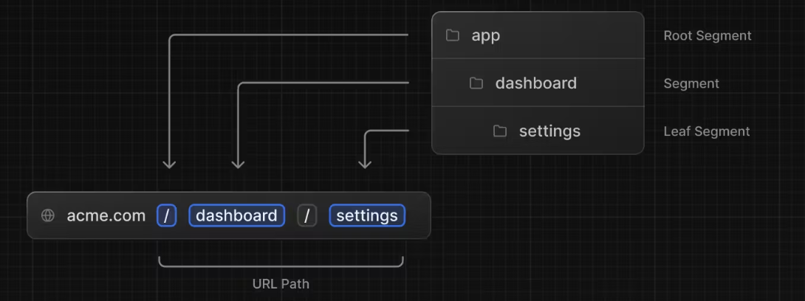
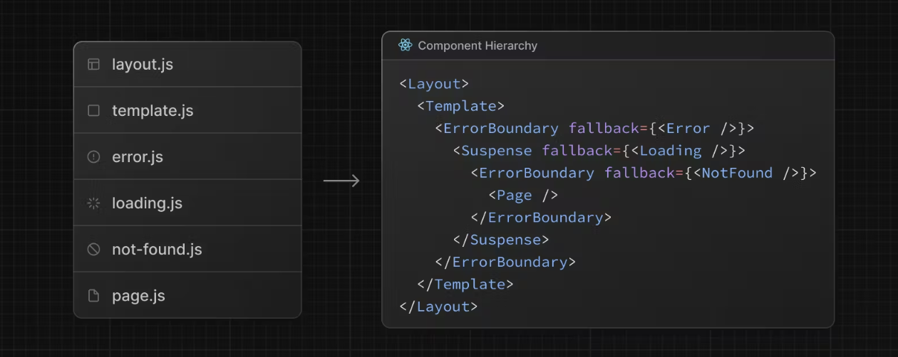
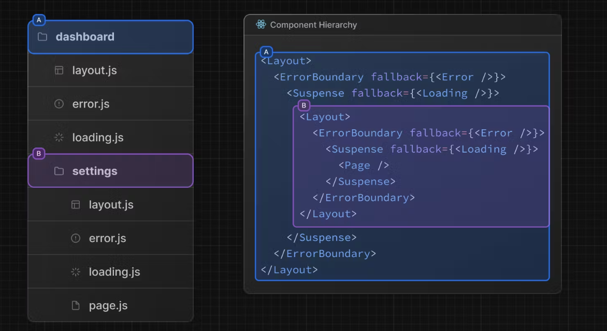
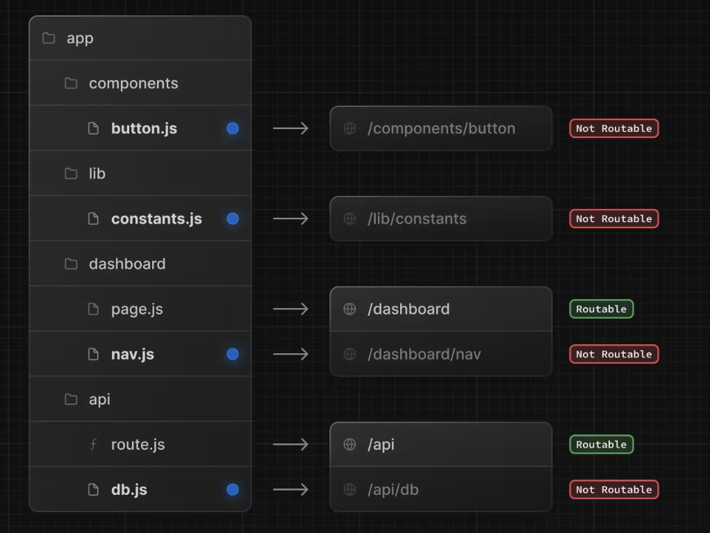
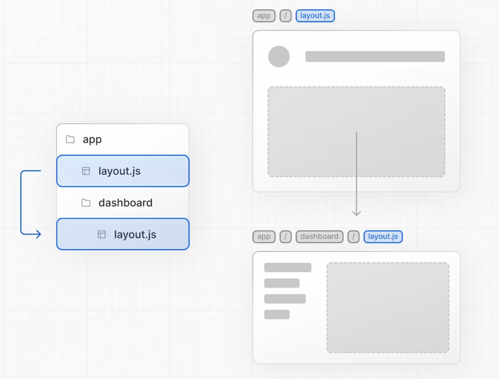

1

对应 routing in next.js https://nextjs.org/docs/app/building-your-application/routing


# key takeaways

<span style="color: red">By default, components inside `app` are [React Server Components](https://nextjs.org/docs/app/building-your-application/rendering/server-components).</span> 


一点关于Next.js中route & ui 的关系的理解

+ in Next.js, 提到route, 就想到一颗component tree, 一个route对应一条sequential path (no branching) from root node to a leaf node (a page.js), 这个sequential path所走过的node 会被渲染成ui呈现
  + in parallel routes, 一个route 对应一条可以分叉的path, 同理, 这个path所走过的node会被渲染成ui呈现


+ basic concepts of routing in Next.js
  + Folder & Files, route path & route segment, file path != url structure

+ Next.js special files
  + commonly used special files
    + Pages vs. Templates

  + :bangbang: ​component hierarchy
    + how the special next.js files are pared to react component
    + A `page.js` file is required to make a route segment publicly accessible.
      + `page.js` file is essentially a react component! 

    + Colocation files under `app` directory

+ Navigation in Next.js
+ Advanced routing in Next.js
  + :bangbang: ​parallel routes
    + 2 Use Cases: 1) simultineously rendering one or more pages; 2) conditionally rendering a page

  + intercepting routes
  + Route groups
  + dynamic route


+ request & response in Next.js 


提到route, 就想到file system 对应的component tree hierarchy, 1个url其实就是对应1条从root layout到达某个page.tsx的tree path 


# Overview 

overview of next.js file-system based routing schema

source: https://nextjs.org/docs/app/building-your-application/routing


`app` route

+ <span style="color: red">By default, components inside `app` directory are [React Server Components](https://nextjs.org/docs/app/building-your-application/rendering/server-components).</span> This is a performance optimization and allows you to easily adopt them, and you can also use [Client Components](https://nextjs.org/docs/app/building-your-application/rendering/client-components).


## Key concepts

Folders & Files

+ **`Folders`** are used to define routes. 
  + A route is a single path of nested folders, following the file-system hierarchy from the **root folder** down to a final **leaf folder** that includes a `page.js` file.
+ **`Files`** are used to create UI that is shown for a route segment. 


[Route segment](https://nextjs.org/docs/app/building-your-application/routing#route-segments) <=> folder under app directory

+ Each folder in a route represents a **`route segment`**. Each route segment is mapped to a corresponding **segment** in a **URL path**.
+ :bangbang: but note file path does not 100% equivalent to URL path  (e.g. parallel routes @slot not affecting url structure)​




Nested route

https://nextjs.org/docs/app/building-your-application/routing#nested-routes


## File conventions in next.js

https://nextjs.org/docs/app/building-your-application/routing#file-conventions

special files under `app` directory: 

+ :bangbang: other files under `app` directory are not treated as react components by Next

| file name                                                    | Description                                                  |
| ------------------------------------------------------------ | ------------------------------------------------------------ |
| [`layout`](https://nextjs.org/docs/app/building-your-application/routing/pages-and-layouts#layouts) | Shared UI for a segment and its children                     |
| [`page`](https://nextjs.org/docs/app/building-your-application/routing/pages-and-layouts#pages) | Unique UI of a route and make routes publicly accessible     |
| [`loading`](https://nextjs.org/docs/app/building-your-application/routing/loading-ui-and-streaming) | Loading UI for a segment and its children                    |
| [`not-found`](https://nextjs.org/docs/app/api-reference/file-conventions/not-found) | Not found UI for a segment and its children                  |
| [`error`](https://nextjs.org/docs/app/building-your-application/routing/error-handling) | Error UI for a segment and its children                      |
| [`global-error`](https://nextjs.org/docs/app/building-your-application/routing/error-handling) | Global Error UI                                              |
| [`route`](https://nextjs.org/docs/app/building-your-application/routing/route-handlers) | Server-side API endpoint                                     |
| [`template`](https://nextjs.org/docs/app/building-your-application/routing/pages-and-layouts#templates) | Specialized re-rendered Layout UI                            |
| [`default`](https://nextjs.org/docs/app/api-reference/file-conventions/default) | Fallback UI for [Parallel Routes](https://nextjs.org/docs/app/building-your-application/routing/parallel-routes) |


see colocation: https://nextjs.org/docs/app/building-your-application/routing#colocation

+ while folders define routes, only the contents returned by `page.js` or `route.js` are publicly addressable. 就是说, folder对应route segment, 但是只有具有page.js 或者 route.js的folder对应的route, 才routable 可到达


## :bangbang: ​component hierarchy

揭示Next.js 本质的


上述一系列的folder, files是如何被next.js转化为对应的react component hierarchy的 https://nextjs.org/docs/app/building-your-application/routing#component-hierarchy

+ 尽管在同一个folder里, file写起来是平行的, 但其实它们在形成react component 时是有hierarhcy的
+ 了解这个有助于理解next是如何build component hierarchy的, 进而build html element


simple route



nested route

+ In a nested route, the components of a segment will be nested **inside** the components of its parent segment.




## colocation

前面提到, app directory下是对应真正的ui 页面的routing的, 但是next,js也允许我们在app directory下 colocate our own files (e.g. components, styles, tests ...). This is because while folders define routes, only the contents returned by `page.js` or `route.js` are publicly addressable.




# 1. :full_moon: Specical next.js files

most basic and most frequently used next.js files


## 1.1 Pages

A page is UI that is **unique** to a route. You can define pages by exporting a component from a `page.js` file. Use nested folders to [define a route](https://nextjs.org/docs/app/building-your-application/routing/defining-routes) and a `page.js` file to make the route publicly accessible.

- A page is always the [leaf](https://nextjs.org/docs/app/building-your-application/routing#terminology) of the [route subtree](https://nextjs.org/docs/app/building-your-application/routing#terminology).
- A `page.js` file is required to make a route segment publicly accessible.
- Pages are [Server Components](https://nextjs.org/docs/app/building-your-application/rendering/server-components) by default but can be set to a [Client Component](https://nextjs.org/docs/app/building-your-application/rendering/client-components).
- Pages can fetch data. View the [Data Fetching](https://nextjs.org/docs/app/building-your-application/data-fetching) section for more information.


## 1.2 Layouts

https://nextjs.org/docs/app/building-your-application/routing/pages-and-layouts#layouts

A layout is UI that is **shared** between multiple pages.  It provides slots for its children or parallel routing slots

+ <span style="color:red">On navigation (route changing), layouts preserve state, remain interactive, and do not re-render.</span> Layouts can also be [nested](https://nextjs.org/docs/app/building-your-application/routing/pages-and-layouts#nesting-layouts).

- Layouts are [Server Components](https://nextjs.org/docs/app/building-your-application/rendering/server-components) by default but can be set to a [Client Component](https://nextjs.org/docs/app/building-your-application/rendering/client-components).
- Layouts can fetch data. View the [Data Fetching](https://nextjs.org/docs/app/building-your-application/data-fetching) section for more information.
- A `layout.js` and `page.js` file can be defined in the same folder. The layout will wrap the page.
- Any route segment can optionally define its own [Layout](https://nextjs.org/docs/app/building-your-application/routing/pages-and-layouts#nesting-layouts). These layouts will be shared across all pages in that segment.
- and more ... 现在还看不太懂


### Root layout

https://nextjs.org/docs/app/building-your-application/routing/pages-and-layouts#root-layout-required


[Meta data: modifying <head>](https://nextjs.org/docs/app/building-your-application/routing/pages-and-layouts#modifying-head)


### :bangbang: ​Nested layout

https://nextjs.org/docs/app/building-your-application/routing/pages-and-layouts#nesting-layouts

e.g. :gem:

+ in app / layout.js, we have 3 slots, one slot is for {children}
  + in app / dashboard / layout.js, we defined the nested layout, which is the {children} in its parent layout. When user visit  url of address/dashboard,  the active file path is app / layout.js => app / dashboard / layout.js,  the page is rendered




## 1.3 Templates

https://nextjs.org/docs/app/building-your-application/routing/pages-and-layouts#templates

Templates are similar to layouts in that they wrap each child layout or page. 

Unlike layouts that persist across routes and maintain state, <span style="color:red">templates create a new instance for each of their children on navigation</span>. 

+ This means that when a user navigates between routes that share a template, a new instance of the component is mounted, DOM elements are recreated, state is **not** preserved, and effects are re-synchronized.


## 1.4  loading.tsx & loading state

[Instant Loading States](https://nextjs.org/docs/app/building-your-application/routing/loading-ui-and-streaming#instant-loading-states): An instant loading state is fallback UI that is shown immediately upon navigation. 


### :bangbang: streaming with Suspense


how is SSR working (see more in rendering chapter)

---

With SSR, there's a series of steps that need to be completed before a user can see and interact with a page:

1. First, all data for a given page is fetched on the server.
2. The server then renders the HTML for the page.
3. The HTML, CSS, and JavaScript for the page are sent to the client.
4. A non-interactive user interface is shown using the generated HTML, and CSS.
5. Finally, React [hydrates](https://react.dev/reference/react-dom/client/hydrateRoot#hydrating-server-rendered-html) the user interface to make it interactive.


:bangbang: Limitation of SSR: has to wait for the whole page to be rendered 

+ These steps are sequential and blocking, meaning the server can only render the HTML for a page once all the data has been fetched. And, on the client, React can only hydrate the UI once the code for all components in the page has been downloaded.


streaming

---

:white_check_mark: => streaming: allows you to break down the page's HTML into smaller chunks and progressively send those chunks from the server to the client.


:gem: [Example use case of suspense](https://nextjs.org/docs/app/building-your-application/routing/loading-ui-and-streaming#example)

```ts
import { Suspense } from 'react'
import { PostFeed, Weather } from './Components'
 
export default function Posts() {
  return (
    <section>
      <Suspense fallback={<p>Loading feed...</p>}>
        <PostFeed />
      </Suspense>
      <Suspense fallback={<p>Loading weather...</p>}>
        <Weather />
      </Suspense>
    </section>
  )
}
```


[SEO of streaming](https://nextjs.org/docs/app/building-your-application/routing/loading-ui-and-streaming#seo) -> 了解一下就行


## 1.5  error.tsx & error state

https://nextjs.org/docs/app/building-your-application/routing/error-handling

also check out at

+  https://www.sitepoint.com/next-js-error-handling-app-router/#:~:text=be%20activated%20often.-,Server%20Errors,tsx%20boundary.

+ https://stackoverflow.com/questions/76796529/next-js-13-errors-tsx


:question: if I get a nested error.tsx, will  error poped from a leaf page be forward to its parent page's error.tsx ?​

:bangbang: error.tsx has to be client component!

+ an intance of Error in page.tsx will be forward to error.tsx located at the same file hierarhcy level


Error.tsx compoent has 2 props 

---

+ error: error received from server component. [How `error.js` Works](https://nextjs.org/docs/app/building-your-application/routing/error-handling#how-errorjs-works)
  + If an error is thrown inside a Server Component, Next.js will forward an `Error` object (stripped of sensitive error information in production) to the nearest `error.js` file as the `error` prop.
+ reset: used to [Recovering From Errors](https://nextjs.org/docs/app/building-your-application/routing/error-handling#recovering-from-errors)


### :bangbang: error handling scope


[Nested Routes](https://nextjs.org/docs/app/building-your-application/routing/error-handling#nested-routes) : 

React components created through [special files](https://nextjs.org/docs/app/building-your-application/routing#file-conventions) are rendered in a [specific nested hierarchy](https://nextjs.org/docs/app/building-your-application/routing#component-hierarchy).


+ error.tsx will handle all errors for its nested child segments
+ but will not handle errors thrown in a layout.tsx or template.tsx in the same route segment as the error boundary is nested **inside** that layout's component.
  + => so how to handle errors thrown by layout or template?
    + [Handling Errors in Layouts](https://nextjs.org/docs/app/building-your-application/routing/error-handling#handling-errors-in-layouts)
    + [Handling Errors in Root Layouts](https://nextjs.org/docs/app/building-your-application/routing/error-handling#handling-errors-in-root-layouts)


security when handling errors

---

[Securing Sensitive Error Information](https://nextjs.org/docs/app/building-your-application/routing/error-handling#securing-sensitive-error-information)


# 2. Linking & navigation

https://nextjs.org/docs/app/building-your-application/routing/linking-and-navigating

2 ways to do navigation in Next.js

+ `<Link>` (primary use)
+ `useRouter` hook


## 2.1 Link

`<Link>` is a built-in component that extends the HTML `<a>` tag to provide [prefetching](https://nextjs.org/docs/app/building-your-application/routing/linking-and-navigating#1-prefetching) and client-side navigation between routes. 

+ 和react router就很类似了


[use cases of Next.js <Link>](https://nextjs.org/docs/app/building-your-application/routing/linking-and-navigating#examples)

+ linkingt to dynamic route
+ checking active Link 
+ Scrolling to an id 


## 2.2 useRouter hook

The `useRouter` ([api reference](https://nextjs.org/docs/app/api-reference/functions/use-router)) hook allows you to <u>programmatically</u> change routes.

<span style="color: red">This hook can only be used inside Client Components</span> and is imported from `next/navigation`.


**Recommendation:** Use the `<Link>` component to navigate between routes unless you have a specific requirement for using `useRouter`.


## 2.3:question: Dive deeper into navigation

https://nextjs.org/docs/app/building-your-application/routing/linking-and-navigating#how-routing-and-navigation-works

有点高级, 看不完全懂, 主要是说Next如何对route & navigation做出性能上的优化

后面看多了再回看这个


# 3. Advanced routing concepts

这些concepts最好边做一些项目边体会, 单独看比较晦涩


## 3.1 Route groups (foldername)

https://nextjs.org/docs/app/building-your-application/routing/route-groups

<span style="color:yellow">一句话总结: 定义不影响route path tree的folder</span>


In the `app` directory, nested folders are normally mapped to URL paths. However, you can mark a folder as a **Route Group** to prevent the folder from being included in the route's URL path.

This allows you to organize your route segments and project files into logical groups without affecting the URL path structure.

A route group can be created by wrapping a folder's name in parenthesis: `(folderName)`


:gem: [Examples use cases](https://nextjs.org/docs/app/building-your-application/routing/route-groups#examples)


## 3.2 Dynamic route [foldername]

https://nextjs.org/docs/app/building-your-application/routing/dynamic-routes

<span style="color:yellow">一句话总结: 往route path里加参数</span>


When you don't know the exact segment names ahead of time and want to create routes from dynamic data, you can use Dynamic Segments that are filled in at request time or [prerendered](https://nextjs.org/docs/app/building-your-application/routing/dynamic-routes#generating-static-params) at build time.

A Dynamic Segment can be created by wrapping a folder's name in square brackets: `[folderName]`. For example, `[id]` or `[slug]`. Dynamic Segments are passed as the `params` prop to [`layout`](https://nextjs.org/docs/app/api-reference/file-conventions/layout), [`page`](https://nextjs.org/docs/app/api-reference/file-conventions/page), [`route`](https://nextjs.org/docs/app/building-your-application/routing/route-handlers), and [`generateMetadata`](https://nextjs.org/docs/app/api-reference/functions/generate-metadata#generatemetadata-function) functions.


[Example use cases](https://nextjs.org/docs/app/building-your-application/routing/dynamic-routes#example)

+ [Catch-all Segments](https://nextjs.org/docs/app/building-your-application/routing/dynamic-routes#catch-all-segments): **catch-all** subsequent segments


## 3.3 :bangbang:Parallel routes - slot @foldername


<span style="color:yellow">一句话总结: 感觉是为了能把一个page作为prop传递给一个layout, 而不影响url的structure, 从而使多个page可以simultaneously or conditioanlly rendered on the same layout (感觉这点在vanilla react里很容易实现) </span>

> 之前我们都是一个url对应一条tree path (从root到page所处在component tree的底部的leaf node 所形成的path), 这个tree path定义了页面的渲染结构, 但是这条tree path是只能一直往下不能在一个节点同时分叉的, 即一个url对应的页面只能渲染处在component tree某个level的一个page
>
> 而引入parallel routes之后, 就相当于tree path可以在一个节点同时分叉了, 这样就可以在一个layout中simultaneously or conditionally 渲染多个page 
>
> 再次理解 `parallel route`的含义, 其实parallel就是说 tree path 可以同时拥有多个分支呗, 之前的route 其实都是sequential route, 对应component tree不能有多于1个分支


<span style="color:yellow">Parallel Routing allows you to <u>simultaneously</u> or <u>conditionally</u> render one or more pages <u>in the same `layout`</u>.</span>

e.g. team & analytics are pages but parallelly rendered in the same layout, note `@team` & `@analytics` folder don't affect URL structure


how to use it: => concept of `slots`

---

Parallel routes are created using named **`slots`**. <span style="color:yellow">Slots are defined with the `@folder` convention, and are passed to the same-level layout as props.</span> 

+ `slots` 这个说法很形象, parallel routes在其parent layout中就是一个slots的位置, 或者说subpage 在layout中就对应一个slot

  + The `children` prop is an implicit slot that does not need to be mapped to a folder. This means `app/page.js` is equivalent to `app/@children/page.js`.

  + :bangbang: ​ <span style="color:red">`Slots` are *not* route segments and *do not affect the URL structure*.</span> The file path `/@team/members` would be accessible at url path `/members`.


[active state of slots & navigation ](https://nextjs.org/docs/app/building-your-application/routing/parallel-routes#active-state-and-navigation)

---

By default, Next.js keeps track of the active *state* (or subpage) for each slot. However, the content rendered within a slot will depend on the type of navigation:

- [**Soft Navigation**](https://nextjs.org/docs/app/building-your-application/routing/linking-and-navigating#5-soft-navigation): During client-side navigation, Next.js will perform a [partial render](https://nextjs.org/docs/app/building-your-application/routing/linking-and-navigating#4-partial-rendering), changing the subpage within the slot, while maintaining the other slot's active subpages, even if they don't match the current URL.
- **Hard Navigation**: After a full-page load (browser refresh), Next.js cannot determine the active state for the slots that don't match the current URL. Instead, it will render a [`default.js`](https://nextjs.org/docs/app/building-your-application/routing/parallel-routes#defaultjs) file for the unmatched slots, or `404` if `default.js` doesn't exist.
  - see more explaination at https://nextjs.org/docs/app/building-your-application/routing/parallel-routes#defaultjs


:gem: see use cases at https://nextjs.org/docs/app/building-your-application/routing/parallel-routes#examples

---

Use Case1: simultaneous rendering of one or more pages

+ and you can even define independent loading and error state for each page
+ :gem: [Modals e.g.](https://nextjs.org/docs/app/building-your-application/routing/parallel-routes#modals)
+ :gem:[Tab group e.g.](https://nextjs.org/docs/app/building-your-application/routing/parallel-routes#tab-groups)
+ :gem: ​[independent loading & error UI](https://nextjs.org/docs/app/building-your-application/routing/parallel-routes#loading-and-error-ui)


Use Case2: conditionally rendering of a page

+ :gem: [Conditional Routes e.g.](https://nextjs.org/docs/app/building-your-application/routing/parallel-routes#conditional-routes)
  + 是基于layout可以获得slots作为props时, 可以利用conditional rendering 来选择哪个slot被展示. 本质和react里conditional rendering没区别

```tsx
import { checkUserRole } from '@/lib/auth'
 
export default function Layout({
  user,
  admin,
}: {
  user: React.ReactNode			// @user/page.js
  admin: React.ReactNode		// @admin/page.js
}) {
  const role = checkUserRole()
  return <>{role === 'admin' ? admin : user}</>
}
```


may also check examples at https://www.builder.io/blog/nextjs-14-parallel-routes


## 3.4:question: Intercepting routes (..)

https://nextjs.org/docs/app/building-your-application/routing/intercepting-routes


<span style="color:yellow">一句话总结: 没完全理解到底是什么意思 </span> maybe look at https://www.builder.io/blog/nextjs-14-intercepting-routes


Intercepting routes allows you to load a route from another part of your application within the current layout. 

This routing paradigm can be useful when you want to display the content of a route without the user switching to a different context.

+ use case: create modal


:gem: [modal demo using parallel and intercepting route](https://github.com/vercel-labs/nextgram?tab=readme-ov-file)


### convention

Intercepting routes can be defined with the `(..)` convention, which is similar to relative path convention `../` but for segments.

You can use:

- `(.)` to match segments on the **same level**
- `(..)` to match segments **one level above**
- `(..)(..)` to match segments **two levels above**
- `(...)` to match segments from the **root** `app` directory

:bangbang: but note - the `(..)` convention is based on *route segments*, not the file-system (e.g. a slot is not considered as a segment).


For example, you can intercept the `photo` segment from within the `feed` segment by creating a `(..)photo` directory.


# 4. Next reqeust & response

不是很理解为什么要讲这块, axios不就解决了吗?


## 4.1:question:Route handlers - route.ts

https://nextjs.org/docs/app/building-your-application/routing/route-handlers

<span style="color: yellow">一句话: Route Handlers allow you to create custom request handlers for a given route using the Web [Request](https://developer.mozilla.org/docs/Web/API/Request) and [Response](https://developer.mozilla.org/docs/Web/API/Response) APIs.</span>


> **Good to know**: Route Handlers are only available inside the `app` directory. They are the equivalent of [API Routes](https://nextjs.org/docs/pages/building-your-application/routing/api-routes) inside the `pages` directory meaning you **do not** need to use API Routes and Route Handlers together.


### conventions

Route Handlers are defined in a [`route.js|ts` file](https://nextjs.org/docs/app/api-reference/file-conventions/route) inside the `app` directory:

```ts
// app/items/route.ts: 
export const dynamic = 'force-dynamic' // defaults to auto
export async function GET(request: Request) {}
```

Route Handlers can be nested inside the `app` directory, similar to `page.js` and `layout.js`. But there **cannot** be a `route.js` file at the same route segment level as `page.js`.


### [Examples](https://nextjs.org/docs/app/building-your-application/routing/route-handlers#examples)


## 4.2:question:Middleware

https://nextjs.org/docs/app/building-your-application/routing/middleware


# 5. :moon: Project organization

https://nextjs.org/docs/app/building-your-application/routing/colocation

introudce how to organize files in next.js project


[Safe colocation by default](https://nextjs.org/docs/app/building-your-application/routing/colocation#safe-colocation-by-default)

+ nextjs的file hierachy => route segment 的金句:  <u>even though route structure is defined through folders, a route is **not publicly accessible** until a `page.js` or `route.js` file is added to a route segment.</u>


[Project organization features](https://nextjs.org/docs/app/building-your-application/routing/colocation#project-organization-features)

+ priavte folder
  + Private folders can be created by prefixing a folder with an underscore: `_folderName`

+ route group
  + see 3.1 

+ src directory
+ module path alias


## project organization strategies

https://nextjs.org/docs/app/building-your-application/routing/colocation#project-organization-strategies


usually we just pick strategy1: keep project files outside app folder, just leave app folder for routing purpose

