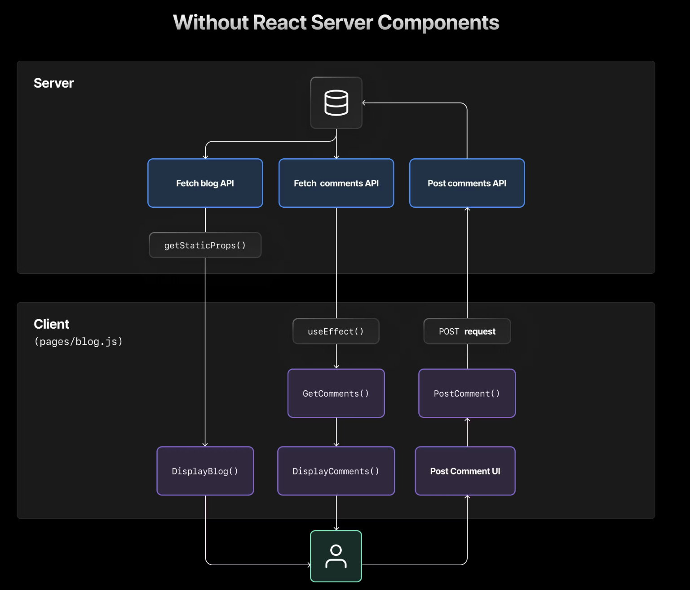
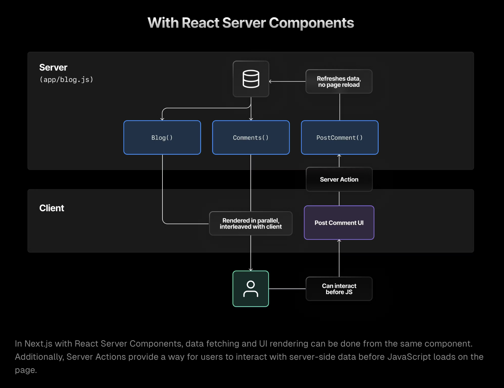

2

# key takeaways

in next, components are default rendered by server, interleaving server and client component is possible, a good practice is to just keep the interactive component as client component

server component has no access to react hooks and browser api

client component is just like normal react component

# Intro

https://nextjs.org/docs/app/building-your-application/rendering

To start, it's helpful to be familiar with three foundational web concepts:

- The [Environments](https://nextjs.org/docs/app/building-your-application/rendering#rendering-environments) your application code can be executed in: the server and the client.
- The [Request-Response Lifecycle](https://nextjs.org/docs/app/building-your-application/rendering#request-response-lifecycle) that's initiated when a user visits or interacts with your application.
- The [Network Boundary](https://nextjs.org/docs/app/building-your-application/rendering#network-boundary) that separates server and client code.

# 1. Server component

https://nextjs.org/docs/app/building-your-application/rendering/server-components

简言之, 如果是server component, 那么一些react hooks以及browser api将无法使用, next的server component有自己的一套state management, data fetching ...的api, 至于具体的实现原理, 见 section 1.3

## 1.0 :full_moon: ​Understanding React Server Component

:book: ​https://vercel.com/blog/understanding-react-server-components

why we need react server components (RSCs)

---

stage1: SSR and Suspense

+ `SSR`: SSR focuses on initial page load, sending pre-rendered HTML to the client that must then be hydrated with downloaded JavaScript before it behaves as a typical React app. SSR also only happens one time: when directly navigating to a page.
  + limitations of SSR - With SSR alone, the user gets HTML more quickly, but must wait on an "all-or-nothing" waterfall before being able to interact with JavaScript:
    - All data must be fetched from the server before any of it can be shown.
    - All JavaScript must download from the server before the client can be hydrated with it.
    - All hydration has to complete on the client before anything can be interacted with.
+ `Suspense` To solve SSR's limitations, [React created Suspense](https://github.com/reactwg/react-18/discussions/37), which allows for server-side HTML streaming and selective hydration on the client. 
  + `SSR` + `Suspense` vastly improves the situation, but still leaves a few remaining issues (in simple words, too much client-side computation workload (more specifically, the amount of javascript code needs to be downloaded, parsed and executed) will be needed which might degrade performance and user experiences):
    - Data for the *entire page* must be fetched from the server before any components can be shown. The only way around this is to fetch data client-side in a `useEffect()` hook, which has a longer roundtrip than server-side fetches and happens only *after* the component is rendered and hydrated.
    - All page JavaScript is eventually downloaded, even if it's streamed to the browser asynchronously. As app complexity increases, so does the amount of code the user downloads.
    - Despite optimizing hydration, users still cannot interact with components until the client-side JavaScript is downloaded and implemented for that component.
    - The majority of JavaScript compute weight still ends up on the client, which could be running on any variety of devices. Why not move it to the more powerful, predictable server?

In Next.js without React Server Components, data fetching requires an extra API layer.

stage2: react server component (RSCs)

In order to solve the above issues, React has created Server Components. RSCs individually fetch data and render entirely on the server, and the resulting HTML is streamed into the client-side React component tree, interleaving with other Server and Client Components as necessary.

When an RSC needs to be re-rendered, due to state change (:question: how is state change in RSC issued ? via Server Action ?  we cannot use `useState`), it refreshes on the server and seamlessly merges into the existing DOM **without a hard refresh**. As a result, the client state is preserved even as parts of the view are updated from the server.

Benefits of RSCs:

+ This process eliminates the need for client-side re-rendering, thereby improving performance. For any Client Components, hydration can happen concurrently with RSCs streaming in, since the compute load is shared between client and server
+ Put another way, the server, far more powerful and physically closer to your data sources, deals with compute-intensive rendering and ships to the client just the interactive pieces of code.

limitations of RSCs

---

+ All code written for Server Components must be serializable, which means you can’t use lifecycle hooks, such as `useEffect()` or state.
+ However, you can still interact with the server from the client through Server Actions, which we’ll get to in [just a bit](https://vercel.com/blog/understanding-react-server-components#server-actions-react’s-first-steps-into-mutability).
+ Also, RSCs do not support continuous updates, such as through WebSockets. In these cases, a client-side fetching or polling approach would be necessary.

balancing RSCs & RCCs

---

It's important to note that RSCs are not intended to replace Client Components. A healthy application utilizes both RSCs for dynamic data fetching and Client Components for rich interactivity. The challenge lies in determining when to use each component.

As a developer, 

+ consider leveraging RSCs for server-side renderingand data fetching, 
+ while relying on Client Components for locally interactive features and user experiences. 

By striking the right balance, you can create a high-performance, efficient, and engaging application.

Next.js: improved data fetching

---

RSCs fetch data on the server, 

+  which not only offers secure access to backend data 
+ but also enhances performance by reducing server-client interaction.

 [Coupled with Next.js enhancements](https://nextjs.org/docs/app/building-your-application/data-fetching?utm_source=vercel_site&utm_medium=web&utm_campaign=understanding_rsc), RSCs also allow for smart data caching, multiple fetches in a single roundtrip, and automatic `fetch()` request deduping—all maximizing the efficiency of sending data client side.

Perhaps most importantly, fetching data on the server helps to prevent client-side data fetching waterfalls,

Server Action

---

Within the context of RSCs, Server Actions are functions that you define in an RSC on the server side that you can then pass across the server/client boundary. When a user interacts with your app on the client side, they can directly call Server Actions which will be executed securely on the server side.

This approach provides a seamless [Remote Procedure Call](https://en.wikipedia.org/wiki/Remote_procedure_call) (RPC) experience between the client and the server. Instead of writing a separate API route to communicate with the server, you can directly call Server Actions from your Client Components.

## 1.1 :bangbang: Benefit of server rendering

https://nextjs.org/docs/app/building-your-application/rendering/server-components#benefits-of-server-rendering

+ Performance
  + Move data fetching to server
  
  + Caching rendered results
  + :bangbang: javascript bundle size
  + **Initial Page Load and [First Contentful Paint (FCP)](https://web.dev/fcp/)**
  + Streaming
+ Security
+ SEO optimization

## 1.2 Using server rendering in Next.js

By default, Next.js uses Server Components. 

This allows you to automatically implement server rendering with no additional configuration, and you can opt into using Client Components when needed, see [Client Components](https://nextjs.org/docs/app/building-your-application/rendering/client-components).

## 1.3:question: How are server components rendered?

https://nextjs.org/docs/app/building-your-application/rendering/server-components#how-are-server-components-rendered

2 steps: (没看太明白)

+ on server, generate RSC payload and use it to generate html
+ then on the client, first non-interactive html then hydrate

Gpt: how are server components rendered in plain English

maybe check this video;

https://www.youtube.com/watch?v=d2yNsZd5PMs

## 1.4 :bangbang: server rendering strategies 

There are three subsets of server rendering: Static, Dynamic, and Streaming.

### Static rendering (default)

With Static Rendering, routes are rendered at **build time**, or in the background after [data revalidation](https://nextjs.org/docs/app/building-your-application/data-fetching/fetching-caching-and-revalidating#revalidating-data). 

+ The result is cached and can be pushed to a [Content Delivery Network (CDN)](https://developer.mozilla.org/docs/Glossary/CDN). This optimization allows you to share the result of the rendering work between users and server requests. see more in caching of next.js

Use case: Static rendering is useful when a route has data that is not personalized to the user and can be known at build time, such as a static blog post or a product page.

### Dynamic rendering

more complex than static rendering

With Dynamic Rendering, routes are rendered for each user at **request time**.

Use case: Dynamic rendering is useful when a route has data that is personalized to the user or has information that can only be known at request time, such as cookies or the URL's search params.

### Streaming

Streaming enables you to progressively render UI from the server. 

Work is split into chunks and streamed to the client as it becomes ready. This allows the user to see parts of the page immediately, before the entire content has finished rendering.

# 2. Client component

https://nextjs.org/docs/app/building-your-application/rendering/client-components

Client Components allows you to write interactive UI that can be rendered on the client at request time. 

In Next.js, client rendering is **opt-in**, meaning you have to <u>explicitly decide what components React should render on the client.</u>

简言之, client component写起来就跟vanilla react 一样了

## 2.1 :bangbang: Benefits of client rendering

There are a couple of benefits to doing the rendering work on the client, including:

- **Interactivity**: Client Components can use state, effects, and event listeners, meaning they can provide immediate feedback to the user and update the UI.
- **Browser APIs**: Client Components have access to browser APIs, like [geolocation](https://developer.mozilla.org/docs/Web/API/Geolocation_API) or [localStorage](https://developer.mozilla.org/docs/Web/API/Window/localStorage), allowing you to build UI for specific use cases.

## 2.2 Using client rendering in next

https://nextjs.org/docs/app/building-your-application/rendering/client-components#using-client-components-in-nextjs

To use Client Components, you can add the React [`"use client"` directive](https://react.dev/reference/react/use-client) at the top of a file, above your imports.

:bangbang: note: `"use client"` is used to declare a [boundary](https://nextjs.org/docs/app/building-your-application/rendering#network-boundary) between a Server and Client Component modules. This means that by defining a `"use client"` in a file, all other modules imported into it, including child components, are considered part of the client bundle

## 2.3:question: How are client components rendered?

https://nextjs.org/docs/app/building-your-application/rendering/client-components#how-are-client-components-rendered

Client Components are rendered differently depending on whether the request is:

+ Full page load https://nextjs.org/docs/app/building-your-application/rendering/client-components#full-page-load
  + just similar to server rendering as in section 1.3
+ subsequent navigations
  + On subsequent navigations, Client Components are rendered entirely on the client, without the server-rendered HTML. This means the Client Component JavaScript bundle is downloaded and parsed. Once the bundle is ready, React will use the RSC Payload to reconcile the Client and Server Component trees, and update the DOM.

# 3. Composition pattern

When building React applications, you will need to consider what parts of your application should be rendered on the server or the client. 

简言之, 如何balancing the use of server AND client component 

## 3.1 :bangbang: when to use server and client components

https://nextjs.org/docs/app/building-your-application/rendering/composition-patterns#when-to-use-server-and-client-components

## 3.2 server component patterns

+ [Sharing data between components](https://nextjs.org/docs/app/building-your-application/rendering/composition-patterns#sharing-data-between-components)
+ [Keeping Server-only Code out of the Client Environment](https://nextjs.org/docs/app/building-your-application/rendering/composition-patterns#keeping-server-only-code-out-of-the-client-environment)
+ [Using Third-party Packages and Providers](https://nextjs.org/docs/app/building-your-application/rendering/composition-patterns#using-third-party-packages-and-providers)

## 3.3 client component patterns

+ [Moving Client Components Down the Tree](https://nextjs.org/docs/app/building-your-application/rendering/composition-patterns#moving-client-components-down-the-tree)
  + good practice: just keep the interactive component as client component
+ [Passing props from Server to Client Components (Serialization)](https://nextjs.org/docs/app/building-your-application/rendering/composition-patterns#passing-props-from-server-to-client-components-serialization)

## 3.3 :bangbang: Interleaving server and client components

When interleaving Client and Server Components, it may be helpful to visualize your UI as a tree of components. Starting with the [root layout](https://nextjs.org/docs/app/building-your-application/routing/pages-and-layouts#root-layout-required), which is a Server Component, you can then render certain subtrees of components on the client by adding the `"use client"` directive.

Within those client subtrees, you can still nest Server Components or call Server Actions, however there are some things to keep in mind:

- During a request-response lifecycle, your code moves from the server to the client. If you need to access data or resources on the server while on the client, you'll be making a **new** request to the server - not switching back and forth.
- When a new request is made to the server, all Server Components are rendered first, including those nested inside Client Components. The rendered result (RSC Payload) will contain references to the locations of Client Components. Then, on the client, React uses the RSC Payload to reconcile Server and Client Components into a single tree.

- Since Client Components are rendered after Server Components, you cannot import a Server Component into a Client Component module (since it would require a new request back to the server). Instead, you can pass a Server Component as `props` to a Client Component. See the [unsupported pattern](https://nextjs.org/docs/app/building-your-application/rendering/composition-patterns#unsupported-pattern-importing-server-components-into-client-components) and [supported pattern](https://nextjs.org/docs/app/building-your-application/rendering/composition-patterns#supported-pattern-passing-server-components-to-client-components-as-props) sections below.

# Runtime choices

https://nextjs.org/docs/app/building-your-application/rendering/edge-and-nodejs-runtimes

需要再看

Edge runtime

Node.js runtime

serverless runtime