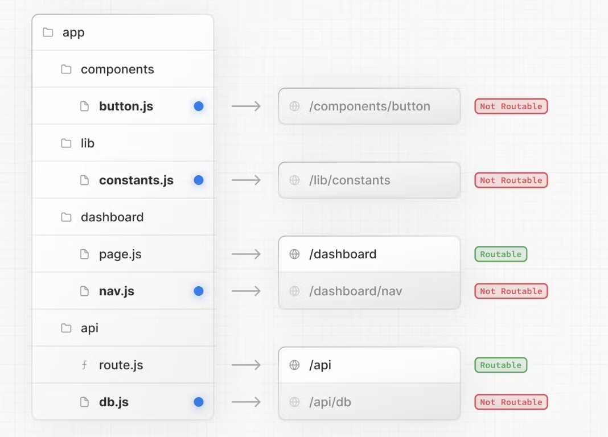
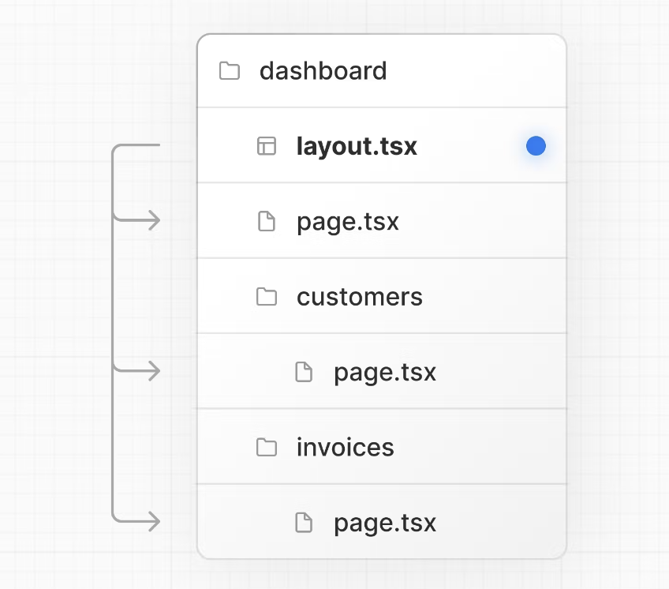

Intro to Next.js


3hrs 


# key takeaways

what is Nextjs? why

file-based routing & Page pre-rendering

data fetching & adding an API


# Intro

a fullstack framework for react.js / a react framework for production

+ Next.js solves common problems and make it easier to build react


## key features

Server-side rendering

+ next.js allows automatic page pre-rendering before sending html to the client
  +  great for SEO and inital load
+ blending client-side and server-side.
  +  Fecth data on the server and render finished pages

file-based routing

+ react router needs code to define routing logics, 
+ but Nest.js gets rid of that code-based routing: it defines pages and routes with files and folders instead of code
  + Less code, less work, more understandable

build fullstack app

+ easily add backend (server-side) code to your Next/React apps
+ CRUD data, authentication etc. can be added to your react projects


# Hands-on

p532-


create a Next project

https://nextjs.org/docs/getting-started/installation


the starting project file structure changed after running `npx create-next-app` compared to the lec

```js
> pages
> public 
> styles
```

:bangbang: it seems the lec content has outdated, when run `npm run dev` pop environment issues

stop learning !


# :gem: Learn Next js with vercel tut

an up-to-date Next learning tutorial offered by vercel: 

https://nextjs.org/learn/dashboard-app

see nextjs-dashboard folder

+ Uses typescript, tailwind css / css module, eslint 


Next official doc https://nextjs.org/docs/getting-started/project-structure


Getting started

---

C1

project file structure


styling 

---

C2

+ use `tailwind css` or `css modules` to add styling 
+ `clsx` for toggling class names
  + 直接在classname里写conditional className 的代码
    + 其实也可以用 react state 来控制额外的变量, 再让其与className concatnate来写
+ and even more options for styling code (omitted)


optimizing fonts & imgs

---

C3

Images without dimensions and web fonts are common causes of <u>layout shift</u>.

+ next/font: next automatically optimizes the font to improve performance
  + directly use the font in tailwind className
+ Next/imgs:  next automatically optimizes the images to improve performance
  + `Image` component
  + tailwind responsive design


## :bangbang: layout, pages & navigations in next


creating layout and pages

---

C4

file-system routing


`page.tsx` is a special Next.js file that exports a React component, and it's required for the route to be accessible. In your application, you already have a page file: `/app/page.tsx` - this is the home page associated with the route `/`.

+ This is how you can create different pages in Next.js: create a new route segment using a folder, and add a `page` file inside it.
+ next allows colocate ui files
  + This is because while folders define routes, only the contents returned by `page.js` or `route.js` are publicly addressable. 
  + 


In Next.js, you can use a special `layout.tsx` file to create UI that is shared between multiple pages.

such pattern allows [partial rendering](https://nextjs.org/docs/app/building-your-application/routing/linking-and-navigating#3-partial-rendering) 


+ The `<Layout />` component receives a `children` prop. This child can either be a page or another layout. 

  + ```ts
    import SideNav from '@/app/ui/dashboard/sidenav';
     
    export default function Layout({ children }: { children: React.ReactNode }) {
      return (
        <div className="flex h-screen flex-col md:flex-row md:overflow-hidden">
          <div className="w-full flex-none md:w-64">
            <SideNav />
          </div>
          <div className="flex-grow p-6 md:overflow-y-auto md:p-12">{children}</div>
        </div>
      );
    }
    ```

  + In your case, the pages inside `/dashboard` will automatically be nested inside a `<Layout />` like so:

    + 

    

Navigating between pages

---

C5

`next/link` 

+ similar to react router, allowing client-side navigation without re-rendering the whole page
  + but \<Link\> in next is gifted with more features, learn more at [how navigation in next works](https://nextjs.org/docs/app/building-your-application/routing/linking-and-navigating#how-routing-and-navigation-works)
    + Pre-fetching => space & time trade-off
    + caching 
    + partial rendering
    + Soft navigation
    + ...


show active link

+ `usePathname()` hook to get the current active path name
  + then use this info & react conditional styling to give user visual feedback of active link

```ts
// file > /app/ui/dashboard/nav-links.tsx
'use client';   // ! what is this for ? 

import {
  UserGroupIcon,
  HomeIcon,
  DocumentDuplicateIcon,
} from '@heroicons/react/24/outline';
import Link from 'next/link';
import { usePathname } from 'next/navigation';
import clsx from 'clsx';

// Map of links to display in the side navigation.
// Depending on the size of the application, this would be stored in a database.
const links = [
  { name: 'Home', href: '/dashboard', icon: HomeIcon },
  {
    name: 'Invoices',
    href: '/dashboard/invoices',
    icon: DocumentDuplicateIcon,
  },
  { name: 'Customers', href: '/dashboard/customers', icon: UserGroupIcon },
];

export default function NavLinks() {
  const pathname = usePathname();

  return (
    <>
      {links.map((link) => {
        const LinkIcon = link.icon;
        return (
          <Link
            key={link.name}
            href={link.href}
            className={clsx(
              'flex h-[48px] grow items-center justify-center gap-2 rounded-md bg-gray-50 p-3 text-sm font-medium hover:bg-sky-100 hover:text-blue-600 md:flex-none md:justify-start md:p-2 md:px-3',
              {
                'bg-sky-100 text-blue-600': pathname === link.href,
              },
            )}
          >
            <LinkIcon className="w-6" />
            <p className="hidden md:block">{link.name}</p>
          </Link>
        );
      })}
    </>
  );
}
```


## adding database

setting up database 

---

C6

 you'll be setting up a PostgreSQL database using `@vercel/postgres`

+ nothing to do with next, but a vercel eco

https://nextjs.org/learn/dashboard-app/setting-up-your-database


# Learn Next.js in 30 mins

youtube: web dev simplify - a todo list app with database


```ts
npx create-next-app@latest		// use typescript, eslint, tailwind
```

database setup

```ts
npm i prisma --save-dev
npx prisma init --datasource-provider sqlite

// write prisma model code...

npx prisma migrate dev --name init
```


