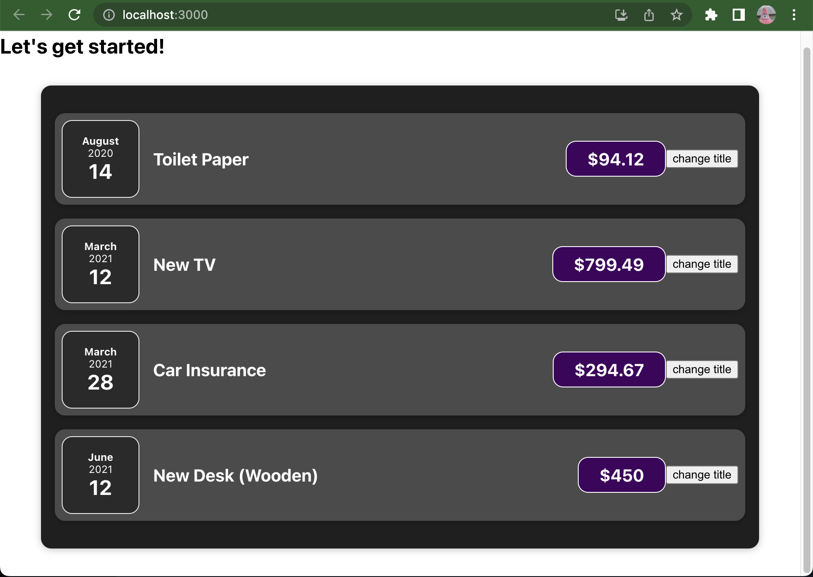

C4 React State & working with events


continue with class3 react  project


## Summary

+ handling event
+ update the UI & working with 'state'
+ closer loo at components & state


## Intro 

### :moon: Lisening to Events & working with Evenet Handler

46

https://developer.mozilla.org/en-US/docs/Web/HTML/Element/button


:book: [MDN: 各种event](https://developer.mozilla.org/en-US/docs/Web/API/Element/click_event)

add event listener to a react element

```js
// on + EventName 
<button onXxxx = {()=>{}} ></button>
```


how react component function works

47

react component function is just a special JS function that returns JSX 


:bangbang: 如果使用如下的代码, click button 改变 title 并没有显示在页面上, 因为页面只在开始时render了1次.  我们需要的是, 当title这个变量改变时, 它所属的component function run again (re-render) ---> rect state

```js

function ExpenseItem(props) {

  let title = props.title;		// 普通JS变量表示, 即使被改变了, 页面也不会re-render
  
  const clickHandler = () => {
    title = 'Update!';
    console.log(title);
  }

  return (
    <Card className="expense-item">

      <ExpenseDate date={props.date} />

      <div className="expense-item__description">
        <h2>{title}</h2>
        <div className="expense-item__price">${props.amount}</div>
      </div>
      
      <button onClick={clickHandler}  >change title</button>  

    </Card>
  );
}
```





### :moon: working with "state"

48


react hook: `useState()`

```js
// useState()返回一个array, 用array destructing 来更方便接取其返回. 
// arg1: current state value 
// arg2: setter for the state
const  [title, setTitle] = useState(props.title);
```

+ can only be used within react component function
+ 将state 理解为react 封装的一种特殊的变量, 当state的value改变时, it will trigger re-render of the functional component that It belongs to


现在点击click, 页面就可以正常显示"state"的改变了

```js
import React, {useState} from 'react';

function ExpenseItem(props) {

  // react state
  const  [title, setTitle] = useState(props.title);

  const clickHandler = () => {
    setTitle("Update!");    // not just set value for title, also triggers re-render when title is changed
    console.log(title);
  }

  return (
    <Card className="expense-item">

      <ExpenseDate date={props.date} />

      <div className="expense-item__description">
        <h2>{title}</h2>
        <div className="expense-item__price">${props.amount}</div>
      </div>
      
      <button onClick={clickHandler}  >change title</button>  

    </Card>
  );
}
```


### Closer look at "useState" hook

49-

看到这里
