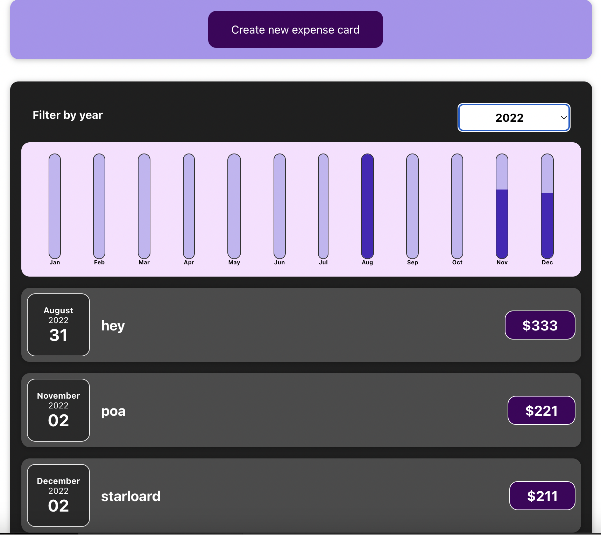

Class5: Rendering List & Conditional content


# Summary

代码在C5 > class5

核心内容:

+ output dynamic list of content by mapping js list to JSX statement

+ rendering content under certain conditions
  + State dependency, 由主动变化的state derive出来的"state"

+ 其实写到这里, 一个react component里的结构基本就是

  ```js
  const myReactComponent = () =>{
    // 1. states
    
    // 2. function
    // 2.1 event handler function
    // 2.2  other functions
    
    // 3. jsx statement
    // where you would apply conditional component & conditional styling
  }
  ```

  


:question: 可以把一个state(比如parent传来的props.title)通过useState()初始化另一个state吗

```js
[title, setTitle] = useState(props.title)  // props.title来源于一个state
```


# 1. Rendering Lists

## :full_moon: Rendering Lists of data

63- 65

```react
function Expenses(props) {
  const [filteredYear, setFilteredYear] = useState("2020");

  const expenses = props.expenses;

  const filterChangeHandler = (selectedYear) => {
    setFilteredYear(selectedYear);
  };

  return (
    <Card className="expenses">
      <ExpensesFilter
        selectedYear={filteredYear}
        onChangeFilter={filterChangeHandler}
      />
			
      // 在这儿用js array.map()语法来dynamically mapping list data to components
      {expenses.map((expense) => {
        return (
          <ExpenseItem
            title={expense.title}
            amount={expense.amount}
            date={expense.date}
          />
        );
      })}

    </Card>
  );
}
```


Using stateful lists

看到这里

64

```react

// 数据写到component function 外面
const DUMMY_EXPENSES = [
  {
    id: "e1",
    title: "Toilet Paper",
    amount: 94.12,
    date: new Date(2020, 7, 14),
  },
  { id: "e2", title: "New TV", amount: 799.49, date: new Date(2021, 2, 12) },
  {
    id: "e3",
    title: "Car Insurance",
    amount: 294.67,
    date: new Date(2021, 2, 28),
  },
  {
    id: "e4",
    title: "New Desk (Wooden)",
    amount: 450,
    date: new Date(2021, 5, 12),
  },
];

function App() {
  const [expenses, setExpenses] = useState(DUMMY_EXPENSES);

  const addExpenseHandler = (expense) => {
    // setExpenses([expense, ...expenses]);		// 因为state change是基于previous state, 所以用下面写法
    setExpenses((prevExpenses) => {
      return [expense, ...prevExpenses];
    });
  };

  return (
    <div className="App">
      <NewExpense onAddExpense={addExpenseHandler} />
      <Expenses expenses={expenses}></Expenses>
    </div>
  );
}
```


:bangbang: 一定要搞清楚谁是data provider, 谁是data consumer, 以及数据的流向

```react
App.js: expenses, addExpenseHandler(expense:object)
 	
	|-- NewExpense (addExpensesHandler): saveExpenseDataHandler(enteredExpenseData:Object) 	// stateful component
					|-- ExpenseForm (saveExpenseDataHandler): enteredTitle, enteredAmount, enteredDate:string
																										submitHandler(event)把输入的string转化为expense obj
                                                    
	|-- Expenses (expenses)
					|-- ExpenseFilter
					|-- expenses.map (expense => ExpenseItem )			// stateless component 
```


## :bangbang: Understand "key"

65


if no "key" specified for item mapped to jsx, 

+ performance issues: 数组里所有expense都被re-render, 因为react无法认识到底是哪个expense被加了进来
  + :bangbang: 再研究研究深入的原因

+ leads to potential bugs


```react
function Expenses(props) {
  const [filteredYear, setFilteredYear] = useState("2020");

  const expenses = props.expenses;

  const filterChangeHandler = (selectedYear) => {
    setFilteredYear(selectedYear);
  };

  return (
    <Card className="expenses">
      <ExpensesFilter
        selectedYear={filteredYear}
        onChangeFilter={filterChangeHandler}
      />

      {expenses.map((expense) => {
        return (
          <ExpenseItem
            key = {expense.id}			// unique id key for each expense
            title={expense.title}
            amount={expense.amount}
            date={expense.date}
          />
        );
      })}
    </Card>
  );
}
```


## :gem: Assignment: working with lists

添加根据filteredYear 来筛选 expenses的功能

+ 直接为props.expenses加个filter即可
+ 只是注意, `Expenses`是stateful component, 而`ExpenseFilter`和`ExpenseItem`则是stateless component

```react
function Expenses(props) {
  const [filteredYear, setFilteredYear] = useState("2020");

  const filterChangeHandler = (selectedYear) => {
    setFilteredYear(selectedYear);
  };

  // whenever state filteredYear is changed, the whole component function will be re-executed
  const filteredExpenses = props.expenses.filter(expense => {
    return expense.date.getFullYear().toString() === filteredYear;
  })

  return (
    <Card className="expenses">
      <ExpensesFilter
        selectedYear={filteredYear}
        onChangeFilter={filterChangeHandler}
      />
			
     <!--Only display filtered expenses-->
      {filteredExpenses.map((expense) => {
        return (
          <ExpenseItem
            key = {expense.id}
            title={expense.title}
            amount={expense.amount}
            date={expense.date}
          />
        );
      })}
    </Card>
  );
}
```


# 2. Conditional content

## :full_moon: Outputing Conditional content

66

现在我们想让filter结果之后, 如果对应年份没有expense item, 就显示no expense item, 如果有再显示exense item


3种方式来生成conditional content for react to render. 具体看公司用哪种写法


### 方式一:  `? :`

+ 比较难读

```react
function Expenses(props) {
  const [filteredYear, setFilteredYear] = useState("2020");

  const filterChangeHandler = (selectedYear) => {
    setFilteredYear(selectedYear);
  };

  // whenever state filteredYear is changed, the whole component function will be re-executed
  const filteredExpenses = props.expenses.filter((expense) => {
    return expense.date.getFullYear().toString() === filteredYear;
  });
  
  return (
    <Card className="expenses">
      <ExpensesFilter
        selectedYear={filteredYear}
        onChangeFilter={filterChangeHandler}
      />

      {/* ============= approach 1 ================= */}
      {filteredExpenses.length === 0 ? (
        <p>No expenses found.</p>
      ) : (
        filteredExpenses.map((expense) => {
          return (
            <ExpenseItem
              key={expense.id}
              title={expense.title}
              amount={expense.amount}
              date={expense.date}
            />
          );
        })
      )} 

    </Card>
  );
}
```

### 方式二 `&&`

+ 相对第一种好读了一些

```react
function Expenses(props) {
  const [filteredYear, setFilteredYear] = useState("2020");

  const filterChangeHandler = (selectedYear) => {
    setFilteredYear(selectedYear);
  };

  // whenever state filteredYear is changed, the whole component function will be re-executed
  const filteredExpenses = props.expenses.filter((expense) => {
    return expense.date.getFullYear().toString() === filteredYear;
  });

  return (
    <Card className="expenses">
      <ExpensesFilter
        selectedYear={filteredYear}
        onChangeFilter={filterChangeHandler}
      />


      {/* apporach 2 */}
      {filteredExpenses.length === 0 && <p>No expenses found.</p>}
      {filteredExpenses.length > 0 && 
        filteredExpenses.map((expense) => {
            return (
              <ExpenseItem
                key={expense.id}
                title={expense.title}
                amount={expense.amount}
                date={expense.date}
              />
            );
          })
      } 


    </Card>
  );
}
```

### 方式三 提取JXS statement并赋值到JS变量里

+ most readable

```react
function Expenses(props) {
  const [filteredYear, setFilteredYear] = useState("2020");

  const filterChangeHandler = (selectedYear) => {
    setFilteredYear(selectedYear);
  };

  // whenever state filteredYear is changed, the whole component function will be re-executed
  const filteredExpenses = props.expenses.filter((expense) => {
    return expense.date.getFullYear().toString() === filteredYear;
  });

	
  // list ---> jsx statement, then assing to js variable
  let expensesContent = <p>No expenses found.</p>;
  if(filteredExpenses.length > 0){
    expensesContent = filteredExpenses.map((expense) => {
            return (
              <ExpenseItem
                key={expense.id}
                title={expense.title}
                amount={expense.amount}
                date={expense.date}
              />
            );
          })
  }

  return (
    <Card className="expenses">
      <ExpensesFilter
        selectedYear={filteredYear}
        onChangeFilter={filterChangeHandler}
      />
      
      {/* ================ approach 3 ================ */}
      {expensesContent}

    </Card>
  );
}
```


## Adding conditional return statements

90

no new content, just extract the logics of managing filtering of cards into a standalone component: ExpenseList.js, to make the code cleaner. 体现一个design上的high cohesion


### :bangbang: recap on component tree 

```js
// 目前的component tree:
--app
	 |-- new-expenses  (page top half)
	 |-- Expenses	(page bottom half) // 定义了state以及如何改变state (due to state lift up), 及其"derived states"
					|-- expense-filter  // (state change trigger (provider) )
				  |-- expense-list		// (state change responser (consumer) )
									|-- expense-item
													|-- expense-date
```


:gem: code change:

Expense.js

+ :bangbang: state dependency: filteredExpenses相当于是filteredYear的derived "state", 由其变化而变化. Derived state最好还是和元state放置在同一个component里

```js
// the component stands at the bottom of page: a filter + expense list
function Expenses(props) {
  const [filteredYear, setFilteredYear] = useState("2020");

  const filterChangeHandler = (selectedYear) => {
    setFilteredYear(selectedYear);
  };

  // whenever state filteredYear is changed, the whole component function will be re-executed
  // filteredExpenses相当于一个derived "state" based on filteredYear
  const filteredExpenses = props.expenses.filter((expense) => {
    return expense.date.getFullYear().toString() === filteredYear;
  });


  return (
    <Card className="expenses">
    
      <ExpensesFilter
        selectedYear={filteredYear}
        onChangeFilter={filterChangeHandler}
      />
			
      <ExpenseList items = {filteredExpenses}/>

    </Card>
  );
}
```


ExpenseList.js

+ add conditional return statement here. 

```js
const ExpenseList = (props) =>{

    let expensesContent = <p>No expenses found.</p>;
	
  	// conditional return statement
    if(props.items.length === 0){
        return <h2 className="expenses-list__fallback">Found no expenses</h2>
    }

    return <ul className="expenses-list" >
        {props.items.map((expense) => {
              return (
                <ExpenseItem
                  key={expense.id}
                  title={expense.title}
                  amount={expense.amount}
                  date={expense.date}
                />
              );
            })}
        </ul>

};
```

ExpenseList.css

```css
.expenses-list {
    list-style: none;
    padding: 0;
  }
  
  .expenses-list__fallback {
    color: white;
    text-align: center;
  }
```


### :gem: Assignment: conditional UI

display new expense form (top half of the application) by clicking on a button, 

只需要在New-expense component中添加1个boolean state (给它取一个语义化的名字很重要!)来监视是否clicked on create new item, 然后将这个state的setter交给底部的component(Expense form)来控制, 在new-expense中的JSX 用conditioanlly content statement来指明boolean state与被渲染组件之间的关系

:bangbang: 注意 <form>中button type的影响:

```js
    <form onSubmit={submitHandler}>
      
      <div className="new-expense__actions">
        {/* type = "submit" means if this button is clicked, it will also trigger submit of the form
            type = "button" means this button is just a normal button, click on it will not trigger submit of the form */}
        <button type="button" onClick={clickCancelHandler}>Cancel</button>
        <button type="submit">Add Expense</button>
      </div>
    </form>
```


# 3. Demo App: add a bar chart for data visualization

91-94

将expense list中的数据做可视化处理, 呈现为一个bar chart:



Recap on component tree

```js
--app
	 |-- new-expenses  (page top half)
	 |-- Expenses	(page bottom half) // 定义了state以及如何改变state (due to state lift up), 及其"derived states"
					|-- ExpensesFilter  // (state change trigger (provider) )
					|-- ExpensesChart
										|-- Chart
													|-- ChartBar
				  |-- ExpensesList		// (state change responser (consumer) )
									|-- expense-item
													|-- expense-date
```


新建directory: Chart

Expense.js

+ pass derived "state" filteredYear to ExpenseChart for data visualization

```js
function Expenses(props) {

  const [filteredYear, setFilteredYear] = useState("2020");   // due to state lift up
  const filterChangeHandler = (selectedYear) => {
    setFilteredYear(selectedYear);
  };

  // whenever state filteredYear is changed, the whole component function will be re-executed
  // filteredExpenses相当于一个derived state based on filteredYear
  const filteredExpenses = props.expenses.filter((expense) => {
    return expense.date.getFullYear().toString() === filteredYear;
  });

  return (
    <Card className="expenses">
      <ExpensesFilter
        selectedYear={filteredYear}
        onChangeFilter={filterChangeHandler}
      />

      <ExpensesChart expenses={filteredExpenses}/>

      <ExpenseList items = {filteredExpenses}/>

    </Card>
  );
}
```


ExpensesChart.js

+ 负责load expense list data给Chart component用来render bar chart

```js
const ExpensesChart = props =>{
    const chartDatapoints = [
        {label: 'Jan', value: 0},
        {label: 'Feb', value: 0},
        {label: 'Mar', value: 0},
        {label: 'Apr', value: 0},
        {label: 'May', value: 0},
        {label: 'Jun', value: 0},
        {label: 'Jul', value: 0},
        {label: 'Aug', value: 0},
        {label: 'Sep', value: 0},
        {label: 'Oct', value: 0},
        {label: 'Nov', value: 0},
        {label: 'Dec', value: 0}
    ];

    // fill up the chartDataPoints
    for (const expense of props.expenses){
        const expenseMonth = expense.date.getMonth();   // starting at 0 => january
        chartDatapoints[expenseMonth].value += expense.amount;
    }

    // render the chart with loaded data
    return <Chart dataPoints = {chartDatapoints}/>
}
```

Chart.js

```js
const Chart = (props) => {
  // obj => number
  const dataPointValues = props.dataPoints.map(dataPoint => dataPoint.value);
  const totalMaximum = Math.max(...dataPointValues);

  return (
    <div className="chart">
      {props.dataPoints.map((dataPoint) => (
        <ChartBar
          key={dataPoint.label}
          value={dataPoint.value}
          maxValue={totalMaximum}
          label={dataPoint.label}
        />
      ))}
    </div>
  );
};
```

ChartBar.js

+ 由HTML向CSS传递dynamic parameters, 控制bar的fill height

```js
const CharBar = (props) => {
  let barFillHeight = "0%";
  if (props.maxValue > 0) {
    barFillHeight = Math.round((props.value / props.maxValue) * 100) + "%";
  }

  return (
    <div className="chart-bar">
      <div className="chart-bar__inner">
        <div
          className="chart-bar__fill"
          style={{ height: barFillHeight }}
        ></div>
      </div>
      <div className="chart-bar__label">{props.label}</div>
    </div>
  );
};
```


