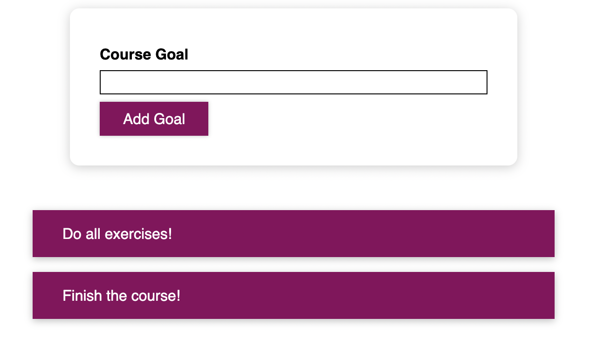

## Module intro

comes with a new demo project





## 1. :moon: Conditional styling & Dynamic CSS 

与之前实现dynamic react component类似, 利用boolean state来实现conditional styling. 有以下两种实现:

+ 方案1: set inline styling + ''? : operator'

+ 方案2: set dynamic tag element className + css selector

  ```js
  user input => boolean state => conditional className => conditional css
  ```

Cons: 

+ css file 并不是和特定的react component绑定， 给component 起className时需要格外小心. 
  + ---> solution: styled component or css modules


### Set inline style

功能实现: 当用户输入empty course goal时， 会conditionally render UI to remind user; 当用户输入正常的course goal时, render normal ui


note: this is not very preferrable as inline style takes very high priority and that might disrupt your css styling logics


CourseInput.js: UI top half component

+ 利用boolean state (isValid) & conditional inline style 来定义conditional CSS style

  + i.e. user input => boolean state => conditional styling 

  + ```js
    // e.g.
    <label style={{ color: !isValid ? "red" : "black" }}>Course Goal</label>
    // 其中 style = {} 里面是一个js object
    ```

+ Revision: 

  + 利用<input/>的onChange event来捕获输入的信息
  + html的tag绑定自定义的event handler来触发对应function to handle event, 比java的GUI event bounding好写多了

```js
const CourseInput = (props) => {
  const [enteredValue, setEnteredValue] = useState("");
  const [isValid, setIsValid] = useState(true);

  // get the input content via 'input' onChange event
  const goalInputChangeHandler = (event) => {
    // set isValid state back to normal
    if(event.target.value.trim().length > 0){
      setIsValid(true);
    }
    setEnteredValue(event.target.value);
  };

  const formSubmitHandler = (event) => {
    event.preventDefault();

    // set isValid state to abnormal
    if (enteredValue.trim().length === 0) {
      // adding an empty goal
      setIsValid(false);
      return;
    }
    props.onAddGoal(enteredValue);
  };

  return (
    <form onSubmit={formSubmitHandler}>
      <div className="form-control">
        {/* ********** inline style here!*********** */}
        <label style={{ color: !isValid ? "red" : "black" }}>Course Goal</label>
        <input
          style={{ borderColor: !isValid ? "red" : "black", background:!isValid ? "salmon" : "transparent" }}
          type="text"
          onChange={goalInputChangeHandler}
        />
      </div>
      <Button type="submit">Add Goal</Button>
    </form>
  );
};
```


### Set css classes dynamically

an alternative solution to set inline style


CourseInput.js

+ 利用dynamic tag element className 和 css selector来实现conditional styling
  + 还是user input => boolean state => conditional styling

```js
const CourseInput = (props) => {
  const [enteredValue, setEnteredValue] = useState("");
  const [isValid, setIsValid] = useState(true);

  // get the input content via 'input' onChange event
  const goalInputChangeHandler = (event) => {
    // set isValid state back to normal
    if (event.target.value.trim().length > 0) {
      setIsValid(true);
    }
    setEnteredValue(event.target.value);
  };

  const formSubmitHandler = (event) => {
    event.preventDefault();

    // set isValid state to abnormal
    if (enteredValue.trim().length === 0) {
      // adding an empty goal
      setIsValid(false);
      return;
    }
    props.onAddGoal(enteredValue);
  };

  return (
    <form onSubmit={formSubmitHandler}>
    // yes! dynamic tag element className
      <div className={`form-control ${!isValid?'invalid':''}`} >
       
        <label >Course Goal</label>
        <input
          type="text"
          onChange={goalInputChangeHandler}
        />
      </div>
      <Button type="submit">Add Goal</Button>
    </form>
  );
};
```

CourseInput.css

+ ```css
  /*注意这css selector格式: .form-control.invalid 表示className = 'form-control invliad'*/
  .form-control.invalid input{
    
  }
  ```

  

```css
.form-control {
  margin: 0.5rem 0;
}

.form-control label {
  font-weight: bold;
  display: block;
  margin-bottom: 0.5rem;
}

.form-control input {
  display: block;
  width: 100%;
  border: 1px solid #ccc;
  font: inherit;
  line-height: 1.5rem;
  padding: 0 0.25rem;
}

.form-control input:focus {
  outline: none;
  background: #fad0ec;
  border-color: #8b005d;
}

/* ------------- for dynamic css class ----------------- */
.form-control.invalid input{
  border-color: red;
  background: #ffd7d7;
}

.form-control.invalid label{
  color: red;
}
```


## 2. Styled component

But putting styles in a css file doesn't strongly confine that css file bound to the js file (i.e. to make those css file only style the component they bound to), there should be a better way to do this.

more learning resources: https://styled-components.com/

install styled component 参见gpt


Button.js

+ 利用styled component 直接 apply css style to this specific react component 
  + `styled.butto`指代应用styled里的button方法, 创建一个利用如下css style的react component, 且该componnet自动具有全局唯一的className


```js
import styled from "styled-components";

const Button = styled.button`
  font: inherit;
  padding: 0.5rem 1.5rem;
  border: 1px solid #8b005d;
  color: white;
  background: #8b005d;
  box-shadow: 0 0 4px rgba(0, 0, 0, 0.26);
  cursor: pointer;

  &:focus {
    outline: none;
  }

  &:hover,
  &:active {
    background: #ac0e77;
    border-color: #ac0e77;
    box-shadow: 0 0 8px rgba(0, 0, 0, 0.26);
  }
`;

export default Button;
```


### Use styled component to apply dynamics css style

99-101


#### 原本的方案

css styling和 react component 文件分开

CourseInput.js

```js
  return (
    <form onSubmit={formSubmitHandler}>
      <div className={`form-control ${!isValid?'invalid':''}`} >
        <label >Course Goal</label>
        <input
          type="text"
          onChange={goalInputChangeHandler}
        />
      </div>
      <Button type="submit">Add Goal</Button>
    </form>
  );
```

CourseInput.css

```css
.form-control {
  margin: 0.5rem 0;
}

.form-control label {
  font-weight: bold;
  display: block;
  margin-bottom: 0.5rem;
}

.form-control input {
  display: block;
  width: 100%;
  border: 1px solid #ccc;
  font: inherit;
  line-height: 1.5rem;
  padding: 0 0.25rem;
}

.form-control input:focus {
  outline: none;
  background: #fad0ec;
  border-color: #8b005d;
}

/* for dynamic css class */
.form-control.invalid input{
  border-color: red;
  background: #ffd7d7;
}

.form-control.invalid label{
  color: red;
}

```


#### 方案1 use conditional className

还是沿用上节课conditioanl styling的方案, 

```js
user input => boolean state change => conditional className change=> conditional styling change
```

+ Pros: 

  + 利用styled component, 可以在js / ts file中直接写css， 并产生对应的styled component. 实现html, css, js的统一

  + 可以利用scss的语法写出structured css 

    ```js
    & // 代表 TagElement created by styled component
    ```

+ Cons: 
  + still a bit cumbersome as we need to use conditional className

```js
import styled from "styled-components";

const FormControl = styled.div`
  margin: 0.5rem 0;

  & label {
    font-weight: bold;
    display: block;
    margin-bottom: 0.5rem;
  }

  & input {
    display: block;
    width: 100%;
    border: 1px solid #ccc;
    font: inherit;
    line-height: 1.5rem;
    padding: 0 0.25rem;
  }

  & input:focus {
    outline: none;
    background: #fad0ec;
    border-color: #8b005d;
  }

  /* for dynamic css class */
  &.invalid input {
    border-color: red;
    background: #ffd7d7;
  }

  &.invalid label {
    color: red;
  }
`;

const CourseInput = (props) => {
  const [enteredValue, setEnteredValue] = useState("");
  const [isValid, setIsValid] = useState(true);

  // get the input content via 'input' onChange event
  const goalInputChangeHandler = (event) => {
    // set isValid state back to normal
    if (event.target.value.trim().length > 0) {
      setIsValid(true);
    }
    setEnteredValue(event.target.value);
  };

  const formSubmitHandler = (event) => {
    event.preventDefault();

    // set isValid state to abnormal
    if (enteredValue.trim().length === 0) {
      // adding an empty goal
      setIsValid(false);
      return;
    }
    props.onAddGoal(enteredValue);
  };

  return (
    <form onSubmit={formSubmitHandler}>
    
      <FormControl className={!isValid?'invalid':''}>
        <label>Course Goal</label> 
        <input type="text" onChange={goalInputChangeHandler} />
      </FormControl>

      <Button type="submit">Add Goal</Button>
    </form>
  );
};
```


#### 方案2 define control function in css

将用来控制ui逻辑状态的boolean state传入styled component生成的component中, 然后直接在css里写function定义conditioanl styling

```js
user input => boolean state change => conditional styling change
```

+ Pros
  + 更加简化的写法, 省去了conditional className的定义. 可读性更高

```js
import styled from "styled-components";
import Button from "../../UI/Button/Button";
import "./CourseInput.css";

const FormControl = styled.div`
  margin: 0.5rem 0;

  & label {
    font-weight: bold;
    display: block;
    margin-bottom: 0.5rem;
    color: ${(props) => (props.invalid ? "red" : "black")};
  }

  & input {
    display: block;
    width: 100%;
    border: 1px solid #ccc ${(props) => (props.invalid ? "red" : "#ccc")};
    background: ${(props) => (props.invalid ? "#ffd7d7" : "transparent")};
    font: inherit;
    line-height: 1.5rem;
    padding: 0 0.25rem;
  }

  & input:focus {
    outline: none;
    background: #fad0ec;
    border-color: #8b005d;
  }

`;

const CourseInput = (props) => {
  const [enteredValue, setEnteredValue] = useState("");
  const [isValid, setIsValid] = useState(true);

  // get the input content via 'input' onChange event
  const goalInputChangeHandler = (event) => {
    // set isValid state back to normal
    if (event.target.value.trim().length > 0) {
      setIsValid(true);
    }
    setEnteredValue(event.target.value);
  };

  const formSubmitHandler = (event) => {
    event.preventDefault();

    // set isValid state to abnormal
    if (enteredValue.trim().length === 0) {
      // adding an empty goal
      setIsValid(false);
      return;
    }
    props.onAddGoal(enteredValue);
  };

  return (
    <form onSubmit={formSubmitHandler}>
      <FormControl invalid={!isValid}>
        <label>Course Goal</label>
        <input type="text" onChange={goalInputChangeHandler} />
      </FormControl>
      <Button type="submit">Add Goal</Button>
    </form>
  );
};
```


### Media query for responsive design

直接写, 和scss一样的语法

```js
const myReactComponent = styled.div`
  @media (min-width: 768px){
    ...
  }
`
```


## 3. CSS modules

102-103

an alternative to `styled component`. 个人不喜欢这个, 有需求再学


dynamic styling with css module