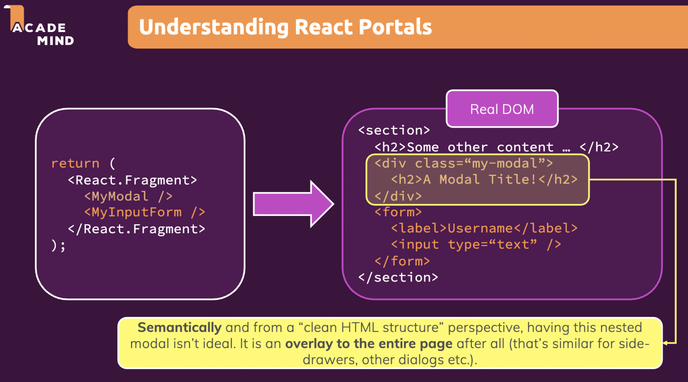
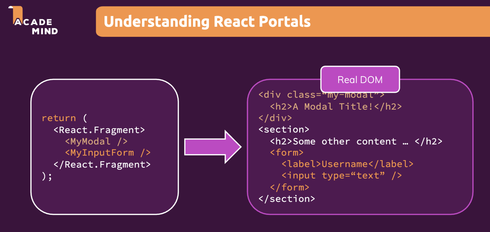

working with Fragments, Portals & 'Refs'

+ React Fragment
  + to combat 'div soup' problem
+ React Portal
  + 改变某个component从 VDOM => DOM 的位置mapping
+ React Ref
  + create a reference to a DOM element or a mutable variable that persists for the full lifetime of the component


## 1. JSX limitations & workaround


+ you cannot return more than one "root" JSX element (you also cannot store more than one "root" JSX element in a variable)

  ```js
  return (
  	<h2> Hi there! </h2>
    <p> This does not work!</p>
  )
  ```

  simply because you cannot return two variables or objects separately from a function  in JS

  ```js
  return (
  	React.createElement('h2', {}, 'Hi there!')
    React.createElement('p', {}, 'This does not wokr!')
  )
  ```

+ Solution: alway wrap adjacent elements; but this might leads to excessively unnecessary nested <div> => "div soup" problem

```js
return (
  <div>
		<h2> Hi there! </h2>
  	<p> This does not work!</p>
  </div>
)
```


更进一步, Create a wrapper component to combat "div soup" problem

```js
const Wrapper = (props) => {
  return props.children;
};

export default Wrapper;


// jsx for a component at somewhere else
return (
  <Wrapper>
		<h2> Hi there! </h2>
  	<p> This does not work!</p>
  </Wrapper>
)
```


### React Fragments

136

其实React有built-in "Wrapper" to combat "div soup" problem

```js
return (
  <React.Fragment>
		<h2> Hi there! </h2>
  	<p> This does not work!</p>
  </React.Fragment>
)

// OR
// an empty Wrapper component. It doesn't render any HTML element to the DOM. But
// it fullfills React's JSX requirement
return (
  <>
		<h2> Hi there! </h2>
  	<p> This does not work!</p>
  </>
)
```


## 2. React Portals

137

Problem is:



+ semantically bad: e.g. it's a bit like styling a <div> like <button> and adding an event listener to it. It'll work, but it's not good practice

  + ```js
    <div onClick={clickHandler}>Click me, I'm a bad button </div>
    ```


What we want: 

+ 实际是想改变React component tree中某个component在Real DOM中的位置, 下面的<MyModal> 我用React写在这个<React.Fragment>里, 但是在Real DOM中我想让它出现别的位置(so that semantically better or having better performance ), 就像使用portal传送了它一样. 
  + :bangbang: 同时React处理起来时还是认为被传送的component依然在用React写的位置(e.g. props passing, component tree hierarchy), 只是实际上它在real dom的别的位置. portal就像提供了一个mask from VDOM to DOM, 说的再远点, react相当于middleware, 它把底层繁杂的对DOM的操作mask为developer对component tree的操作
  + 一般是针对overlay效果
  




### working with portal 

基于上个lecture的demo project2中的ErrorModal的overlay来举例讲


UI > ErrorModal.js

+ 第一次见到在1个js file中定义多个component
+ Styled component与React.Fragment的兼容: 不要试图把所有的styling写在1个styled component里, 可以拆分出几个component分别写其styled component

```js
import React from "react";
import ReactDOM from "react-dom";			// 将react-dom的逻辑适配到real dom上， 相当于adapter
import styled from "styled-components";
import Card from "./Card";
import Button from "./Button";

const StyledBackdrop = styled.div`
  position: fixed;
  top: 0;
  left: 0;
  width: 100%;
  height: 100vh;
  z-index: 10;
  background: rgba(0, 0, 0, 0.75);
`;

const Backdrop = (props) => {
  return (
    <StyledBackdrop
      className="backdrop"
      onClick={props.onConfirm}
    ></StyledBackdrop>
  );
};

const StyledModal = styled(Card)`
  position: fixed;
  top: 30vh;
  left: 10%;
  width: 80%;
  z-index: 100;
  overflow: hidden;

  & .header {
    background: #4f005f;
    padding: 1rem;
    & h2 {
      margin: 0;
      color: white;
    }
  }

  & .content {
    padding: 1rem;
  }

  & .actions {
    padding: 1rem;
    display: flex;
    justify-content: flex-end;
  }

  @media (min-width: 768px) {
    left: calc(50% - 20rem);
    width: 40rem;
  }
`;

const ModalOverlay = (props) => {
  return (
    <StyledModal>
      <header className="header">
        <h2>{props.title}</h2>
      </header>

      <div className="content">
        <p>{props.message}</p>
      </div>

      <footer className="actions">
        <Button onClick={props.onConfirm}>Okay</Button>
      </footer>
    </StyledModal>
  );
};

const ErrorModel = (props) => {
  return (
    <React.Fragment>
      {ReactDOM.createPortal(
        <Backdrop onConfirm={props.onConfirm} />,
        document.getElementById("backdrop-root") // the other side of portal (mount in real DOM)
      )}
      {ReactDOM.createPortal(
        <ModalOverlay
          title={props.title}
          message={props.message}
          onConfirm={props.onConfirm}
        />,
        document.getElementById("overlay-root")		// actual mount point in real DOM
      )}
    </React.Fragment>
  );
};

export default ErrorModel;
```

index.html

+ ErrorModal.js中通过React.createPortal()定义好了哪些component要被attach在html的其他位置, 这样backdrop 和 overlay component实际render时就会与其他component分开

```html
  <body>
    <noscript>You need to enable JavaScript to run this app.</noscript>
    <div id="backdrop-root"></div>		// 放backdrop component
    <div id="overlay-root"></div>			// 放overlay component
    <div id="root"></div>
  </body>
```


## 3. Working with "ref"s

139

create a reference to html element

chatGPT: The `useRef` hook in React is used to create a reference to a DOM element or a mutable variable that persists for the full lifetime of the component. It is similar to instance variables in a class-based component, providing a way to persist values across renders.


use ref 可以平替 state, 但是有时需要对real DOM直接进行操作, 这不是react的核心思想


AddUser.js 依然以last lecture的demo2为例讲

```js
import { useState, useRef } from "react";
import styled from "styled-components";
import Card from "../UI/Card";
import Button from "../UI/Button";
import ErrorModel from "../UI/ErrorModel";
import Wrapper from "../Helpers/Wrapper";

// to style an existing component
const StyledCard = styled(Card)`
  margin: 2rem auto;
  padding: 1rem;
  width: 90%;
  max-width: 40rem;

  label {
    display: block;
    font-weight: bold;
    margin-bottom: 0.5rem;
  }

  input {
    font: inherit;
    display: block;
    width: 100%;
    border: 1px solid #ccc;
    padding: 0.15rem;
    margin-bottom: 0.5rem;
  }

  input:focus {
    outline: none;
    border-color: #4f005f;
  }
`;

const AddUser = (props) => {
  const nameInputRef = useRef(); // an object with 'current' as its field
  const ageInputRef = useRef();
  const [error, setError] = useState();

  const addUserHandler = (event) => {
    event.preventDefault();

    // use Ref to read value from <input>
    const enteredName = nameInputRef.current.value;
    const enteredUserAge = ageInputRef.current.value;

    if (enteredName.trim().length === 0 || enteredUserAge.trim().length === 0) {
      setError({
        title: "invalid input",
        message: "Please enter a valid name and age (non-empty values)",
      });
      return;
    }

    if (+enteredUserAge < 1) {
      // make sure enterAge is a number, not a string
      setError({
        title: "invalid input",
        message: "Please enter a valid age (>0)",
      });
      return;
    }

    props.onAddUser(enteredName, enteredUserAge);

    // reset: 这里不是react, 而是在直接操作real DOM
    nameInputRef.current.value = '';
    ageInputRef.current.value = '';
  };

  const errorHandler = () => {
    setError(null);
  };

  return (
    <Wrapper>
      {error && (
        <ErrorModel
          title={error.title}
          message={error.message}
          onConfirm={errorHandler}
        ></ErrorModel>
      )}

      <StyledCard>
        <form onSubmit={addUserHandler}>
          {/* htmlFor property is used to bind label with input */}
          <label htmlFor="username">Username</label>
          <input id="username" type="text" ref={nameInputRef}></input>

          <label htmlFor="age">Age(years)</label>
          <input id="age" type="number" ref={ageInputRef}></input>

          <Button type="submit">Add User</Button>
        </form>
      </StyledCard>
    </Wrapper>
  );
};

export default AddUser;
```


ref vs. state

+ if just for reading, ref is better 


### Controlled vs. uncontrolled components

140

+ 上面的AddUser中 <input>就是uncontrolled components, 因为<input>的state我们没有通过react来控制

+ 而上节课讲的使用state和two-way binding来read和control <input>中， <input>是controlled component因为它的状态我们直接操控


chatGPT:

Controlled and uncontrolled components in React relate to form elements and how state is managed with those elements.

1. **Controlled Components**:

   In a controlled component, the state of the form element (e.g. the value of an input field) is handled by the state within the component and controlled via functions within the component. Every state mutation will have an associated handler function. The React component that renders a form also controls what happens in that form on subsequent user input.

   Here's a simple example of a controlled component:

   ```jsx
   class ControlledForm extends React.Component {
     constructor(props) {
       super(props);
       this.state = { value: '' };

       this.handleChange = this.handleChange.bind(this);
       this.handleSubmit = this.handleSubmit.bind(this);
     }

     handleChange(event) {
       this.setState({ value: event.target.value });
     }

     handleSubmit(event) {
       alert('A name was submitted: ' + this.state.value);
       event.preventDefault();
     }

     render() {
       return (
         <form onSubmit={this.handleSubmit}>
           <label>
             Name:
             <input type="text" value={this.state.value} onChange={this.handleChange} />
           </label>
           <input type="submit" value="Submit" />
         </form>
       );
     }
   }
   ```

2. **Uncontrolled Components**:

   An uncontrolled component works more like traditional HTML form elements. Instead of writing an event handler for every state update, you can use a ref to get form values from the DOM. The form data is handled by the DOM itself, not by the React component.

   Here's a simple example of an uncontrolled component:

   ```jsx
   class UncontrolledForm extends React.Component {
     constructor(props) {
       super(props);
       this.handleSubmit = this.handleSubmit.bind(this);
       this.input = React.createRef();
     }
   
     handleSubmit(event) {
       alert('A name was submitted: ' + this.input.current.value);
       event.preventDefault();
     }
   
     render() {
       return (
         <form onSubmit={this.handleSubmit}>
           <label>
             Name:
             <input type="text" ref={this.input} />
           </label>
           <input type="submit" value="Submit" />
         </form>
       );
     }
   }
   ```

Generally, it's recommended to use **controlled components** because they allow for more predictable and deterministic code, and they integrate better with other React concepts, such as form validation. However, uncontrolled components can be useful in some cases for simplifying code, especially when dealing with form data that doesn't need to be validated or tightly controlled.

