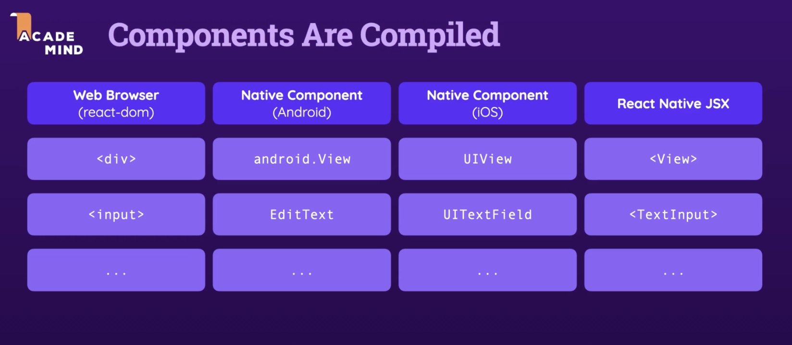

# React.js vs. React Native

React.js (often simply referred to as "React") and React Native are both JavaScript libraries/frameworks developed by Facebook, and they share a foundational concept and some underlying architecture. However, they serve different purposes in the web and software development landscapes:

1. **Purpose**:
   - **React.js**: React is a JavaScript library used for building user interfaces or UI components, primarily for web applications.
   - **React Native**: React Native is a framework for building native mobile applications for platforms like iOS and Android using JavaScript and React.

2. **Platform**:
   - **React.js**: Targets web browsers, resulting in web applications.
   - **React Native**: Targets mobile platforms, leading to native mobile applications.

3. :bangbang: **Common Foundation**:
   Both React and React Native utilize the concept of a `virtual DOM`, which optimizes rendering and provides a `declarative way` to define UI components.

4. :bangbang: **Rendering**:
   - **React.js**: Uses browser DOM APIs to render components.
   - **React Native**: Uses native rendering APIs on iOS and Android to display components. Instead of translating React components to HTML like React.js does, React Native translates them into native mobile UI elements.

5. :bangbang: **Styling**:
   - **React.js**: Utilizes CSS for styling.
   - **React Native**: Uses a styling mechanism that resembles inline styles in JavaScript objects. This is then converted to native styling code under the hood.

6. **Integration with Native Code**:
   - **React.js**: Typically doesn't need to integrate with native code unless you're trying to build a web application that taps into some lower-level browser APIs.
   - **React Native**: Has built-in facilities to integrate with native code, allowing developers to write portions of their apps in native code (Objective-C, Swift, Java, Kotlin) if needed, and then bridge that functionality to JavaScript.

7. :bangbang: **Components**:
   - **React.js**: Comes with standard HTML components (like divs, spans, etc.).
   
   - **React Native**: Comes with its own set of components (like `View`, `Text`, and `Image`) that map to native UI elements on iOS and Android.
   
     - React Native is a middleware!
   
     
   
8. **Learning Curve**:
   If you're familiar with React.js, transitioning to React Native is generally smooth. The core concepts remain the same, though there are some differences related to the mobile platform, component library, and styling.

9. **Community and Ecosystem**:
   Both React and React Native have vibrant communities and ecosystems, with a plethora of libraries, tools, and plugins available.

In summary, while React and React Native share the foundational concept of component-based UI development and a virtual DOM, they are tailored for different platforms (web vs. mobile). Developers can often reuse <u>logic</u> and <u>state management strategies</u> across the two, but the <u>rendering, styling, and certain integrations</u> will be platform-specific.