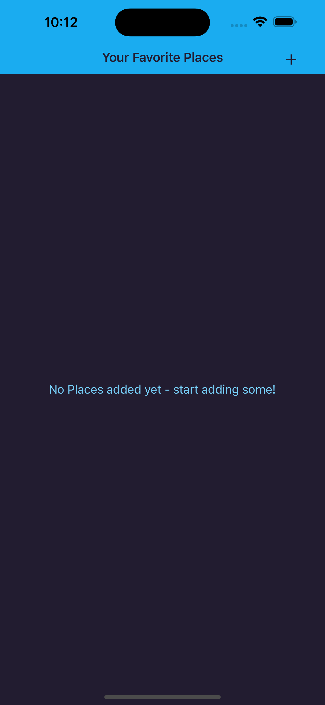
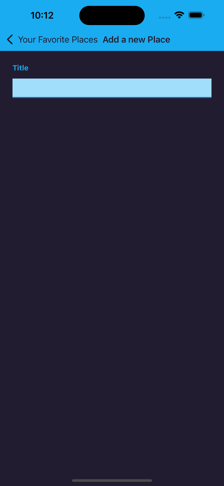
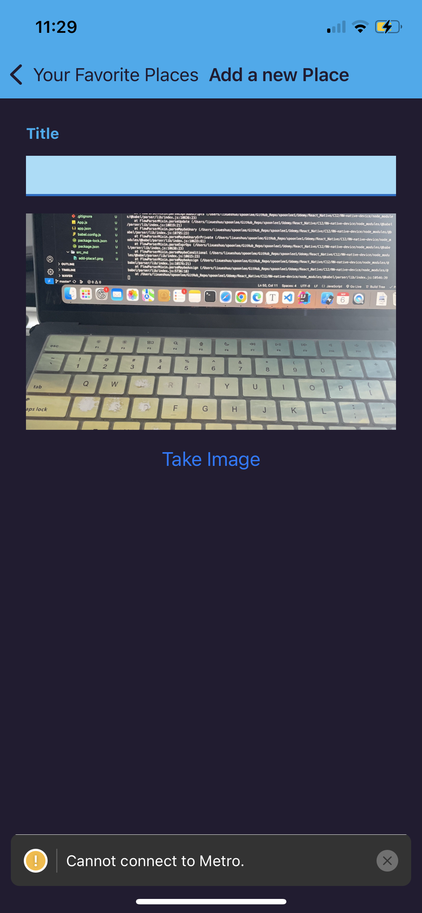
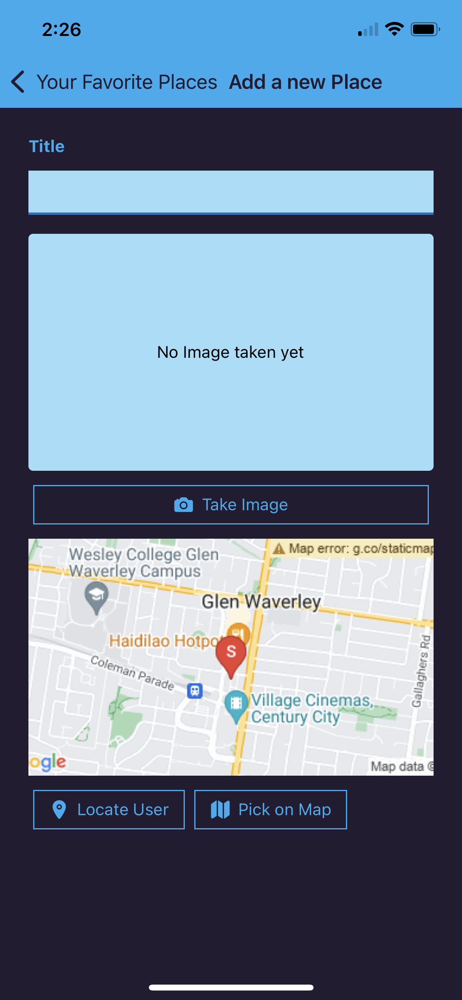

12

4 hours course 

189 - 219


# Abstract

:gem: build another app from a scratch: favorite places app

+ using camera, 
+ user location & Map
+ Storing Data on the Device

同时也复习前面的 navigation, user input, send http request

note we just cover a few native device APIs in this class, refer to expo doc for more


# Prepare

189-194

some preparation work before we really use native device 


```js
AllPlaces: Screen
	|-- PlaceList
				|-- PlaceItem
```


```js
AddPlaces: Screen 
	|-- PlaceForm
```


```js
// navigations: in App.js
// some screen configs
 <NavigationContainer>
        <Stack.Navigator screenOptions={{
          headerStyle: {backgroundColor: Colors.primary500},
          headerTintColor: Colors.gray700,
          contentStyle: {backgroundColor: Colors.gray700}
        }}>
          <Stack.Screen
            name="AllPlaces"
            component={AllPlaces}
            options={({ navigation }) => ({
              title: 'Your Favorite Places',
              headerRight: ({ tintColor }) => (
                <IconButton			// customised component ******
                  icon="add"
                  size={24}
                  color={tintColor}
                  onPress={() => navigation.navigate("AddPlace")}
                />
              ),
            })}
          />
          <Stack.Screen name="AddPlace" component={AddPlace} options={{
            title: 'Add a new Place'
          }} />
        </Stack.Navigator>
      </NavigationContainer>
```








# Native device

195-


## Camera

195-

[Camera - Expo Documentation](https://docs.expo.dev/versions/latest/sdk/camera/) but might overkill in this course (very comprehensive camear documentations)

[ImagePicker - Expo Documentation](https://docs.expo.dev/versions/latest/sdk/imagepicker/) this demo use this one

+ just check intall and configuration steps before use
  + set permissions in app.config


### permission & take photo

+ permissions on android is more loose, but on iOS permission is more strict and need to explicitly ask for user's permission: take photos on iOS (camera not available on simulator, need to use real phone)
+ Take photo API `launchCameraAsync` [ImagePicker - Expo Documentation](https://docs.expo.dev/versions/latest/sdk/imagepicker/#imagepickerlaunchcameraasyncoptions)

```js
import { Alert, Button, View } from "react-native";
import {
  launchCameraAsync,
  useCameraPermissions,
  PermissionStatus,
} from "expo-image-picker";

function ImagePicker() {
  // this hook is for iOS to seek permission----------------
  const [cameraPermissionInfo, requestPermission] = useCameraPermissions();
  async function verifyPermission() {
    if (cameraPermissionInfo.status === PermissionStatus.UNDETERMINED) {
      const permissionResponse = await requestPermission(); //! asking for user's permission
      return permissionResponse.granted; // true if granted, false otherwise
    }
    if (cameraPermissionInfo.status === PermissionStatus.DENIED) {
      Alert.alert(
        "Insufficient Permissions!",
        "You need to grant camera permissions to use this app"
      );
      return false;
    }
    return true; // if have permission
  }
  // ------------------------------------

  async function takeImageHandler() {
    const hasPermission = await verifyPermission();
    if(!hasPermission){
        return
    }
    const image = await launchCameraAsync({
      allowsEditing: true,
      aspect: [16, 9],
      quality: 0.5,
    });
    console.log(image);		// log the image 
  }

  return (
    <View>
      <View></View>
      <Button title="Take Image" onPress={takeImageHandler} />
    </View>
  );
}

export default ImagePicker;
```

now you can take photos on your real iOS device:

```shell
 LOG  {"assets": [{"assetId": null, "base64": null, "duration": null, "exif": null, "fileName": null, "fileSize": 1107435, "height": 3025, "type": "image", "uri": "file:///var/mobile/Containers/Data/Application/D2302A16-3760-4586-A311-D61C7349BF0E/Library/Caches/ExponentExperienceData/%2540anonymous%252FRN-native-device-8bcf90f0-2c88-4b60-9c50-43d8cf1beded/ImagePicker/4DE00345-6479-4D4B-B0DA-2B78DDE6D734.jpg", "width": 3024}], "canceled": false, "cancelled": false}
```


### preview image

set image picked as state 

```js
import { Alert, Button, Image, View, Text, StyleSheet } from "react-native";
import {
  launchCameraAsync,
  useCameraPermissions,
  PermissionStatus,
} from "expo-image-picker";
import { useState } from "react";
import { Colors } from "../../constants/colors";

function ImagePicker() {
  // 1 hooks
  const [pickedImage, setPickedImage] = useState();	// ********** store picked image uri

  // this hook is for iOS ----------------
  const [cameraPermissionInfo, requestPermission] = useCameraPermissions();
  async function verifyPermission() {
    if (cameraPermissionInfo.status === PermissionStatus.UNDETERMINED) {
      const permissionResponse = await requestPermission(); //! asking for user's permission
      return permissionResponse.granted; // true if granted, false otherwise
    }
    if (cameraPermissionInfo.status === PermissionStatus.DENIED) {
      Alert.alert(
        "Insufficient Permissions!",
        "You need to grant camera permissions to use this app"
      );
      return false;
    }
    return true; // do have permission
  }
  // ------------------------------------
	
  // 2 callback handlers
  async function takeImageHandler() {
    const hasPermission = await verifyPermission();
    if (!hasPermission) {
      return;
    }
    const image = await launchCameraAsync({
      allowsEditing: true,
      aspect: [16, 9],
      quality: 0.5,
    });
    console.log(image);
    setPickedImage(image.uri);
  }
  
	// 3 conditional jsx variables 
  let imagePreview = <Text>No Image taken yet</Text>;
  if (pickedImage) {
    imagePreview = <Image style={styles.iamge} source={{ uri: pickedImage }} />;
  }
	
	// 4 jsx 
  return (
    <View>
      <View style={styles.imagePreview}>{imagePreview}</View>
      <Button title="Take Image" onPress={takeImageHandler} />
    </View>
  );
}

export default ImagePicker;

const styles = StyleSheet.create({
  imagePreview: {
    width: "100%",
    height: 200,
    marginVertical: 8,
    justifyContent: "center",
    alignItems: "center",
    backgroundColor: Colors.primary100,
    borderRadius: 4,
  },
  iamge: {
    width: '100%',
    height: '100%'
  }
});
```





At last, customized a more beautiful button component: OutlinedButton.js

199


## Location & (Interactive) Map

200-

### Location picker

```js
AddPlaces: Screen 
	|-- PlaceForm
				|-- ImagePicker
				|-- LocationPicker
```

[Location - Expo Documentation](https://docs.expo.dev/versions/latest/sdk/location/)


LocationPicker.js

+ permission
+ Get location API `getCurrentPositionAsync`  [Location - Expo Documentation ](https://docs.expo.dev/versions/latest/sdk/location/#locationgetcurrentpositionasyncoptions)there are many more APIs!

```js
import { StyleSheet, View, Alert } from "react-native";
import {
  getCurrentPositionAsync,
  useForegroundPermissions,
  PermissionStatus
} from "expo-location";

import OutlinedButton from "../UI/OutlinedButton";
import { Colors } from "../../constants/colors";

function LocationPicker() {
  const [locationPermissionInfo, requestPermission] =
    useForegroundPermissions();

  async function verifyPermission() {
    if (locationPermissionInfo.status === PermissionStatus.UNDETERMINED) {
      const permissionResponse = await requestPermission(); //! asking for user's permission
      return permissionResponse.granted; // true if granted, false otherwise
    }
    if (locationPermissionInfo.status === PermissionStatus.DENIED) {
      Alert.alert(
        "Insufficient Permissions!",
        "You need to grant location permissions to use this app"
      );
      return false;
    }
    return true; // do have permission
  }

  async function getLocationHandler() {
    // permissions
    const hasPermission = await verifyPermission();
    if(!hasPermission){
        return;
    }
    // fetch location
    const location = await getCurrentPositionAsync();
    console.log(location);
  }

  function pickOnMapHandler() {}

  return (
    <View>
      <View style={styles.mapPreview}></View>
      <View style={styles.actions}>
        <OutlinedButton icon="location" onPress={getLocationHandler}>
          Locate User
        </OutlinedButton>
        <OutlinedButton icon="map" onPress={pickOnMapHandler}>
          Pick on Map
        </OutlinedButton>
      </View>
    </View>
  );
}

export default LocationPicker;

const styles = StyleSheet.create({
  mapPreview: {
    width: "100%",
    height: 200,
    marginVertical: 8,
    justifyContent: "center",
    alignItems: "center",
    backgroundColor: Colors.primary100,
    borderRadius: 4,
  },
  actions: {
    flexDirection: "row",
    justifyContent: "sapce-around",
    alignItems: "center",
  },
});
```


after click on get location button on your real iOS device:

```shell
{"coords": {"accuracy": 13.724252306905626, "altitude": 143.06784796714783, "altitudeAccuracy": 3, "heading": 0, "latitude": -37.87882797889214, "longitude": 145.16468242755641, "speed": 0}, "timestamp": 1693967585999.8245}
```


### :moon: Location preview Map

202

use Google Map 3rd party api to display map 

+ :bangbang: note google provides $200 credit every month, if excceed this limit, you need to pay for it! https://mapsplatform.google.com/pricing/

https://developers.google.com/maps/documentation/maps-static/overview

quick start: https://developers.google.com/maps/documentation/maps-static/overview#quick_example

+ go to google cloud to set your API key, which is needed when send request in your app https://console.cloud.google.com/google/maps-apis/overview


we will now construct a Url which contains the location info (lat, lng) that we just picked and attach this Url to <Image>, google map server will return an image showing the picked location

+ 注意in your google cloud project, enable API
+ API对应的url 1行不要加空格


```js
const GOOGLE_API_KEy = "xxxxxxxx"

export function getMapPreview(lat, lng) {      // helper function that constructs the Url to Google Map server
  const imagePreviewUrl = `https://maps.googleapis.com/maps/api/staticmap?center=${lat},${lng}Y&zoom=14&size=400x200&maptype=roadmap&markers=color:red%7Clabel:S%7C${lat},${lng}&key=${GOOGLE_API_KEY}`;

  return imagePreviewUrl;
}
```


LocationPicker.js

+ 注意RN的<Image/>必须声明width, height
+ 将fetch来的location化为state, 以放入<Iamge />

```js
import { StyleSheet, View, Alert, Image, Text } from "react-native";
import {
  getCurrentPositionAsync,
  useForegroundPermissions,
  PermissionStatus,
} from "expo-location";

import OutlinedButton from "../UI/OutlinedButton";
import { Colors } from "../../constants/colors";
import { useState } from "react";
import { getMapPreview } from "../../util/location";

function LocationPicker() {
  // 1. hooks ------------------------------
  const [pickedLocation, setPickedLocation] = useState();
  const [locationPermissionInfo, requestPermission] =
    useForegroundPermissions();

  async function verifyPermission() {
    if (locationPermissionInfo.status === PermissionStatus.UNDETERMINED) {
      const permissionResponse = await requestPermission(); //! asking for user's permission
      return permissionResponse.granted; // true if granted, false otherwise
    }
    if (locationPermissionInfo.status === PermissionStatus.DENIED) {
      Alert.alert(
        "Insufficient Permissions!",
        "You need to grant location permissions to use this app"
      );
      return false;
    }
    return true; // do have permission
  }
	
  // 2. handlers ----------------------------
  async function getLocationHandler() {
    // permissions
    const hasPermission = await verifyPermission();
    if (!hasPermission) {
      return;
    }
    // fetch location
    const location = await getCurrentPositionAsync();
    console.log(location);
    setPickedLocation({
      lat: location.coords.latitude,
      lng: location.coords.longitude,
    });
  }

  function pickOnMapHandler() {}
	
  // 3. conditional jsx variable -----------
  let locationPreview = <Text>No locaiton picked yet!</Text>;
  if (pickedLocation) {
    locationPreview = (
      <Image
        style={styles.image}
        source={{
          uri: getMapPreview(pickedLocation.lat, pickedLocation.lng),	// Google Static Map API********
        }}
      />
    );
  }
	
  // 4. jsx -------------------------------
  return (
    <View>
      <View style={styles.mapPreview}>{locationPreview}</View>
      <View style={styles.actions}>
        <OutlinedButton icon="location" onPress={getLocationHandler}>
          Locate User
        </OutlinedButton>
        <OutlinedButton icon="map" onPress={pickOnMapHandler}>
          Pick on Map
        </OutlinedButton>
      </View>
    </View>
  );
}

export default LocationPicker;

const styles = StyleSheet.create({
  mapPreview: {
    width: "100%",
    height: 200,
    marginVertical: 8,
    justifyContent: "center",
    alignItems: "center",
    backgroundColor: Colors.primary100,
    borderRadius: 4,
  },
  actions: {
    flexDirection: "row",
    justifyContent: "sapce-around",
    alignItems: "center",
  },
  image: {
    width: "100%",
    height: "100%",
  },
});

```

now once click on 'Locate User', we will receive the Image from Google static map api




### Interactive map

203-


## Form Submission


