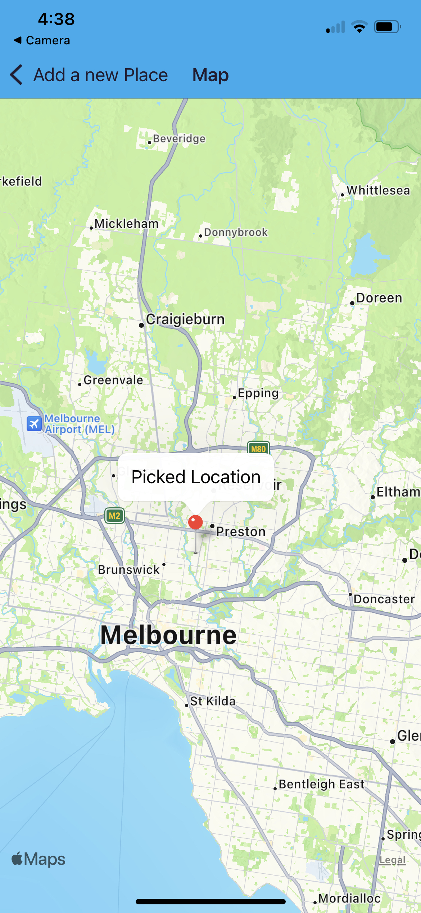

12

4 hours course 

189 - 219


# Abstract

:gem: build another app from a scratch: favorite places app

+ using camera, 
+ user location & Map
+ Storing Data on the Device

同时也复习前面的 navigation, user input, send http request

note we just cover a few native device APIs in this class, refer to expo doc for more


### key takeaways

+ expo provide a lot of libs for using native device. check out at  [Expo Documentation](https://docs.expo.dev/). 


# Prepare

189-194

some preparation work before we really use native device 


```js
AllPlaces: Screen
	|-- PlaceList
				|-- PlaceItem
```


```js
AddPlaces: Screen 
	|-- PlaceForm
```


```js
// navigations: in App.js
// some screen configs
 <NavigationContainer>
        <Stack.Navigator screenOptions={{
          headerStyle: {backgroundColor: Colors.primary500},
          headerTintColor: Colors.gray700,
          contentStyle: {backgroundColor: Colors.gray700}
        }}>
          <Stack.Screen
            name="AllPlaces"
            component={AllPlaces}
            options={({ navigation }) => ({
              title: 'Your Favorite Places',
              headerRight: ({ tintColor }) => (
                <IconButton			// customised component ******
                  icon="add"
                  size={24}
                  color={tintColor}
                  onPress={() => navigation.navigate("AddPlace")}
                />
              ),
            })}
          />
          <Stack.Screen name="AddPlace" component={AddPlace} options={{
            title: 'Add a new Place'
          }} />
        </Stack.Navigator>
      </NavigationContainer>
```


# Native device

195-


## Camera

195-

[Camera - Expo Documentation](https://docs.expo.dev/versions/latest/sdk/camera/) but might overkill in this course (very comprehensive camear documentations)

[ImagePicker - Expo Documentation](https://docs.expo.dev/versions/latest/sdk/imagepicker/) this demo use this one

+ just check intall and configuration steps before use
  + set permissions in app.config


### permission & take photo

+ permissions on android is more loose, but on iOS permission is more strict and need to explicitly ask for user's permission: take photos on iOS (camera not available on simulator, need to use real phone)
+ Take photo API `launchCameraAsync` [ImagePicker - Expo Documentation](https://docs.expo.dev/versions/latest/sdk/imagepicker/#imagepickerlaunchcameraasyncoptions)

```js
import { Alert, Button, View } from "react-native";
import {
  launchCameraAsync,
  useCameraPermissions,
  PermissionStatus,
} from "expo-image-picker";

function ImagePicker() {
  // this hook is for iOS to seek permission----------------
  const [cameraPermissionInfo, requestPermission] = useCameraPermissions();
  async function verifyPermission() {
    if (cameraPermissionInfo.status === PermissionStatus.UNDETERMINED) {
      const permissionResponse = await requestPermission(); //! asking for user's permission
      return permissionResponse.granted; // true if granted, false otherwise
    }
    if (cameraPermissionInfo.status === PermissionStatus.DENIED) {
      Alert.alert(
        "Insufficient Permissions!",
        "You need to grant camera permissions to use this app"
      );
      return false;
    }
    return true; // if have permission
  }
  // ------------------------------------

  async function takeImageHandler() {
    const hasPermission = await verifyPermission();
    if(!hasPermission){
        return
    }
    const image = await launchCameraAsync({
      allowsEditing: true,
      aspect: [16, 9],
      quality: 0.5,
    });
    console.log(image);		// log the image 
  }

  return (
    <View>
      <View></View>
      <Button title="Take Image" onPress={takeImageHandler} />
    </View>
  );
}

export default ImagePicker;
```

now you can take photos on your real iOS device:

```shell
 LOG  {"assets": [{"assetId": null, "base64": null, "duration": null, "exif": null, "fileName": null, "fileSize": 1107435, "height": 3025, "type": "image", "uri": "file:///var/mobile/Containers/Data/Application/D2302A16-3760-4586-A311-D61C7349BF0E/Library/Caches/ExponentExperienceData/%2540anonymous%252FRN-native-device-8bcf90f0-2c88-4b60-9c50-43d8cf1beded/ImagePicker/4DE00345-6479-4D4B-B0DA-2B78DDE6D734.jpg", "width": 3024}], "canceled": false, "cancelled": false}
```


### preview image

set image picked as state 

```js
import { Alert, Button, Image, View, Text, StyleSheet } from "react-native";
import {
  launchCameraAsync,
  useCameraPermissions,
  PermissionStatus,
} from "expo-image-picker";
import { useState } from "react";
import { Colors } from "../../constants/colors";

function ImagePicker() {
  // 1 hooks
  const [pickedImage, setPickedImage] = useState();	// ********** store picked image uri

  // this hook is for iOS ----------------
  const [cameraPermissionInfo, requestPermission] = useCameraPermissions();
  async function verifyPermission() {
    if (cameraPermissionInfo.status === PermissionStatus.UNDETERMINED) {
      const permissionResponse = await requestPermission(); //! asking for user's permission
      return permissionResponse.granted; // true if granted, false otherwise
    }
    if (cameraPermissionInfo.status === PermissionStatus.DENIED) {
      Alert.alert(
        "Insufficient Permissions!",
        "You need to grant camera permissions to use this app"
      );
      return false;
    }
    return true; // do have permission
  }
  // ------------------------------------
	
  // 2 callback handlers
  async function takeImageHandler() {
    const hasPermission = await verifyPermission();
    if (!hasPermission) {
      return;
    }
    const image = await launchCameraAsync({
      allowsEditing: true,
      aspect: [16, 9],
      quality: 0.5,
    });
    console.log(image);
    setPickedImage(image.uri);
  }
  
	// 3 conditional jsx variables 
  let imagePreview = <Text>No Image taken yet</Text>;
  if (pickedImage) {
    imagePreview = <Image style={styles.iamge} source={{ uri: pickedImage }} />;
  }
	
	// 4 jsx 
  return (
    <View>
      <View style={styles.imagePreview}>{imagePreview}</View>
      <Button title="Take Image" onPress={takeImageHandler} />
    </View>
  );
}

export default ImagePicker;

const styles = StyleSheet.create({
  imagePreview: {
    width: "100%",
    height: 200,
    marginVertical: 8,
    justifyContent: "center",
    alignItems: "center",
    backgroundColor: Colors.primary100,
    borderRadius: 4,
  },
  iamge: {
    width: '100%',
    height: '100%'
  }
});
```


At last, customized a more beautiful button component: OutlinedButton.js

199


## Location & (Interactive) Map

200-

### Location picker

```js
AddPlaces: Screen 
	|-- PlaceForm
				|-- ImagePicker
				|-- LocationPicker
```

[Location - Expo Documentation](https://docs.expo.dev/versions/latest/sdk/location/)


LocationPicker.js

+ permission
+ Get location API `getCurrentPositionAsync`  [Location - Expo Documentation ](https://docs.expo.dev/versions/latest/sdk/location/#locationgetcurrentpositionasyncoptions)there are many more APIs!

```js
import { StyleSheet, View, Alert } from "react-native";
import {
  getCurrentPositionAsync,
  useForegroundPermissions,
  PermissionStatus
} from "expo-location";

import OutlinedButton from "../UI/OutlinedButton";
import { Colors } from "../../constants/colors";

function LocationPicker() {
  const [locationPermissionInfo, requestPermission] =
    useForegroundPermissions();

  async function verifyPermission() {
    if (locationPermissionInfo.status === PermissionStatus.UNDETERMINED) {
      const permissionResponse = await requestPermission(); //! asking for user's permission
      return permissionResponse.granted; // true if granted, false otherwise
    }
    if (locationPermissionInfo.status === PermissionStatus.DENIED) {
      Alert.alert(
        "Insufficient Permissions!",
        "You need to grant location permissions to use this app"
      );
      return false;
    }
    return true; // do have permission
  }

  async function getLocationHandler() {
    // permissions
    const hasPermission = await verifyPermission();
    if(!hasPermission){
        return;
    }
    // fetch location
    const location = await getCurrentPositionAsync();
    console.log(location);
  }

  function pickOnMapHandler() {}

  return (
    <View>
      <View style={styles.mapPreview}></View>
      <View style={styles.actions}>
        <OutlinedButton icon="location" onPress={getLocationHandler}>
          Locate User
        </OutlinedButton>
        <OutlinedButton icon="map" onPress={pickOnMapHandler}>
          Pick on Map
        </OutlinedButton>
      </View>
    </View>
  );
}

export default LocationPicker;

const styles = StyleSheet.create({
  mapPreview: {
    width: "100%",
    height: 200,
    marginVertical: 8,
    justifyContent: "center",
    alignItems: "center",
    backgroundColor: Colors.primary100,
    borderRadius: 4,
  },
  actions: {
    flexDirection: "row",
    justifyContent: "sapce-around",
    alignItems: "center",
  },
});
```


after click on get location button on your real iOS device:

```shell
{"coords": {"accuracy": 13.724252306905626, "altitude": 143.06784796714783, "altitudeAccuracy": 3, "heading": 0, "latitude": -37.87882797889214, "longitude": 145.16468242755641, "speed": 0}, "timestamp": 1693967585999.8245}
```


### :moon: Location preview Map

202

use Google Map 3rd party api to display map 

+ :bangbang: note google provides $200 credit every month, if excceed this limit, you need to pay for it! https://mapsplatform.google.com/pricing/

https://developers.google.com/maps/documentation/maps-static/overview

quick start: https://developers.google.com/maps/documentation/maps-static/overview#quick_example

+ go to google cloud to set your API key, which is needed when send request in your app https://console.cloud.google.com/google/maps-apis/overview
  + you can set restriction to API key
  + :bangbang: don't expose your API key to public! if you do, you will receive warning from google => .gitignore


we will now construct a Url which contains the location info (lat, lng) that we just picked and attach this Url to <Image>, google map server will return an image showing the picked location

+ 注意in your google cloud project, enable API that is needed
+ API对应的url 1行不要加空格


```js
const GOOGLE_API_KEy = "xxxxxxxx"

export function getMapPreview(lat, lng) {      // helper function that constructs the Url to Google Map server
  const imagePreviewUrl = `https://maps.googleapis.com/maps/api/staticmap?center=${lat},${lng}Y&zoom=14&size=400x200&maptype=roadmap&markers=color:red%7Clabel:S%7C${lat},${lng}&key=${GOOGLE_API_KEY}`;

  return imagePreviewUrl;
}
```


LocationPicker.js

+ 注意RN的<Image/>必须声明width, height
+ 将fetch来的location化为state, 以放入<Iamge />

```js
import { StyleSheet, View, Alert, Image, Text } from "react-native";
import {
  getCurrentPositionAsync,
  useForegroundPermissions,
  PermissionStatus,
} from "expo-location";

import OutlinedButton from "../UI/OutlinedButton";
import { Colors } from "../../constants/colors";
import { useState } from "react";
import { getMapPreview } from "../../util/location";

function LocationPicker() {
  // 1. hooks ------------------------------
  const [pickedLocation, setPickedLocation] = useState();
  const [locationPermissionInfo, requestPermission] =
    useForegroundPermissions();

  async function verifyPermission() {
    if (locationPermissionInfo.status === PermissionStatus.UNDETERMINED) {
      const permissionResponse = await requestPermission(); //! asking for user's permission
      return permissionResponse.granted; // true if granted, false otherwise
    }
    if (locationPermissionInfo.status === PermissionStatus.DENIED) {
      Alert.alert(
        "Insufficient Permissions!",
        "You need to grant location permissions to use this app"
      );
      return false;
    }
    return true; // do have permission
  }
	
  // 2. handlers ----------------------------
  async function getLocationHandler() {
    // permissions
    const hasPermission = await verifyPermission();
    if (!hasPermission) {
      return;
    }
    // fetch location
    const location = await getCurrentPositionAsync();
    console.log(location);
    setPickedLocation({
      lat: location.coords.latitude,
      lng: location.coords.longitude,
    });
  }

  function pickOnMapHandler() {}
	
  // 3. conditional jsx variable -----------
  let locationPreview = <Text>No locaiton picked yet!</Text>;
  if (pickedLocation) {
    locationPreview = (
      <Image
        style={styles.image}
        source={{
          uri: getMapPreview(pickedLocation.lat, pickedLocation.lng),	// Google Static Map API********
        }}
      />
    );
  }
	
  // 4. jsx -------------------------------
  return (
    <View>
      <View style={styles.mapPreview}>{locationPreview}</View>
      <View style={styles.actions}>
        <OutlinedButton icon="location" onPress={getLocationHandler}>
          Locate User
        </OutlinedButton>
        <OutlinedButton icon="map" onPress={pickOnMapHandler}>
          Pick on Map
        </OutlinedButton>
      </View>
    </View>
  );
}

export default LocationPicker;

const styles = StyleSheet.create({
  mapPreview: {
    width: "100%",
    height: 200,
    marginVertical: 8,
    justifyContent: "center",
    alignItems: "center",
    backgroundColor: Colors.primary100,
    borderRadius: 4,
  },
  actions: {
    flexDirection: "row",
    justifyContent: "sapce-around",
    alignItems: "center",
  },
  image: {
    width: "100%",
    height: "100%",
  },
});

```


now once click on 'Locate User', we will receive the Image from Google static map api


### Interactive map

203-206


when click on 'pick on Map', navigate to a full screen interactive map that allows user to pick a location

---

+ use <MapView> from expo [MapView - Expo Documentation](https://docs.expo.dev/versions/latest/sdk/map-view/)
  + need flex: 1 to take up screen space
  + show Apple map on iOS, google map on android (no use 3rd party API)


```js
import { useState } from "react";
import { StyleSheet } from "react-native";
import MapView, { Marker } from "react-native-maps";

function Map() {
  const [selectedLocation, setSelectedLocation] = useState();

  const region = {
    latitude: 37.78,
    longitude: -1222.43,
    latitudeDelta: 0.0922, // define zoom of map
    longitudeDelta: 0.0421,
  };

  function selectionLocationHandler(event) {	
    // MapView onPress's callback
    console.log(event);
    const lat = event.nativeEvent.coordinate.latitude;
    const lng = event.nativeEvent.coordinate.longitude;
    setSelectedLocation({ lat: lat, lng: lng });
  }

  return (
    <MapView
      style={styles.map}
      initialRegion={region}				// the inital view content
      onPress={selectionLocationHandler}		// MapView is pressable!!
    >
      {selectedLocation && (
        <Marker
          title="Picked Location"
          coordinate={{
            latitude: selectedLocation.lat,
            longitude: selectedLocation.lng,
          }}
        />
      )}
    </MapView>
  );
}

export default Map;

const styles = StyleSheet.create({
  map: {
    flex: 1, // take up all available space
  },
});
```





save marked location 

---

205-206

user can click on a button to save the location just marked, and that marker along with the map will be displayed back to <AddPlace> screen

+ 设计screen communication, 在Map screen需要向AddPlace screen传递user marked location的信息. 看似简单但涉及到以下问题: stack-navigator默认不会把已经在stack里的srceen重新re-render when navigate back to that screen, 所以导致当我们从Map screen回到AddPlace screen时, 没有看到被marked location, 因为AddPlace screen没有被re-render
  + 解决方案是useEffect() + useIsFocused() hook


Stack-navigator mechanism:

say I have two screen component registered in a stack navigator, I firstly navigate from screen1 to screen2, then navigate back from screen2 to screen1, how many times does screen1 is rendered? 

GPT:

If you're using React Navigation's Stack Navigator and navigate from `Screen1` to `Screen2` and then navigate back from `Screen2` to `Screen1`, the render behavior is as follows:

1. `Screen1` is initially rendered when it's first displayed.
2. When you navigate from `Screen1` to `Screen2`, `Screen2` is pushed onto the stack and is rendered. `Screen1` is not unmounted; it remains in memory but is no longer visible.
3. When you navigate back from `Screen2` to `Screen1`, `Screen2` is popped from the stack and `Screen1` becomes visible again. Since `Screen1` was not unmounted in the first place, it's not re-rendered. It just becomes visible again.

So, in this flow, `Screen1` is rendered only once. 

However, it's important to note that while the entire component might not re-render, parts of it (like child components or specific hooks) might re-execute based on changes in props or state. If you're seeing unexpected re-renders, tools like React's `PureComponent`, `React.memo`, or careful use of the `useEffect` hook can be utilized to control rendering behavior.


`useIsFocus()` hook

+ a utility hook provided by React Navigation. It returns a boolean that indicates whether the screen it's used in is currently focused (active) within its navigator. This can be particularly useful in scenarios where you want to run certain effects or logic only when the screen is in focus.


## Form Submission

207-

看到这里


# Databse connection 

213-
