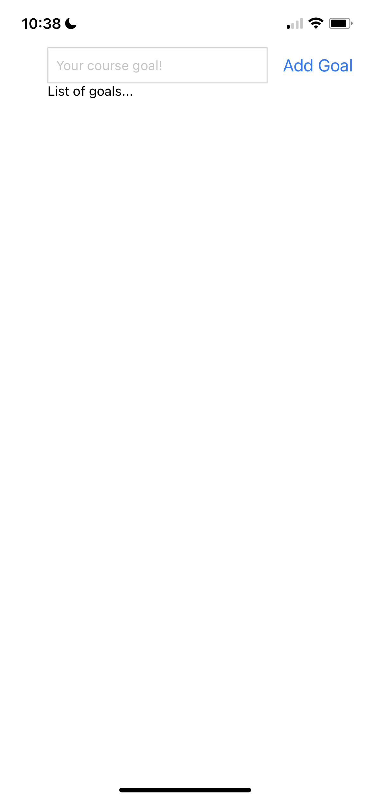
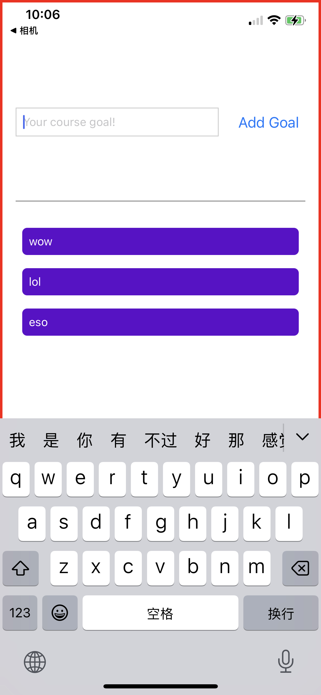

C2

# Abstract:

Using React Native Components & Building UIs

Styling React Native Apps

Adding interactivity & managing state


:gem:A demo app: course goals (典中典的demo, 两个组件, 一个接收user input, 一个展示user input)

+ Core Component of React Native
  + HTML tags cannot be used, but RN provides many similar counterparts - the core components
  + <View>, <ScrollView>, <FlatList>, <Pressable>, <Image>...
+ React Native use StyleSheet to create css-alike styling to core component
  + layout: flexbox 和 css语法一样
+ state management & props passing is the same as React.js
  + 注意组件通信时, 如何向props传来的function reference提供参数

一句话, RN基本上写起来需要逻辑和思维与写React.js一样, 只是它自己有HTML 和 CSS的平替, 以及一些特别的API


# Part1: core component & styling

## Core Components & Component styling

13 

:gem: starting-project

in this course, we only use functional component and react hooks, not gonna using class component


React Native core components docs:

https://reactnative.dev/docs/components-and-apis


App.js

```js
import { StatusBar } from 'expo-status-bar';
import { StyleSheet, Text, View } from 'react-native';  // note these React Native Core component

export default function App() {
  return (
    <View style={styles.container}>
      <Text>Hello World!!!!</Text>
      <Text>Hello World!!!!</Text>
      <StatusBar style="auto" />
    </View>
  );
}

const styles = StyleSheet.create({
  // very similar to css syntax, but in javascript
  container: {
    flex: 1,
    backgroundColor: '#fff',
    alignItems: 'center',
    justifyContent: 'center',
  },
});
```


## Working with Core Components

14

与React.js不同

+ Button component的写法 和 react.js中的不同
+ 使用到的React Native Component, 需要先import


App.js

```js
import { StyleSheet, Text, View, Button } from 'react-native';  // note this

export default function App() {
  return (
    // View is the container component that is used to contain elements, not pure text
    <View style={styles.container}> 
      <Text>Hello World!</Text>
      <Text>Another piece of info!</Text>
      <Button title="click me!"/>   
    </View>
  );
}

const styles = StyleSheet.create({
  // very similar to css syntax, but in javascript
  container: {
    flex: 1,
    backgroundColor: '#fff',
    alignItems: 'center',
    justifyContent: 'center',
  },
});
```


## Styling React Native Apps

15

no css in React Native

[react native stylesheet](https://reactnative.dev/docs/stylesheet)

[react native style](https://reactnative.dev/docs/style)

[React Native Color References](https://reactnative.dev/docs/colors)

[React Native: view style props](https://reactnative.dev/docs/view-style-props)


Two apporach to apply styling to a React Native Component

+ In-line
+ StyleSheet (preferred)
  + seperate component code with styling code
  + make styling more reusable


App.js

+ 以下: 运用StyledSheet来定义styling

```js
import { StyleSheet, Text, View, Button } from "react-native"; // note this

export default function App() {
  return (
    // View is the container component that is used to contain elements, not pure text
    <View style={styles.container}>
      <Text style={styles.textBox}>Hello World!</Text>
      <Text style={styles.textBox}>Another piece of info!</Text>
      <Button title="click me!" />
    </View>
  );
}

const styles = StyleSheet.create({
  // very similar to css syntax, but in javascript
  container: {
    flex: 1,
    backgroundColor: "#fff",
    alignItems: "center",
    justifyContent: "center",
  },
  textBox: {
    margin: 16,
    borderWidth: 2,
    borderColor: "blue",
    padding: 16,
  },
});
```


# Part2: Layouts & Flexbox

17


App.js

```js
import { StyleSheet, Text, View, Button, TextInput } from "react-native"; // note this

export default function App() {
  return (
    // View is the container component that is used to contain elements, not pure text
    <View style={styles.appContainer}>
      <View>
        <TextInput placeholder="Your course goal!" />
        <Button title="Add Goal" />
      </View>
      <View>
        <Text>List of goals...</Text>
      </View>
    </View>
  );
}

const styles = StyleSheet.create({
  appContainer: {
    padding: 50,
  },
});
```


## React Native & Flexbox

18,19

similar to browser css flexbox, 

+ elements are positioned inside of a container
+ positioning is controlled via style settings applied to the element container


```css
flex: 1,		// the element(container) should expand to occupy availble space
flexDirection: 'column' (top to bottom => main axis) / 'row' (left to right => main axis),
justifyContent: 'flex-start',
alignItems: 'flex-start'
```


App.js

+ 和写html + css 非常类似

```js
import { StyleSheet, Text, View, Button, TextInput } from "react-native"; // note this

export default function App() {
  return (
    // View is the container component that is used to contain elements, not pure text
    <View style={styles.appContainer}>
      <View style={styles.inputContainer}>
        <TextInput style={styles.textInput} placeholder="Your course goal!" />
        <Button title="Add Goal" />
      </View>
      <View>
        <Text>List of goals...</Text>
      </View>
    </View>
  );
}

// object attribute name is just like class name in react.js
const styles = StyleSheet.create({
  appContainer: {
    padding: 50,
  },
  inputContainer: {
    flexDirection: "row",
    justifyContent: "space-between",
  },
  textInput: {
    borderWidth: 1,
    borderColor: "#cccccc",
    width: "80%",
    marginRight: 8,
    padding: 8
  },
});
```





### Flexbox - A Deep Dive

20

https://reactnative.dev/docs/flexbox

+ In react native, every <View> organize its children using flexbox by default (unlike in react.js)

+ child elements of a flexbox, by default, align themselves along cross axis by stretching. 

  + But in main axis, they just 包络其内部最大内容的尺寸

    ```js
    alignItems: 'stretch' // by default for cross axis
    ```

    

:gem: 盒子嵌套布局

App.js

play with it, just like flexbox in css

```js
import React from "react";
import { Text, View } from "react-native";

export default function App() {
  return (
    <View
      style={{
        padding: 50,
        width: "80%",
        borderWidth: 1,
        borderColor: 'red',
        height: 300,
        flexDirection: "row",
        justifyContent: 'space-around',
        alignItems: 'stretch',
      }}
    >
      <View
        style={{
          backgroundColor: "red",
          flex:  1, // this property is for element inside a flexbox, specify relative size in available space
          justifyContent: "center",
          alignItems: "center",
        }}
      >
        <Text>1</Text>
      </View>
      <View
        style={{
          backgroundColor: "blue",
          flex: 1,
          justifyContent: "center",
          alignItems: "center",
        }}
      >
        <Text>2</Text>
      </View>
      <View
        style={{
          backgroundColor: "green",
          flex: 1,
          justifyContent: "center",
          alignItems: "center",
        }}
      >
        <Text>3</Text>
      </View>
    </View>
  );
}
```


## Improving the Layout

21


App.js

自己调着玩吧, 都是styling很繁琐

```js
import { StyleSheet, Text, View, Button, TextInput } from "react-native"; // note this

export default function App() {
  return (
    // View is the container component that is used to contain elements, not pure text
    <View style={styles.appContainer}>
      <View style={styles.inputContainer}>
        <TextInput style={styles.textInput} placeholder="Your course goal!" />
        <Button title="Add Goal" />
      </View>
      <View style={styles.goalsContainer}>
        <Text>List of goals...</Text>
      </View>
    </View>
  );
}

const styles = StyleSheet.create({
  appContainer: {
    flex:1,   // appContainer uses all available space 
    paddingTop: 50,
    paddingHorizontal: 16,
    borderWidth: 3,
    borderColor: 'red'
    
  },
  inputContainer: {
    flex: 1,    // note flex is to say within a flexbox
    flexDirection: "row",
    justifyContent: "space-between",
    alignItems: "center",
    marginBottom: 24,
    borderBottomWidth: 1,
    borderBottomColor: "grey",
  },
  textInput: {
    borderWidth: 1,
    borderColor: "#cccccc",
    width: "70%",
    marginRight: 8,
    padding: 8,
  },
  goalsContainer: {
    flex: 3,
  },
});
```


# Part3: events and list rendering

## handling event

22, 23

开始利用state实现动态的交互页面


典中典: 一个component收集user input, 另一个component display that input

App.js 

```js
import { useState } from "react";
import { StyleSheet, Text, View, Button, TextInput } from "react-native"; // note this

export default function App() {
  // hooks  -------------------------------------------
  const [enteredGoalText, setEnteredGoalText] = useState("");
  const [courseGoals, setCourseGoals] = useState([]);

  // handlers -----------------------------------------
  function goalInputHandler(enteredText) {
    // React Native will get enteredText automatically
    setEnteredGoalText(enteredText);
  }

  function addGoalHandler() {
    console.log(enteredGoalText);
    // setCourseGoals([...courseGoals, enteredGoalText]);    // not best way to update if new state depends on prev state
    setCourseGoals((currentCourseGoals) => [
      ...currentCourseGoals,
      enteredGoalText,
    ]); // best practice
  }

  return (
    // View is the container component that is used to contain elements, not pure text
    <View style={styles.appContainer}>
      <View style={styles.inputContainer}>
        <TextInput
          style={styles.textInput}
          placeholder="Your course goal!"
          onChangeText={goalInputHandler}
        />
        <Button title="Add Goal" onPress={addGoalHandler} />
      </View>
      <View style={styles.goalsContainer}>
        {courseGoals.map((goal) => {
          return <Text key={goal}>{goal}</Text>;
        })}
      </View>
    </View>
  );
}

const styles = StyleSheet.create({
  appContainer: {
    flex: 1, // appContainer uses all available space
    paddingTop: 50,
    paddingHorizontal: 16,
    borderWidth: 3,
    borderColor: "red",
  },
  inputContainer: {
    flex: 1, // note flex is to say within a flexbox
    flexDirection: "row",
    justifyContent: "space-between",
    alignItems: "center",
    marginBottom: 24,
    borderBottomWidth: 1,
    borderBottomColor: "grey",
  },
  textInput: {
    borderWidth: 1,
    borderColor: "#cccccc",
    width: "70%",
    marginRight: 8,
    padding: 8,
  },
  goalsContainer: {
    flex: 3,
  },
});
```


## Android & iOS styling differences

24

Now let's apply some styling to the goal component generated from the dynamic list. You will notice two things peculiar:

+ borderRadius defined in styling for <Text> doesn't apply on <Text> on iOS, 
  + need to define that in <View> that surrounds <Text>
+ styling in React Native doesn't cascade to descendant element, unlike in real CSS


```js
import { useState } from "react";
import { StyleSheet, Text, View, Button, TextInput } from "react-native"; // note this

export default function App() {
  // hooks  -------------------------------------------
  const [enteredGoalText, setEnteredGoalText] = useState("");
  const [courseGoals, setCourseGoals] = useState([]);

  // handlers -----------------------------------------
  function goalInputHandler(enteredText) {
    // React Native will get enteredText automatically
    setEnteredGoalText(enteredText);
  }

  function addGoalHandler() {
    console.log(enteredGoalText);
    // setCourseGoals([...courseGoals, enteredGoalText]);    // not best way to update if new state depends on prev state
    setCourseGoals((currentCourseGoals) => [
      ...currentCourseGoals,
      enteredGoalText,
    ]); // best practice
  }

  return (
    // View is the container component that is used to contain elements, not pure text
    <View style={styles.appContainer}>
      <View style={styles.inputContainer}>
        <TextInput
          style={styles.textInput}
          placeholder="Your course goal!"
          onChangeText={goalInputHandler}
        />
        <Button title="Add Goal" onPress={addGoalHandler} />
      </View>
      <View style={styles.goalsContainer}>
        {courseGoals.map((goal) => {
          return (
            <View style={styles.goalItem} key={goal}>
              <Text style={styles.goalText}>{goal}</Text>
            </View>
          );
        })}
      </View>
    </View>
  );
}

const styles = StyleSheet.create({
  appContainer: {
    flex: 1, // appContainer uses all available space
    paddingTop: 50,
    paddingHorizontal: 16,
    borderWidth: 3,
    borderColor: "red",
  },
  inputContainer: {
    flex: 1, // note flex is to say within a flexbox
    flexDirection: "row",
    justifyContent: "space-between",
    alignItems: "center",
    marginBottom: 24,
    borderBottomWidth: 1,
    borderBottomColor: "grey",
  },
  textInput: {
    borderWidth: 1,
    borderColor: "#cccccc",
    width: "70%",
    marginRight: 8,
    padding: 8,
  },
  goalsContainer: {
    flex: 3,
  },
  goalItem: {
    margin: 8,
    padding: 8,
    borderRadius: 6,
    backgroundColor: "#5e0acc",
    color: "white", // style does not cascade in React Native unlike real css
  },
  goalText: {
    color: "white",
  },
});
```




## Some optimizations 


### ScrollView

25

in native, not provide scrolls by default => use <ScrollView>

refer to  https://reactnative.dev/docs/scrollview for more configurations if needed


App.js

+ 使用<ScrollView>来 make an area scrollable

:bangbang: the area that <ScrollView> makes scrollable is determined by container that holds the <ScrollView>

```js

  return (
    // View is the container component that is used to contain elements, not pure text
    <View style={styles.appContainer}>
      <View style={styles.inputContainer}>
        <TextInput
          style={styles.textInput}
          placeholder="Your course goal!"
          onChangeText={goalInputHandler}
        />
        <Button title="Add Goal" onPress={addGoalHandler} />
      </View>
      <View style={styles.goalsContainer}>
        <ScrollView>
          {courseGoals.map((goal) => {
            return (
              <View style={styles.goalItem} key={goal}>
                <Text style={styles.goalText}>{goal}</Text>
              </View>
            );
          })}
        </ScrollView>
      </View>
    </View>
  );
```


### :moon: FlatList

26


Note <ScrollView> will render all children elements even they not show up in the screen, so its performance is degraded for long list rendering

Solution: use <FlatView>, which is a React Native core component that only renders the list within the screen


:bangbang: But .... It still need key,  add Key for FlatList to help React uniquely idendenfy a list item in 2 ways: 

+ data is object and contains a key property itself
  + you don't need to specify a key property for each GoalItem, FlatList will do this for you
+ use `keyExtractor` property of FlatList
  +  more flexible, it is the most and best practice, 后续都使用这个方法
    + e.g. what if my object is generated by HTTP response, and it doesn't have key as property, and I don't want to change its structure


App.js

以下第一种写法

+ list 中的item 是object, 且含有'key' property
+ 在<FlatList>的property 中指定 data 和 renderItem的方式

```js
import { useState } from "react";
import {
  StyleSheet,
  Text,
  View,
  Button,
  TextInput,
  ScrollView,
  FlatList,
} from "react-native"; // note this

export default function App() {
  // hooks  -------------------------------------------
  const [enteredGoalText, setEnteredGoalText] = useState("");
  const [courseGoals, setCourseGoals] = useState([]);

  // handlers -----------------------------------------
  function goalInputHandler(enteredText) {
    // React Native will get enteredText automatically
    setEnteredGoalText(enteredText);
  }

  function addGoalHandler() {
    console.log(enteredGoalText);
    // setCourseGoals([...courseGoals, enteredGoalText]);    // not best way to update if new state depends on prev state
    setCourseGoals((currentCourseGoals) => [
      ...currentCourseGoals,
      { text: enteredGoalText, key: Math.random().toString() }, // for FlatList to generate key
    ]); 
  }

  return (
    // View is the container component that is used to contain elements, not pure text
    <View style={styles.appContainer}>
      <View style={styles.inputContainer}>
        <TextInput
          style={styles.textInput}
          placeholder="Your course goal!"
          onChangeText={goalInputHandler}
        />
        <Button title="Add Goal" onPress={addGoalHandler} />
      </View>
      <View style={styles.goalsContainer}>
        <FlatList
          data={courseGoals}
          renderItem={(itemData) => {
            return (
              <View style={styles.goalItem}>
                <Text style={styles.goalText}>{itemData.item.text}</Text>
              </View>
            );
          }}
        />
      </View>
    </View>
  );
}

const styles = StyleSheet.create({
	...
});
```


use` KeyExtractor`的写法

```js
import { useState } from "react";
import {
  StyleSheet,
  Text,
  View,
  Button,
  TextInput,
  ScrollView,
  FlatList,
} from "react-native"; // note this

export default function App() {
  // hooks  -------------------------------------------
  const [enteredGoalText, setEnteredGoalText] = useState("");
  const [courseGoals, setCourseGoals] = useState([]);

  // handlers -----------------------------------------
  function goalInputHandler(enteredText) {
    // React Native will get enteredText automatically
    setEnteredGoalText(enteredText);
  }

  function addGoalHandler() {
    console.log(enteredGoalText);
    // setCourseGoals([...courseGoals, enteredGoalText]);    // not best way to update if new state depends on prev state
    setCourseGoals((currentCourseGoals) => [
      ...currentCourseGoals,
      { text: enteredGoalText, id: Math.random().toString() }, // for FlatList to generate key
    ]); 
  }

  return (
    // View is the container component that is used to contain elements, not pure text
    <View style={styles.appContainer}>
      <View style={styles.inputContainer}>
        <TextInput
          style={styles.textInput}
          placeholder="Your course goal!"
          onChangeText={goalInputHandler}
        />
        <Button title="Add Goal" onPress={addGoalHandler} />
      </View>
      <View style={styles.goalsContainer}>
        <FlatList
          data={courseGoals}
          renderItem={(itemData) => {
            return (
              <View style={styles.goalItem}>
                <Text style={styles.goalText}>{itemData.item.text}</Text>
              </View>
            );
          }}
          keyExtractor={(item, index) => {
            return item.id;
          }}
        />
      </View>
    </View>
  );
}

const styles = StyleSheet.create({
	...
});
```


# Part4: more features


## :moon: Refactoring & passing props

27, 28, 29

Now we try to make system code more modular

```js
App  (enteredCourseGoals -- addGoalHandler)
 |-- GoalInput	(eneteredGoalText -- goalInputHandler, addGoalHandler)	// 收集输入
 |-- GoalItem			// 展示输入
```

典中典, 和React.js一样


App.js

+ 通过props, 向children element传递state

```js
import { useState } from "react";
import { StyleSheet, View, FlatList } from "react-native"; // note this
import GoalItem from "./components/GoalItem";
import GoalInput from "./components/GoalInput";

export default function App() {
  // hooks  -------------------------------------------
  const [courseGoals, setCourseGoals] = useState([]);

  // handlers  ----------------------------------------
  function addGoalHandler(enteredGoalText) {
    console.log(enteredGoalText);
    // setCourseGoals([...courseGoals, enteredGoalText]);    // not best way to update if new state depends on prev state
    setCourseGoals((currentCourseGoals) => [
      ...currentCourseGoals,
      { text: enteredGoalText, key: Math.random().toString() }, // for FlatList to generate key
    ]); // best practice
  }

  return (
    // View is the container component that is used to contain elements, not pure text
    <View style={styles.appContainer}>
      <GoalInput onAddGoal={addGoalHandler} />

      <View style={styles.goalsContainer}>
        <FlatList
          data={courseGoals}
          renderItem={(itemData) => {
            return <GoalItem text={itemData.item.text} />;
          }}
        />
      </View>
    </View>
  );
}

const styles = StyleSheet.create({
  appContainer: {
    flex: 1, // appContainer uses all available space
    paddingTop: 50,
    paddingHorizontal: 16,
    borderWidth: 3,
    borderColor: "red",
  },

  goalsContainer: {
    flex: 3,
  },
});
```


GoalInput.js

+ 2 way binding for state and <TextInput> value

```js
import { useState } from "react";
import { View, Text, TextInput, Button, StyleSheet } from "react-native";

function GoalInput(props) {
  const [enteredGoalText, setEnteredGoalText] = useState("");
  function goalInputHandler(enteredText) {
    // React Native will get enteredText automatically
    setEnteredGoalText(enteredText);
  }
  
  function addGoalHandler() {
    props.onAddGoal(enteredGoalText); // make sure enteredGoalText can be passed to referenced function
    setEnteredGoalText(""); // claer after add a new goal, also need 2 way binding 
  }

  return (
    <View style={styles.inputContainer}>
      <TextInput
        style={styles.textInput}
        placeholder="Your course goal!"
        onChangeText={goalInputHandler}
        value={enteredGoalText}     // two way binding!
      />
      <Button title="Add Goal" onPress={addGoalHandler} />
    </View>
  );
}

const styles = StyleSheet.create({
  inputContainer: {
    flex: 1, // note flex is to say within a flexbox
    flexDirection: "row",
    justifyContent: "space-between",
    alignItems: "center",
    marginBottom: 24,
    borderBottomWidth: 1,
    borderBottomColor: "grey",
  },
  textInput: {
    borderWidth: 1,
    borderColor: "#cccccc",
    width: "70%",
    marginRight: 8,
    padding: 8,
  },
});

export default GoalInput;
```


GoalItem.js

```js
import React from "react";
import { StyleSheet, View, Text } from "react-native";

function GoalItem(props) {
  return (
    <View style={styles.goalItem}>
      <Text style={styles.goalText}>{props.text}</Text>
    </View>
  );
}

const styles = StyleSheet.create({
  goalItem: {
    margin: 8,
    padding: 8,
    borderRadius: 6,
    backgroundColor: "#5e0acc",
    color: "white", // style does not cascade in React Native unlike real css
  },
  goalText: {
    color: "white",
  },
});

export default GoalItem;
```


## :moon: making Items Deletable & using IDs

30, 31

实现点击一个GoalItem, 它就会被删除的效果


App.js

+ 我们用`KeyExtractor`来uniquely identify a GoalItem

```js
import { useState, useEffect } from "react";
import { StyleSheet, View, FlatList } from "react-native"; // note this
import GoalItem from "./components/GoalItem";
import GoalInput from "./components/GoalInput";

export default function App() {
  // hooks  -------------------------------------------
  const [courseGoals, setCourseGoals] = useState([]);

  useEffect(() => {
    console.log("useEffect: ", courseGoals);
  }, [courseGoals]);

  // handlers  ----------------------------------------
  function addGoalHandler(enteredGoalText) {
    console.log(enteredGoalText);
    // setCourseGoals([...courseGoals, enteredGoalText]);    // not best way to update if new state depends on prev state
    setCourseGoals((currentCourseGoals) => [
      ...currentCourseGoals,
      { text: enteredGoalText, id: Math.random().toString() }, // for FlatList to generate key
    ]); // best practice
  }

  function deleteGoalHandler(id) {
    console.log("Item to be deleted: id", id);

    setCourseGoals((currentCourseGoals) => {
      return currentCourseGoals.filter((goal) => {
        return goal.id !== id;
      }); // filter keeps what satisfies the checking criteria
    });
  }

  return (
    // View is the container component that is used to contain elements, not pure text
    <View style={styles.appContainer}>
      <GoalInput onAddGoal={addGoalHandler} />

      <View style={styles.goalsContainer}>
        <FlatList
          data={courseGoals}
          renderItem={(itemData) => {
            return (
              <GoalItem
                text={itemData.item.text}
                onDeleteItem={deleteGoalHandler}
                id={itemData.item.id}
              />
            );
          }}
          keyExtractor={(item, index) => {
            return item.id;
          }} // extract something as a key
        />
      </View>
    </View>
  );
}

const styles = StyleSheet.create({
...
});
```

GoalItem.js

+ <Pressable> component: 
  + Intead, use <Pressable> to wrap the component that is to be made pressable

+ bind()
  + 类似Java反射, 可以将参数通过一个method的reference 来向其传递参数

```js
import React from "react";
import { StyleSheet, View, Text, Pressable } from "react-native";

function GoalItem(props) {

  return (
    // bind():  a bit like reflection in java
    <Pressable onPress={props.onDeleteItem.bind(this, props.id)}>
      <View style={styles.goalItem}>
        <Text style={styles.goalText}>{props.text}</Text>
      </View>
    </Pressable>
  );
}

const styles = StyleSheet.create({
...
});

export default GoalItem;
```


### Adding an Android Ripple Effect & an iOS alternative

利用<Pressable> component来做conditional styling

+ <Pressable> is more flexible and provde unified API than classic way of conditional styling: useState + onPress property

:bangbang: [<Pressable> vs. (useState + onPress)](./sub-topics/conditionalStyling.md)


**style**: The `style` prop for the `Pressable` component can accept a function, which is unique compared to other React Native components. This function gets triggered every time there's a change in the press state of the `Pressable` component, i.e., when the component is pressed down and when the press is released.

```js
import React from "react";
import { StyleSheet, View, Text, Pressable } from "react-native";

function GoalItem(props) {
  return (
    // bind():  a bit like reflection in java
    <View style={styles.goalItem}>
      <Pressable
        android_ripple={{ color: "#dddddd" }} // android only
        onPress={props.onDeleteItem.bind(this, props.id)}
        style={({ pressed }) => {
          // built-in state for detecting if Pressable component is pressed
          console.log("pressed!");
          return pressed && styles.pressedItem; // like conditional style
        }}
      >
        <Text style={styles.goalText}>{props.text}</Text>
      </Pressable>
    </View>
  );
}

const styles = StyleSheet.create({
  goalItem: {
    margin: 8,
    borderRadius: 6,
    backgroundColor: "#5e0acc",
    color: "white", // style does not cascade in React Native unlike real css
  },
  pressedItem: {
    opacity: 0.5,
  },
  goalText: {
    color: "white",
    padding: 8,
  },
});

export default GoalItem;
```


## :moon: Modal 

33-35

相当于wrapper component


App.js

+ 利用<Button>(其实内部也是用<Pressable>做的) + state来 conditional render <GoalInput> & its modal

```js
import { useState, useEffect } from "react";
import { StyleSheet, View, FlatList, Button } from "react-native"; // note this
import GoalItem from "./components/GoalItem";
import GoalInput from "./components/GoalInput";

export default function App() {
  // hooks  -------------------------------------------
  const [courseGoals, setCourseGoals] = useState([]);
  const [modalIsVisible, setModalIsVisible] = useState(false);

  useEffect(() => {
    console.log("useEffect: ", courseGoals);
  }, [courseGoals]);

  // handlers  ----------------------------------------
  function addGoalHandler(enteredGoalText) {
    console.log(enteredGoalText);
    // setCourseGoals([...courseGoals, enteredGoalText]);    // not best way to update if new state depends on prev state
    setCourseGoals((currentCourseGoals) => [
      ...currentCourseGoals,
      { text: enteredGoalText, id: Math.random().toString() }, // for FlatList to generate key
    ]); // best practice

    endAddGoalHandler();
  }

  function deleteGoalHandler(id) {
    console.log("Item to be deleted: id", id);

    setCourseGoals((currentCourseGoals) => {
      return currentCourseGoals.filter((goal) => {
        return goal.id !== id;
      }); // filter keeps what satisfies the checking criteria
    });
  }

  function startAddGoalHandler() {
    setModalIsVisible(true);
  }

  function endAddGoalHandler() {
    setModalIsVisible(false);
  }

  return (
    // View is the container component that is used to contain elements, not pure text
    <View style={styles.appContainer}>
      <Button
        title="Add New Goal"
        color="#5e0acc"
        onPress={startAddGoalHandler}
      ></Button>

      {modalIsVisible && (
        <GoalInput
          onAddGoal={addGoalHandler}
          visible={modalIsVisible}
          onCancel={endAddGoalHandler}
        />
      )}

      <View style={styles.goalsContainer}>
        <FlatList
          data={courseGoals}
          renderItem={(itemData) => {
            return (
              <GoalItem
                text={itemData.item.text}
                onDeleteItem={deleteGoalHandler}
                id={itemData.item.id}
              />
            );
          }}
          keyExtractor={(item, index) => {
            return item.id;
          }} // extract something as a key
        />
      </View>
    </View>
  );
}

const styles = StyleSheet.create({
  appContainer: {
    flex: 1, // appContainer uses all available space
    paddingTop: 50,
    paddingHorizontal: 16,
    borderWidth: 3,
    borderColor: "red",
  },

  goalsContainer: {
    flex: 3,
  },
});
```


GoalInput.js

```js
import { useState } from "react";
import { View, Text, TextInput, Button, StyleSheet, Modal } from "react-native";

function GoalInput(props) {
  const [enteredGoalText, setEnteredGoalText] = useState("");
  function goalInputHandler(enteredText) {
    // React Native will get enteredText automatically
    setEnteredGoalText(enteredText);
  }
  function addGoalHandler() {
    props.onAddGoal(enteredGoalText); // make sure enteredGoalText can be passed to referenced function
    setEnteredGoalText(""); // claer after add a new goal, also need 2 way binding
  }

  return (
    <Modal visible={props.visible} animationType="slide">
      <View style={styles.inputContainer}>
        <TextInput
          style={styles.textInput}
          placeholder="Your course goal!"
          onChangeText={goalInputHandler}
          value={enteredGoalText} // two way binding!
        />
        <View style={styles.buttonContainer}>
          <View style={styles.button}>
            <Button title="Add Goal" onPress={addGoalHandler} />
          </View>
          <View style={styles.button}>
            <Button title="cancel" onPress={props.onCancel} />
          </View>
        </View>
      </View>
    </Modal>
  );
}

const styles = StyleSheet.create({
  inputContainer: {
    flex: 1, // note flex is to say within a flexbox
    flexDirection: "column",
    justifyContent: "center",
    alignItems: "center",
    marginBottom: 24,
    padding: 16,
    borderBottomWidth: 1,
    borderBottomColor: "grey",
  },
  textInput: {
    borderWidth: 1,
    borderColor: "#cccccc",
    width: "100%",
    marginRight: 8,
    padding: 8,
  },
  buttonContainer: {
    marginTop: 16,
    flexDirection: "row",
  },
  button: {
    width: 100,
    marginHorizontal: 8,
  },
});

export default GoalInput;
```

GoalItem.js

+ 几乎没变和前面

```js
import React from "react";
import { StyleSheet, View, Text, Pressable } from "react-native";

function GoalItem(props) {
  return (
    // bind():  a bit like reflection in java
    <View style={styles.goalItem}>
      <Pressable
        android_ripple={{ color: "#dddddd" }} // android only
        onPress={props.onDeleteItem.bind(this, props.id)}
        style={({ pressed }) => {
          // built-in state for detecting if Pressable component is pressed
          console.log("pressed!");
          return pressed && styles.pressedItem; // like conditional style
        }}
      >
        <Text style={styles.goalText}>{props.text}</Text>
      </Pressable>
    </View>
  );
}

const styles = StyleSheet.create({
  goalItem: {
    margin: 8,
    borderRadius: 6,
    backgroundColor: "#5e0acc",
    color: "white", // style does not cascade in React Native unlike real css
  },
  pressedItem: {
    opacity: 0.5,
  },
  goalText: {
    color: "white",
    padding: 8,
  },
});

export default GoalItem;
```


## Working with Images & change color

36

React Native 也具有类似  的 Core Component <Image>

+ import an image source using require() function

```js
// jsx in GoalInput component
return ( 
    <Modal visible={props.visible} animationType="slide">
      <View style={styles.inputContainer}>
        // *********************************************
        <Image
          style={styles.image}
          source={require("../assets/images/goal.png")}
        />
        // *********************************************
        <TextInput
          style={styles.textInput}
          placeholder="Your course goal!"
          onChangeText={goalInputHandler}
          value={enteredGoalText} // two way binding!
        />
        <View style={styles.buttonContainer}>
          <View style={styles.button}>
            <Button title="Add Goal" onPress={addGoalHandler} />
          </View>
          <View style={styles.button}>
            <Button title="cancel" onPress={props.onCancel} />
          </View>
        </View>
      </View>
    </Modal>
  );
```


## App finishing touches

37

just tuning the color to make app looks nicer


<StatusBar> style statusbar of iOS 

```js
import { StatusBar } from "expo-status-bar";

<StatusBar style="light" />
```


