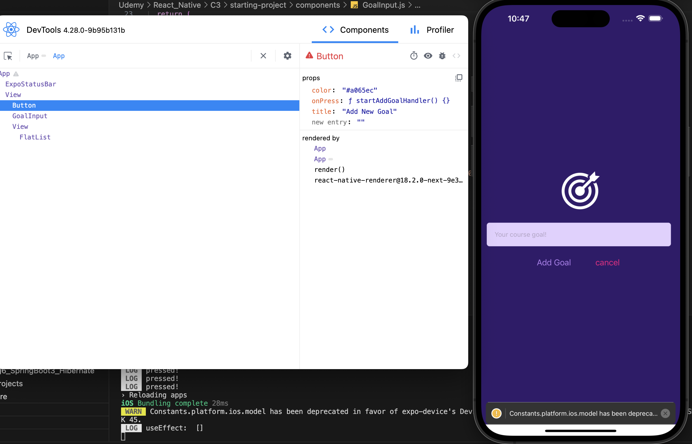

C3

Debug React Native Apps


## Read error message

read warning or error message pop up in simulator or terminal


console.log() to test out 


## Debugging Javascript remotely

in Terminal: m

in iOS simulator: cmd + d 

open JS debugger 


```js
sudo npm install -g react-devtools		// globally安装 react-devtools

react-devtools // 任何路径都可启动react-devtools, 之后可以在这个application中看到component tree的相关信息
```





## RN officail debugging guides

https://reactnative.dev/docs/debugging


