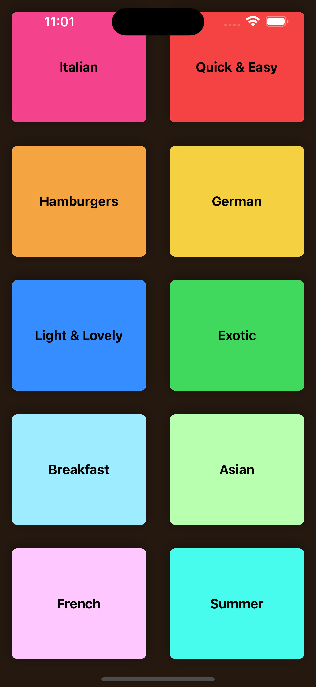
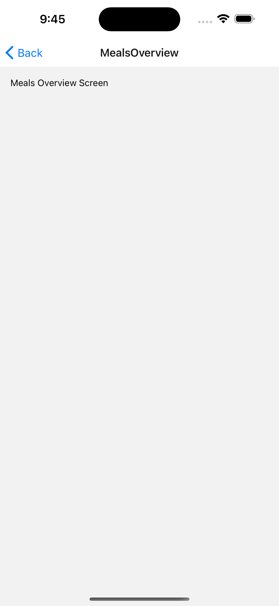
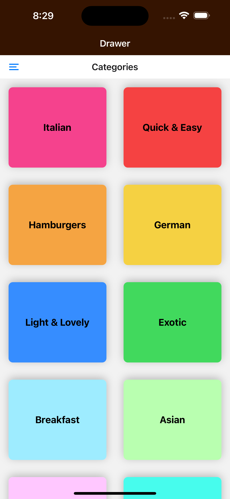
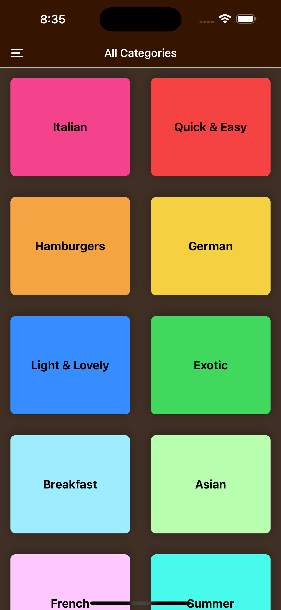

C6 React Native Navigation with React Navigation: MEAL APP

+ a grid list view of different categories of meals
+ when click on a category, navigate to see more meals 
+ when click on a meal, naviagte to see more detailed description


3h course content

:bangbang: note this course only explore some navigator in React Navigation, visit [Bottom Tabs Navigator | React Navigation](https://reactnavigation.org/docs/bottom-tab-navigator) for more


# Key takeaway

一句话总结: register screen component (navigators can be nested) + option to config navigator (we can pass dynamic data to option (e.g. dynamically control the navigator header title of a screen))


+ There are multiple types of React Navigator. But use of them shares the same pattern:
  + Register screen components firstly. 
  + we can config `option` to an individual screen, or apply common `option` to all registered screens
    + `Option` to a screen allows add additional or customized component to Navigation header, background ... A good practice is that, specific screen options should be defined inside that screen component 

  + These registerd components will automatically have access to object: `navigation`, `route`. Use this objects to define navigation and information passing logics. 
    + other unregistered component can have access to navigation & route via `useNavigation()` & `useRoute()` hooks

+ Different types of navigator
  + Stack: suitable for stacked pages navigation 
  + Drawer: suitable for parallel pages navigation
  + Tap: suitable for parallel pages navigation
+ :bangbang:Nested use of navigators
+ Url source image's dimension must be specified for RN 
+ use <Ionicons> to define icons in RN app


# 1. Intro


## What is Navigation

some preparing work (using previous class knowledge) 91-93


data & component seperation

---

model >  Category.js

```js
class Category {
  constructor(id, title, color) {
    this.id = id;
    this.title = title;
    this.color = color;
  }
}

export default Category;
```

data > dummy-data.js: 

```js
import Category from '../models/category';

export const CATEGORIES = [
  new Category('c1', 'Italian', '#f5428d'),
  new Category('c2', 'Quick & Easy', '#f54242'),
  new Category('c3', 'Hamburgers', '#f5a442'),
  new Category('c4', 'German', '#f5d142'),
  new Category('c5', 'Light & Lovely', '#368dff'),
  new Category('c6', 'Exotic', '#41d95d'),
  new Category('c7', 'Breakfast', '#9eecff'),
  new Category('c8', 'Asian', '#b9ffb0'),
  new Category('c9', 'French', '#ffc7ff'),
  new Category('c10', 'Summer', '#47fced')
];
```


screen 

---

+ use <FlatList> to render CategoryItemTile
  + <FlatList> also provides grid layout 

```js
import { FlatList } from "react-native";

import { CATEGORIES } from "../data/dummy-data";
import CategoryGridTile from "../components/CategoryGridTile";

function renderCategoryItem(itemData) {
  return (
    <CategoryGridTile title={itemData.item.title} color={itemData.item.color} />
  );
}

function CategoriesScreen() {
  return (
    <FlatList
      data={CATEGORIES}
      keyExtractor={(item) => item.id}
      renderItem={renderCategoryItem}
      numColumns={2}
    />
  );
}

export default CategoriesScreen;
```


customized component with its default styling:

---

CategoryGridTile

+ add shadow styling for android & iOS
+ cascading styling for passing color props
+ add press ripple effect for android & iOS
+ `flex: 1` 对parent tag的available space 要求. 如果不显示, 很可能parent tag没有avaliable space

```js
import { Pressable, View, Text, StyleSheet, Platform } from "react-native";

function CategoryGridTile({ title, color }) {
  return (
    <View style={styles.gridItem}>
      <Pressable
        android_ripple={{ color: "#ccc" }}      // for android
        style={({ pressed }) => [                 // for iOS
          styles.button,
          pressed ? styles.buttonPressed : null,
        ]}
      >
        <View style={[styles.innerContainer, {backgroundColor: color}]}>	// cascade styling
          <Text style={styles.title}>{title}</Text>
        </View>
      </Pressable>
    </View>
  );
}

export default CategoryGridTile;

const styles = StyleSheet.create({
  gridItem: {
    flex: 1,
    margin: 16,
    height: 150,
    borderRadius: 8,

    // shadow
    // on android
    elevation: 4,
    overflow: Platform.OS === "android" ? "hidden" : "visible",
    // on iOS
    backgroundColor: "white", // needs to have this for shadow to work
    shadowColor: "black",
    shadowOpacity: 0.25,
    shadowOffSet: { width: 0, height: 2 },
    shadowRadius: 8,
  },
  button: {
    flex: 1,
  },
  buttonPressed: {
    opacity: 0.5,
  },
  innerContainer: {
    flex: 1, // take up all available space from parent tag (first of all, parent tag needs to have some space available)
    padding: 16,
    borderRadius: 8,
    justifyContent: "center",
    alignItems: "center",
  },
  title: {
    fontWeight: "bold",
    fontSize: 18,
  },
});
```





# 2. Stack Navigator

:gem: 01-stack-navigator


## 2.1 MealCategory Screen (1st layer)

### Get start with React Nativation

94-

https://reactnavigation.org/


fisrtly, install react navigation package

```console
npm install @react-navigation/native
```

install additional dependencies if using expo

```console
npx expo install react-native-screens react-native-safe-area-context
```


then, intall stack Navigator (there are also other types of navigator)

https://reactnavigation.org/docs/stack-navigator/

check for installation of stack navigator


app.js

+ 在NavigationContainer里使用Navigator
  + Navigator register screen component, associated it with a name

```js
import { StatusBar } from "expo-status-bar";
import { StyleSheet } from "react-native";
import { NavigationContainer } from "@react-navigation/native";
import { createStackNavigator } from "@react-navigation/stack";

const Stack = createStackNavigator();

import CategoriesScreen from "./screens/CategoriesScreen";

export default function App() {
  return (
    <>
      <StatusBar style="dark"></StatusBar>

      <NavigationContainer>
        <Stack.Navigator>
          <Stack.Screen name="MealsCategories" component={CategoriesScreen} />
        </Stack.Navigator>
      </NavigationContainer>
    </>
  );
}
```

now we see:

+ a title area provide by stack navigator


## 2.2 MealsOverView Screen (2nd layer)


### `navigation`: Implementing Navigation between screens

95-97


create a new screen component

```js
import { View, Text, StyleSheet } from "react-native";

import { MEALS } from "../data/dummy-data";

function MealsOverviewScreen() {
  return (
    <View style={styles.container}>
      <Text>Meals Overview Screen</Text>
    </View>
  );
}

export default MealsOverviewScreen;

const styles = StyleSheet.create({
  container: {
    flex: 1,
    padding: 16,
  },
});
```


step1: register new screen component

+ 所有registered screen component会被提供navigation object作为props, 即只有registered的component才能使用navigation object
  + note alternatively, we can also use `useNavigation()` hook to get that navigation object in any component (see class 97)

```js
import { StatusBar } from "expo-status-bar";
import { StyleSheet } from "react-native";
import { NavigationContainer } from "@react-navigation/native";
import { createStackNavigator } from "@react-navigation/stack";

const Stack = createStackNavigator();

import CategoriesScreen from "./screens/CategoriesScreen";
import MealsOverviewScreen from "./screens/MealsOverviewScreen";

export default function App() {
  return (
    <>
      <StatusBar style="dark"></StatusBar>

      {/* register screens here */}
      <NavigationContainer>
        <Stack.Navigator>
          <Stack.Screen name="MealsCategories" component={CategoriesScreen} />
          <Stack.Screen name="MealsOverview" component={MealsOverviewScreen}/>
        </Stack.Navigator>
      </NavigationContainer>
    </>
  );
}

const styles = StyleSheet.create({
  container: {},
});
```


step2: define callback that triggers navigation to the new screen

+ 利用props.navigation 来绑定navigation target sreen

+ 这里用到多重nested function, 主要是为了inner function可以直接access outer function的argument

```js
import { FlatList } from "react-native";

import { CATEGORIES } from "../data/dummy-data";
import CategoryGridTile from "../components/CategoryGridTile";


//navigation props is provided if the component is registed on React navigation
function CategoriesScreen({navigation}) {

  function renderCategoryItem(itemData) {   // inner function so that we can use arguments of outer function
    function pressHandler() {
      navigation.navigate("MealsOverview");
    }
  
    return (
      <CategoryGridTile
        title={itemData.item.title}
        color={itemData.item.color}
        onPress={pressHandler}
      />
    );
  }


  return (
    <FlatList
      data={CATEGORIES}
      keyExtractor={(item) => item.id}
      renderItem={renderCategoryItem}
      numColumns={2}
    />
  );
}

export default CategoriesScreen;
```


now click on any CategoryItem, we will be navigate to a MealsOverviewScreen. And React Navigation automatically provde a go back button




set the default screen of app

---

When setting up a Navigator (like `<Stack.Navigator>`) and registering its screens (via `<Stack.Screen>`), you can decide **which screen will be shown as a default when the app starts**.

+ Out of the box, the **top-most screen** (i.e. the **first child** inside of `<Stack.Navigator>`) is used as the initial screen.
+ we also has the freedom to disrupt above rule and point out which child be the default screen (check gpt)


### `route`: pass data between screens

98

https://reactnavigation.org/docs/navigation-prop

https://reactnavigation.org/docs/route-prop


navigation.navigate() acts like a router: define target, define associated data 

```js

//navigation props is provided if the component is registed on React navigation
function CategoriesScreen({navigation}) {

  function renderCategoryItem(itemData) {   // inner function so that we can use arguments of outer function
    function pressHandler() {
      navigation.navigate("MealsOverview", {	// just like router in node.js ********
        categoryId: itemData.item.id,
      });
    }
  
    return (
      <CategoryGridTile
        title={itemData.item.title}
        color={itemData.item.color}
        onPress={pressHandler}
      />
    );
  }


  return (
    <FlatList
      data={CATEGORIES}
      keyExtractor={(item) => item.id}
      renderItem={renderCategoryItem}
      numColumns={2}
    />
  );
}
```


in the target screen, use route to extract the info passed

+ 同理, route 和 navigation一样, 自动提供给registered screen component. 
  + 也可以用useRoute() hook 在任何component中得到这个route obj

```js
function MealsOverviewScreen({route}) {
    //  route.params:  object containing params which is defined while navigating
   const catId = route.params.categoryId; 


  return (
    <View style={styles.container}>
      <Text>Meals Overview Screen - {catId}</Text>
    </View>
  );
```


#### displaying meals

99

MealOverViewScreen

+ 注意这里是如何filter某个meal category的
+ <FlatList>的使用, 老话题了

```js
import { View,  StyleSheet, FlatList } from "react-native";

import { MEALS } from "../data/dummy-data";
import MealItem from "../components/MealItem";

function MealsOverviewScreen({ route }) {
  //  route.params:  object containing params which is defined while navigating
  const catId = route.params.categoryId;
	

  const displayedMeals = MEALS.filter((mealItem) => {
     // check if meals's categoryIds contain this meal category id
    return mealItem.categoryIds.indexOf(catId) >= 0; // check model -> meal.js
  });

  function renderMealItem(itemData) {
    return <MealItem title={itemData.item.title}/>;
  }

  return (
    <View style={styles.container}>
      <FlatList
        data={displayedMeals}
        keyExtractor={(item) => item.id}
        renderItem={renderMealItem}
      />
    </View>
  );
}

export default MealsOverviewScreen;

const styles = StyleSheet.create({
  container: {
    flex: 1,
    padding: 16,
  },
});
```

MealItem (dummy version)

```js
import { View, Text } from "react-native";

function MealItem({ title }) {
  return (
    <View>
      <Text>{title}</Text>
    </View>
  );
}

export default MealItem;
```


#### styling MealItem component

100

和navigation 无关, 复习前面

+ Image 的导入, RN 需要指定url来源的image的size
+ feedback effect when click on a MealItem
+ add shadows to MealItem 
+ round corner of each MealItem Card


### Navigation `option`

#### Style screen header & backgrounds

101-

style default navigation header & backgrounds

refer to https://reactnavigation.org/docs/stack-navigator#options check more option settings


App.js

+ 这里我用的stack, 老师用的native-stack. 个别api不太一样
+ 通过Navigator 为registered screens设置default option
+ 也可在register时, 为单独的screen定义option

```js
import { StatusBar } from "expo-status-bar";
import { StyleSheet } from "react-native";
import { NavigationContainer } from "@react-navigation/native";
import { createStackNavigator } from "@react-navigation/stack";

// import {createStackNavigator} from '@react-navigation/native-stack'

const Stack = createStackNavigator();

import CategoriesScreen from "./screens/CategoriesScreen";
import MealsOverviewScreen from "./screens/MealsOverviewScreen";

export default function App() {
  return (
    <>
      <StatusBar style="dark"></StatusBar>

      {/* register screens here */}
      <NavigationContainer>
        <Stack.Navigator
          screenOptions={{  // default screen option
            headerStyle: { backgroundColor: "#351401" },
            headerTintColor: "white",
            cardStyle: { backgroundColor: "#3f2f25" },
          }}
        >
          <Stack.Screen
            name="MealsCategories"
            component={CategoriesScreen}
            options={{  // option for specific screen
              title: "All Categories",
            }}
          />
          <Stack.Screen name="MealsOverview" component={MealsOverviewScreen} />
        </Stack.Navigator>
      </NavigationContainer>
    </>
  );
}

const styles = StyleSheet.create({
  container: {},
});
```


#### Set Navigation options dynamically

102

方式1

+ at  screen register, use a function to return dynamic option obj

```js
export default function App() {
  return (
    <>
      <StatusBar style="light"></StatusBar>

      {/* register screens here */}
      <NavigationContainer>
        <Stack.Navigator
          screenOptions={{
            // default screen option
            headerStyle: { backgroundColor: "#351401" },
            headerTintColor: "white",
            cardStyle: { backgroundColor: "#3f2f25" },
          }}
        >
          <Stack.Screen
            name="MealsCategories"
            component={CategoriesScreen}
            options={{
              // option for specific screen
              title: "All Categories",
            }}
          />
          <Stack.Screen
            name="MealsOverview"
            component={MealsOverviewScreen}
            options={({ route, navigation }) => {
               const catId = route.params.categoryId;
               return {
                 title: catId,
               };
             }}
          />
        </Stack.Navigator>
      </NavigationContainer>
    </>
  );
}
```


方式二 (preferred)

+ 在screen component里使用useEffect or useLayoutEffect来set option

```js
import { useLayoutEffect } from "react";
import { View, StyleSheet, FlatList } from "react-native";

import { MEALS, CATEGORIES } from "../data/dummy-data";
import MealItem from "../components/MealItem";

function MealsOverviewScreen({ route, navigation }) {
  //  route.params:  object containing params which is defined while navigating
  const catId = route.params.categoryId;

  const displayedMeals = MEALS.filter((mealItem) => {
    // check if meals's categoryIds contain this meal category id
    return mealItem.categoryIds.indexOf(catId) >= 0; // check model -> meal.js
  });
	
  // ****************!see this!*************************
  useLayoutEffect(() => { // set screen title is a side effect, callback run after init rendering is done
    const catTitle = CATEGORIES.find((cat) => cat.id === catId).title;
    navigation.setOptions({
      title: catTitle,
    });
  }, [catId, navigation]);
  // ***************************************************

  function renderMealItem(itemData) {
    const item = itemData.item;
    const mealItemProps = {
      title: item.title,
      imageUrl: item.imageUrl,
      affordability: item.affordability,
      complexity: item.complexity,
      duration: item.duration,
    };

    return <MealItem {...mealItemProps} />;
  }

  return (
    <View style={styles.container}>
      <FlatList
        data={displayedMeals}
        keyExtractor={(item) => item.id}
        renderItem={renderMealItem}
      />
    </View>
  );
}

export default MealsOverviewScreen;

const styles = StyleSheet.create({
  container: {
    flex: 1,
    padding: 16,
  },
});

```


## 2.3 MealDetailScreen(3rd layer)

103-105


添加第三层screen的navigation效果步骤和前面类似:

Step1: register 3rd layer screen at App.js

Step2: 在第二层screen里通过navigation obj 来define how to navigate (e.g. onPress) to  3rd layer screen. 


为MealDetailScreen添加更多内容和styling  104 -105

+ cascading styling to overwrite compoent's default styling
  + tailwind怎么cascade styling?
+ :bangbang: note <Text> in RN cannot receive border styling, you need to wrap it with a <View> and define border styling onto that <View>
+ create reusable UI component with default styling


## 2.4 Customize navigation Header component

106-

同理, 通过registeed screen的`option`来定义additional or customized navigation header component

+ 方式一: 在register时就定义option, 但这种方式不够灵活, 可以应用于option和screen component不相关的情景
+ 方式二 (good practice): 在screen component里定义option, 更加灵活, 因为你可以在option里定义和该screen component depedent的内容


```js
function MealDetailScreen({ route, navigation }) {

	// 
  function headerButtonPressHandler() {
    console.log("Pressed!");
  }
	
  useLayoutEffect(() => {
    navigation.setOptions({
      headerRight: () => {
        return <Button title="Tap Me!" onPress={headerButtonPressHandler} />;
      },
    });
  }, [navigation, headerButtonPressHandler]);

	// jsx

}
```


Replace above <Button> with a Customize Icon button for better looking

+ use <Ionicons>
+ add opacity effect  onPress


# 3. Drawer Navigator

108-112

:gem: 02-drawer-navigation

[Drawer Navigator | React Navigation](https://reactnavigation.org/docs/drawer-navigator) install dependencies


貌似有兼容性问题with react-native-reanimated, solution: 


>  Following the [reanimated2](https://www.reanimated2.com/docs/fundamentals/installation) documentation , the problem is fixed adding the `react-native-reanimated/plugin ` to `babel.config.js` in root directory. After this, if the error persists, launch `expo r -c` for deploy the app with empty cache. This will probably fix the issue.
>
>  **-- IMPORTANT --**
>
> The `react-native-reanimated/plugin` has to be the last of every other plugins you may have installed in babel configuration.
>
> ```js
> module.exports = function(api) {
>   api.cache(true);
>   return {
>     presets: ['babel-preset-expo'],
>     plugins: ['react-native-reanimated/plugin'],
>   };
> };
> ```


code 

App.js

+ 和stack navigator一样, 先register screen components

```js
import { NavigationContainer } from "@react-navigation/native";
import { createDrawerNavigator } from "@react-navigation/drawer";

import WelcomeScreen from "./screens/WelcomeScreen";
import UserScreen from './screens/UserScreen'

const Drawer = createDrawerNavigator();

export default function App() {
  return (
    <NavigationContainer>
      <Drawer.Navigator screenOptions={{}}>
        <Drawer.Screen name="User" component={UserScreen} />
        <Drawer.Screen name="Welcome" component={WelcomeScreen} />
      </Drawer.Navigator>
    </NavigationContainer>
  );
}
```


## Config Drawer navigator 

109-

config option of registered drawer screen component

[Drawer Navigator | React Navigation](https://reactnavigation.org/docs/drawer-navigator#options)


App.js

+ config `option` for individual screen or apply to all registered screens

```js
import { NavigationContainer } from "@react-navigation/native";
import { createDrawerNavigator } from "@react-navigation/drawer";
import { Ionicons } from "@expo/vector-icons";

import WelcomeScreen from "./screens/WelcomeScreen";
import UserScreen from "./screens/UserScreen";

const Drawer = createDrawerNavigator();

export default function App() {
  return (
    <NavigationContainer>
      <Drawer.Navigator
        screenOptions={{
          // default options for all below registered screens
          headerStyle: { backgroundColor: "#3c0a6b" },
          headerTintColor: "white",
          drawerActiveBackgroundColor: "#f0e1ff",
          drawerActiveTintColor: "#3c0a6b",
          drawerStyle: { backgroundColor: "#ccc" },
        }}
      >
        <Drawer.Screen
          name="User"
          component={UserScreen}
          options={{
            drawerLabel: "Welcome Screen",
            drawerIcon: ({ color, size }) => (
              <Ionicons name="home" color={color} size={18} />
            ),
          }}
        />
        <Drawer.Screen name="Welcome" component={WelcomeScreen} options={{
          drawerIcon: ({color, size}) => <Ionicons name="person" color={color} size={size}/>
        }}/>
      </Drawer.Navigator>
    </NavigationContainer>
  );
}
```


# 4. Taps Navigator

## Bottom Taps Navigator

110-

:gem: 03-tap-navigator

 

[Bottom Tabs Navigator | React Navigation](https://reactnavigation.org/docs/bottom-tab-navigator)

check out how to install dependencies

App.js

+ 同理, register + option config

```js
import { NavigationContainer } from "@react-navigation/native";
import { createBottomTabNavigator } from "@react-navigation/bottom-tabs";
import { Ionicons } from "@expo/vector-icons";

import WelcomeScreen from "./screens/WelcomeScreen";
import UserScreen from "./screens/UserScreen";

const BottomTab = createBottomTabNavigator();

export default function App() {
  return (
    <NavigationContainer>
      <BottomTab.Navigator
        screenOptions={{
          // default options for all below registered screens
          headerStyle: { backgroundColor: "#3c0a6b" },
          headerTintColor: "white",
          tabBarActiveTintColor: '#3c0a6b'
        }}
      >
        <BottomTab.Screen
          name="User"
          component={UserScreen}
          options={{
            tabBarIcon: ({ color, size }) => (
              <Ionicons name="person" color={color} size={size} />
            ),
          }}
        />
        <BottomTab.Screen
          name="Welcome"
          component={WelcomeScreen}
          options={{
            tabBarIcon: ({ color, size }) => (
              <Ionicons name="home" color={color} size={size} />
            ),
          }}
        />
      </BottomTab.Navigator>
    </NavigationContainer>
  );
}
```


# 5. :moon: Nesting Navigators

同时使用stack navigator & drawer navigator

111-112

:gem: 04-nested-navigation


Now, we have the Drawer navigator nested inside a stack navigator.

+ but how to remove the top header which belongs to the stack navigator? we don't want it



App.js

+ registered screen component的 props 可以被传递另一个navigator, 实现nested navigator的效果
+ 同样通过options来config各种navigator相关的内容

```js
import { StatusBar } from "expo-status-bar";
import { StyleSheet, Text, Button } from "react-native";
import { NavigationContainer } from "@react-navigation/native";
import { createStackNavigator } from "@react-navigation/stack";
import { createDrawerNavigator } from "@react-navigation/drawer";
import { Ionicons } from "@expo/vector-icons";
// import {createStackNavigator} from '@react-navigation/native-stack'

import CategoriesScreen from "./screens/CategoriesScreen";
import MealsOverviewScreen from "./screens/MealsOverviewScreen";
import MealDetailScreen from "./screens/MealDetailScreen";
import FavoriteScreen from "./screens/FavoriteScreen";

const Stack = createStackNavigator();
const Drawer = createDrawerNavigator();

function DrawerNavigator() {
  return (
    <Drawer.Navigator
      screenOptions={{
        headerStyle: { backgroundColor: "#351401" },
        headerTintColor: "white",
        sceneContainerStyle: { backgroundColor: "#3f2f25" },
        drawerContentStyle: { backgroundColor: "#351401" },
        drawerInactiveTintColor: "white",
        drawerActiveTintColor: "#351401",
        drawerActiveBackgroundColor: "#c14b07",
      }}
    >
      <Drawer.Screen
        name="Categories"
        component={CategoriesScreen}
        options={{
          title: "All Categories",
          drawerIcon: ({ color, size }) => (
            <Ionicons name="list" color={color} size={size} />
          ),
        }}
      />
      <Drawer.Screen
        name="Favorites"
        component={FavoriteScreen}
        options={{
          drawerIcon: ({ color, size }) => (
            <Ionicons name="star" color={color} size={size} />
          ),
        }}
      />
    </Drawer.Navigator>
  );
}

export default function App() {
  return (
    <>
      <StatusBar style="light"></StatusBar>

      {/* register screens here */}
      <NavigationContainer>
        <Stack.Navigator
          screenOptions={{
            // default screen option
            headerStyle: { backgroundColor: "#351401" },
            headerTintColor: "white",
            cardStyle: { backgroundColor: "#3f2f25" },
          }}
        >
          <Stack.Screen
            name="Drawer"
            component={DrawerNavigator}		// nested navigator *****************
            options={{
              title: "All Categories",
              headerShown: false,				// remove stack navigator's header *************
            }}
          />
          <Stack.Screen name="MealsOverview" component={MealsOverviewScreen} />
          <Stack.Screen
            name="MealDetail"
            component={MealDetailScreen}
            options={{
              title: "About the Meal",
            }}
          />
        </Stack.Navigator>
      </NavigationContainer>
    </>
  );
}

const styles = StyleSheet.create({
  container: {},
});
```

Now, we have following 1st layer, when click on a category card, we will navigate to a 2nd layer MealOverviewScreen


