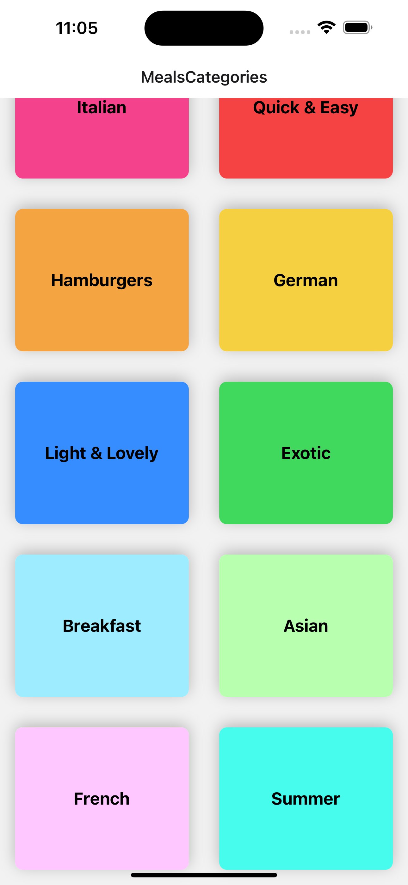

C6 React Native Navigation with React Navigation: MEAL APP

+ a grid list view of different categories of meals
+ when click on a category, navigate to see more meals 
+ when click on a meal, naviagte to see more detailed description


3h course content


# Intro


## What is Navigation

some preparing work (using previous class knowledge) 91-93


data & component seperation

---

model >  Category.js

```js
class Category {
  constructor(id, title, color) {
    this.id = id;
    this.title = title;
    this.color = color;
  }
}

export default Category;
```

data > dummy-data.js: 

```js
import Category from '../models/category';

export const CATEGORIES = [
  new Category('c1', 'Italian', '#f5428d'),
  new Category('c2', 'Quick & Easy', '#f54242'),
  new Category('c3', 'Hamburgers', '#f5a442'),
  new Category('c4', 'German', '#f5d142'),
  new Category('c5', 'Light & Lovely', '#368dff'),
  new Category('c6', 'Exotic', '#41d95d'),
  new Category('c7', 'Breakfast', '#9eecff'),
  new Category('c8', 'Asian', '#b9ffb0'),
  new Category('c9', 'French', '#ffc7ff'),
  new Category('c10', 'Summer', '#47fced')
];
```


screen 

---

+ use <FlatList> to render CategoryItemTile
  + <FlatList> also provides grid layout 

```js
import { FlatList } from "react-native";

import { CATEGORIES } from "../data/dummy-data";
import CategoryGridTile from "../components/CategoryGridTile";

function renderCategoryItem(itemData) {
  return (
    <CategoryGridTile title={itemData.item.title} color={itemData.item.color} />
  );
}

function CategoriesScreen() {
  return (
    <FlatList
      data={CATEGORIES}
      keyExtractor={(item) => item.id}
      renderItem={renderCategoryItem}
      numColumns={2}
    />
  );
}

export default CategoriesScreen;
```


customized component with its default styling:

---

CategoryGridTile

+ add shadow styling for android & iOS
+ cascading styling for passing color props
+ add press ripple effect for android & iOS
+ `flex: 1` 对parent tag的available space 要求. 如果不显示, 很可能parent tag没有avaliable space

```js
import { Pressable, View, Text, StyleSheet, Platform } from "react-native";

function CategoryGridTile({ title, color }) {
  return (
    <View style={styles.gridItem}>
      <Pressable
        android_ripple={{ color: "#ccc" }}      // for android
        style={({ pressed }) => [                 // for iOS
          styles.button,
          pressed ? styles.buttonPressed : null,
        ]}
      >
        <View style={[styles.innerContainer, {backgroundColor: color}]}>	// cascade styling
          <Text style={styles.title}>{title}</Text>
        </View>
      </Pressable>
    </View>
  );
}

export default CategoryGridTile;

const styles = StyleSheet.create({
  gridItem: {
    flex: 1,
    margin: 16,
    height: 150,
    borderRadius: 8,

    // shadow
    // on android
    elevation: 4,
    overflow: Platform.OS === "android" ? "hidden" : "visible",
    // on iOS
    backgroundColor: "white", // needs to have this for shadow to work
    shadowColor: "black",
    shadowOpacity: 0.25,
    shadowOffSet: { width: 0, height: 2 },
    shadowRadius: 8,
  },
  button: {
    flex: 1,
  },
  buttonPressed: {
    opacity: 0.5,
  },
  innerContainer: {
    flex: 1, // take up all available space from parent tag (first of all, parent tag needs to have some space available)
    padding: 16,
    borderRadius: 8,
    justifyContent: "center",
    alignItems: "center",
  },
  title: {
    fontWeight: "bold",
    fontSize: 18,
  },
});
```


# Hands-on

## Get start with React Nativation

94-

https://reactnavigation.org/


fisrtly, install react navigation package

```console
npm install @react-navigation/native
```

install additional dependencies if using expo

```console
npx expo install react-native-screens react-native-safe-area-context
```


then, intall stack Navigator (there are also other types of navigator)

https://reactnavigation.org/docs/stack-navigator/

check for installation of stack navigator


app.js

+ 在NavigationContainer里使用Navigator
  + Navigator register screen component, associated it with a name

```js
import { StatusBar } from "expo-status-bar";
import { StyleSheet } from "react-native";
import { NavigationContainer } from "@react-navigation/native";
import { createStackNavigator } from "@react-navigation/stack";

const Stack = createStackNavigator();

import CategoriesScreen from "./screens/CategoriesScreen";

export default function App() {
  return (
    <>
      <StatusBar style="dark"></StatusBar>

      <NavigationContainer>
        <Stack.Navigator>
          <Stack.Screen name="MealsCategories" component={CategoriesScreen} />
        </Stack.Navigator>
      </NavigationContainer>
    </>
  );
}
```

now we see:

+ a title area provide by stack navigator




## Implementing Navigation between screens

95