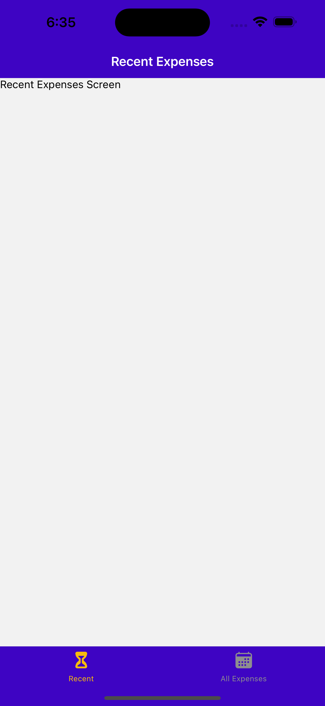

C8

Expense tracker app


2h40min course


# Abstract

:gem: build an expense tracker app (怎么感觉还是个to-do-list?)


apply what we learned before:

+ Add Navigations & Screens
+ Layouts & Styles
+ Mange Local & App-wide state


## Set up navigation and screens


screen setup using React Navigation

+ react navigation & expo dependencies
+ stack-native navigator
+ bottom tap navigator


3 screens


### Add navigation

126-


App.js

+ just set up the skeleton as below:

```js
import { StatusBar } from "expo-status-bar";
import { NavigationContainer } from "@react-navigation/native";
import { createNativeStackNavigator } from "@react-navigation/native-stack";
import { createBottomTabNavigator } from "@react-navigation/bottom-tabs";
import ManageExpenses from "./screens/ManageExpenses";
import AllExpenses from "./screens/AllExpenses";
import RecentExpenses from "./screens/RecentExpenses";

const Stack = createNativeStackNavigator(); // obj contains navigation & route
const BottomTaps = createBottomTabNavigator();

function ExpensesOverview() {
  return <BottomTaps.Navigator>
    <BottomTaps.Screen name="RecentExpenses" component={RecentExpenses}/>
    <BottomTaps.Screen name="AllExpenses" component={AllExpenses}/>
  </BottomTaps.Navigator>;
}

export default function App() {
  return (
    <>
      <StatusBar style="auto" />
      <NavigationContainer>
        <Stack.Navigator>
          <Stack.Screen name="ExpensesOverview" component={ExpensesOverview} />
          <Stack.Screen name="ManageExpense" component={ManageExpenses} />
        </Stack.Navigator>
      </NavigationContainer>
    </>
  );
}
```


### Add global color & Navigation options

127-

```js
import { StatusBar } from "expo-status-bar";
import { NavigationContainer } from "@react-navigation/native";
import { createNativeStackNavigator } from "@react-navigation/native-stack";
import { createBottomTabNavigator } from "@react-navigation/bottom-tabs";
import { Ionicons } from "@expo/vector-icons";

import ManageExpenses from "./screens/ManageExpenses";
import AllExpenses from "./screens/AllExpenses";
import RecentExpenses from "./screens/RecentExpenses";
import { GlobalStyles } from "./constants/styles";

const Stack = createNativeStackNavigator(); // obj contains navigation & route
const BottomTaps = createBottomTabNavigator();

function ExpensesOverview() {
  return (
    <BottomTaps.Navigator
      screenOptions={{
        headerStyle: { backgroundColor: GlobalStyles.colors.primary500 },
        headerTintColor: "white",
        tabBarStyle: { backgroundColor: GlobalStyles.colors.primary500 },
        tabBarActiveTintColor: GlobalStyles.colors.accent500,
      }}
    >
      <BottomTaps.Screen
        name="RecentExpenses"
        component={RecentExpenses}
        options={{
          title: "Recent Expenses",
          tabBarLabel: "Recent",
          tabBarIcon: ({ color, size }) => (
            <Ionicons name="hourglass" size={size} color={color} />
          ),
        }}
      />
      <BottomTaps.Screen
        name="AllExpenses"
        component={AllExpenses}
        options={{
          title: "All Expenses",
          tabBarLabel: "All Expenses",
          tabBarIcon: ({ color, size }) => (
            <Ionicons name="calendar" size={size} color={color} />
          ),
        }}
      />
    </BottomTaps.Navigator>
  );
}

export default function App() {
  return (
    <>
      <StatusBar style="auto" />
      <NavigationContainer>
        <Stack.Navigator>
          <Stack.Screen
            name="ExpensesOverview"
            component={ExpensesOverview}
            options={{ headerShown: false }}
          />

          <Stack.Screen name="ManageExpense" component={ManageExpenses} />
        </Stack.Navigator>
      </NavigationContainer>
    </>
  );
}
```

Now, results:




## Expenses components

128-

define several expenses-related components

```js
AllExpenses & RecentExpenses: Screens
	|--
  ExpensesOutput
    |-- ExpensesSummary({ expenses, periodName })
    |-- ExpensesList({expenses})
				|-- ExpenseItem
```


Revision on 

+ component break down

+ <FlatList> render a list of objects

+ props passing

+ Styling & layout

  + ```js
    // we can pass array of styles to style props
    <Text style={[styles.textBase, styles.description]}>{description}</Text>
    ```

+ :bangbang: Formatting date 

  + ```js
    // you cannot directly put an object to jsx {}, map it to a string first!
    <Text style={styles.textBase}>{getFormattedDate(date)}</Text>
                                     
    function getFormattedDate(date){
        return `${date.getFullYear()}-${date.getMonth()+1}-${date.getDate()}`
    }                           
    ```

+ :bangbang: Tappable component 135-

  + visual feedback onPress

  + Ui > IconButton.js

  + config headerRight of a navigator:

    + ```js
       <BottomTaps.Navigator
            screenOptions={{
              headerStyle: { backgroundColor: GlobalStyles.colors.primary500 },
              headerTintColor: "white",
              tabBarStyle: { backgroundColor: GlobalStyles.colors.primary500 },
              tabBarActiveTintColor: GlobalStyles.colors.accent500,
              headerRight: ({tintColor}) => (   // component to add at the right of header
                <IconButton icon="add" size={24} color={tintColor} onPress={() => {}}/>
              ),
            }}
          >
      ```

+ apply navigation between screens: onPress handler > useNavigation() 136-
  + when click on an ExpenseItem => navigate to ManageExpenses
  + when click on headerRight IconButton => navigate to ManageExpenses

+ :star: config ManageExpenses screen 137 -

  + ```js
    // React Navigation 封装好的modal效果
    <Stack.Screen
      name="ManageExpense"
      component={ManageExpenses}
      options={{
        presentation: 'modal'			// presentation stlye 
      }}
    ```

+ :bangbang: Supporting different Editing Modes & Using Route Parameters 138-
  + when press on ExpenseItem, navigate to MangeExpenses screen title is 'Edit Expense'
  + when press on headerRight IconButton, navigate to ManageExpenses screen title is 'Add Expense'
  + <u>实现这样的效果, 需要在navigate时就携带好是从哪个组件navigate过来的信息</u>. 就像向component pass props一样, 算是screen之间的通信

+ Add a delete button on ManageExpenses if editing  139-

+ Add a custom button => ui> Button 140-

  + pass styles from outside of the custom button

  + add multiple styles to one element

    + ```js
       <View style={[styles.button, mode === "flat" && styles.flat]}
      ```

+ Close a Modal 141-

  + ```js
    navigation.goBack()
    ```

    


## Context (App-wide state) management


### :bangbang: Manage App-wide state with Context

142

the App-wide state is an array that stores the expenses records, as we need to display it in several screen it is an App-wide state


store > expenses-context.js

+ revision on React Reducer for complex state management in a cohesive, decoupled manner. Similar to command pattern 
  + 要素1: reducer function
  + 要素2: useReducer hook to connect state with reducer function
  + 要素3: dispatch action (& associated data) to reducer function in various callback handlers
+ Context API
  + Context object 
    + Define context format
  + Context Provider (a wrapper component) 
    + defines how the context is managed (normally useState or useReducer) 
    + dispatch context obj, which would be received and used by other component

```js
import { createContext, useReducer } from "react";

const DUMMY_EXPENSES = [
  {
    id: "e1",
    description: "A pair of shoes",
    amount: 59.99,
    date: new Date("2021-12-19"),
  },
  {
    id: "e2",
    description: "A pair of trousers",
    amount: 89.99,
    date: new Date("2022-01-05"),
  }
  // ... more obj
];

export const ExpensesContext = createContext({
  expenses: [],
  addExpense: ({ description, amount, date }) => {},
  deleteExpense: (id) => {},
  updateExpense: (id, { description, amount, date }) => {},
});

// reducer function: define how to update given state based on the dispatched action *****
// always return a new state (similar to cmmand pattern)
function expensesReducer(state, action) {
  switch (action.type) {
    case "ADD":
      const id = new Date().toString() + Math.random.toString();
      return [{ ...action.payload, id: id }, ...state]; // add an obj to expenses array
    case "UPDATE":
      const updatableExpenseIndex = state.findIndex(
        (expense) => expense.id === action.payload.id
      );
      const updatableExpense = state[updatableExpenseIndex];
      const updatedItem = { ...updatableExpense, ...action.payload.data }; // a temp variable,  overwirte (update) target expense obj
      const updatedExpenses = [...state];   // a temp variable
      updatedExpenses[updatableExpenseIndex] = updatedItem;
      return updatedExpenses; // newly updated state
    case "DELETE":
      return state.filter((expense) => expense.id !== action.payload);
    default:
      return state;
  }
}

function ExpensesContextProvider({ children }) {
  // hook: connect state and reducer function ************
  const [expensesState, dispatch] = useReducer(expensesReducer, DUMMY_EXPENSES);

  function addExpense(expenseData) {
    dispatch({ type: "ADD", payload: expenseData }); // dispatch action to reudcer function
  }
  function deleteExpense(id) {
    dispatch({ type: "DELETE", payload: id });
  }
  function updateExpense(id, expenseData) {
    dispatch({ type: "UPDATE", payload: { id: id, data: expenseData } });
  }

  const value = {
    expenses: expensesState,
    addExpense: addExpense,
    deleteExpense: deleteExpense,
    updateExpense: updateExpense,
  };

  return (
    <ExpensesContext.Provider value={value}>
      {children}
    </ExpensesContext.Provider>
  );
}

export default ExpensesContextProvider;

```


### Using context from inside component

143-

that 3 screen component would useContext, check out there


### Deleting & Updating Expenses

144

that 3 screen component would useContext and use dispatched context obj to manipulate the state (expenses array) defined in that context, chek out there


145

just some final touch
