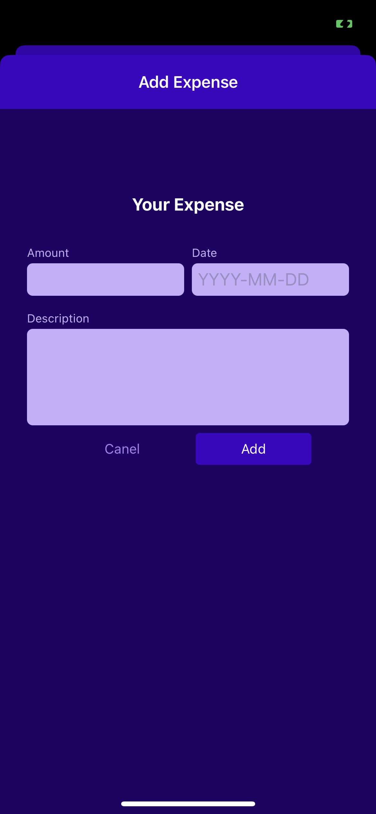

C9

handling user input


# Abstract

:gem: code is based on previous class

+ working with TextInput

+ Validate user input & provide feedback

+ user input & components


上节课的demo中, add expense和update expense我们只是使用dummy data, user还不能主动输入, 这里我们实现user input


# Customize Input form component


## Config custom form component

148

take an object as props for configuration

+ more freedom, allows config TextInput from outside, but need to keep the configuration name as the same with TextInput docs check more on [TextInput · React Native](https://reactnative.dev/docs/textinput)

```js
import { Text, TextInput, View } from "react-native";

function Input({label, textInputConfig}) {
  return (
    <View>
      <Text>{label}</Text>
      <TextInput {...textInputConfig} />
    </View>
  );
}

export default Input;
```

```js
import { View } from "react-native";
import Input from "./Input";

function ExpenseForm() {
  function amountChangeHandler() {}

  return (
    <View>
      <Input
        label="Amount"
        textInputConfig={{
          keyboardType: "decimal-pad",
          onChangeText: amountChangeHandler,
        }}
      />
      <Input label="Date" textInputConfig={{
        placeholder: 'YYYY-MM-DD',
        maxLength: 10,
        onChangeText: ()=>{}
      }} />
      <Input label="Description" textInputConfig={{
        multiline: true,
        // autocorrect: false,
        autoCapitalize: 'sentence'

      }}/>
    </View>
  );
}

export default ExpenseForm;
```


## Add styling and layout to custom form component

150,151


Input.js

:bangbang: note how configurable of this component: 

+ conditional styling + mutiple styling

+ cascade styling: allow pass style from outside to overwrite default styling within component using new styling

  


Input.js

```js
import { Text, TextInput, View, StyleSheet } from "react-native";
import { GlobalStyles } from "../../constants/styles";

function Input({ label, textInputConfig, style }) {
  const inputStyles = [styles.input];

  if (textInputConfig && textInputConfig.multiline) {
    inputStyles.push(styles.inputMultipline);
  }

  return (
    // cascading styling
    <View style={[styles.inputContainer, style]}>        
      <Text style={styles.label}>{label}</Text>
      <TextInput style={inputStyles} {...textInputConfig} />
    </View>
  );
}

export default Input;

const styles = StyleSheet.create({
  inputContainer: {
    marginHorizontal: 4,
    marginVertical: 8,
  },
  label: {
    fontSize: 12,
    color: GlobalStyles.colors.primary100,
    marginBottom: 4,
  },
  input: {
    backgroundColor: GlobalStyles.colors.primary100,
    color: GlobalStyles.colors.primary700,
    padding: 6,
    borderRadius: 6,
    fontSize: 18,
  },
  inputMultipline: {
    minHeight: 100,
    textAlignVertical: "top",
  },
});
```

ExpenseForm.js

```js
import { View, StyleSheet, Text } from "react-native";
import Input from "./Input";

function ExpenseForm() {
  function amountChangeHandler() {}

  return (
    <View style={styles.form}>
      <Text style={styles.title}>Your Expense</Text>

      <View style={styles.inputsRow}>
        <Input
          label="Amount"
          style={styles.rowInput}
          textInputConfig={{
            keyboardType: "decimal-pad",
            onChangeText: amountChangeHandler,
          }}
        />
        <Input
          label="Date"
          style={styles.rowInput}
          textInputConfig={{
            placeholder: "YYYY-MM-DD",
            maxLength: 10,
            onChangeText: () => {},
          }}
        />
      </View>

      <Input
        label="Description"
        textInputConfig={{
          multiline: true,
          // autocorrect: false,
          // autoCapitalize: 'sentence'
        }}
      />
    </View>
  );
}

export default ExpenseForm;

const styles = StyleSheet.create({
  form: { marginTop: 40 },
  title: {
    fontSize: 18,
    fontWeight: "bold",
    color: "white",
    marginVertical: 24,
    textAlign: 'center'
  },
  inputsRow: {
    flexDirection: "row",
    justifyContent: "space-between",
  },
  rowInput: {
    flex: 1,
  },
});
```

Now,




## Handling user input in a generic way

152-

看到这里


+ good practice: 将form-related的input统一放到1个object state里处理
  + good practice: update state based on previous state
+ 2-way binding still applies 
+ 关于callback handler that bounds to onChangeText
  + 

```js
import { View, StyleSheet, Text } from "react-native";
import Input from "./Input";
import { useState } from "react";

function ExpenseForm() {
  const [inputValue, setInputValue] = useState({
    amount: "",
    date: "",
    description: "",
  }); //!  input from TextInput is string!
	
  // ****** inputIdentifier is my own parameter, need to use bind to pass to this callback
  // ****** enteredValue (the last argument) is provided by RN automatically
  function inputChangeHandler(inputIdentifier, enteredValue) {
    // enteredValue is provied by RN if connect this with onChangeText
    // argument is provied by React Native
    setInputValue((currentInputValues) => {
      return {
        ...currentInputValues,
        [inputIdentifier]: enteredValue,
      };
    });
  }

  return (
    <View style={styles.form}>
      <Text style={styles.title}>Your Expense</Text>

      <View style={styles.inputsRow}>
        <Input
          label="Amount"
          style={styles.rowInput}
          textInputConfig={{
            keyboardType: "decimal-pad",
            onChangeText: inputChangeHandler.bind(this, "amount"),
            value: inputValue.amount, // 2-way binding
          }}
        />
        <Input
          label="Date"
          style={styles.rowInput}
          textInputConfig={{
            placeholder: "YYYY-MM-DD",
            maxLength: 10,
            onChangeText: inputChangeHandler.bind(this, "date"),
            value: inputValue.date,		// 2-way binding
          }}
        />
      </View>

      <Input
        label="Description"
        textInputConfig={{
          multiline: true,
          // autocorrect: false,
          // autoCapitalize: 'sentence'
          onChangeText: inputChangeHandler.bind(this, "description"),
          value: inputValue.description,	// 2-way binding
        }}
      />
    </View>
  );
}

export default ExpenseForm;

const styles = StyleSheet.create({
  form: { marginTop: 40 },
  title: {
    fontSize: 18,
    fontWeight: "bold",
    color: "white",
    marginVertical: 24,
    textAlign: "center",
  },
  inputsRow: {
    flexDirection: "row",
    justifyContent: "space-between",
  },
  rowInput: {
    flex: 1,
  },
});

```


# Form submission

153-

定义button 绑定handler来submit form 

+ handler里肯定得使用context中的对expenses: [ ] state的CRUD方法


```js
ManageExpenses: Screen  (useContext to get expenses: [] state and CRUD methods)
	|-- ExpenseForm
```


```js
function ManageExpenses({ route, navigation }) {
  const expenseCtx = useContext(ExpensesContext);

  // control 2 mode
  const editedExpenseId = route.params?.expenseId; // if route has parameter, if does it is in Edit mode not add mode
  const isEditing = !!editedExpenseId; // convert a value to boolean

  useLayoutEffect(() => {
    navigation.setOptions({
      title: isEditing ? "Edit Expense" : "Add Expense",
    });
  }, [navigation, isEditing]);

  function deleteExpenseHandler() {
    expenseCtx.deleteExpense(editedExpenseId);
    navigation.goBack();
  }

  function cancelHandler() {
    navigation.goBack();
  }
	
  // ****************** pass this to onSubmit ******************
  function confirmHandler(expenseData) {
    if (isEditing) {
      expenseCtx.updateExpense(editedExpenseId, expenseData);
    } else {
      expenseCtx.addExpense(expenseData);
    }
    navigation.goBack();
  }

  return (
    <View style={styles.container}>
      <ExpenseForm
        submitButtonLabel={isEditing ? "Update" : "Add"}
        onCancel={cancelHandler}
        onSubmit={confirmHandler}
      />

      {isEditing && (
        <View style={styles.deleteContainer}>
          <IconButton
            icon="trash"
            color={GlobalStyles.colors.error500}
            size={36}
            onPress={deleteExpenseHandler}
          />
        </View>
      )}
    </View>
  );
}
```


```js
import { View, StyleSheet, Text } from "react-native";
import { useState } from "react";

import Input from "./Input";
import Button from "../ui/Button";

function ExpenseForm({ submitButtonLabel, onCancel, onSubmit }) {
  const [inputValues, setinputValues] = useState({
    amount: "",
    date: "",
    description: "",
  }); //!  input from TextInput is string!

  function inputChangeHandler(inputIdentifier, enteredValue) {
    // enteredValue is provied by RN if connect this with onChangeText
    // argument is provied by React Native
    setinputValues((currentinputValuess) => {
      return {
        ...currentinputValuess,
        [inputIdentifier]: enteredValue,
      };
    });
  }

  // ! *************** big one ***************!
  function submitHanlder() {
    const expenseData = {
      // temp obj to collect state data, including doing data format conversion 
      amount: +inputValues.amount,
      date: new Date(inputValues.date),
      description: inputValues.description
    };

    onSubmit(expenseData);
  }

  return (
    <View style={styles.form}>
      <Text style={styles.title}>Your Expense</Text>

      <View style={styles.inputsRow}>
        <Input
          label="Amount"
          style={styles.rowInput}
          textInputConfig={{
            keyboardType: "decimal-pad",
            onChangeText: inputChangeHandler.bind(this, "amount"),
            value: inputValues.amount, // 2-way binding
          }}
        />
        <Input
          label="Date"
          style={styles.rowInput}
          textInputConfig={{
            placeholder: "YYYY-MM-DD",
            maxLength: 10,
            onChangeText: inputChangeHandler.bind(this, "date"),
            value: inputValues.date,
          }}
        />
      </View>

      <Input
        label="Description"
        textInputConfig={{
          multiline: true,
          // autocorrect: false,
          // autoCapitalize: 'sentence'
          onChangeText: inputChangeHandler.bind(this, "description"),
          value: inputValues.description,
        }}
      />

      <View style={styles.buttons}>
        <Button mode="flat" onPress={onCancel} style={styles.button}>
          Canel
        </Button>
        <Button onPress={submitHanlder} style={styles.button}>
          {submitButtonLabel}
        </Button>
      </View>
    </View>
  );
}

export default ExpenseForm;

const styles = StyleSheet.create({
  form: { marginTop: 40 },
  title: {
    fontSize: 18,
    fontWeight: "bold",
    color: "white",
    marginVertical: 24,
    textAlign: "center",
  },
  inputsRow: {
    flexDirection: "row",
    justifyContent: "space-between",
  },
  rowInput: {
    flex: 1,
  },
  buttons: {
    flexDirection: "row",
    justifyContent: "center",
    alignItems: "center",
  },
  button: {
    minWidth: 120,
    marginHorizontal: 8,
  },
});
```


## Set default values for TextInput


just set initial value for useState() in ExpenseForm

```js
function ManageExpenses({ route, navigation }) {
  const expenseCtx = useContext(ExpensesContext);
	// ...

  const selectedExpense = expenseCtx.expenses.find(
    (expense) => expense.id === editedExpenseId
  );
		
  //...
  
   return (
    <View style={styles.container}>
      <ExpenseForm
        submitButtonLabel={isEditing ? "Update" : "Add"}
        onCancel={cancelHandler}
        onSubmit={confirmHandler}
        defaultValues={selectedExpense}
      />

			//...
    </View>
  );


}
```


```js
function ExpenseForm({ submitButtonLabel, onCancel, onSubmit, defaultValues }) {
  const [inputValues, setinputValues] = useState({
    amount: defaultValues ? defaultValues.amount.toString() : "",
    date: defaultValues ? getFormattedDate(defaultValues.date) : "",
    description: defaultValues ? defaultValues.description : "",
  }); //!  input from TextInput is string!
  
  //....
}
```


## Add Validation

156-159


but up to now, user can still input empty input, which is invalid, let's now add validation for submisson

```js
// in ExpenseForm.js

  function submitHanlder() {
    const expenseData = {
      // temp obj to collect state data, including doing data format conversion
      amount: +inputValues.amount,
      date: new Date(inputValues.date),
      description: inputValues.description,
    };

    // !valiations *******************
    const amountIsValid = !isNaN(expenseData.amount) && expenseData.amount > 0;
    const dateIsValid = expenseData.date.toString !== "Invalid Date";
    const descriptionIsValid = expenseData.description.trim().length > 0;

    if (!amountIsValid || !dateIsValid || !descriptionIsValid) {
      // show feedback
      Alert.alert("Invalid input", "Please check your input values");

      return;
    }
		// ********************************
    
    onSubmit(expenseData);
  }
```


Provide visual validation feedback 157 -158

---

above code only display a alert dialog, not indicating which input is not correct

+ now we do more specific about which input field is inValid
  + 取决于你如何定义这种信息给Input.js => 当然是pass props indicating if the input is valid!


