# intro 

6


Building a traditional Spring application is really HARD!!!

Q: Which JAR dependencies do I need?
Q: How do I set up configuration (xml or Java)?

Q: How do I install the server? (Tomcat, JBoss etc...)

And that's JUST the basics for getting started


**Spring Boot Solution**

Make it easier to get started with Spring development Minimize the amount of manual configuration

Perform auto-configuration based on props files and JAR classpath Help to resolve dependency conflicts (Maven or Gradle)
 Provide an embedded HTTP server so you can get started quickly

Tomcat, Jetty, Undertow, ...


**Spring Boot and Spring**

Spring Boot uses Spring behind the scenes 

Spring Boot simply makes it easier to use Spring


**Spring Initializr**

```
http://start.spring.io
```

Quickly create a starter Spring Boot project 

Select your dependencies 

Creates a Maven/Gradle project

Import the project into your IDE 

Eclipse, IntelliJ, NetBeans etc ...


**Spring Boot Embedded Server**

Provide an embedded HTTP server so you can get started quickly 

+ Tomcat, Jetty, Undertow, ...

No need to install a server separately

mycoolapp.jar 里就包含了application code AND server code


**Running Spring Boot Apps**

Spring Boot apps can be run standalone (includes embedded server) 

Run the Spring Boot app from the IDE or command-line

```
> java -jar mycoolapp.jar
```


**Deploying Spring Boot Apps**

Spring Boot apps can also be deployed in the traditional way 

Deploy **Web Application Archive (WAR) file** to an external server:

+ Tomcat, JBoss, WebSphere etc ...

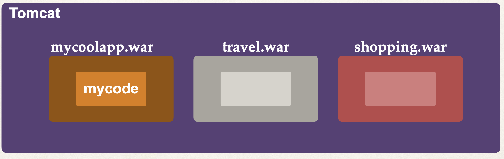


## Q & A

Q: Does Spring Boot replace Spring MVC, Spring REST etc ...?

No. Instead, Spring Boot actually uses those technologies

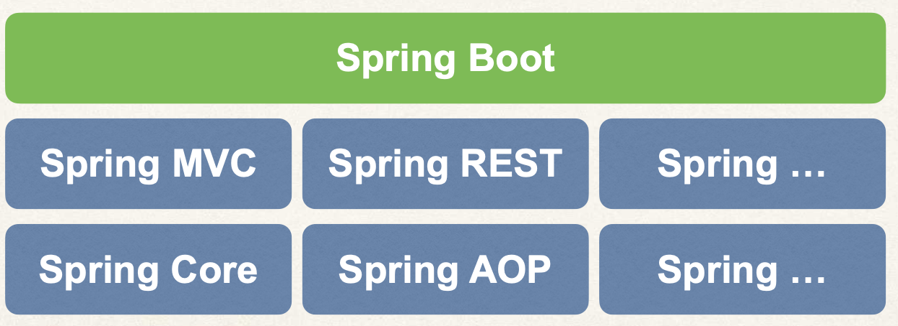


Q: Does Spring Boot run code faster than regular Spring code?

No. Behind the scenes, Spring Boot uses same code of Spring Framework Remember, Spring Boot is about making it easier to get started. Minimizing configuration etc ...


# Hands-on

## Spring Boot initialzer

10-


**Quick Word on Maven**

When building your Java project, you may need additional JAR files For example: Spring, Hibernate, Commons Logging, JSON etc...

One approach is to download the JAR files from each project web site Manually add the JAR files to your build path / classpath


**Maven Solution**

Tell Maven the projects you are working with (dependencies) Spring, Hibernate etc ....

Maven will go out and download the JAR files for those projects for you

And Maven will make those JAR files available during compile/run

Think of Maven as your friendly helper / personal shopper :-)


**Development Process**

https://start.spring.io

+ Configure our project at Spring Initializr website
  + choose latest release version, avoid 'snapshot' version since they are beta
  + here we use maven project
  + as an inital build, we just select `spring web` as dependencies

+ Download the zip file
+ Unzip the file
+ Import the project into our IDE
  + run spring boot application :smile: just like usual in JR course


## Spring Boot "Hello World" 

8

create a REST controller

新建package: rest,  然后创建如下class

```java
@RestController
public class FunRestController {
    
    // expose '/' that return "hello world"
    @GetMapping("/")
    public String sayHello(){
        return "hello world!";
    }
    
}
```

启动application, 这时访问`localhost:8080/ `就显示"hello world!"了


# Spring Framework overview

9, 10

[spring offical ](https://spring.io/)

**Why Spring?** Simplify Java Enterprise Development


**Goals of Spring**

+ Lightweight development with Java POJOs (Plain-Old-Java-Objects) 

+ Dependency injection to promote loose coupling

+ Declarative programming with Aspect-Oriented-Programming (AOP)

+ Minimize boilerplate Java code


`Core Container`: Factory for creating beans and manage bean dependencies. 

Container 内包含:

+ Beans
+ Core
+ SpEL
+ Context
+ ...


`Infrastructure`

AOP: Aspect Oriented Programming, Add functionality to objects declaratively.

+ Logging, security, transactions, etc...


`Data Access Layer`: communicating with database

+  **JDBC**: Spring JDBC Helper Clsses, reduces your JDBC code by 50%
+ **ORM**: Object to Relational Mapping, Integration with `Hibernate` and `JPA`
+ **Transactions**: Add transaction support. Make heavy use of AOP behind the scenes
+ **OXM**
+  **JMS**: Java Message Service. 
   +  for sending async messages to a Message Broker. Spring provides helper classes for JMS


`Web Layer`: All web related classes, home of the Spring MVC framework

+ **Servlet:** 
+ **WebSocket:**
+ **Web:**


`Infrastructure`: Java agents to remotely monitor your app with JMX (Java Management Extension) 

+ AOP
+ Aspects
+ Instrumentation
+ Messaging


`Test`: Spring supports Test-Driven-Development (TDD). Mock objects and out-of-container testing

+ **Unit test:**
+ **Integration test:**
+ **Mock objects:**


# Spring Projects

11-

**What Are Spring “Projects”**

Additional <u>Spring **modules**</u> built-on top of the core Spring Framework 

Only use what you need ...

+ Spring Cloud, Spring Data

+ Spring Batch, Spring Security 
+ Spring Web Services, Spring LDAP *others ...*


spring.io > project, you will see all these modules.  每个module都能单独出个课


## Maven

**What is Maven?**

+ Maven is a Project Management tool
+ Most popular use of Maven is for build management and dependencies 


**What Problems Does Maven Solve?**

+ When building your Java project, you may need additional JAR files For example: Spring, Hibernate, Commons Logging, JSON etc...

+ One approach is to download the JAR files from each project web site 
+ Manually add the JAR files to your build path / classpath


**Maven Solution**

+ Tell Maven the projects you are working with (dependencies) Spring, Hibernate etc ....

+ Maven will go out and download the JAR files for those projects for you

+ And Maven will make those JAR files available during compile/run

+ Think of Maven as your friendly helper / personal shopper :-)


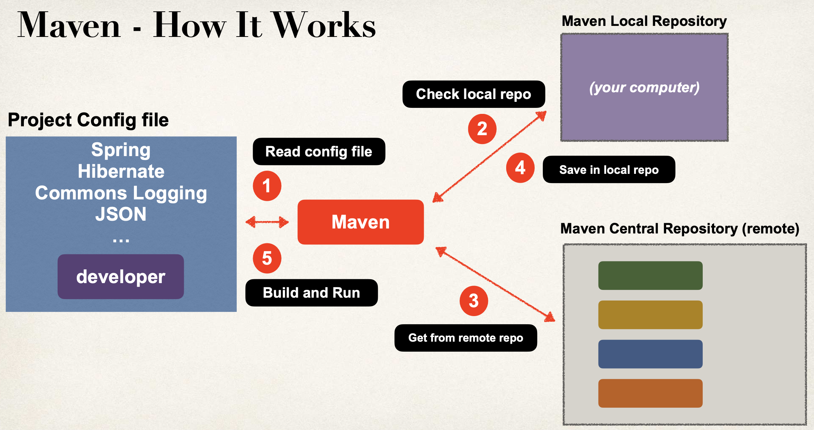


**Handling JAR Dependencies**

When Maven retrieves a project dependency. It will also download supporting dependencies. For example: Spring depends on commo ns-logging ... Maven will handle this for us automagically


**Building and Running**

When you build and run your app ... Maven will handle class / build path for you. Based on config file, Maven will add JAR files accordingly


**Standard Directory Structure**

13-

+ Normally when you join a new project
  + Each development team dreams up their own directory structure 
  + Not ideal f or new comers and not standardized

+ Maven solves this problem by providing a standard directory structure


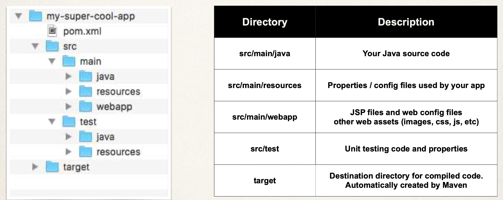

+ pom.xml: maven configuration file


**Standard Directory Structure Benefits**

+ Most major IDEs have built-in support for Maven
  +  Eclipse, IntelliJ, NetBeans etc
  + IDEs can easily read/import Maven projects

+ Maven projects are portable

  + Developers can easily share projects between IDEs

  + No need to fight about which IDE is the best LOL!


**Advantages of Maven**

+ Dependency Management
  + Maven will find JAR files for you 	
  + No more missing JARs
+ Building and Running your Project
  + No more build path / classpath issues 

+ Standard directory structure


Once you learn Maven, you can join a new project and be productive You can build and run a project with minimal local configuration


### Maven key concepts

14

pom.xml: Project Object Model file, the Configuration file for your project


pom.xml 一般结构:

```xml
project meta data: project name, version etc. Output file type: JAR, WAR,...


dependencies: List of projects we depend on: SPring, Hibernate, etc ...


plug-ins: Additional custom tasks to run: generate JUnit test reports etc...
```

e.g.

```xml
<project ...> 
  
  <modelVersion>4.0.0</modelVersion>
	<groupId>com.luv2code</groupId> 
  <artifactId>mycoolapp</artifactId> 
  <version>1.0.FINAL</version> 
  <packaging>jar</packaging>
	<name>mycoolapp</name>
  
<dependencies> 
  <dependency>
		<groupId>org.junit.jupiter</groupId> 
    <artifactId>junit-jupiter</artifactId> 
    <version>5.9.1</version> 		
    <scope>test</scope>
	</dependency> 
</dependencies>
  
<!-- add plugins for customization -->
  
  
</project>
```


Project Coordinates uniquely identify a project

Project Coordinates - Elements

| Name Description** | Description                                                  |
| ------------------ | ------------------------------------------------------------ |
| Group ID           | Name of company, group, or organization.  Convention is to use reverse domain name: **com.luv2code** |
| Artifact ID        | Name for this project: **mycoolapp**                         |
| Version            | A specific release version like: **1.0, 1.6, 2.0 ** If project is under active development then: **1.0-SNAPSHOT** |

e.g. of project coordinates

```xml
<groupId>com.luv2code</groupId> 
<artifactId>mycoolapp</artifactId> 
<version>1.0.FINAL</version>
```

```xml
<groupId>org.springframework</groupId> 
<artifactId>spring-context</artifactId> 
<version>6.0.0</version>
```

```xml
<groupId>org.hibernate.orm</groupId> 
<artifactId>hibernate-core</artifactId> 
<version>6.1.4.Final</version>
```

Adding dependencies

```xml
<project ...> 
  ...
	<dependencies>
		<dependency> 
      <groupId>org.springframework</groupId> 
      <artifactId>spring-context</artifactId> 
      <version>6.0.0</version>
		</dependency>
    
		<dependency> 
    	<groupId>org.hibernate.orm</groupId> 
    	<artifactId>hibernate-core</artifactId> 
      <version>6.1.4.Final</version>
  	</dependency> 
    ...

	</dependencies> 
</project>
```


Dependency coordination

To add given dependency project, we need

+ **Group ID**, **Artifact ID**

+ **Version** is optional ...

+ Best practice for DevOps is to include the version (repeatable builds) 

May see this referred to as: **GAV:  G**roup ID, **A**rtifact ID and **V**ersion


**How to Find Dependency Coordinates**

+ Option 1: Visit the project page (spring.io, hibernate.org etc) 
+ Option 2: Visit http://search.maven.org (<u>easiest approach</u>) 


## SpringBoot project files

15-16

Spring Initializr created a Maven project for us


### mvnw

**mvnw** allows you to run a Maven project (后面的commandline 启动springboot application用到)

+ No need to have Maven installed or present on your path

+ If correct version of Maven is NOT found on your computer 
  + **Automatically downloads** correct versionand runs Maven Two files are provided

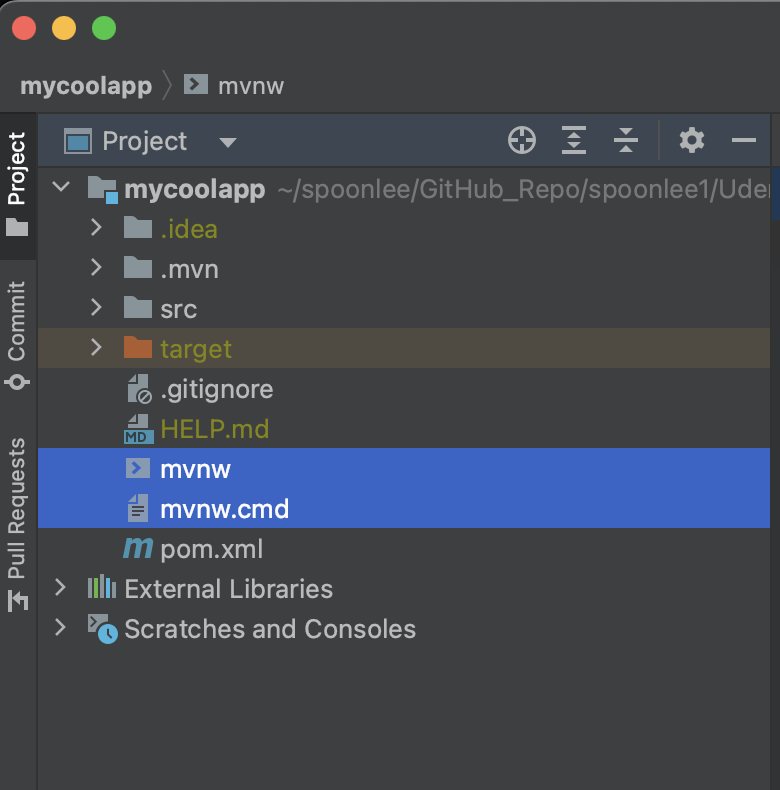

+ **mvnw.cmd** for MS Windows 

+ **mvnw.sh** for Linux/Mac

If you already have Maven installed on your computer previously, then you can ignore/delete the **mvnw** filesJust use Maven as you normally would


### Spring Boot Maven plugin

```xml
<!-->To package executable jar or war archive, Can also easily run the app<-->	
	<build>
		<plugins>
			<plugin>
				<groupId>org.springframework.boot</groupId>
				<artifactId>spring-boot-maven-plugin</artifactId>
			</plugin>
		</plugins>
	</build>
```


### Application Properties

By default, Spring Boot will load properties from: **application.properties**

It is created by Spring Initializr. Empty at the beginning

```properties
# configure server port
server.port=8484

# configure my customizing props
coach.name=Mickey Mouse
team.name=The Mouse Crew
```

read data from properties file

```java
@RestController
public class FunRestController {
  @Value("${coach.name}")
  private String coachName;
  @Value("${team.name}")
  private String teamName;
  ...
}
```


Static

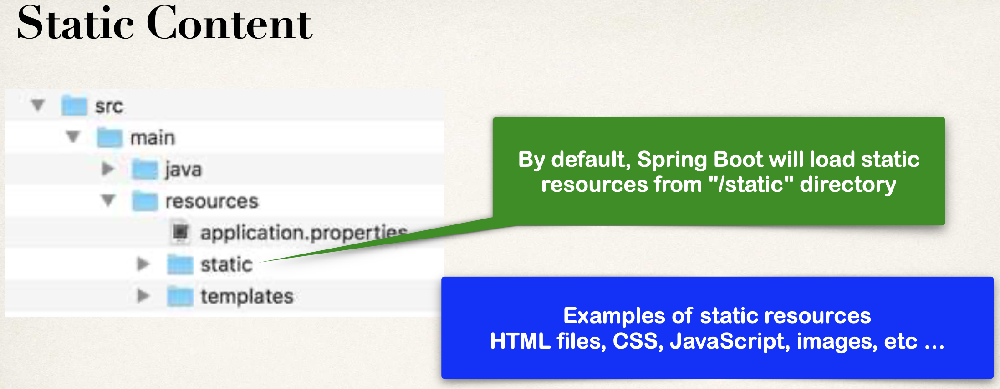


:bangbang: WARNING:

Do not use the **src/main/webapp** directory if your application is packaged as a JAR.

Although this is a standard Maven directory, it works only with WAR packaging. It is silently ignored by most build tools if you generate a JAR.


Template

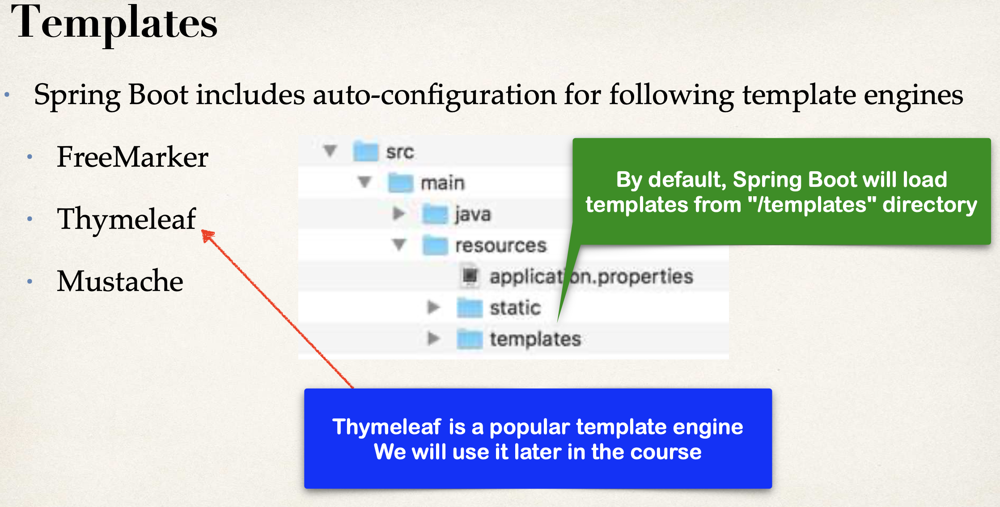


# Get Start with SpringBoot application

## SpringBoot starters

17-

Building a Spring application is really HARD!!! It's tricky to figure out the correct dependencies of correct version with Spring.


**The Solution - Spring Boot Starters**

+ A curated list of Maven dependencies
+ A collection of dependencies grouped together
+ Tested and verified by the  Spring Development team
+ Makes it much easier for the developer to get started with Spring 
+ Reduces the amount of Maven configuration


Spring Boot provides: **spring-boot-starter-web**

```xml
<dependency>
    <groupId>org.springframework.boot</groupId>
    <artifactId>spring-boot-starter-web</artifactId>
    <version>2.6.2</version>
</dependency>

<!-->CONTAINS 
  spring-web 
  spring-webmvc 
  hibernate-validator 
  json
  tomcat
<-->
```


In Spring Initializr, simply select `Web` dependency. You automatically get **spring-boot-starter-web** in **pom.xml**


There are 30+ Spring Boot Starters from the Spring Development team

| Name                         | Description                                                  |
| ---------------------------- | ------------------------------------------------------------ |
| spring-boot-starter-web      | **Building web apps, includes validation, REST. Uses Tomcat as default embedded server** |
| spring-boot-starter-security | **Adding Spring Security support**                           |
| spring-boot-starter-data-jpa | **Spring database support with JPA and Hibernate**           |


check full list of spring starters:

https://docs.spring.io/spring-boot/docs/current/reference/htmlsingle/#using.build-systems.starters


### **Spring Boot Starter Parent**


+ Spring Boot provides a "Starter Parent". This is a special starter that provides Maven defaults


For the **spring-boot-starter-\*** dependencies, no need to list version

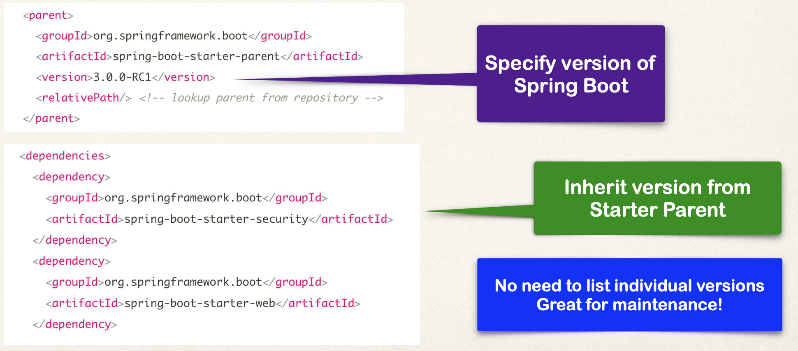


**Benefits of the Spring Boot Starter Parent**

+ Default Maven configuration: Java version, UTF-encoding etc Dependency management

+ Use version on parent only
  + **spring-boot-starter-\*** dependencies inherit version from parent 

+ Default configuration of Spring Boot plugin


## SpringBoot Dev tools

19,20

**spring-boot-devtools** to the rescue!  Automatically restarts your application when code is updated


```xml
<dependency>
   <groupId>org.springframework.boot</groupId>
   <artifactId>spring-boot-devtools</artifactId>
</dependency>
```


IntelliJ Community Edition does not support DevTools by default

Select: **Preferences > Build, Execution, Deployment > Compiler**, Check box: **Build project automatically**

Select: **Preferences > Advanced Settings**, Check box: **Allow auto-make to ...**


Then add new endpoint to your controller class

```java
@RestController
public class FunRestController {

    // expose '/' that return "hello world"
    @GetMapping("/")
    public String sayHello(){
        return "hello world!";
    }

    // expose a new endpoint for "workout"
    @GetMapping("/workout")
    public String getDailyWorkout(){
        return "Run a hard 5k!";
    }

    // expose a new endpoint for "fortune"
    @GetMapping("/fortune")
    public String getDailyFortune(){
        return "Today is your lucky day.";
    }

}
```

save the file, you will see automatically reloading of your application 


## :moon: SpringBoot Actuator 

21-25


**Problem**

How can I monitor and manage my application?  How can I check the application health? How can I access application metrics?


**Solution: Spring Boot Actuator**

Exposes endpoints to monitor and manage your application. 

+ You easily get DevOps functionality out-of-the-box
+ Simply add the dependency to your POM file. 

+ REST endpoints are automatically added to your application

```xml
<dependency>
    <groupId>org.springframework.boot</groupId>
    <artifactId>spring-boot-starter-actuator</artifactId>
</dependency>

```


Automatically exposes endpoints for metrics out-of-the-box. Endpoints are prefixed with: **/actuator**

| Name        | Description                                   |
| ----------- | --------------------------------------------- |
| **/health** | **Health information about your application** |

**/health** checks the status of your application
 Normally used by monitoring apps to see if your app is up or down

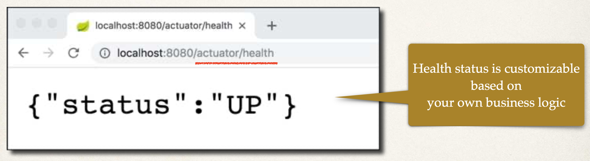


By default, only **/health** is exposed. The **/info** endpoint can provide information about your application

To expose **/info**

**File: src/main/resources/application.properties**:

```properties
management.endpoints.web.exposure.include=health,info
management.info.env.enabled=true
```

**/info** gives information about your application


Update **application.properties** with your app info

**File: src/main/resources/application.properties**:

```properties
info.app.name=My Super Cool App
info.app.description=A crazy and fun app, yoohoo!
info.app.version=1.0.0
```

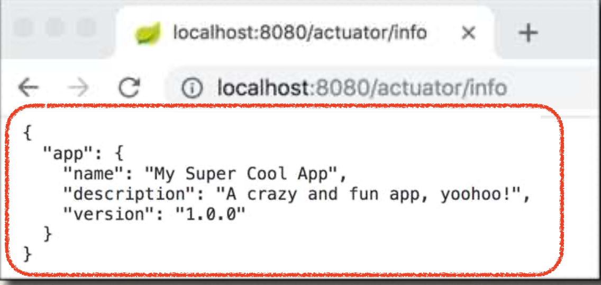


There are 10+ Spring Boot Actuator endpoints


| Name          | Description                                                  |
| ------------- | ------------------------------------------------------------ |
| /auditevents  | **Audit events for your application**                        |
| **/beans**    | **List of all beans registered in the Spring application context** |
| **/mappings** | **List of all @RequestMapping paths**                        |
| ...           | ...                                                          |


Full list of actuator endpoints

https://docs.spring.io/spring-boot/docs/current/reference/htmlsingle/#actuator.endpoints


By default, only **/health** is exposed

To expose all actuator endpoints over HTTP:

**File: src/main/resources/application.properties**

```properties
# Use wildcard "*" to expose all endpoints
# Can also expose individual endpoints with a comma-delimited list
#
management.endpoints.web.exposure.include=*
```

Then, for example, access all the beans's information of your application:  **http://localhost:8080/actuator/beans**


### hands-on with actuator

22-23

添加dependency, 并在application.properties file中写入

```properties
management.endpoints.web.exposure.include=health,info
management.info.env.enabled=true
```

run application, 会发现 log中出现如下

```bash
2023-04-22T07:29:46.945+10:00  INFO 14751 --- [  restartedMain] o.s.b.a.e.web.EndpointLinksResolver      : Exposing 2 endpoint(s) beneath base path '/actuator'
```


继续为info提供自定义信息:

```properties
management.endpoints.web.exposure.include=health,info
management.info.env.enabled=true

info.app.name=My Super Cool App
info.app.description=A Crazy Fun App, yoohoo!
info.app.version=1.0.0
```

Re-run application, check out at localhost:8080/actuator/info

```json
{
  "app": {
    "name": "My Super Cool App",
    "description": "A Crazy Fun App, yoohoo!",
    "version": "1.0.0"
  }
}
```


添加所有的actuator endpoint

```properties
management.endpoints.web.exposure.include=*
management.info.env.enabled=true

info.app.name=My Super Cool App
info.app.description=A Crazy Fun App, yoohoo!
info.app.version=1.0.0
```

Re-run application, now we have 13 endpoints in total

```bash
2023-04-22T07:37:19.169+10:00  INFO 14751 --- [  restartedMain] o.s.b.a.e.web.EndpointLinksResolver      : Exposing 13 endpoint(s) beneath base path '/actuator'
```

```json
// check out with these URL, see info on different checkpoints
http://localhost:8080/actuator/beans
http://localhost:8080/actuator/threaddump
http://localhost:8080/actuator/mappings
```


### Endpoint security

24-25

You may **NOT** want to expose all of this information. Add Spring Security to project and endpoints are secured :-)

```xml
<dependency>
    <groupId>org.springframework.boot</groupId>
    <artifactId>spring-boot-starter-security</artifactId>
</dependency>
```


Spring actuator full documentations:

https://docs.spring.io/spring-boot/docs/current/reference/htmlsingle/#actuator


Hands-on

加入spring security dependency,  re-run application, you will see below in terminal log:

```bash
2023-04-22T07:51:46.432+10:00  WARN 14893 --- [  restartedMain] .s.s.UserDetailsServiceAutoConfiguration : 

Using generated security password: 2b5ef672-434c-4b33-8903-a8eef0dcad20

This generated password is for development use only. Your security configuration must be updated before running your application in production.
```

Check out at localhost:8080/actuator/mappings, now spring security will force you to login using the password  then you can see mappings info


then, we exclude some endpoints from application:

```properties
management.endpoints.web.exposure.include=*
management.info.env.enabled=true

# Exclude individual endpoints with a comma-delimted list
management.endpoints.web.exposure.exclude=health,info

info.app.name=My Super Cool App
info.app.description=A Crazy Fun App, yoohoo!
info.app.version=1.0.0
```


## Run SpringBoot Application from command line

26-27

+ Since we using Spring Boot, the server is embedded in our JAR file. No need to have separate server installed/running

+ Spring Boot apps are self-contained
  

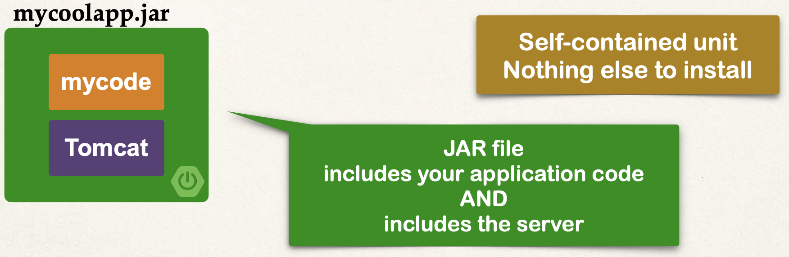


Option 1: Use **java -jar**

Option 2: Use Spring Boot Maven plugin

```bash
   mvnw spring-boot:run
```


先不看这部分, 有需求再看: 什么情况下需要commandline 启动springboot application


# :moon:  SpringBoot properties

## Injecting Custom Application Properties

28-29

You need for your app to be configurable ... no hard-coding of values  ---->  You need to read app configuration from a properties file


By default, Spring Boot reads information from a standard properties file 

+ Located at: **src/main/resources/application.properties**

+ You can define ANY custom properties in this file
+ Your Spring Boot app can access properties using **@Value**


Hands-on:

Application.properties

```properties
# Define my own properties
coach.name=Mickey Mouse
team.name=The Mouse Club
```


Controller class:

```java
@RestController
public class FunRestController {

    // inject custom properties from properties file
    @Value("${coach.name}")
    private String coachName;
    @Value("${team.name}")
    private String teamName;

    // expose new endpoint for "teaminfo"
    @GetMapping("/teaminfo")
    public String getTeamInfo(){
        return "Coach: " + coachName + ", Team name: " + teamName;
    }

}
```

re-run application, 可见读取properties file的信息成功了


## Configure SpringBoot Server

30-31

**Spring Boot Properties**

+ Spring Boot can be configured in the **application.properties** file 
  + Server port, context path, actuator, security etc ...


Spring Boot has 1,000+ properties ... wowzers! Full list of SpringBoot properties:

https://docs.spring.io/spring-boot/docs/current/reference/html/application-properties.html#appendix.application-properties

check the link, you will see 16 categories of these 1000+ properties


Some examples of common properties:

+ Core properties:

```properties
# Log levels severity mapping
logging.level.org.springframework=DEBUG
logging.level.org.hibernate=TRACE
logging.level.com.luv2code=INFO
# Log file name
logging.file=my-crazy-stuff.log
```

see more details of springboot logging:

https://docs.spring.io/spring-boot/docs/current/reference/html/features.html#features.logging

+ Web properties:

```properties
 # HTTP server port
 server.port=7070
 # Context path of the application
 server.servlet.context-path=/my-silly-app
 # Default HTTP session time out
 server.servlet.session.timeout=15m
```

+ Actuator properties

```properties
# Endpoints to include by name or wildcard
management.endpoints.web.exposure.include=*
# Endpoints to exclude by name or wildcard
management.endpoints.web.exposure.exclude=beans,mapping
# Base path for actuator endpoints
management.endpoints.web.base-path=/actuator
```

+ security properties

```properties
# Default user name
spring.security.user.name=admin
# Password for default user
spring.security.user.password=topsecret
```

+ Data properties

```properties
# JDBC URL of the database
spring.datasource.url=jdbc:mysql://localhost:3306/ecommerce
# Login username of the database
spring.datasource.username=scott
# Login password of the database
spring.datasource.password=tiger
...
```


Hands-on

```properties
# Web properties ------------------------------
server.port = 7070

# set the context path of the application
# all request should be prefixed with /mycoolapp
server.servlet.context-path=/mycoolapp
```

re-run the app, check out at http://localhost:7070/mycoolapp/teaminfo, instead of http://localhost:7070/teaminfo

