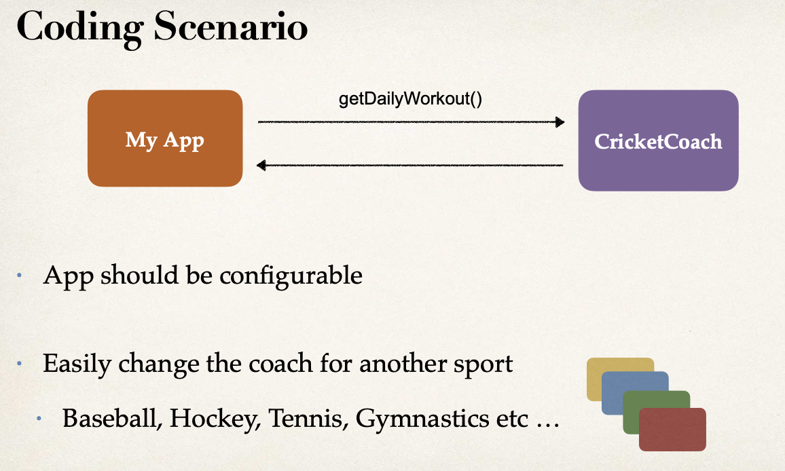
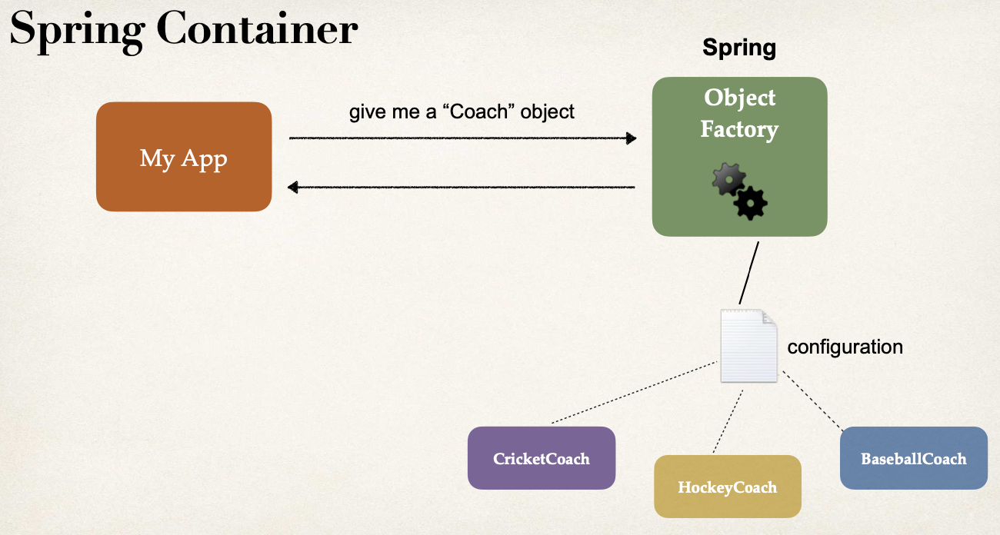
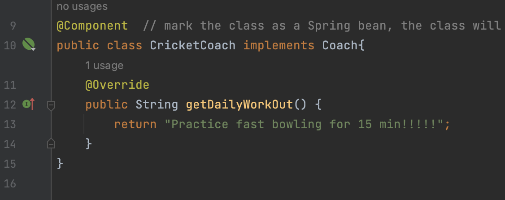

a


# Inversion control


32


Inversion control:  The approach of outsourcing the construction and management of objects.

Traditional way:



Solution of Spring: 应用工厂模式




**Spring Container**: working as object factory (一个大的工厂模式应用), it has two functionalities

+ Create and manage objects *(Inversion of Control)* 
+ Inject object dependencies *(Dependency Injection)*.  下面讲


**Configuring Spring Container**

+ XML configuration file *(legacy)*, not gonna focus on this in this course
+ Java Annotations *(modern)* 
+ Java Source Code *(modern)*


# Dependency injection

33, 34

The dependency inversion principle: The client delegates to another object,  the responsibility of providing its dependencies.


We will cover the two recommended types of injection 

+ Constructor Injection
  + Use this when you have required dependencies
  + Generally recommended by the spring.io development team as first choice
+ Setter Injection
  + Use this when you have optional dependencies
  + If dependency is not provided, your app can provide reasonable default logic


`@Autowiring`

For dependency injection, Spring can use autowiring

+ For dependency injection, Spring can use autowiring Spring will look for a class that matches
  + *matches by type*: class or interface

Spring will inject it automatically ... hence it is autowired


```java
// @Component marks the class as a Spring Bean
// A Spring Bean is just a regular Java class that is managed by Spring
// @Component also makes the bean available for dependency injection
```


## Hands-on

36-38


实现如下的sequence


```java
public interface Coach {
    String getDailyWorkOut();
}
```


```java
import org.springframework.stereotype.Component;

@Component  // mark the class as a Spring bean, the class will become candidates for dependency injection
public class CricketCoach implements Coach{
    @Override
    public String getDailyWorkOut() {
        return "Practice fast bowling for 15 min!!!!!";
    }
}
```


```java
import org.springframework.beans.factory.annotation.Autowired;
import org.springframework.web.bind.annotation.GetMapping;
import org.springframework.web.bind.annotation.RestController;

@RestController
public class DemoController {
    // define a private field for dependency
    private Coach myCoach;
  
    // define a constructor for dependency injection
    @Autowired  // @Autowired annotation tells Spring to inject a dependency
    public DemoController(Coach theCoach){
        myCoach = theCoach;
    }

    @GetMapping("/dailyworkout")
    public String getDailyWorkout(){
        return myCoach.getDailyWorkOut();
    }

}
```

re-run application, check out at localhost:8080/dailyworkout


:bangbang: IDE warning - no usages

it says: no usage of CricketCoach class, but we do use it in getDailyWorkout()!

This is because Spring Framework is dynamic, IDE may not be able to determine if a given class/method is used at runtime. So simply ignore "no usage" warning 




## Constructor injection

38

看到这里


## Component scanning

39-41


## Setter injection

42,43


## Field injection

44


## Qualifiers

45-47


## Primary 

48-49


## Lazy initialization

50-52


# Bean 

## Bean scope

53-54


## Bean Lifecycle methods


## Java Config bean