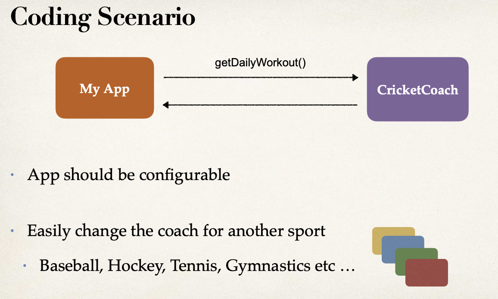
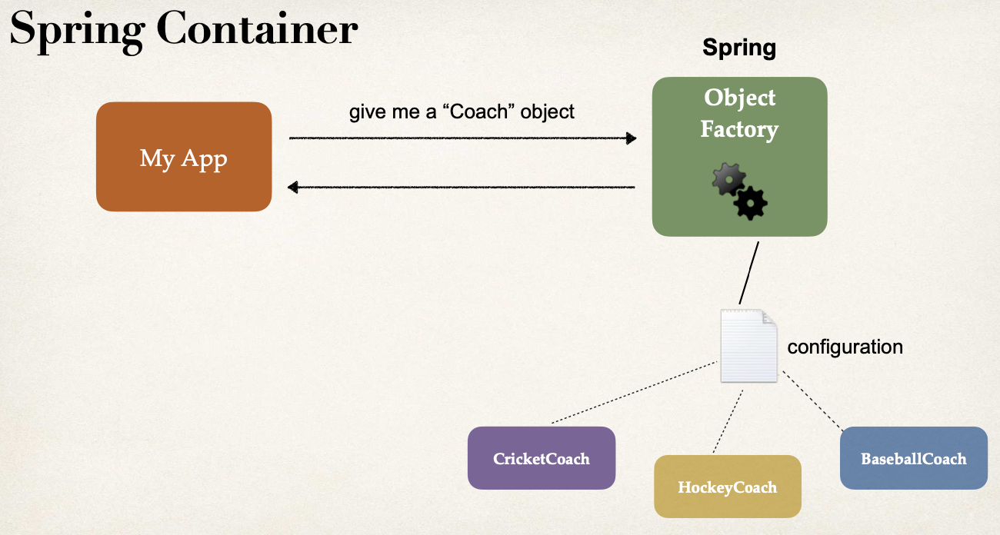
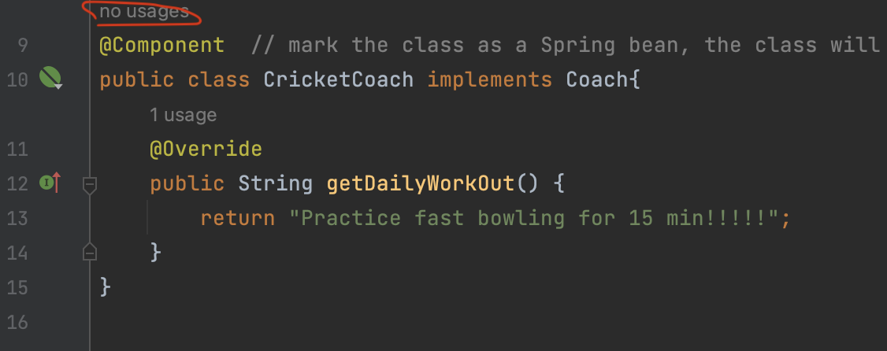

# Abstract

+ IoC
  + Spring Container
    + Spring Bean
      + @Component
      + @Autowired
        + @Qualifier
  
+ Dependency Injection
  + a


# 1. Inversion control

31

Inversion of Control (IoC):  The approach of outsourcing the construction and management of objects.

:pencil: [IoC concepts](./sub_md/IoC.md)


Traditional way:



Solution of Spring: 应用工厂模式

+ based on configuration, generate corresponding object




:star: `Spring Container`: working as object factory (一个大的工厂模式应用, 即充当上图中的Object Factory), it has two functionalities

+ Create and manage objects *(**Inversion of Control**)* 
+ Inject object dependencies *(**Dependency Injection**)*.  下面讲

**Configuring Spring Container**: 3 ways

+ XML configuration file *(legacy)*, not gonna focus on this in this course
+ Java Annotations *(modern)* 
+ Java Source Code *(modern)*


# 2. Dependency injection

32 Defining Dependency Injection - Overview

The dependency inversion principle:  The client delegates the responsibility of providing its dependencies to another object


:bangbang: We will cover the two recommended types of injection :

+ `Constructor Injection`
  + Use this when you have <u>required dependencies</u>
  + Generally recommended by the spring.io development team as first choice
+ `Setter Injection`
  + Use this when you have <u>optional dependencies</u>
  + If dependency is not provided, your app can provide reasonable default logic


:star: `@Autowired`

For dependency injection, Spring can use autowiring, Spring will look for a class that matches
+ *matches by type*: class or interface

Spring will inject it automatically ... hence it is autowired

:bangbang: 为啥JR说尽量别用@Autowiring呢


## 2.1 Constructor Injection

33-36

实现如下的sequence 的 demo


go to https://start.spring.io 

+ 别选snapshot version of Spring Boot
+ Dependencies选择:
  + Spring Boot DevTools
  + Spring Web


---

Code:

```java
public interface Coach {
    String getDailyWorkOut();
}
```

create candidate class for injection

+ use `@Component` to mark it as a Bean. 

  + A Spring Bean is just a regular Java class that is managed by Spring

  + `@Component` also makes the bean available for dependency injection

```java
import org.springframework.stereotype.Component;

@Component  // mark the class as a Spring bean, the class will become candidates for dependency injection (Spring will scan through the @Component class to check for candidates)
public class CricketCoach implements Coach{
    @Override
    public String getDailyWorkOut() {
        return "Practice fast bowling for 15 min!!!!!";
    }
}
```


Create a constructor in your class for injections 

+ here we use `@Autowired` to tell Spring to inject a dependency
  + 注意`@Autowired` is used to decorate method or constructor


```java
import org.springframework.beans.factory.annotation.Autowired;
import org.springframework.web.bind.annotation.GetMapping;
import org.springframework.web.bind.annotation.RestController;

@RestController
public class DemoController {
    // define a private field for dependency
    private Coach myCoach;
  
    // define a constructor for dependency injection
    @Autowired  // @Autowired annotation tells Spring to inject a dependency (create a Coach Obj and inject into this constructor)
    public DemoController(Coach theCoach){
        myCoach = theCoach;
    }

    @GetMapping("/dailyworkout")		// API 
    public String getDailyWorkout(){
        return myCoach.getDailyWorkOut();
    }

}
```

re-run application, check out at localhost:8080/dailyworkout


P35最后提了下如何设置intellij来使得Spring DevTools中的auto build project生效


:bangbang: IDE warning - no usages

it says: no usage of CricketCoach class, but we do use it in getDailyWorkout()!

This is because Spring Framework is dynamic, IDE may not be able to determine if a given class/method is used at runtime. So simply ignore "no usage" warning 




### Constructor injection - Behind the scene

37

Spring Framework do below work for you

```java
Coach theCoach = new CricketCoach();		// instantiate the dependency
DemoController demoController = new DemoController(theCoach);	// inject the dependecny via constructor
```


This is too simple, but why do we need Spring to do this?

Spring is targeted for enterprise, real-time/real-world applications. It provides features such as 

+ Database access and Transactions
+ REST APIs and Web MVC
+ Security
+ etc..


## 2.2 Component scanning

38-40

Spring will scan your Java classes for special annotations ( e.g. @Component, etc ...)

Automatically register the beans in the Spring container


`@SpringBootApplication` is composed of the following annotations:

| Annotation               | Description                                                  |
| ------------------------ | ------------------------------------------------------------ |
| @EnableAutoConfiguration | Enable Spring Boot's auto-configuration support              |
| @ComponentScan           | Enables component scanning of current pacakge, also recursively scans sub-packages <br/> (所以默认main SpringBoot application 所在的路径下的所有package都会被scan) |
| @Configuration           | able to register extra beans with @Bean or import other configuration classes |


Behind the scene: 

+ it creates applications context and register all beans 
+ it starts the embedded server Tomcat etc...

```java
package com.luv2code.springcoredemo;

import org.springframework.boot.SpringApplication;
import org.springframework.boot.autoconfigure.SpringBootApplication;

// @SpringBootApplication enable:
// auto configuration (@EnableAutoConfiguration),
// Component scanning (@ComponentScan),
// Additional configuration (@Configuration)
@SpringBootApplication
public class SpringcoredemoApplication {

	public static void main(String[] args) {
		SpringApplication.run(SpringcoredemoApplication.class, args);
	}

}
```


:bangbang: `@SpringBootApplication` 默认只扫描自己所在的路径及其子路径, 但其实也可以指定component scanning的范围

```java
package com.luv2code.springcoredemo;

import org.springframework.boot.SpringApplication;
import org.springframework.boot.autoconfigure.SpringBootApplication;

@SpringBootApplication(
	scanBasePackages={
    "com.luv2code.springcoredemo",	// 自己所在的路径
    "com.luv2code.util",
    "org.acme.cart",
    "edu.cmu.srs"
  }
)
public class SpringcoredemoApplication {

	public static void main(String[] args) {
		SpringApplication.run(SpringcoredemoApplication.class, args);
	}

}
```


---

code: component scanning

39-40

Just demonstrate `@SpringBootApplication`的默认component scanning 与指定路径的component scanning


## 2.3 Setter Injection

42,43

Inject dependencies by calling setter method on your class


Spring do the work behind the scene:

```java
Coach theCoach = new CricketCoach();
DemoController demoController = new DemoController();
demoController.setCoach(theCoach);
```


Just put a setter method to inject coach using `@Autowired` in the DemoController

```java
@RestController
public class DemoController {
    // define a private field for dependency
    private Coach myCoach;

    @Autowired
    public void setMyCoach(Coach theCoach){     // note method name here is not important
        myCoach = theCoach;
    }
    
    @GetMapping("/dailyworkout")
    public String getDailyWorkout(){
        return myCoach.getDailyWorkOut();
    }

}
```

and everything runs just like in constructor injection demo


## 2.4 Field injection

43

note **field injection** is not recommendated by spring.io development team

+ in early days, field injection was popular on spring projects. But in recent years, it has fallen out of favor

+ In general, it makes the code harder to unit test. Some old project might use it


```java
@RestController
public class DemoController {
    // field injection, use @Autowired directly on the field
  	@Autowired
    private Coach myCoach;
    
    @GetMapping("/dailyworkout")
    public String getDailyWorkout(){
        return myCoach.getDailyWorkOut();
    }

}
```


## 2.5 Others 


### Qualifiers

45-47

Anotation autowiring and qualifiers


:bangbang: if we have multiple implementations of interface Coach, how does `@Autowired` know which one should be instantiateed and injected?

+ Intellij 甚至会提醒你需不需要加`@Qualifier`

```java
public interface Coach {
  ...
}

public class CricketCoach implements Coach{
  ...
}
public class BaseballCoach implements Coach{
  ...
}
public class TrackCoach implements Coach{
  ...
}
public class TennisCoach implements Coach{
  ...
}
```

:star: Solution: be specific using `@Qualifier`

+ specify the bean id: cricketCoach
  + same name as the class name, except the first character in lower-case

```java
@RestController
public class DemoController {
    // define a private field for dependency
    private Coach myCoach;
  
    // define a constructor for dependency injection
    @Autowired  // @Autowired annotation tells Spring to inject a dependency (create a Coach Obj and inject into this constructor)
    public DemoController(@Qualifier("cricketCoach") Coach theCoach){
        myCoach = theCoach;
    }

    @GetMapping("/dailyworkout")		// API 
    public String getDailyWorkout(){
        return myCoach.getDailyWorkOut();
    }

}
```


:gem: 04-qualifiers


:bangbang: 用了@Qualifier, polymorphism 不就成了摆设了吗?


### Primary 

47-48

看到这里


### Lazy initialization

49-51


# 3. Bean 

## 3.1 Bean scope

53-54


## 3.2 Bean Lifecycle methods


## 3.3 Java Config bean