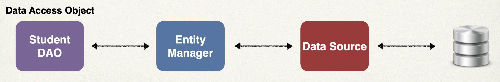
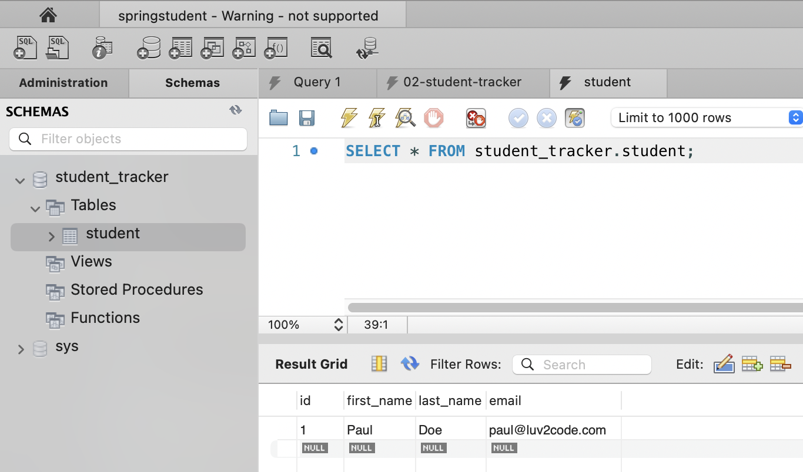
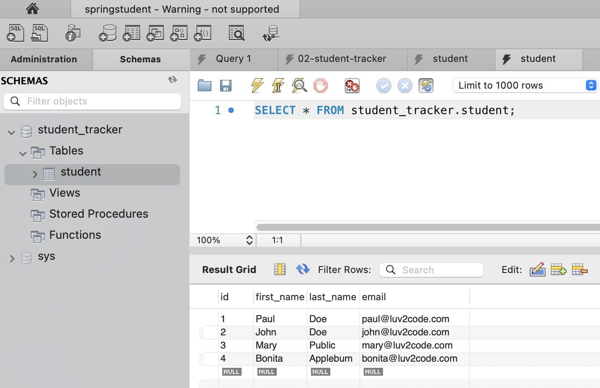
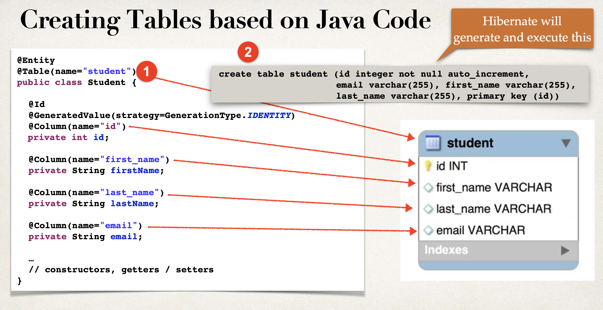

\3


Database Access with Hibernate / JPA CRUD 

:bangbang: 这节课只涉及1个table的CRUD操作


# Abstract 


# Hibernate / JPA overview


What is Hibernate https://hibernate.org/orm/

A middleware (Facade) that connect Java Spring application with database, to allow developer to do declarative  stuff on database

+ It handles all of the low-level SQL

+ It minimizes the amount of JDBC code you have to develop

+ Hibernate provides the Object-to-Relational Mapping (ORM)

  + ORM: The developer defines (declares) mapping between Java class & database table

    


What is JPA?

Jakarta Persistence Api (JPA)... previously known as *Java Persistence API*

+ Standard API for Object-to-Relational-Mapping (ORM)
+ Note it is just a specification that defines a set of interfaces, it requires an implementation to be usbale

There are many implementions of JPA, Hinernate is the most popular one. Check more JPA-Vendor implementations at https://en.wikipedia.org/wiki/Jakarta_Persistence


Benefit of using JPA (polymorphism)

+ By having a standard API, you are not locked to vendor's implementation
+ Maintain portable, flexible code by coding to JPA spec (interfaces)
+ Can theoretically switch vendor implmentation
  + protected variation principle


## Hibernate/JPA & JDBC

How does Hinernate / JPA relate to JDBC? 

Hibernate / JPA uses JDBC  in the background for all database communications

(就像 React 和 JS DOM 的关系一样)


# Hands on

## Set up

62-67 

### Set up Devenvironment: MySQL

In this course, we use MySQL database. It has 2 components:

+ MySQL Database Server
  + It is the main engine of the database. It stores data for the database and supports CRUD features on the data
+ MySQL Workbench
  + It is a client GUI for interacting with the database. 
  + It can create database schemas and tables 
  + execute queries to retrieve data
  + Perform insert, updates and deletes on data
  + Handle administrative functions such as creating users


MySQL Database Server download:

https://dev.mysql.com/downloads/mysql/

MySQL Workbench download:

https://dev.mysql.com/downloads/workbench/


### Set up database table

利用MySQL Workbench 创建自己的Database Server ( 有自己的ip和port number) with specified username & password, 再利用这个database connection和sql script创建table


### Set up SpringBoot project

65-67

In SpringBoot, Hibernate is the default implementation of JPA.

+ **EntityManager** is main component for creating queries etc ...
+ **EntityManager** is from Jakarta Persistence API (JPA)


Based on configs, SpringBoot will automatically create the beans : 

+ **DataSource**, **EntityManager**

You can then inject these into your app, for example your DAO


And SpringBoot will automatically configure your data source for you based on entries from Maven pom file

+ JDBC Driver: mysql-connector-j
+ Spring Data(ORM): spring-boot-starter-data-jpa

SpringBoot will also read DB connection info from application.properties file


:gem: demo

starter.spring.io 添加dependency

+ MySQL Driver

+ Spring Data JPA


SpringBoot Application 

+ **mmandLineRunner**: This is a functional interface with a single method `run(String... args)`. When a bean of type `CommandLineRunner` is present in the context, its `run` method will be called by the Spring Boot framework after the application context is loaded. This gives you an opportunity to execute some logic after the entire Spring context is up and running but before the main method completes.

In the example below, the `commandLineRunner` bean simply prints "hello world!" to the console after the Spring context is initialized.

```java
@SpringBootApplication
public class CruddemoApplication {

	public static void main(String[] args) {
		SpringApplication.run(CruddemoApplication.class, args);
	}

	@Bean
	public CommandLineRunner commandLineRunner(String[] args){	// executed after the Spring beans have been loaded
    
    // lambda expression
		return runner -> {
			System.out.println("hello world!");
		};
    
//		// lambda expression is equivalent to below
//		return new CommandLineRunner() {
//			@Override
//			public void run(String... args) throws Exception {
//				System.out.println("hello world!");
//			}
//		};
	}

}
```

application.properties

+ 注意别打错字了!

```properties
spring.datasource.url=jdbc:mysql://localhost:3306/student_tracker
spring.datasource.username=springstudent
spring.datasource.password=springstudent

# Turn off the Spring Boot banner
spring.main.banner-mode=off

# Reduce logging level. Set logging level to warn
#logging.level.root=warn
```


by running application, you can see logging:

```terminal
2023-08-08T21:59:51.122+10:00  INFO 34915 --- [           main] com.zaxxer.hikari.HikariDataSource       : HikariPool-1 - Starting...
2023-08-08T21:59:51.255+10:00  INFO 34915 --- [           main] com.zaxxer.hikari.pool.HikariPool        : HikariPool-1 - Added connection com.mysql.cj.jdbc.ConnectionImpl@6abdec0e
2023-08-08T21:59:51.256+10:00  INFO 34915 --- [           main] com.zaxxer.hikari.HikariDataSource       : HikariPool-1 - Start completed.
```

which indicates the database server is successfully connected by the SpringBoot application


## JPA Annotations

68, 69

Continuing the content from set up

这里就是在Java里利用JPA Annotation声明式地写对应MySQL record的类, 其实很多和database相关的code我们都是在backend写的, 而不是直接打开MySQL server 去写, <u>我们的目的是让backend去访问database server!</u> 

As mentioned, Hibernate is the default JPA implementation in SpringBoot. 


### **Entity Class**

The Java class that is mapped to a database table

+ at a minimun, the Entity class 
  + Must be annoted with `@Entity`
  + Must have a public or protected no-argument constructor
    + the class can have other constructors

:bangbang: in Java, if you

+ don't decalre any constructors, Java will provide a no-argument constructor for free
+ do declare any constrcutors other than a no-agurment constrctor, Java will not provide a no-argument construtor for free
  + you need to explicitly define a no-argument constructor


Actually, the use of `@Column` is optional

+ If not specified, the column name is the same name as Java field

+ In general, I don’t recommend this approach
  + If you refactor the Java code, then it will not match existing database columns This is a breaking change and you will need to update database column

Same applies to `@Table`, database table name is same as the class


### **Primary Key**

+ cannot be null

MySQL - Auto Increment

```sql
CREATE TABLE student (
  id int NOT NULL AUTO_INCREMENT, # PK should be NOT NULL!
  first_name varchar(45) DEFAULT NULL,
  last_name varchar(45) DEFAULT NULL,
  email varchar(45) DEFAULT NULL,
  PRIMARY KEY (id)
)
```


```java
@Entity 
@Table(name="student") 
public class Student {
  
  @Id
  @GeneratedValue(strategy=GenerationType.IDENTITY)		// 对应 auto increment
  @Column(name="id")
  private int id;
  ...
}
```

ID Generation Strategies

| Name                                      | Description                                                  |
| ----------------------------------------- | ------------------------------------------------------------ |
| GenerationType.AUTO                       | Pick an appropriate strategy for the particular database     |
| GenerationType.IDENTITY     (recommended) | Assign primary keys using database identity column           |
| GenerationType.SEQUEENCE                  | Assign primary keys using a database sequence                |
| GenerationType.TABLE                      | Assign primary keys using an underlying database table to ensure uniqueness |

You can  also define your own CUSTOM generation strategy

+ create implementation of org.hibernate.id.IdentifierGenerator
+ and override the method: public Serializable generate(...)


### :gem: Demo

the entity class: Student

```java
import jakarta.persistence.*;


/**
 * @author xueshuo
 * @create 2023-08-08 10:23 pm
 */

@Entity 
@Table(name="student")
public class Student {
    // define fields
    @Id
    @GeneratedValue(strategy = GenerationType.IDENTITY)
    @Column(name="id")
    private int id;
    
    @Column(name="first_name")
    private String firstName;

    @Column(name="last_name")
    private String lastName;

    @Column(name="email")
    private String email;
    
    
    // define constructors
    public Student() {
    }

    public Student(String firstName, String lastName, String email) {
        this.firstName = firstName;
        this.lastName = lastName;
        this.email = email;
    }

    // define getters/setters
    public int getId() {
        return id;
    }

    public void setId(int id) {
        this.id = id;
    }

    public String getFirstName() {
        return firstName;
    }

    public void setFirstName(String firstName) {
        this.firstName = firstName;
    }

    public String getLastName() {
        return lastName;
    }

    public void setLastName(String lastName) {
        this.lastName = lastName;
    }

    public String getEmail() {
        return email;
    }

    public void setEmail(String email) {
        this.email = email;
    }


    // define toString() method
    @Override
    public String toString() {
        return "Student{" +
                "id=" + id +
                ", firstName='" + firstName + '\'' +
                ", lastName='" + lastName + '\'' +
                ", email='" + email + '\'' +
                '}';
    }
}
```


# CRUD using JPA

Continuing our database and SpringBoot application setup above


同理, 目的是在backend写API来让backend 去 访问 database server. backend 相当于是client 访问database 的Facade. 

+ 核心是调用entityManager的已经封装好的方法
  + entityManger 可以createQuery, 使用JPQL
  + entityManager的方法的输入, 一般是对应entity的obj, 而不是primitive type data
    + DAOImpl是在做如此的转化， 让一个方法的输入可以是primitive type


## :moon: Save a Java Object with JPA

+ **Data access object (DAO)** acts as the Facade for our backend to communicate with Database.
  + DAO has the responsibility of handling data access requests received at backend and reaching them out to databse
  + DAO用Spring默认的Singleton bean scope即可
+ Our **JPA Entity Manager** needs a **Data Source**
  + The Data Source defines database connection info

+ **JPA Entity Manager** and **Data Source** are automatically created by Spring Boot
  + Based on the file: application.properties (JDBC URL, user id, password, etc ...) We can autowire/inject the JPA Entity Manager into our Student DAO




Steps:

+ Step1: define DAO interface
+ Step2: define DAO implementation
  + inject the entity manager
+ Step3: update main app


Spring provides an `@Transactional` annotation

+ Spring automatically begins and ends a transaction for your JPA code
  + No need for you to explicitly do this in your code
+ This Spring magic happens behind the scenes


Spring provides `@Repository` annotation (which is a sub-annotation of @Component)

+ Applied to DAO implementation
+ Spring will automatically register the DAO implementation as a **bean** thanks to component scanning
  + Like `@Component`, `@Service`, and `@Controller`, the `@Repository` annotation tells Spring to manage the annotated class as a bean within the application context. This means that you can `@Autowired` this bean into other components.

+ Spring also provides translation of any JDBC related exceptions
  + One of the key benefits of using `@Repository` over a regular `@Component` is the automatic persistence exception translation. This means that the data access exceptions (thrown by JPA, JDBC, Hibernate, etc.) are automatically caught and translated into Spring's unified `DataAccessException` for consistent exception handling.


:gem: demo

Case1

dao

+ the Step1 & 2

+ note for `@Repository` and `@Transactional`
  + if you are going to modifier record (add, update, delete) database, use `@Transactional`


```java
public interface StudentDAO {
    void save(Student theStudent);
}

@Repository
public class StudentDAOImpl implements StudentDAO{
    // define field for entity manager
    private EntityManager entityManager;


    // inject entity manager using constructor injection
    @Autowired
    public StudentDAOImpl(EntityManager entityManager) {
        this.entityManager = entityManager;
    }

    // implement save method
    @Transactional
    @Override
    public void save(Student theStudent) {
        entityManager.persist(theStudent);
    }
}
```


application

+ the step3

```java
@SpringBootApplication
public class CruddemoApplication {

	public static void main(String[] args) {
		SpringApplication.run(CruddemoApplication.class, args);
	}


	// this method is to simulate client's CRUD operations, it runs after SpringBoot has set up the context
	@Bean
	public CommandLineRunner commandLineRunner(StudentDAO studentDAO ){	// executed after the Spring beans have been loaded
		return runner -> {
			createStudent(studentDAO);
		};
	}

	private void createStudent(StudentDAO studentDAO) {
		// create the student object
		System.out.println("Creating new student object...");
		Student tempStudent = new Student ("Paul", "Doe", "paul@luv2code.com");

		// save the student object
		System.out.println("saving the student...");
		studentDAO.save(tempStudent);

		// display id of the saved student
		System.out.println("Saved student. Generated id: " + tempStudent.getId());

	}


}
```

runn application, you will see a student record appears in MySQL workbench interface under schema!




case 2

+ 这次连续多加几个Student obj to database

```java
@SpringBootApplication
public class CruddemoApplication {

	public static void main(String[] args) {
		SpringApplication.run(CruddemoApplication.class, args);
	}


	// this method is to simulate client's CRUD operations, it runs after SpringBoot has set up the context
	@Bean
	public CommandLineRunner commandLineRunner(StudentDAO studentDAO ){	
		return runner -> {
			createMultipleStudent(studentDAO);

		};
	}

	private void createMultipleStudent(StudentDAO studentDAO) {
		// create multiple students
		System.out.println("Creating new student object...");
		Student tempStudent1 = new Student ("John", "Doe", "john@luv2code.com");
		Student tempStudent2 = new Student ("Mary", "Public", "mary@luv2code.com");
		Student tempStudent3 = new Student ("Bonita", "Applebum", "bonita@luv2code.com");

		// save the students objects
		System.out.println("saving the students ...");
		studentDAO.save(tempStudent1);
		studentDAO.save(tempStudent2);
		studentDAO.save(tempStudent3);

	}

}
```

可以看到新加的student record的id是依次递增的




## Read obj with JPA

还是民工三连: 写interface, 写impl, 写main


:gem: demo

DAO

+ 注意imlp中的findById() 不需要加`@Transactional` 因为它不对database做modification
+ StudentDAOImpl 的`@Repository` 标记它为Spring bean, 将会被Spring管理dependency injection

```java
public interface StudentDAO {
    void save(Student theStudent);
  
    Student findById(Integer id);
}

@Repository
public class StudentDAOImpl implements StudentDAO{
    // define field for entity manager
    private EntityManager entityManager;

    // inject entity manager using constructor injection
    @Autowired
    public StudentDAOImpl(EntityManager entityManager) {
        this.entityManager = entityManager;
    }

    // implement save method
    @Transactional
    @Override
    public void save(Student theStudent) {
        entityManager.persist(theStudent);
    }

    @Override
    public Student findById(Integer id) {
        return entityManager.find(Student.class, id);
    }
}
```


Application

+ :question: 好奇studentDAO 是如何被注入的? commandLineRunner() 并没有@Autowired
  + If `StudentDAO` is a Spring component (e.g., annotated with `@Repository`, `@Service`, `@Component`, etc.), it gets registered in the Spring application context.
  + 默认, @Bean commandLineRunner() 其实被`@Autowired`过了. 这类似于如果一个类只有1个constructor, Spring会默认为它加上一个@Autowired

```java
@SpringBootApplication
public class CruddemoApplication {

	public static void main(String[] args) {
		SpringApplication.run(CruddemoApplication.class, args);
	}

  // this method is to simulate client's CRUD operations, it runs after SpringBoot has set up the context
	@Bean
	public CommandLineRunner commandLineRunner(StudentDAO studentDAO ){	
		return runner -> {
			readStudent(studentDAO);
		};
	}

	private void readStudent(StudentDAO studentDAO) {
		// create a student obj
		System.out.println("creating a student obj...");
		Student tempStudent = new Student("Daffy", "Duck", "daffy@luv2code.com");

		// save the student
		System.out.println("Saving the student");
		studentDAO.save(tempStudent);

		// display id of the saved student
		int theId = tempStudent.getId();
		System.out.println("saved student: with Generated id: " + theId);

		// retrieve student based on the id: pk
		System.out.println("Retrieving student with id: " + theId);
		Student myStudent = studentDAO.findById(theId);

		// display student read
		System.out.println("Found the student: " + myStudent);
	}

}
```

run application可见:

```terminal
creating a student obj...
Saving the student
saved student: with Generated id: 5
Retrieving student with id: 5
Found the student: Student{id=5, firstName='Daffy', lastName='Duck', email='daffy@luv2code.com'}
```


## :moon: Queryt obj with JPA - JPQL

**JPA Query Language (JPQL)**: query language for retrieving objects

+ it is similar in concept to SQL
  + Where, like, order by, join, in, etc...
+ :bangbang: However, note JPQL is based on <u>entity name</u> and <u>entity fields</u>  at the backend side (not table name, table columns at the database side). As we are at backend tring to querying database.


:gem: demo1

retrive all students objects from the table


DAO

+ entityManager.createQuery() 允许我们直接在backend写类sql的query language

```java
public interface StudentDAO {
    void save(Student theStudent);
    Student findById(Integer id);
    List<Student> findAll();
}

@Repository
public class StudentDAOImpl implements StudentDAO{
    // define field for entity manager
    private EntityManager entityManager;

    // inject entity manager using constructor injection
    @Autowired
    public StudentDAOImpl(EntityManager entityManager) {
        this.entityManager = entityManager;
    }

		// ... other methods impl

    @Override
    public List<Student> findAll() {
        // create query
        TypedQuery<Student> theQuery = entityManager.createQuery("FROM Student order by lastName desc", Student.class);

        // return query results
        return theQuery.getResultList();
    }
}
```

appliaction

```java
@SpringBootApplication
public class CruddemoApplication {

	public static void main(String[] args) {
		SpringApplication.run(CruddemoApplication.class, args);
	}


	// this method is to simulate client's CRUD operations, it runs after SpringBoot has set up the context
	@Bean
	public CommandLineRunner commandLineRunner(StudentDAO studentDAO ){	// executed after the Spring beans have been loaded
		return runner -> {
			queryForStudents(studentDAO);
		};
	}

	private void queryForStudents(StudentDAO studentDAO) {
		// get a list of students
		List<Student> theStudents = studentDAO.findAll();

		// display list of student
		for(Student tempStudent:theStudents){
			System.out.println(tempStudent);
		}
	}
  
}
```


:gem: demo2

retrieve student obj by its lastName


DAO

+ JPQL Named Parameter

```java
public interface StudentDAO {
    void save(Student theStudent);
    Student findById(Integer id);
    List<Student> findAll();
    List<Student> findByLastName(String theLastName);
}

@Repository
public class StudentDAOImpl implements StudentDAO{
    // define field for entity manager
    private EntityManager entityManager;

    // inject entity manager using constructor injection
    @Autowired
    public StudentDAOImpl(EntityManager entityManager) {
        this.entityManager = entityManager;
    }

		// ... other methods impl

    @Override
    public List<Student> findByLastName(String theLastName) {
        // create query
        TypedQuery<Student> theQuery = entityManager.createQuery(
                "FROM Student WHERE lastName=:theData", Student.class);
        // JPQL Named Parameters are prefixed with a colon
        // think of it as a placeholder that is filled later

        // set query parameter      ?? SQL injection risk??
        theQuery.setParameter("theData", theLastName);

        // return qurey results
        return theQuery.getResultList();
    }
}
```

application

```java
@SpringBootApplication
public class CruddemoApplication {

	public static void main(String[] args) {
		SpringApplication.run(CruddemoApplication.class, args);
	}

	// this method is to simulate client's CRUD operations, it runs after SpringBoot has set up the context
	@Bean
	public CommandLineRunner commandLineRunner(StudentDAO studentDAO ){	// executed after the Spring beans have been loaded
		return runner -> {

			queryForStudentByLastName(studentDAO);
		};
	}

	private void queryForStudentByLastName(StudentDAO studentDAO) {
		List<Student> theStudents = studentDAO.findByLastName("Doe");

		for(Student tempStudent:theStudents){
			System.out.println(tempStudent);
		}
	}

}
```


## Update obj with JPA

Update可以通过

+ 先find obj, 再用setter, 再entityManager.merge()
+ 也可用JPQL 一步到位


:gem: demo

以下demo两个update的API

dao

```java
public interface StudentDAO {
    void save(Student theStudent);
    Student findById(Integer id);
    List<Student> findAll();
    List<Student> findByLastName(String theLastName);
    void update(Student theStudent);
    int updateAllStudentLastName(String newName);
}

@Repository
public class StudentDAOImpl implements StudentDAO{
    // define field for entity manager
    private EntityManager entityManager;

    // inject entity manager using constructor injection
    @Autowired
    public StudentDAOImpl(EntityManager entityManager) {
        this.entityManager = entityManager;
    }

		// other dao imlp methods ...

    @Override
    @Transactional
    public void update(Student theStudent) {
        entityManager.merge(theStudent);
    }

    @Override
    @Transactional
    public int updateAllStudentLastName(String newName) {
       return entityManager.createQuery("UPDATE Student SET lastName='Tester'")
               .executeUpdate();
    }
}
```

Application

```java
@SpringBootApplication
public class CruddemoApplication {

	public static void main(String[] args) {
		SpringApplication.run(CruddemoApplication.class, args);
	}

	// this method is to simulate client's CRUD operations, it runs after SpringBoot has set up the context
	@Bean
	public CommandLineRunner commandLineRunner(StudentDAO studentDAO ){	
		return runner -> {

			updateStudent(studentDAO);

			updateAllStudentLastName(studentDAO);

		};
	}

	private void updateAllStudentLastName(StudentDAO studentDAO) {
		studentDAO.updateAllStudentLastName("Tester");
	}

	private void updateStudent(StudentDAO studentDAO) {
		// retrieve student based on Id
		int studentId = 1;
		System.out.println("Getting student with id: " + studentId);
		Student myStudent = studentDAO.findById(studentId);

		// change first name
		System.out.println("Update student ...");
		myStudent.setFirstName("Scooby");

		// update student in database
		studentDAO.update(myStudent);

		// display update student
		System.out.println("Update student" + myStudent);

	}


}
```


## Delete obj with JPA

和update 同理


:gem: demo

DAO

```java
public interface StudentDAO {
    void save(Student theStudent);

    Student findById(Integer id);
    List<Student> findAll();
    List<Student> findByLastName(String theLastName);

    void update(Student theStudent);
    int updateAllStudentLastName(String newName);

    void delete(Integer id);
    int deleteAll();

}

@Repository
public class StudentDAOImpl implements StudentDAO{
    // define field for entity manager
    private EntityManager entityManager;

    // inject entity manager using constructor injection
    @Autowired
    public StudentDAOImpl(EntityManager entityManager) {
        this.entityManager = entityManager;
    }

  	// other DAOImpl methods ...

    @Override
    @Transactional
    public void delete(Integer id) {
        // retrieve the student
        Student theStudent = entityManager.find(Student.class, id);

        // delete the student
        entityManager.remove(theStudent);
    }

    @Override
    @Transactional
    public int deleteAll() {

        return entityManager.createQuery("DELETE from Student").executeUpdate();
    }
}
```

application

```java
@SpringBootApplication
public class CruddemoApplication {

	public static void main(String[] args) {
		SpringApplication.run(CruddemoApplication.class, args);
	}

	// this method is to simulate client's CRUD operations, it runs after SpringBoot has set up the context
	@Bean
	public CommandLineRunner commandLineRunner(StudentDAO studentDAO ){	
		return runner -> {
			deleteStudent(studentDAO);
      
			deleteAllStudent(studentDAO);
		};
	}

	private void deleteAllStudent(StudentDAO studentDAO) {
		System.out.println("Deleting all students ...");
		int  numRowsDeleted = studentDAO.deleteAll();
		System.out.println("Deleted rows count: " + numRowsDeleted);
	}

	private void deleteStudent(StudentDAO studentDAO) {
		int studentId = 3;
		System.out.println("Deleting student id: " + studentId);

		studentDAO.delete(studentId);
	}

}
```


## :moon: Create Database table from Java code


Previously, we created database tables by running a SQL script

JPA/Hibernate provides an option to automagically create database tables

Creates tables based on Java code with JPA/Hibernate annotations Useful for development and testing

```properties
spring.jpa.hibernate.ddl-auto=create
# but don't do this on Production database!!
# it is useful for
# 		Database integration testing with in-memory databases
#     Small hobby projects
```

+ when you run your app, JPA/Hibernate will drop tables then create them based on the JPA/Hibernate annotations in your Java code



| Propert Value | Property Description                                         |
| ------------- | ------------------------------------------------------------ |
| None          | No action will be performed                                  |
| Create-only   | Database tables are only created                             |
| Drop          | Database tables are dropped                                  |
| :star: create | Database tables are dropped followed by database tables creation |
| Create-drop   | Database tables are dropped followed by database tables creation. On application shutdown, drop the database tables |
| Validate      | Validate the database tables schema                          |
| :star: Update | Update the database tables schema (old data in table will be kept everytime we run SpringBoot application) |


> :bangbang: **Recommendation**
>
> In general, I don’t recommend auto generation for enterprise, real-time projects 
>
> + You can VERY easily drop PRODUCTION data if you are not careful
>
> I recommend SQL scripts
>
> + Corporate DBAs prefer SQL scripts for governance and code review
>
> + The SQL scripts can be customized and fine-tuned for complex database designs 
> + The SQL scripts can be version-controlled
> + Can also work with schema migration tools such as Liquibase and Flyway 


:gem: demo


Application.properties

```properties
spring.datasource.url=jdbc:mysql://localhost:3306/student_tracker
spring.datasource.username=springstudent
spring.datasource.password=springstudent

# Turn off the Spring Boot banner
spring.main.banner-mode=off

# Reduce logging level. Set logging level to warn
logging.level.root=warn

# Add logging configs to display SQL statements ------------------------
# show SQL statement
logging.level.org.hibernate.SQL=debug
# show SQL statement values
logging.level.org.hibernate.orm.jdbc.bind=trace

# for database table: auto create table --------------------------------
# the "update" config will keep existing data in the table
spring.jpa.hibernate.ddl-auto=update
```


terminal output when 

```properties
spring.jpa.hibernate.ddl-auto=create
```

```terminal
2023-08-09T20:49:32.717+10:00 DEBUG 77506 --- [           main] org.hibernate.SQL                        : drop table if exists student
2023-08-09T20:49:32.724+10:00 DEBUG 77506 --- [           main] org.hibernate.SQL                        : create table student (id integer not null auto_increment, email varchar(255), first_name varchar(255), last_name varchar(255), primary key (id)) engine=InnoDB
Creating new student object...
saving the students ...
2023-08-09T20:49:32.820+10:00 DEBUG 77506 --- [           main] org.hibernate.SQL                        : insert into student (email,first_name,last_name) values (?,?,?)
2023-08-09T20:49:32.823+10:00 TRACE 77506 --- [           main] org.hibernate.orm.jdbc.bind              : binding parameter [1] as [VARCHAR] - [john@luv2code.com]
2023-08-09T20:49:32.823+10:00 TRACE 77506 --- [           main] org.hibernate.orm.jdbc.bind              : binding parameter [2] as [VARCHAR] - [John]
2023-08-09T20:49:32.823+10:00 TRACE 77506 --- [           main] org.hibernate.orm.jdbc.bind              : binding parameter [3] as [VARCHAR] - [Doe]
2023-08-09T20:49:32.836+10:00 DEBUG 77506 --- [           main] org.hibernate.SQL                        : insert into student (email,first_name,last_name) values (?,?,?)
2023-08-09T20:49:32.836+10:00 TRACE 77506 --- [           main] org.hibernate.orm.jdbc.bind              : binding parameter [1] as [VARCHAR] - [mary@luv2code.com]
2023-08-09T20:49:32.836+10:00 TRACE 77506 --- [           main] org.hibernate.orm.jdbc.bind              : binding parameter [2] as [VARCHAR] - [Mary]
2023-08-09T20:49:32.836+10:00 TRACE 77506 --- [           main] org.hibernate.orm.jdbc.bind              : binding parameter [3] as [VARCHAR] - [Public]
2023-08-09T20:49:32.837+10:00 DEBUG 77506 --- [           main] org.hibernate.SQL                        : insert into student (email,first_name,last_name) values (?,?,?)
2023-08-09T20:49:32.837+10:00 TRACE 77506 --- [           main] org.hibernate.orm.jdbc.bind              : binding parameter [1] as [VARCHAR] - [bonita@luv2code.com]
2023-08-09T20:49:32.837+10:00 TRACE 77506 --- [           main] org.hibernate.orm.jdbc.bind              : binding parameter [2] as [VARCHAR] - [Bonita]
2023-08-09T20:49:32.837+10:00 TRACE 77506 --- [           main] org.hibernate.orm.jdbc.bind              : binding parameter [3] as [VARCHAR] - [Applebum]
```

