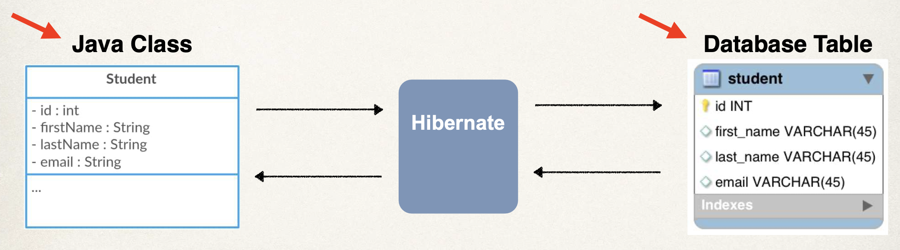
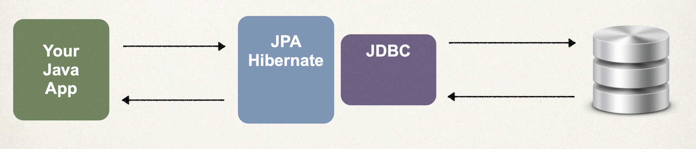

3

Database Access with Hibernate / JPA CRUD

# Abstract 

# Hibernate / JPA overview

What is Hibernate https://hibernate.org/orm/

A middleware (Facade) that connect Java Spring application with database, to allow developer to do declarative  stuff on database

+ It handles all of the low-level SQL

+ It minimizes the amount of JDBC code you have to develop

+ Hibernate provides the Object-to-Relational Mapping (ORM)

  + ORM: The developer defines (declares) mapping between Java class & database table

    

What is JPA?

Jakarta Persistence Api (JPA)... previously known as *Java Persistence API*

+ Standard API for Object-to-Relational-Mapping (ORM)
+ Note it is just a specification that defines a set of interfaces, it requires an implementation to be usbale

There are many implementions of JPA, Hinernate is the most popular one. Check more JPA-Vendor implementations at https://en.wikipedia.org/wiki/Jakarta_Persistence

Benefit of using JPA (polymorphism)

+ By having a standard API, you are not locked to vendor's implementation
+ Maintain portable, flexible code by coding to JPA spec (interfaces)
+ Can theoretically switch vendor implmentation
  + protected variation principle

## Hibernate/JPA & JDBC

How does Hinernate / JPA relate to JDBC? 

Hibernate / JPA uses JDBC  in the background for all database communications

(就像 React 和 JS DOM 的关系一样)

# Hands on

## Set up

62-67 

### Set up Dev environment 

### Set up database table

### Set up SpringBoot project

# JPA

Continuing part2

## JPA Annotations

## Save a Java Object with JPA

