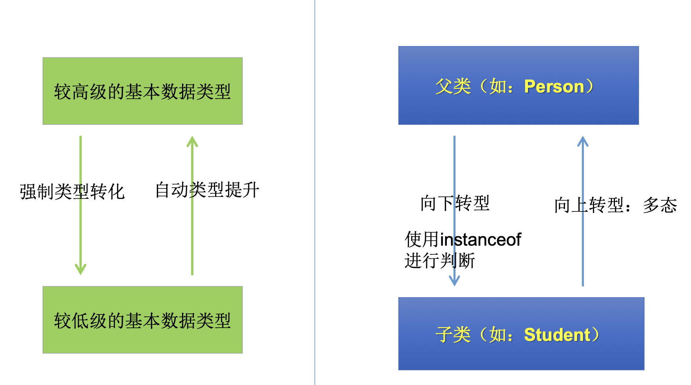

278-312


# 1. 多态

278-291


## 1.1 多态性的理解与使用举例

278-280

```java
1. 多态理解: 可以理解为一种事物的多种形态

2. 何为多态: 对象的多态性: 父类的引用指向子类的对象 (子类的对象赋值给父类的引用)

3. 多态的使用: 虚拟方法调用
+ 有了对象的多态性之后, 我们在编译期, 只能调用父类中声明的结构而不能调用子类中特有的结构, 在运行期, 我们实际执行的是子类重写父类的方法。 
+ 总结: 对于父类中被重写的方法的调用, 编译看左边， 运行看右边  
	+ 也就体现多态的含义： 对于父类的引用的变量, 在编译时其体现为父类的行为-只能调用父类中被定义的方法, 在运行时则体现为子类重写父类方法的行为; `Person p2 = new 		Man();` p2引用 在编译时视为Person类, 运行时体现子类Man的行为
  
4. 多态的使用前提
+ 类的继承关系.
+ 方法的重写.
    
5. 继承中子类不会继承父类中某个属性的值, 同样的对象的多态性只适用于方法而不适用于属性. 对于属性来说, 编译和运行都看左边
```


:gem: 多态使用举例

```java
public class AnimalTest {

    public static void main(String[] args) {
        AnimalTest test = new AnimalTest();

        test.func(new Dog()); // Animal animal = new Dog();

        test.func(new Cat()); // Animal animal = new Cat();
    }
	
  	// 多态的使用: 节省写重载方法
    public void func(Animal animal){        
        animal.eat();
        animal.shout();
    }

//    // 如果不用多态, 则需要写很多重载方法
//    public void func(Dog dog){
//        dog.eat();
//        dog.shout();
//    }
//
//    public void func(Cat cat){
//        cat.shout();
//        cat.shout();
//    }
}


class Animal{
    public void eat(){
        System.out.println("animal eat");
    }

    public void shout(){
        System.out.println("animal shout");
    }

}

class Dog extends Animal{
    @Override
    public void eat(){
        System.out.println("dog eat bones");
    }

    @Override
    public void shout(){
        System.out.println("woo, woo, woo!");
    }
}

class Cat extends Animal{
    @Override
    public void eat(){
        System.out.println("cat eat fish");
    }

    @Override
    public void shout(){
        System.out.println("miao, miao, miao!");
    }
}
```


### Virtual Method Invocation

281

子类中定义了与父类同名同参数的方法，在多态情况下，将此时父类的方法称为虚拟方法，父类根据赋给它的不同子类对象，动态调用属于子类的该方法。**这样的方法调用在编译期是无法确定的, 多态是运行时行为。**

````java
Person e = new Student();
e.getInfo(); //调用Student类的getInfo()方法
````

编译时e为Person类型，而方法的调用是在运行时确定的，所以调用的是Student类 的getInfo()方法。——**动态绑定**


> Overloading VS. Overwritten
>
> 重载，是指允许存在多个同名方法，而这些方法的参数不同。编译器根据方法不 同的参数表，对同名方法的名称做修饰。对于编译器而言，这些同名方法就成了 不同的方法。它们的调用地址在编译期就绑定了。Java的重载是可以包括父类 和子类的，即子类可以重载父类的同名不同参数的方法。
>
> 对于重载而言，在方法调用之前，编译器就已经确定了所要调用的方法， 这称为“`早绑定`”或“`静态绑定`”;
>
> 而对于多态，只有等到方法调用的那一刻，解释运行器才会确定所要调用的具体方法，这称为“`晚绑定`”或“`动态绑定`”。
>
> 引用一句Bruce Eckel的话:“不要犯傻，如果它不是晚绑定，它就不是多态。”


````java
// 证明 多态是运行时行为
public class InterviewTest {

	public static Animal  getInstance(int key) {
		switch (key) {
		case 0:
			return new Cat ();
		case 1:
			return new Dog ();
		default:
			return new Sheep ();
		}

	}

	public static void main(String[] args) {
		int key = new Random().nextInt(3);

		System.out.println(key);	

		Animal  animal = getInstance(key);		// 随机生成Animal某个子类的对象
		
		animal.eat();		// 在编译时无法确定到底调用了哪个eat()方法
		 
	}

}

````


## 1.2 Downcasting

285




```java
// upper casting: 其实就是多态, 将子类的对象赋值给一个父类的引用.
Person p1 = new Man();		// ! 需要注意的是, 此时p1指向堆空间中一个Man对象, 这个Man对象内是具有Man的特有属性与方法的, 但是由于p1被声明为父类Person, 这些Man特有的属性与方法不能被p1调用。!

// down casting: 将一个被视为父类的对象或引用, 赋值给子类的引用, 需要强制类型转换
Man m1 = (Man) p1;		// 现在我们认为被声明为Man的 m1 是 指向堆空间中同一个Man对象的, m1可以使用Man的特有属性与方法
```


### `instanceof`

286

```java
// 接上面: 使用强制类型转换其实并不安全
Woman w1 = (Woman) p1;      // 编译通过了, 但是运行时会throw ClassCastException. 因为p1指向堆空间中的对象, 本质上是Man 类型的
w1.goShopping();
```

解决方案:  a instanceof A: 判断对象a是否是类A的实例. 如果是， 则返回true, 如果不是则返回false。  

:bangbang: instanceof 判断的是 a 指向的堆空间中的对象的本质类型 e.g. `Person p1 = new Man()`  p1 instanceof Man ---> true, ( 当然p1 instanceof Person也是 true )

>  B 是A 的父类, 如果 a instance of A 返回true, 则 a instanceof B 也一定会返回true


使用情景:  为了保证在down casting时避免ClassCastException, 往往需要先用instanceof 来判断一旦返回true, 就进行down casting, 否则不进行

```java
if(p1 instanceof Woman){		// p1只有是Woman才可进入if
            Woman w1 = (Woman) p1;
            w1.goShopping();
            System.out.println("Woman");
        }
```


---

:gem: 几个常见的问题:

```java
// 问题一: 编译时通过, 运行时不通过
// 举例一
Person p3 = new Woman();
Man man3 = (Man) p3;

// 举例二
Person p4 = new Person();
Man man4 = (Man) p4;		// p4 指向的对象本质为Person类，没有其子类Man特有的结构因而被强转时会throw ClassCastException

// 问题二: 编译通过, 运行时也通过 (正确的多态用法)
Object obj = new Woman();
Person person = (Person) obj;

// 问题三: 编译不通过
Man man5 = new Woman();     // type mismatch
String str = new Date();

// 骗编译器, 不相关的两个类不可以赋值
Object o = new Date();
String str2 = (String) o;
```


## 1.3 多态的练习

288-291


```java
多态作用:
	提高了代码的通用性，常称作接口重用
    
前提:
	需要存在继承或者实现关系 
  有方法的重写
    
成员方法:
	编译时:要查看引用变量所声明的类中是否有所调用的方法。 
  运行时:调用实际new的对象所属的类中的重写方法。
    
成员变量: 不具备多态性，只看引用变量所声明的类。
```


# 2. Object class

292-301


# 3. Wrapper Class

302-312


