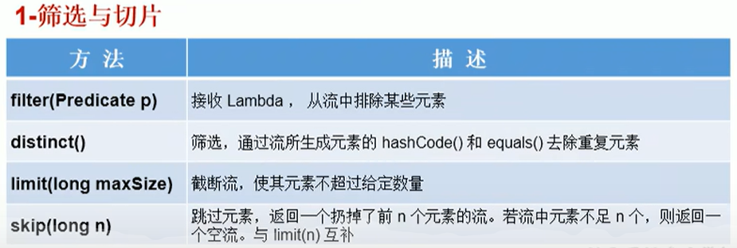
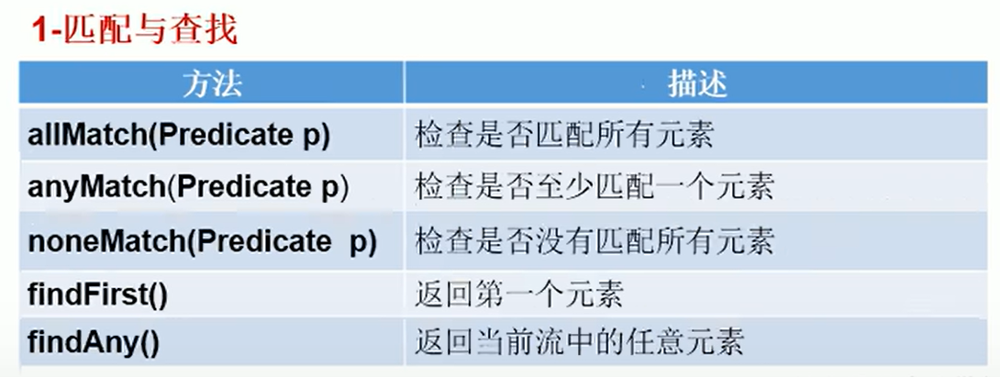
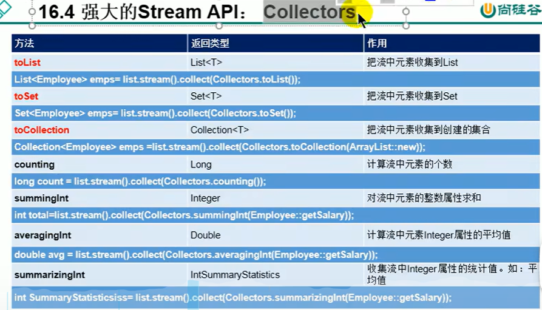
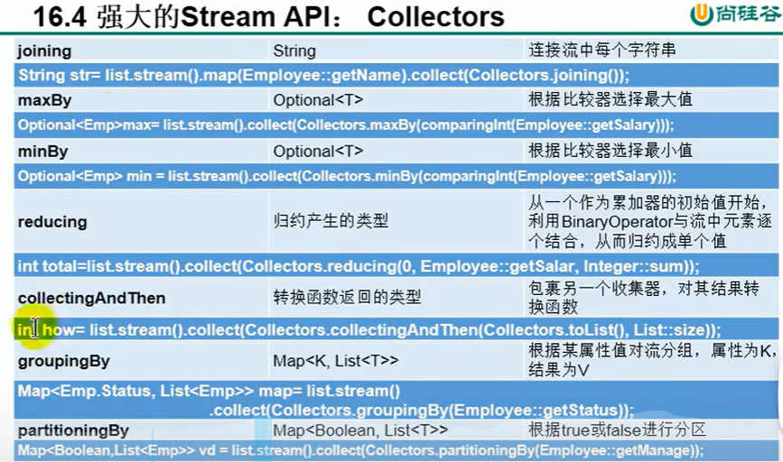

尚硅谷Java8讲解:
:computer: [Bilibili尚硅谷: Java8 Stream API & Optional class](https://www.bilibili.com/video/BV1Kb411W75N?p=677&vd_source=c6866d088ad067762877e4b6b23ab9df)

---

Content

- [1. :full\_moon: Stream API](#1-full_moon-stream-api)
  - [Stream API Introduction](#stream-api-introduction)
  - [Step1: Stream 的创建](#step1-stream-的创建)
    - [by collection (List, Set)](#by-collection-list-set)
    - [by array](#by-array)
    - [无限流](#无限流)
  - [Step2: Stream API 中间操作](#step2-stream-api-中间操作)
    - [filter](#filter)
    - [map](#map)
    - [sort](#sort)
  - [Step3: Stream API 终止操作](#step3-stream-api-终止操作)
    - [match \& find](#match--find)
    - [reduce](#reduce)
    - [collect](#collect)
      - [Collectors 类](#collectors-类)
- [2. :moon:Optional Class](#2-moonoptional-class)
  - [创建Optional instance:](#创建optional-instance)
  - [判断Optional容器中是否包含对象](#判断optional容器中是否包含对象)
  - [获取Optional容器内的对象](#获取optional容器内的对象)

---

# 1. :full_moon: Stream API

## Stream API Introduction
What is Stream API?

Stream API (java.util.stream)把真正的函数式编程风格引入到Java. Stream是Java8中处理集合的关键抽象概念, 它可以指定你希望对集合进行的操作(e.g. 查找, 过滤, 映射...). 使用Stream API对集合数据进行操作, 就类似使用SQL执行的数据库查询, 还可以利用Stream API来进行并行操作.

Why Stream API?
+ 实际开发中, 项目中多数数据都来源于MySQL, Oracle等关系型数据库(Relational database). 但现在数据源更多了, 有MongDB, Radis等等, 而这些NoSQL的数据就需要Java层面去处理, 这时就需要Stream API.
+ Stream vs. Collection: 
  + Collection是一种静态的内存数据结构, 主要是面向内存, 存储在内存中.
  + 而Stream是有关计算的, 主要是面向CPU, 通过CPU来实现计算

什么是Stream?
是数据渠道(管道), 用于操作数据源(集合, 数组)所生成的元素序列. 可以想象stream是一个处理数据的管道或者传送带, 而集合相当于一筐筐的原材料. 我们把一箱箱的原材料倒入管道或者传送带, 数据才会被加工处理(即计算), 这些加工处理我们称之为Stream API的中间操作. 集合和stream一般都需要指定其内部元素的类型
```java
ArrayList<Character>

Stream<Integer>
```

**集合讲的是数据, 而Stream讲的是计算, 这体现在:**

- Stream自己不会存储元素
- Stream不会改变源对象. 相反, 它们只会返回一个持有结果的新Stream
- Stream操作是延迟执行(惰性的)的, 这意味着它们会等到需要结果的时候才执行.

Stream的操作3个步骤:
1. 创建Stream
   从一个数据源(e.g. Set, Array)那里创建一个初始Stream
2. 中间操作
   中间操作链, 在初始流的基础上生成Stream链(流水线). 
3. 终止操作
   一旦执行终止操作, 就执行中间操作链表, 并产生结果. 之后, Stream不会再被使用.


## Step1: Stream 的创建

### by collection (List, Set)

`stream()`

`parallelStream()`

### by array

通过Arrays的static method

`Arrays.stream(arr)`


`Stream.of()`


### 无限流

无限流即被无限投入数据stream

使用static method:

`Stream.iterate()`


`Stream.generate()`


## Step2: Stream API 中间操作
多个中间操作可以连起来形成一个**流水线**, 除非流水线上触发终止操作, 否则中间操作不会执行任何的处理! 而在终止操作时一次性全部处理, 这被称为"惰性操作"

### filter


### map


map会对stream中的每个元素进行操作. 相当于java自动loop over elements in the stream, you just need to define what to do with the element when pointers is on it

### sort


:question: Comparator 是functional interface, 但它里面怎么不止一个method?

## Step3: Stream API 终止操作

相当于在stream的结尾处我们收集最终的数据

### match & find



### reduce


### collect


#### Collectors 类

搭配collect(Collector c)使用





# 2. :moon:Optional Class
Why introducing Optional Class in Java8?  
到目前为止, 臭名昭著的NullPointerException是导致Java应用程序失败的最常见的原因.以前, 为了解决NullPointerException, Google著名的Guava项目引入Optional类, Guava通过使用检查空值的方式来防止代码污染, 它鼓励程序员写更干净的代码. 受到Google Guava的启发, Optional类已经成为Java8类库的一部分.

what is Optional Class?  
Optional<T> class(java.util.Optional)是一个容器类:

+ 它可以保存类型T的值, 代表这个值存在. 
+ 或者仅仅保存null, 表示这个值不存在. **对T的操作我们可以转化为对Optional容器的操作, 这样就可以规避NullPointerException的问题.** 原来用null表示一个值不存在, 而现在Optional可以更好的表达这个概念, 并且可以避免NullPointerException.

Optional类的Javadoc描述如下: 这是一个可以为Null的容器对象. 如果值存在, 则isPresent()方法会返回true, 调用get()方法会返回该对象.

Optional 类的常用方法:
## 创建Optional instance:
+ `Optional.of(T t)`: 创建一个Optional instance, **t必须非空**
+ `Optional.empty()`: 创建一个空的Optional instance
+ `Optional.ofNullable(T t)`: 创建一个Optional instance, 此时t可以为null

## 判断Optional容器中是否包含对象
+ `boolean isPresent()`: 判断是否包含对象
+ `void ifPresent(Consumer<? super T> consumer)`: 如果有值, 就执行Consumer interface的实现代码, 并且该值会作为参数传给它


## 获取Optional容器内的对象
+ `T get()`: 如果调用对象包含值, 则返回该值, 否则抛出异常
  + 和 `Optional.of(T t)` 对应, 非常确定Optional容器内value非空时使用
+ `T orElse(T other)`: 如果有值则将其返回, 否则返回( )内指定的other对象
+ `T orElseGet(Supplier<? extends T> other)`： 如果有值则将其返回, 否则返回由Supplier interface实现提供的对象
+ `T orElseThrow(Supplier<? extends X> exceptionSupplier)`: 如果有值则将其返回, 否则抛出由Supplier interface实现提供的异常.