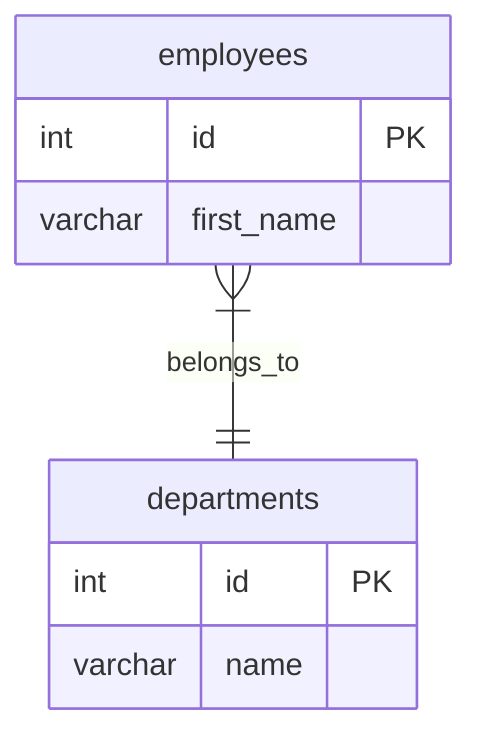
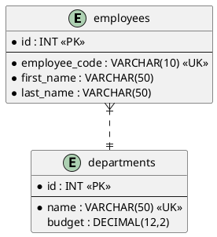
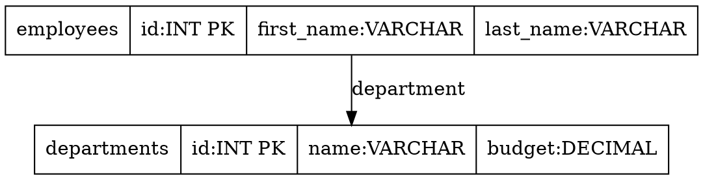

check the db tables created using the `practice.sql` script
https://www.mermaidchart.com/app/projects/c643b2e9-8ac4-4f7a-a637-82f3f0959963/diagrams/ac2c9347-2a46-4d23-b465-2f11c39edee6/version/v0.1/edit


## Other Diagram Languages You Can Use:

### 1. **Mermaid** (what I just created):



### 2. **PlantUML**:



### 3. **Graphviz DOT**:



### 4. **D2 Language**:

```d2
employees: {
  shape: sql_table
  id: int PK
  first_name: varchar(50)
  last_name: varchar(50)
  department: varchar(50)
}

departments: {
  shape: sql_table
  id: int PK
  name: varchar(50)
  budget: decimal(12,2)
}

employees.department -> departments.name
```

## Mermaid Syntax Breakdown:

The diagram I created uses:

- **`erDiagram`** - declares it's an Entity-Relationship diagram
- **`{}`** - defines table structure with columns
- **`PK`** - Primary Key
- **`FK`** - Foreign Key
- **`UK`** - Unique Key
- **`||--o{`** - one-to-many relationship
- **`||--o|`** - one-to-one relationship

## Relationship Symbols in Mermaid:

```
||--||  one to one
||--o{  one to many
}|--||  many to one
}|--o{  many to many
||--o|  one to zero or one
```

You can copy the Mermaid code and use it in:

- **GitHub** (supports Mermaid in markdown)
- **GitLab**
- **Notion**
- **Obsidian**
- **VS Code** (with Mermaid extension)
- **Mermaid Live Editor** (mermaid.live)

Would you like me to show you any other diagram language or modify the Mermaid diagram?
