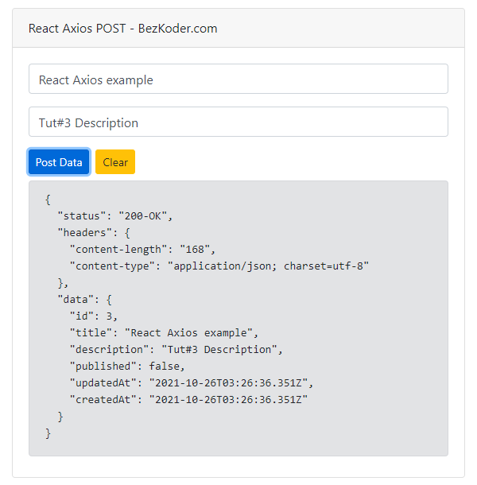

References:

参考资料: https://www.bezkoder.com/react-axios-example/


前置tutorial: https://www.bezkoder.com/axios-request/


[Axios](https://www.npmjs.com/package/axios) is a promise-based HTTP Client Javascript library for Node.js and Browser. In this tutorial, we will create React example that use Axios to make Get/Post/Put/Delete request with Rest API and JSON data in a React functional component (with Hooks).


# 1. React Axios example Overview

We will build a React Client with React Query and Axios library to make CRUD requests to Rest API in that:

- React Query Axios GET request: get all Tutorials, get Tutorial by Id, find Tutorial by title
- React Query Axios POST request: create new Tutorial
- React Query Axios PUT request: update an existing Tutorial
- React Query Axios DELETE request: delete a Tutorial, delete all Tutorials


This React Query Axios Client works with the following Web API:

| Methods | Urls                           | Actions                                           |
| :------ | :----------------------------- | :------------------------------------------------ |
| POST    | /api/tutorials                 | create new Tutorial                               |
| GET     | /api/tutorials                 | retrieve all Tutorials                            |
| GET     | /api/tutorials/:id             | retrieve a Tutorial by `:id`                      |
| PUT     | /api/tutorials/:id             | update a Tutorial by `:id`                        |
| DELETE  | /api/tutorials/:id             | delete a Tutorial by `:id`                        |
| DELETE  | /api/tutorials                 | delete all Tutorials                              |
| GET     | /api/tutorials?title=[keyword] | find all Tutorials which title contains `keyword` |


## How to import Axios in React

There are 2 ways to import Axios into React Application:

+ Using CDN: 不展示了
+ Installing *axios* module: using npm or yarn 


## Create Axios instance in React

We can create a new instance of axios using `axios.create(config)` method, then export it as an `apiClient`:

**src**/*http-common.js*

```react
import axios from "axios";

export default axios.create({
  baseURL: "http://localhost:8080/api",
  headers: {
    "Content-type": "application/json"
  }
});
```


In **src**/*App.js*

```react
import apiClient from "./http-common";		// default import , 与之相对的是named imported
...
```


Now we can use `apiClient` to send HTTP requests and receive responses.

The response for a Axios request contains:

- `data`: parsed response body provided by the server
- `status`: HTTP status code
- `statusText`: HTTP status message
- `headers`: HTTP headers (lower case)
- `config`: the request config that was provided to `axios`
- `request`: the last client request instance that generated this response


# 2. CRUD

## 2.1 React Axios Get JSON data

Let’s implement <u>a React component</u> to fetch JSON data from API:

- get all Tutorials
- get Tutorial by Id
- find Tutorial by title


小小的总结

```react
// functional component里面一般写这几部分
function App(){
  // part1: hooks
  
  // part2: functions to be used, some function might be bound to onClick
  		// API
  		// 辅助函数
  
  // part3: jsx
}
```


App.js

对照UI自己看jsx里对应哪部分

```react
import React, { useRef, useState } from "react";
import "./App.css";

import apiClient from "./http-common";		// Axios实例

function App() {
  // hooks ===================================================================
  const get_id = useRef(null);			// getDataById()要用
  const get_title = useRef(null);		// getDataByTitle()要用

  const [getResult, setGetResult] = useState(null);
	
  // functions ===================================================================
  // 辅助函数, 做格式转化
  const fortmatResponse = (res) => {
    return JSON.stringify(res, null, 2);
  };
	
  // API1 ----------------------------------------------
  async function getAllData() {
    try {
      const res = await apiClient.get("/tutorials");
			
      // 整理response里的信息
      const result = {
        status: res.status + "-" + res.statusText,
        headers: res.headers,
        data: res.data,
      };

      setGetResult(fortmatResponse(result));
    } catch (err) {
      setGetResult(fortmatResponse(err.response?.data || err));
    }
  }
	// API2 --------------------------------------------
  async function getDataById() {
    const id = get_id.current.value;

    if (id) {
      try {
        const res = await apiClient.get(`/tutorials/${id}`);
				
        // 整理response里的信息
        const result = {
          data: res.data,
          status: res.status,
          statusText: res.statusText,
          headers: res.headers,
        };

        setGetResult(fortmatResponse(result));
      } catch (err) {
        setGetResult(fortmatResponse(err.response?.data || err));
      }
    }
  }
	
  // API3 ----------------------------------------------
  async function getDataByTitle() {
    const title = get_title.current.value;

    if (title) {
      try {
        // const res = await instance.get(`/tutorials?title=${title}`);
        const res = await apiClient.get("/tutorials", {
          params: {
            title: title,
          },
        });
				
        // 整理response里的信息
        const result = {
          status: res.status + "-" + res.statusText,
          headers: res.headers,
          data: res.data,
        };

        setGetResult(fortmatResponse(result));
      } catch (err) {
        setGetResult(fortmatResponse(err.response?.data || err));
      }
    }
  }
	
  // clear -------------------------------------------
  const clearGetOutput = () => {
    setGetResult(null);
  };
	
  // return jsx ===================================================================
  return (
    <div id="app" className="container">
      <div className="card">
        <div className="card-header">React Axios GET - BezKoder.com</div>
        
        <div className="card-body">
          <div className="input-group input-group-sm">
            {/*----------- 1 -----------*/}
            <button className="btn btn-sm btn-primary" onClick={getAllData}>Get All</button>
						{/*----------- 2 -----------*/}
            <input type="text" ref={get_id} className="form-control ml-2" placeholder="Id" />
            <div className="input-group-append">
              <button className="btn btn-sm btn-primary" onClick={getDataById}>Get by Id</button>
            </div>
						{/*----------- 3 -----------*/}
            <input type="text" ref={get_title} className="form-control ml-2" placeholder="Title" />
            <div className="input-group-append">
              <button className="btn btn-sm btn-primary" onClick={getDataByTitle}>Find By Title</button>
            </div>
						{/*----------- 4 -----------*/}
            <button className="btn btn-sm btn-warning ml-2" onClick={clearGetOutput}>Clear</button>
          </div>   
          
          {/*---------- 返回的response显示框 -----------*/}
          { getResult && <div className="alert alert-secondary mt-2" role="alert"><pre>{getResult}</pre></div> }
        </div>   {/*card body*/}
      </div>		 {/*card */}
    </div>			 {/*container */}
  );
}

export default App;
```


## 2.2 React Axios Post

Let’s use React Axios POST Json data to create new Tutorial.

To send the request with Headers, we pass an option object with `headers` property right after the `body`.


```react
import React, { useRef, useState } from "react";
import "./App.css";

import apiClient from "./http-common";

function App() {
  // hooks and states =====================================================================
  const post_title = useRef(null);
  const post_description = useRef(null);

  const [postResult, setPostResult] = useState(null);		// 表示post response 的state
	
  // functions =================================================================
  const fortmatResponse = (res) => {
    return JSON.stringify(res, null, 2);
  };
	
  // API1: async + await 的经典写法 -------------------------------------------------
  async function postData() {
    // 
    const postData = {
      title: post_title.current.value,
      description: post_description.current.value,
    };

    try {
      // res 为 post request的response
      // 在这里正式发送HTTP request
      const res = await apiClient.post("/tutorials", postData, {
        headers: {
          "x-access-token": "token-value",
        },
      });

      const result = {
        status: res.status + "-" + res.statusText,
        headers: res.headers,
        data: res.data,
      };

      setPostResult(fortmatResponse(result));
      
    } catch (err) {
      setPostResult(fortmatResponse(err.response?.data || err));
    }
  }
	
  // ----------------------------------------------------------
  const clearPostOutput = () => {
    setPostResult(null);
  };
	
  // jsx =================================================================
  return (
    <div id="app" className="container">
      <div className="card">
        <div className="card-header">React Axios POST - BezKoder.com</div>
        
        <div className="card-body">
          <div className="form-group">
            <input type="text" className="form-control" ref={post_title} placeholder="Title" />
          </div>
          
          <div className="form-group">
            <input type="text" className="form-control" ref={post_description} placeholder="Description" />
          </div>
          {/*真正的发送API的功能*/}
          <button className="btn btn-sm btn-primary" onClick={postData}>Post Data</button>
          <button className="btn btn-sm btn-warning ml-2" onClick={clearPostOutput}>Clear</button>

          { postResult && 
            <div className="alert alert-secondary mt-2" role="alert">
             		<pre>{postResult}</pre>
            </div> }
        </div>
      </div>
    </div>
  );
}

export default App;
```

Check the result by making a React Axios Post Request:




## 2.3 React Axios Put


## 2.4 React Axios Delete


# 3. Conclusion