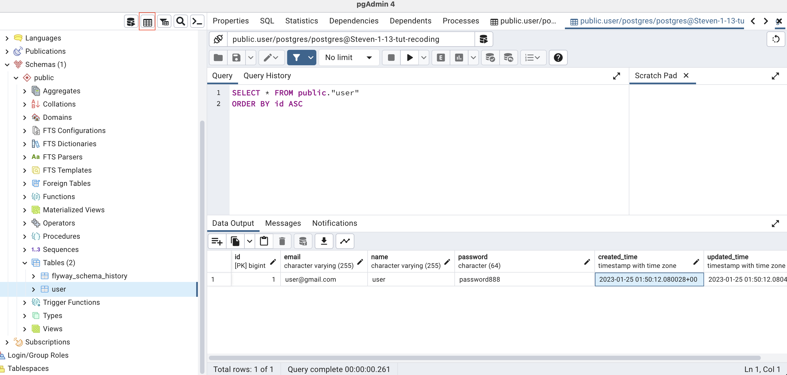

1.13 tut

# 内容总结

演示CRUD后端基本流程, 内容:

+ 如何用docker搭建PostgreSQL数据库
+ 如何连接PostgreSQL数据库和pgadmin(PostgreSQL tool)
+ 如何在intellij里写SQL
+ 演示了CRUD中的C --- 把URL的body作为RequestBody传入controller, 然后再将其化为entity存入数据库
+ lombok提供很多的自动生成代码的annotation
  + `@Getter`
  + `@Setter`
  + `@ToString`
  + `@RequiredArgsConstructor` [lombok constructor annotation](https://projectlombok.org/features/constructor)
    + 在intellij的左侧底部： structure可以查看当前类的所有方法


## springboot后端代码

### controller

+ controller和service传递信息, controller class内有一个service object
+ controller调用service object的方法
  + 注意service obejct的方法的argument得是dto
+ controller实际上作为与外间数据交换的portal, 注意controller里的方法的argument需要annotation, 才能有效读取URL的输入信息


```java
@RestController
@RequestMapping("users")    // URL中跟着/api/v1的成分
@RequiredArgsConstructor    // for UserService
public class UserController {
    private final UserService userService;  // controller要调用service, 以传递数据 不要在controller调用repository

    // 接收URL作为输入， 然后进行一系列操作
    @PostMapping
    public void createUser(@RequestBody UserPostDto userPostDto){
 				// 传入userPostDto
        userService.createUser(userPostDto);
    }
}
```

### service

+ service和repository传递信息, service class内有一个repository object
+ service调用repositoy的方法
  + 注意repository的方法的argument必须是entity, 而不是dto

```java
@Service
@RequiredArgsConstructor
public class UserService {

    private final UserRepository userRepository;

    public void createUser(UserPostDto userPostDto){
        System.out.println(userPostDto);

        User user = new User();
        user.setEmail(userPostDto.getEmail());
        user.setName(userPostDto.getName());
        user.setPassword(userPostDto.getPassword());

        // 将user存进table
        userRepository.save(user);      // argument必须是entity, not dto
    }

}
```

### repository

+ 我们的repository interface直接继承JpaRepository定义好的CRUD方法

```java
public interface UserRepository extends JpaRepository<User, Long> {

}
```


结合锤姐上课的SpringBoot2架构图理解


---
# 1. 前期准备 0min-

## 安装:

+ docker: 通过docker-compose.yml配置文件, 用来创建数据库
+ postman: 模拟HTTP request, 做测试
+ Pgadmin: 数据库可视化工具?

我们将用到postgres数据库, 但不需要我们安装


URL: <传输协议>://<主机名>:<端口号>/<文件名>#片段名?参数列表

## 展示最终效果: 

Postman --> Post request --> body:

```bash
{
	"name": "user",
	"email": "user@gmail.com",
	"password": "123"
}
```


send后, 返回

```bash
{
	"id": 3,
	"name": "user",
	"email": "user@gmail.com",
	"createdTime": "2023-...",
	"updatedTime": "2023-..."
}
```

然后可以把post request body中的信息作为entity存入database


---

## spring initializer

浏览器搜索spring initializer,  版本先选择2.7.8 (别选最新的, 可能会有兼容性问题), 然后选择以下依赖 7min-

+ Spring web
+ lombok

数据库相关

+ spring data jpa (为了能写sql, 后面lec会讲jpa)
+ h2 database
+ postgresSQL driver

其他

+ validation
+ flyway migration
+ spring boot actuator
+ spring security （用来验证用户密码, 这里先不选了, p3里可能要加上）

然后点击generate, 用intellij打开解压好的gradle project, 需要等一会儿下载完所有dependency


当可以跑动application之后, 就表示build完毕了 


---


如果此时运行application报错, 在右上角锤子图标的右侧按钮>edit configuration >VM option复制输入如下代码: 22min-
-Djava.rmi.server.hostname=localhost


解读初次跑application的terminal显示信息23min-

```java
2023-01-25 09:59:09.780  INFO 966 --- [           main] o.s.b.a.e.web.EndpointLinksResolver      : Exposing 1 endpoint(s) beneath base path '/actuator'
```

+ actuator的作用 

  暴露一个端口, 访问该窗口用以检查后端服务器是否健康(服务器是否启动完成), 这个主要后端上线后给devops用的, 如果后端不部署, 就不用actuator了

  + postman: new 一个 get request 输入http://localhost:8080/actuator, send, 返回如下信息

    ```java
    {
        "_links": {
            "self": {
                "href": "http://localhost:8080/actuator",
                "templated": false
            },
            "health": {
                "href": "http://localhost:8080/actuator/health",
                "templated": false
            },
            "health-path": {
                "href": "http://localhost:8080/actuator/health/{*path}",
                "templated": true
            }
        }
    }
    ```

  + postman: new 一个 get request 输入http://localhost:8080/actuator/health, send, 返回如下信息

    ```java
    {
        "status": "UP"
    }
    ```

    


---
# 2. :full_moon: 搭建与连接数据库 28min-

## 2.1 Docker: 搭建数据库 28min-

在intellij的project路径下, 创建docker-compose.yml文件

- dock-compose.yml: 输入如下配置信息

```yml
version: "3.3"
services:
  database:
    image: postgres:13.0-alpine
    volumes:
      - postgresql_data:/var/lib/postgresql/data/
    ports:
      - "5400:5432"
    environment:
      - POSTGRES_DB=postgres
      - POSTGRES_USER=postgres
      - POSTGRES_PASSWORD=admin
volumes:
  postgresql_data: {}
```

启动docker desktop, 之后在intellij的terminal输入来创建数据库: 
```bash
docker-compose up
```

之后可以看到intellij的console最后显示database system is ready to accept connections

```bash
crud-demo-recode-database-1  | 2023-01-24 23:21:04.604 UTC [1] LOG:  database system is ready to accept connections

```

同时在docker你也能看到对应的数据库建立记录


38min-
docker-compose.yml 配置文件的讲解

```yml
image: postgres:13.0-alpine
```

想安装postgres

```yml
volumes:
	- postgresql_data:/var/lib/postgresql/data/
```

数据库信息的存储位置

```yml
ports:
	- "5400:5432"
```

绑定数据库到这个port

```yml
environment:
  - POSTGRES_DB=postgres
  - POSTGRES_USER=postgres
  - POSTGRES_PASSWORD=admin
```

数据库的登录名与密码


## 2.2 Pgadmin: 可视化刚才搭建的数据库 40min-

即连接pgadmin和刚才用docker搭建的数据库

打开pgadmin, 右键点击server > register server >在General随便起个名字, 在Connection中 输入和刚才docker-composer.yml相匹配的参数(DB, user, password), 之后save, 此时可以看到左侧栏中出现了一个大象头图标, 表示连接成功


pgadmin是作为一个数据库可视化工具吗?


## 2.3 创建一个数据库里的table 45min-

:bangbang: 严禁在pgadmin里写data definition language, 因为这样做没有table的创建记录, 容易造成团队里的信息差

我们统一在在intellij里用sql创建table: src>main>resource>db.migration>new file: V1__create_user_table.sql (注意这个命名法. 以Version number开头, 跟双下划线) (如果是intellj终极版, 可以创建flyway文件), 在这个文件里面写:

:bangbang: 一定注意sql的类型要和springboot写的@entity修饰的entity的类型匹配！

```sql
CREATE TABLE "user" (
                        "id" BIGSERIAL PRIMARY KEY,
                        "email" VARCHAR(255) UNIQUE NOT NULL,
                        "name" VARCHAR(255) NOT NULL,
                        "password" CHAR(64) NOT NULL,
                        "created_time" TIMESTAMP WITH TIME ZONE NOT NULL,
                        "updated_time" TIMESTAMP WITH TIME ZONE NOT NULL
);
```

application.properties --> application.yml, 然后复制粘贴如下配置信息 1h-, 用类配置springboot建立的后端服务器

```yml
server:
	port: 8080
  servlet:
    context-path: /api/v1
spring:
  datasource:
    driver-class-name: org.postgresql.Driver
    url: jdbc:postgresql://localhost:5400/postgres
    username: postgres
    password: admin
  jpa:
    database: postgresql
    properties:
      hibernate:
        default_schema: public
        jdbc:
          time_zone: UTC
```

+ server及其下属的配置用来确定URL
  + `Context-path: /api/v1` 是指定我们的URL, 之后在postman里测试的URL, 都是接着`/api/v1`
+ Spring
  + 注意上面的datasource > username, password应该和搭建数据库时的配置一样


---

**之后, 运行application,** 可见现在连接到了搭建的database:

```bash
2023-01-13 20:40:48.687  INFO 6719 --- [           main] o.f.c.i.database.base.BaseDatabaseType   : Database: jdbc:postgresql://localhost:5478/postgres (PostgreSQL 13.0)
```

并且migration (刚写的sql) 也执行了:

```bash
2023-01-13 20:40:48.708  INFO 6719 --- [           main] o.f.core.internal.command.DbValidate     : Successfully validated 1 migration (execution time 00:00.006s)
```

并且pgadmin的刚建好的server(有大象头图标)>database>postgres>shemas>table, 也会看到根据 V1__create_user_table.sql新创建的table


# 3. 开始写后端代码 1h13min-

完成controller  -->  service ---> repository --> database的一个简单流程


## 3.1 Controller: 接收前台的数据 1h13min-

在application所在的路径下新建package: controller,

在这个包下, 新建UserController.java, 写入:

```java
@RestController
@RequestMapping("users")
public class UserController {
    @PostMapping
    public String createUser(){
        return "User create";
    }
    
}
```

在postman > post request: http://localhost:8080/api/v1/users

body中输入

```bash
{
    "name": "user",
    "email": "user@gmail.com",
    "password": "password888"
}
```

 看到返回了

```bash
User create
```


---

在后台把前台传过来的东西打印出来 1h20min-

在application所在路径新建package: dto, 并新建UserPostDto.java

```java
@Getter	// lombok enabled
@Setter
@ToString
public class UserPostDto {
    private String name;
    private String email;
    private String password;
}
```


之后再修改UserController

```java
@RestController
@RequestMapping("users")    // URL中跟着/api/v1的成分
public class UserController {
    @PostMapping
    public String createUser(@RequestBody UserPostDto userPostDto){
        System.out.println(userPostDto);
        return "User create";
    }

}
```


之后运行application, 在postman>post request: http://localhost:8080/api/v1/users

在post request body里输入:

```bash
{
    "name": "user",
    "email": "user@gmail.com",
    "password": "password888"
}
```

send, 然后在intellij可以看到如下, 表示我们的`System.out.println(userPostDto);`成功了

```bash
UserPostDto(name=user, email=user@gmail.com, password=password888)
```


---

## 3.2 实现createUser() 1h27min-

实现把前台接收到的request body转化为entity, 然后将其放到数据库

同时在project路径下, 新建package: repository, entity, service

### 3.2.1 entity 1h27min-

在entity包下新建: User.java

```java
// 注意和sql定义的User属性要一致
@Entity   // 证明这是个Entity, 是要与数据库作用的
@Getter
@Setter
public class User {
    @Id     // 指定修饰的属性为primary key
    @GeneratedValue(strategy = GenerationType.IDENTITY) // 指定主键自动生成模式： 自增长
    private Long id;
  
    private String email;
    private String name;
    private String password;
  
    @CreationTimestamp // 指定自动管理
    private OffsetDateTime createdTime;

    @UpdateTimestamp  // 指定自动管理
    private OffsetDateTime updatedTime;
    
}
```


### 3.2.2 repository 1h43min-

在repository包下新建interface: UserRepository


```java
// <User, Long>: 
//      |--- User对应User entity, 而User entity对应User table, 表示我们是要对User table进行增删改查的 
//      |--- Long是User的pk类型
public interface UserRepository extends JpaRepository<User, Long> {

}
```


JpaRepository里已经定义了CRUD的方法


### 3.2.3 service 1h47min- 2h02min

在Service包下新建UserService class

```java
@Service
@RequiredArgsConstructor
public class UserService {

    private final UserRepository userRepository;

    public void createUser(UserPostDto userPostDto){
        System.out.println(userPostDto);

        User user = new User();
        user.setEmail(userPostDto.getEmail());
        user.setName(userPostDto.getName());
        user.setPassword(userPostDto.getPassword());
        
        // 将user存进table
        userRepository.save(user);      // argument必须是entity, not dto
    }

}
```


在UserController:

```java
@RestController
@RequestMapping("users")    // URL中跟着/api/v1的成分
@RequiredArgsConstructor    // for UserService
public class UserController {
    private final UserService userService;  // controller要调用service, 以传递数据 不要在controller调用repository

    // 接收URL作为输入， 然后进行一系列操作
    @PostMapping        
    public String createUser(@RequestBody UserPostDto userPostDto){
        System.out.println(userPostDto);
        userService.createUser(userPostDto);
        return "User create";
    }
}
```

controller里调用service的方法, 而service的方法调用了repository来和数据库交互


**结果:**

run application, 同样在postman> post request > http://localhost:8080/api/v1/users

body中输入：

```bash
{
    "name": "user",
    "email": "user1@gmail.com",
    "password": "password888"
}
```

此时在pgadmin中可以看到User创建成功了(点左上角那个圈红的button来view data)




改变email (因为Unique) 再send, 会发现pgadmin中数据库也更新了

