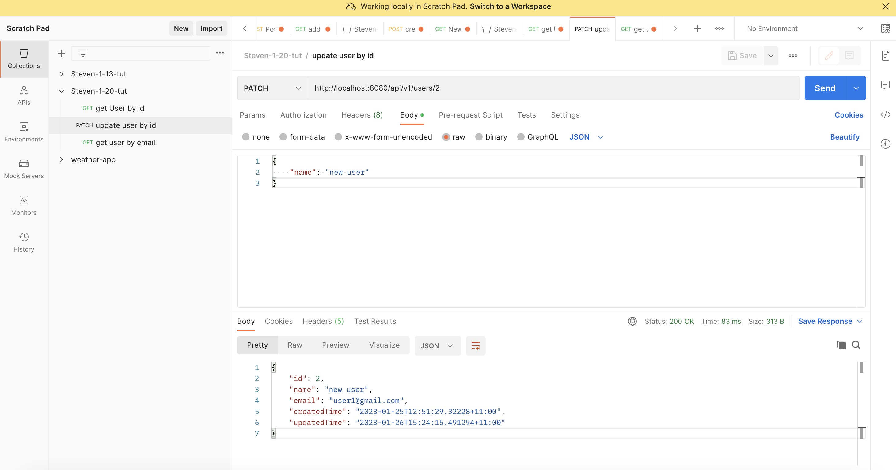
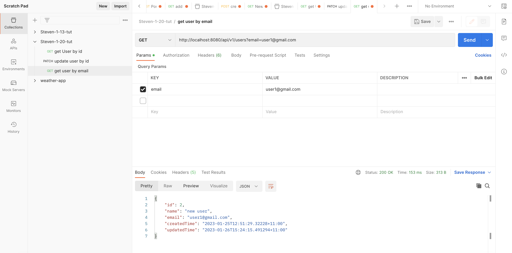

1-20 tut


接上节课, 注意要启动pgadmin, 并输入密码access existing server


# 0. 总结

+ 利用SpringBoot来连接数据库做CRUD
+ 在Controller里写的方法应遵循RESTful API的规范: 改返回什么HttpStatus, 是否有body, 成功时是否返回Body
+ SpringBoot exception handling的写法
  + 错误信息应由足够独特的Exception携带
  + 将错误信息返回给前端, 而不仅仅是在后端显示


# 1. 查找: getUserById 0min-

get

+ get没有body, 一般用params


## 将get的结果打印在terminal

接上节课, 在UserController里写入:

```java
@GetMapping("/{userId}")     // 接URL中/api/v1/users
public void getUser(@PathVariable Long userId){
  	userService.getUser(userId);
}
```

在UserService里写入:

```java
public void getUser(Long userId) {
    Optional<User> optionalUser = userRepository.findById(userId);

    User user = optionalUser.get();
    System.out.println(user);
}
```


在postman > get request: http://localhost:8080/api/v1/users/2, intellj的console出现:

```bash
User(id=2, email=user1@gmail.com, name=user, password=password888                                                     , createdTime=2023-01-25T12:51:29.322280+11:00, updatedTime=2023-01-25T12:51:29.322345+11:00)
```

说明get成功了


## 把get的结果返回到前台去 14min-


Controller ---dto---> service ----entity----> repository 

Controller <---dto--- service <----entity---- repository 

其中entity class需要@entity annotation, 用来表示是要与数据库交互的, 对成员变量有很多类似SQL DDL的constraint

很多时候, 数据从controller流向repository并不是对称的: 比如用户登陆, 数据从controller流向repository带有用户的密码, 而当我们想get user的某些信息时, 数据从repository流向controller但不能带有用户的密码信息


UserController写入:

```java
@GetMapping("/{userId}")     // 接URL中/api/v1/users
public UserGetDto getUser(@PathVariable Long userId){
    UserGetDto userGetDto = userService.getUser(userId);
    return userGetDto;
}
```


UserService写入:

```java
public UserGetDto getUser(Long userId) {

    Optional<User> optionalUser = userRepository.findById(userId);      // repository的方法, 和数据库交互

    User user = optionalUser.get();
    System.out.println(user);

    UserGetDto userGetDto = new UserGetDto();
    userGetDto.setId(userId);
    userGetDto.setName(user.getName());
    userGetDto.setEmail(user.getEmail());
    userGetDto.setCreatedTime(user.getCreatedTime());
    userGetDto.setUpdatedTime(user.getUpdatedTime());

    return userGetDto;
}
```


Postman > get request: http://localhost:8080/api/v1/users/2

真的在前台得到结果了, 

```bash
{
    "id": 2,
    "name": "user",
    "email": "user1@gmail.com",
    "createdTime": "2023-01-25T12:51:29.32228+11:00",
    "updatedTime": "2023-01-25T12:51:29.322345+11:00"
}
```


## 处理用户的不合法输入26min- 

精简

上面我们在做信息载体转换的时候(dto <---> entity)写的很繁琐


同时也不是很健壮, 如getUser() 如果输入的userId在数据库中并没有匹配, 就会报错

e.g. postman > get request: http://localhost:8080/api/v1/users/100 (数据库中没有id为100的row)

Postman中返回的:

```bash
{
    "timestamp": "2023-01-26T00:05:44.135+00:00",
    "status": 500,
    "error": "Internal Server Error",
    "path": "/api/v1/users/100"
}
```

返回的错误信息太广了, 应该narrow down一下


在UserService:

使用Optional类来解决数据库中指定id的User不存在的情况: orElseThrow() 抛一个异常

```java
public UserGetDto getUser(Long userId) {

        Optional<User> optionalUser = userRepository.findById(userId);      // repository的方法, 和数据库交互

        // User user = optionalUser.get();      // 不够健壮, 如果指定id的user在数据库中不存在呢?

        User user = optionalUser.orElseThrow(() -> new RuntimeException("User: " + userId + " not found"));     // Optional类的方法
        // T orElseThrow(Supplier<? extends X> exceptionSupplier): 如果有值则将其返回, 否则抛出由Supplier interface实现提供的异常.

        System.out.println(user);

        UserGetDto userGetDto = new UserGetDto();
        userGetDto.setId(userId);
        userGetDto.setName(user.getName());
        userGetDto.setEmail(user.getEmail());
        userGetDto.setCreatedTime(user.getCreatedTime());
        userGetDto.setUpdatedTime(user.getUpdatedTime());

        return userGetDto;
    }
```

但RuntimeException还是太广了, 进一步具体化Exception


自定义Exception

在application的路径下新建package: exception, 并新建一个ResourceNotFoundException class

```java
public class ResourceNotFoundException extends RuntimeException {

    public ResourceNotFoundException(){
        super("Resource not found!");
    }

}
```

并替换掉UserService的getUser()里的RuntimeException

```java
User user = optionalUser.orElseThrow(() -> new ResourceNotFoundException());
```


但是错误信息只在后端显示, 并没有返回给用户

---

把错误信息返回到前台36min-

在exception包下新建如下类

```java
@RestControllerAdvice   // 监视Controller, 如果controller里的方法报了异常的化, 做如下处理
public class ControllerExceptionHandler {

    @ExceptionHandler(value = {ResourceNotFoundException.class})        // 如果controller里报了ResourceNotFoundException, handle it (back-end terminal will not show Exception message)
    @ResponseStatus(HttpStatus.NOT_FOUND)           // 让前台返回信息中HttpStatus为404
    public String handleResourceNotFoundException(){
        return "Resource not found";            // 返回该值直接到前台
    }

}
```


这样再跑application, 在postman中如果输入URL指定id的user不存在于数据库的话, 前台也会收到信息: Resource not found, 且http status为404 (如果) 如果不指明HttpStatus的话, 默认返回200


Q&A 43min-58min

暂停一下解决同学遇到的问题


## 进一步指明错误信息, 并返回给前台 58min-


ResourceNotFoundException中新定义有参构造器

```java
public class ResourceNotFoundException extends RuntimeException {

    public ResourceNotFoundException(){
        super("Resource not found!");
    }

    // 指明哪个resource not found
    public ResourceNotFoundException(String resource){
        super(resource + " not found!");
    }

}

```


UserService:

```java
User user = optionalUser.orElseThrow(() -> new ResourceNotFoundException("User " + userId));     // Optional类的方法
```


ControllerExceptionHandler 中 handleResourceNotFoundException(e) return e.getMessage

```java
@RestControllerAdvice   // 监视Controller, 如果controller里的方法报了异常的化, 做如下处理
@Slf4j      // enable log
public class ControllerExceptionHandler {


    @ExceptionHandler(value = {ResourceNotFoundException.class})        // 如果controller里报了ResourceNotFoundException, handle it (back-end terminal will not show Exception message)
    @ResponseStatus(HttpStatus.NOT_FOUND)           // 让前台返回信息中HttpStatus为404
    public String handleResourceNotFoundException(ResourceNotFoundException e){
        // log.info(e.getMessage(), e);
        
        return e.getMessage();            // 返回该值直接到前台
    }
}
```


总结: 在可能出错的地方throw exception (这个exception应该足够独特, 最好自己自定义一个Exception class, 并添加有参构造器方便指明具体的错误信息对象), 并编写一个ExceptionHanler class在其中处理该独特的exception并将错误信息返回给前台


# 2. HttpStatus 相关 1h16min- 

HttpStatus很讲究, 不能乱写

https://developer.mozilla.org/en-US/docs/Web/HTTP/Status

https://developer.mozilla.org/en-US/docs/Web/HTTP/Methods/GET 遵循这个标准, 具体一个RESTful API是否该有body, status应该返回几

Created-201

Deleted-204


# 3. 删除1h18min-

UserController

```java
@DeleteMapping("/{userId}")
public void deleteUser(@PathVariable Long userId){
  	userService.deleteUser(userId);
}
```


UserService

```java
public void deleteUser(Long userId) {
  	userRepository.deleteById(userId);
}
```


# 4. 改 1h23min-

UserController

```java
// @PutMapping 改动User全部属性
// @PatchMapping 改动User部分属性
@PatchMapping("/{userId}")
public UserGetDto updateUser(@RequestBody UserPatchDto userPatchDto, @PathVariable Long userId){
  return userService.updateUser(userPatchDto, userId);
}
```


新建一个UserPatchDto class

```java
// Dto for patch
@Setter
@Getter
public class UserPatchDto {
    private String name;

}
```


UserService:

改: 分为4步

+ 从数据库中查到指定id的user entity, 返回
+ 改动这个entity的某个属性
+ 再将这个entity存回数据库
+ 最后返回一个状态更新后的UserGetDto给前台 (RESTful api的标准规定这么做的)

```java
// 改
public UserGetDto updateUser(UserPatchDto userPatchDto, Long userId) {
    // step1
    Optional<User> optionalUser = userRepository.findById(userId);      // repository的方法, 和数据库交互

    User user = optionalUser.orElseThrow(() -> new ResourceNotFoundException("User " + userId));     // Optional类的方法
    // T orElseThrow(Supplier<? extends X> exceptionSupplier): 如果有值则将其返回, 否则抛出由Supplier interface实现提供的异常.

    // step2
    user.setName(userPatchDto.getName());

    // step3
    userRepository.save(user);

    // step4: 将update过后的user entity转化为UserGetDto返回给前台
    UserGetDto userGetDto = new UserGetDto();
    userGetDto.setId(userId);
    userGetDto.setName(user.getName());
    userGetDto.setEmail(user.getEmail());
    userGetDto.setCreatedTime(user.getCreatedTime());
    userGetDto.setUpdatedTime(user.getUpdatedTime());

    return userGetDto;
  }
```


测试效果如下:




# 5. 查找: getUserByEmail 1h49min- 2h05min

用户希望通过email来定位自己在数据库中的id


UserController

```java
@GetMapping
public UserGetDto getUserByEmail(@Param(value = "email") String email){
    System.out.println(email);
    return userService.getUserByEmail(email);
}

```


UserRepository

UserRepository继承自JpaRepository, 自身并没有findByEmail方法

+ 但我们只需写上`Optional<User> findByEmail(String email);`就可以了, 太神奇了

```java
// <User, Long>:
//      |--- User对应User entity, 而User entity对应User table, 表示我们是要对User table进行增删改查的
//      |--- Long是User的pk类型
public interface UserRepository extends JpaRepository<User, Long> {
    Optional<User> findByEmail(String email);
}
```


UserService

+ 此时我们便可以调用userRepository.findEmail()了

```java
public UserGetDto getUserByEmail(String email) {
    // step1
    Optional<User> optionalUser = userRepository.findByEmail(email);      // repository的方法, 和数据库交互

    User user = optionalUser.orElseThrow(() -> new ResourceNotFoundException("User " + email));     // Optional类的方法
    // T orElseThrow(Supplier<? extends X> exceptionSupplier): 如果有值则将其返回, 否则抛出由Supplier interface实现提供的异常.

    // step2: entity --> dto
    UserGetDto userGetDto = new UserGetDto();
    userGetDto.setId(user.getId());
    userGetDto.setName(user.getName());
    userGetDto.setEmail(user.getEmail());
    userGetDto.setCreatedTime(user.getCreatedTime());
    userGetDto.setUpdatedTime(user.getUpdatedTime());

    return userGetDto;
}
```


测试效果如下:




至此, springboot相关的内容就结束了

后续我们学习联表查询
