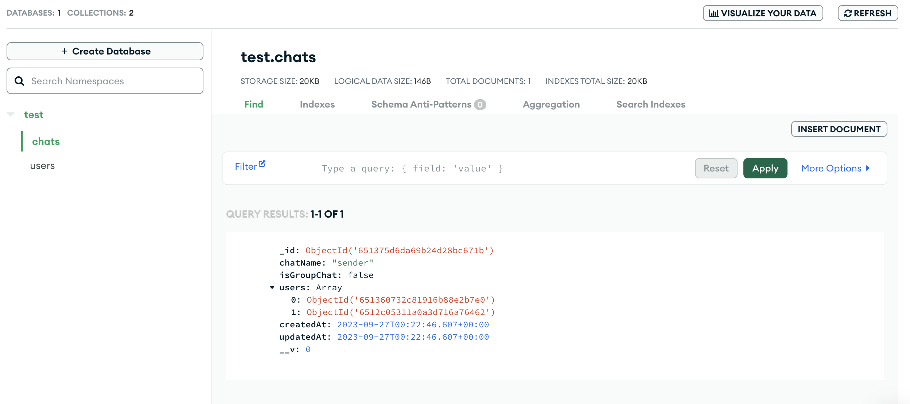

https://www.youtube.com/watch?v=3vRcB0P84t4&list=PLKhlp2qtUcSZsGkxAdgnPcHioRr-4guZf

mainly to learn mongoDB and web socket (socket io)


# Key Takeaways

Server

+ MongoDB schema
+ Connect MongoDB
+ User sign up & authentication using JWT token
  + `protect` middleware to authenticate a user login

+ :gem: use morgon for logging to help debug
+ 写server api pattern: 边写边validate user input or a db operation result

Postman

+ set and save environment variables
+ Authentication token


Client

+ React Router V5 

+ use of Chakra UI lib

+ set proxy in package.json for CORS. we can also config CORS at server 

+ upload image to cloudiary, then MongoDB store pic url

  
  
  


# 1. Intro

## App demo

C1

## What is MERN 

C2


https://www.mongodb.com/zh-cn/nosql-explained/nosql-vs-sql


# 2. Basics

1hrs

## Environment setup

VScode extension

```ts
auto rename tag
Bracket Pair Colorizer 2
ES7 React snippets
JavaScript (ES6) code snippets
```


## Server startup

C4

```ts
npm i dotenv		// for .env
```

Server.js

```js
const express = require("express");
const { chats } = require("./data/data");  // see data.js, some dummy data
const dotenv = require("dotenv");

const app = express();
dotenv.config();

app.get("/", (req, res) => {
  res.send("API is running!");
});

app.get("/api/chat", (req, res) => {
  res.send(chats);
});

app.get("/api/chat/:id", (req, res) => {
  // console.log(req.params.id)
  const singleChat = chats.find((chat) => chat._id === req.params.id);
  res.send(singleChat);
});

const PORT = process.env.PORT || 8080;
app.listen(PORT, console.log(`Server is listening on port ${PORT}`));

```


## Client startup

C5

https://chakra-ui.com/

:bangbang: 似乎这个ui lib 比视频做的时候有很多更新... 可能会有兼容性问题, 可能也是为什么他给的code npm install不成功


```js
npm i react-router-dom@5
```

index.js

+ wrap "<App/>" with `ChakraProvider` , `BrowserRouter`  to enable Chakra UI and React Router

```js
import React from "react";
import ReactDOM from "react-dom/client";
import "./index.css";
import App from "./App";
import { ChakraProvider } from "@chakra-ui/react";
import { BrowserRouter } from "react-router-dom";

const root = ReactDOM.createRoot(document.getElementById("root"));
root.render(
  <React.StrictMode>
    <BrowserRouter>
      <ChakraProvider>
        <App />
      </ChakraProvider>
    </BrowserRouter>
  </React.StrictMode>
);
```

App.js

```js
import "./App.css";
import { Route } from "react-router-dom";

import HomePage from "./Pages/HomePage";
import ChatPage from "./Pages/ChatPage";

function App() {
  return (
    <div className="App">
      <Route path="/" component={HomePage} exact/>
      <Route path="/chats" component={ChatPage}/>
    </div>
  );
}

export default App;

```

Pages> HomePage.js

```js
import React from 'react'

const HomePage = () => {
  return (
    <div>
      Home
    </div>
  )
}

export default HomePage
```

Pages > ChatPage.js

+ 同理需要config CORS, 这里选择在front end package.json 里加`  "proxy": "http://127.0.0.1:8081",  `

```js
import React, { useEffect, useState } from "react";
import axios from "axios";

const ChatPage = () => {
  const [chats, setChats] = useState([]);

  const fetchChats = async () => {
    const { data } = await axios.get("/api/chat");
    console.log(data);

    setChats(data);
  };

  useEffect(() => {
    fetchChats();
  }, []);

  return (
    <div>
      {chats.map((chat) => (
        <div key={chat._id}>{chat.chatName}</div>
      ))}
    </div>
  );
};

export default ChatPage;
```


so far so good!


## :moon: Defining Schema and Models with mongoose

C6

```js
 npm i mongoose
```

Backend: 

models > chatModel.js

```js
const mongoose = require("mongoose");

const chatModel = mongoose.Schema(
  {
    chatName: { type: String, trim: true },
    isGroupChat: { type: Boolean, default: false },
    users: [
      {
        type: mongoose.Schema.Types.ObjectId, // this is managed by mongoose
        ref: "User",
      },
    ],
    latestMessage: {
      type: mongoose.Schema.Types.ObjectId,
      ref: "Message",
    },
    groupAdmin: {
      type: mongoose.Schema.Types.ObjectId,
      ref: "User",
    },
  },
  {
    timestamps: true,
  }
);

const Chat = mongoose.model("Chat", chatModel);

module.exports = Chat;
```

Models: messageModel.js

```js
const mongoose = require("mongoose");

const messageModel = mongoose.Schema(
  {
    sender: {
      type: mongoose.Schema.Types.ObjectId,
      ref: "User",
    },
    content: {
      type: String,
      trim: true,
    },
    chat: {
      type: mongoose.Schema.Types.ObjectId,
      ref: "Chat",
    },
  },
  {
    timestamps: true,
  }
);

const Message = mongoose.model("Message", messageModel);

module.exports = Message;
```

models: userModel.js

```js
const mongoose = require("mongoose");

const userSchema = mongoose.Schema(
  {
    name: { type: String, required: true },
    email: { type: String, require: true },
    password: { type: String, required: true },
    pic: {
      type: String,
      required: true,
      default:
        "https://icon-library.com/images/anonymous-avatar-icon/anonymous-avatar-icon-25.jpg",
    },
  },
  { timestamps: true }
);

const User = mongoose.model("User", userSchema);

module.exports = User;
```


## Login and Signup Form

C7

App.css

```css
@import url('https://fonts.googleapis.com/css2?family=Poppins:ital,wght@0,100;0,200;0,300;0,400;0,500;0,600;0,700;0,800;0,900;1,100;1,200;1,300;1,400;1,500;1,600;1,700;1,800;1,900&family=Roboto:ital,wght@0,100;0,300;0,400;0,500;0,700;0,900;1,100;1,300;1,400;1,500;1,700;1,900&family=Work+Sans:wght@300&display=swap');

.App{
  min-height: 100vh;
  display: flex;
  background-image: url("./Assets/background.png");
  background-size: cover;
  background-position: center;
  color: black;
}
```


HomePage.js

https://chakra-ui.com/docs/components/container/usage

+ use of Chakra UI components
  + config styling directly in the component props

```js
import React from "react";
import {
  Box,
  Container,
  Text,
  Tab,
  Tabs,
  TabList,
  TabPanels,
  TabPanel,
} from "@chakra-ui/react";
import Login from "../Components/Auth/Login";
import Signup from "../Components/Auth/Signup";

const HomePage = () => {
  return (
    <Container maxW="xl" centerContent>
      <Box
        d="flex"
        justifyContent="center"
        p={3}
        bg={"white"}
        w="100%"
        m="40px 0 15px 0"
        borderRadius="lg"
        borderWidth="1px"
      >
        <Text
          fontSize="4xl"
          fontFamily="Work sans"
          color="black"
          textAlign="center"
        >
          Talk-A-Tive
        </Text>
      </Box>
      <Box
        bg="white"
        w="100%"
        p={4}
        borderRadius="lg"
        borderWidth="1px"
        color="black"
      >
        <Tabs variant="soft-rounded">
          <TabList mb="1em">
            <Tab width="50%">Login</Tab>
            <Tab width="50%">Sign Up</Tab>
          </TabList>

          <TabPanels>
            <TabPanel>
              <Login />
            </TabPanel>
            <TabPanel>
              <Signup />
            </TabPanel>
          </TabPanels>
        </Tabs>
      </Box>
    </Container>
  );
};

export default HomePage;
```

Components > Auth > Login.js

```js
import React, { useState } from "react";
import {
  Button,
  FormControl,
  FormLabel,
  Input,
  InputGroup,
  InputRightElement,
  VStack,
} from "@chakra-ui/react";

const Login = () => {
  const [show, setShow] = useState(false);

  const [email, setEmail] = useState();
  const [password, setPassword] = useState();

  const clickHanlder = () => {
    setShow((prev) => !prev);
  };

  const submitHandler = () => {};

  return (
    <VStack spacing="5px" color="black">
      <FormControl id="email" isRequired>
        <FormLabel>Email</FormLabel>
        <Input
          placeholder="Enter Your Email"
          onChange={(e) => setEmail(e.target.value)}
        />
      </FormControl>

      <FormControl id="password" isRequired>
        <FormLabel>Password</FormLabel>
        <InputGroup>
          <Input
            type={show ? "text" : "password"}
            placeholder="Enter Your Password"
            onChange={(e) => setPassword(e.target.value)}
          />
          <InputRightElement>
            <Button h="1.75rem" size="sm" onClick={clickHanlder}>
              {show ? "Hide" : "Show"}
            </Button>
          </InputRightElement>
        </InputGroup>
      </FormControl>

      <Button
        colorScheme="blue"
        width="100%"
        style={{ marginTop: 15 }}
        onClick={submitHandler}
      >
        Login
      </Button>

      <Button
        variant="solid"
        colorScheme="red"
        width="100%"
        style={{ marginTop: 15 }}
        onClick={() => {
          setEmail("guest@example.com");
          setPassword("123456");
        }}
      >
        Get Guest Credentials
      </Button>
    </VStack>
  );
};

export default Login;
```


Components > Auth > SignUp.js

```js
import React, { useState } from "react";
import {
  Button,
  FormControl,
  FormLabel,
  Input,
  InputGroup,
  InputRightElement,
  VStack,
} from "@chakra-ui/react";

const Signup = () => {
  const [show, setShow] = useState(false);

  const [name, setName] = useState();
  const [email, setEmail] = useState();
  const [confirmpassword, setConfirmpassword] = useState();
  const [password, setPassword] = useState();
  const [pic, setPic] = useState();

  const handleClick = () => {
    setShow((prev) => !prev);
  };

  const postDetails = (pics) => {};

  const submitHandler = () => {};

  return (
    <VStack spacing="5px" color="black">
      <FormControl id="first-name" isRequired>
        <FormLabel>Name</FormLabel>
        <Input
          placeholder="Enter Your Name"
          onChange={(e) => setName(e.target.value)}
        />
      </FormControl>

      <FormControl id="email" isRequired>
        <FormLabel>Email</FormLabel>
        <Input
          placeholder="Enter Your Email"
          onChange={(e) => setEmail(e.target.value)}
        />
      </FormControl>

      <FormControl id="password" isRequired>
        <FormLabel>Password</FormLabel>
        <InputGroup>
          <Input
            type={show ? "text" : "password"}
            placeholder="Enter Your Password"
            onChange={(e) => setPassword(e.target.value)}
          />
          <InputRightElement>
            <Button h="1.75rem" size="sm" onClick={handleClick}>
              {show ? "Hide" : "Show"}
            </Button>
          </InputRightElement>
        </InputGroup>
      </FormControl>

      <FormControl id="confirm-password" isRequired>
        <FormLabel>Confirm Password</FormLabel>
        <InputGroup>
          <Input
            type={show ? "text" : "password"}
            placeholder="Enter Your Password"
            onChange={(e) => setPassword(e.target.value)}
          />
          <InputRightElement>
            <Button h="1.75rem" size="sm" onClick={handleClick}>
              {show ? "Hide" : "Show"}
            </Button>
          </InputRightElement>
        </InputGroup>
      </FormControl>

      <FormControl id="pic">
        <FormLabel>Upload your Picture</FormLabel>
        <Input
          type="file"
          p={1.5}
          accept="image/*"
          onChange={(e) => postDetails(e.target.files[0])}
        />
      </FormControl>

      <Button
        colorScheme="blue"
        width="100%"
        style={{ marginTop: 15 }}
        onClick={submitHandler}
      >
        Sign Up
      </Button>
    </VStack>
  );
};

export default Signup;
```


## Connect MongoDB to Server

C8

```js
npm i mongoose
npm i colors // for coloring console.log() in terminal
```


MongoDB Atlas setup: database, user, user's password (for constructing URI accessing database)

.env

```env
PORT=8081
MONGO_URI="mongodb+srv://spoonlee24k:<password here!!>@cluster0.lw9ymvn.mongodb.net/?retryWrites=true&w=majority"
```


backend > config > db.js

```js
const mongoose = require("mongoose");
const colors = require("colors")

const connectDB = async () => {
  try {
    const conn = await mongoose.connect(process.env.MONGO_URI, {
      useNewUrlParser: true,
      useUnifiedTopology: true,
    });
    console.log(`mongoDB connected: ${conn.connection.host}`.cyan.underline);
  } catch (error) {
    console.log(`Error when connecting with MongoDB: ${error.message}`.red.bold);
    process.exit();
  }
};

module.exports = connectDB;
```

app.js

```ts
const app = express();
dotenv.config();
connectDB();			// invoke after dotenv 
```


# 3. Advanced 

C9-C12

3.5 hrs 

now we are going to add more logics  at the backend


## 3.1 :moon: User Authentication

C9


### Server

```js
npm i express-async-handler
```

0-8min- user register api mainbody API

8min-generate and attach JWT token in the response to client if user created successfully

```js
npm i jsonwebtoken
```

14min- auth user login API

```js
npm i bcrypt		// for encrypt user password 
```

22min-24min error handling middleware


使用postman test signup & login API


code

---

controllers > userControllers.js

核心的业务逻辑所在

+ pattern: 边写写检查input, 与database operation结果, 并throw errors
+ 在sign up API里, JWT token is generated and attached in the response to client

```js
const asyncHandler = require("express-async-handler");
const User = require("../models/userModel");

const generateToken = require("../config/generateToken");

// do a step, then check error --------------------------------------------------------
const registerUser = asyncHandler(async (req, res) => {
  const { name, email, password, pic } = req.body;

  // ! validate input from req
  if (!name || !email || !password) {
    res.status(400);
    throw new Error("Please Enter all the Fields!");
  }

  const userExists = await User.findOne({ email }); // ! database manipulation: check if user exist
  if (userExists) {
    res.status(400);
    throw new Error("User already exists");
  }

  const user = await User.create({
    // ! Database Manipulateion: create user
    name,
    email,
    password,
    pic,
  });

  if (user) {
    // return response to client
    res.status(201).json({
      _id: user._id,
      name: user.name,
      email: user.email,
      pic: user.pic,
      token: generateToken(user._id),
    });
  } else {
    res.status(400);
    throw new Error("Failed to create the user");
  }
});

// user login authentication ------------------------------------------------------------------
const authUser = asyncHandler(async (req, res) => {
  const { email, password } = req.body;

  const user = await User.findOne({email});   // ! database manipulation

  if(user && (await user.matchPassword(password))){
    res.json({
      _id: user._id,
      name: user.name,
      email: user.email,
      pic: user.pic,
      token: generateToken(user._id),
    })
  } else {
    res.status(401);
    throw new Error("Invalid Email or Password");
  }
});

module.exports = { registerUser, authUser };

```

config > generateToken.js

```js
const jwt = require("jsonwebtoken");

const generateToken = (id) => {
  return jwt.sign({ id }, process.env.JWT_SECRET, {
    expiresIn: "30d",
  });
};

module.exports = generateToken;
```

routes > userRoute.js

+ bind controller service to API path

```js
const express = require("express");
const router = express.Router();

const { registerUser, authUser } = require("../controllers/userControllers");

router.post("/login", authUser);
router.route("/").post(registerUser);

module.exports = router;
```


database model

models > userModel.js

+ 除了 schema限定数据类型外, 还加入了一些自定义function为user model 提供额外的behaviour
  + encrypt user's password before save
  + compare user's input password with saved password in DB

```js
const mongoose = require("mongoose");
const bcrypt = require("bcrypt");

const userSchema = mongoose.Schema(
  {
    name: { type: String, required: true },
    email: { type: String, require: true, unique: true },
    password: { type: String, required: true },
    pic: {
      type: String,
      default:
        "https://icon-library.com/images/anonymous-avatar-icon/anonymous-avatar-icon-25.jpg",
    },
  },
  { timestamps: true }
);

// ! like AOP: before save, do this:  encrypt user's password
userSchema.pre("save", async function (next) {
  if (!this.isModified) {
    next();
  }

  const salt = await bcrypt.genSalt(10);
  this.password = await bcrypt.hash(this.password, salt);
});

userSchema.methods.matchPassword = async function (enteredPassword) {
  return await bcrypt.compare(enteredPassword, this.password);
};

const User = mongoose.model("User", userSchema);

module.exports = User;
```


error handling

app.js

+ 最后几个app.use() 一定是注册上error handler

```js
const express = require("express");
const { chats } = require("./data/data");
const dotenv = require("dotenv");

const connectDB = require("./config/db");
const colors = require("colors"); // coloring console.log() in terminal
const userRoutes = require("./routes/userRoutes");

const { notFound, errorHandler } = require("./middlewares/errorMiddleware");

dotenv.config();
connectDB();

const app = express();
app.use(express.json()); // !tell server to access json data

app.get("/", (req, res) => {
  res.send("API is running!");
});

app.use("/api/user", userRoutes);

app.use(notFound);
app.use(errorHandler);    // ! general error handler 

const PORT = process.env.PORT || 8080;
app.listen(
  PORT,
  console.log(`Server is listening on port ${PORT}`.yellow.bold)
);
```

Middlewares > errorMiddleware.js

```js
const notFound = (req, res, next) => {
  const error = new Error(`Not Found - ${req.originalUrl}`);
  res.status(404);
  next(error);
};

const errorHandler = (err, req, res, next) => {
  const statusCode = res.statusCode === 200 ? 500 : res.statusCode;
  res.status(statusCode);
  res.json({
    message: err.message,
    stack: process.env.NODE_ENV === "production" ? null : err.stack,
  });
};

module.exports = { notFound, errorHandler };
```


so far so good


### Client

24min-

有了server 的 sign up, login API 后, 我们先通过postman测试是通过的, 现在我们在client发送request


<span style="color: red">24-32min upload picture to `cloudinary` (it will store the pic and return a url, your MongoDB just store that url)</span>

+ set up cloudinary (make sure upload presets (chat-app) is unsigned)

32min-37min sign up handler, post sign up form data to MongoDB

37min- 40min login handler


code 

---

too many code in frontend, not show here

mainy in components > auth > SignUp.js , Login.js `submitHandler`

+ use axios to send post request to server, wrapped in try-catch block
+ 同样, 边检查user input, 边throw error (popup toast) 


:bangbang: 需要注意的是, 这里用了useHistory(), which is react router V5 feature, replaced by other hooks in V6

submitHandler 

```js
// step1: check user input

// step2: sned request
try{
  // use axios send request
  
  // after successfully get data from server, do something e.g. localStorage...
}catch (error) {
  
  // show error message to client
}
```


so far so good


## 3.2 Search User and Create chat APIs

C10

focus on server REST APIs


https://www.mongodb.com/docs/manual/reference/operator/query/regex/

0-8min search all user api

+ search all users except myself -> require authorization to identify I am logged in!

8min- :bangbang: user login authentication 

+ use JWT token to verify a user is login ->middlewares > authMiddleware.js
+ 实现方法是, 将user login API 返回的JWT token携带到以后该user发送的request的authorization里, server会`req.headers.authorization` (authMiddleware.js)来判断user是否login
  + token type is Bearer token. postman是可以测试的 -> HTTP request的authorisation里设置


userRouter.js

+ 一个path可以跟多个http method

```js
const express = require("express");
const router = express.Router();

const {
  registerUser,
  authUser,
  allUsers,
} = require("../controllers/userControllers");
const { protect } = require("../middlewares/authMiddleware");

// /api/user/
router.post("/login", authUser);
router
  .route("/")
  .post(registerUser) //
  .get(protect, allUsers);      // !  protect runs before allUsers- first verify user login state (protect middleware), then search all users (as search all users require user to login)

module.exports = router;
```


:bangbang: middlewares > authMiddleware.js

+ attach the authenticated user to request

```js
const jwt = require("jsonwebtoken");
const User = require("../models/userModel.js");
const asyncHandler = require("express-async-handler");

const protect = asyncHandler(async (req, res, next) => {
  let token;

  if (
    req.headers.authorization && // jwt token here
    req.headers.authorization.startsWith("Bearer")
  ) {
    console.log(req.headers.authorization);

    try {
      // Bearer sfsafnwajejdanda
      token = req.headers.authorization.split(" ")[1]; // just take the token content
      console.log(token);

      //decodes token id
      const decoded = jwt.verify(token, process.env.JWT_SECRET);
      console.log(decoded);
			
      // ! attach the authenticated user to request
      req.user = await User.findById(decoded.id).select("-password"); // ! return user without password from db
      console.log(req.user);

      next();
    } catch (error) {
      res.status(401);
      throw new Error("Not authorized, token failed!");
    }
  }

  if (!token) {
    res.status(401);
    throw new Error("Not authorized, no token");
  }
});

module.exports = { protect };
```

userController:

+ allUsers need user to login

```js
// /api/user?search=bob    get all users -------------------------------
const allUsers = asyncHandler(async (req, res) => {
  const keyword = req.query.search
    ? {
        $or: [
          // mongoDB syntax
          { name: { $regex: req.query.search, $options: "i" } }, // case insensitive
          { email: { $regex: req.query.search, $options: "i" } },
        ],
      }
    : {};
  console.log(`keyword: ${keyword}`);

  const users = await User.find(keyword) //
                          .find({ _id: { $ne: req.user._id } }); // ! this line require user login, it return all other user except the one making the request
  res.send(users);
});
```


12min- define chat api

Previously, we are just focusing on User, Now we proceed to create our second entity related APIs - chat

chat - router, controller 

chatRouter.js

```js
const express = require("express");
const { protect } = require("../middlewares/authMiddleware");
const {accessChat} = require("../controllers/chatControllers")

const router = express.Router();

// /api/chat
router.route("/").post(protect, accessChat);
router.route("/").get(protect, fetchChat);

router.route("/group").post(protect, createGroupChat);
router.route("/rename").put(protect, renameGroup);
router.route("/groupremove").put(protect, removeFromGroup);
router.route("/groupadd").put(protect, addToGroup);

module.exports = router;
```


### create or access a one-on-one chat with another user

12min-

```js
const asyncHandler = require("express-async-handler");
const Chat = require("../models/chatModel");
const User = require("../models/userModel")

// const accessChat = (req, res) => {
//     res.send("accessChat")
// }

// access chat of the loggedin user
const accessChat = asyncHandler(async (req, res) => {
  const { userId } = req.body;      // one-on-one chat target user
  console.log("some one is trying to acces chat!")

  if (!userId) {
    console.log("UserId param not sent with request!");
    return res.sendStatus(400);
  }

  // ! MongoDB manipulation
  let isChat = await Chat.find({
    isGroupChat: false,
    $and: [
      { users: { $elemMatch: { $eq: req.user._id } } },
      { users: { $elemMatch: { $eq: userId } } },
    ],
  })
    .populate("users", "-password")
    .populate("latestMessage");

  isChat = await User.populate(isChat, {
    path: "latestMessage.sender",
    select: "name pic email",
  });

  // after find the chat
  if (isChat.length > 0) {
    res.send(isChat[0]);

  } else {
    // ! if no existing chat found, create one
    var chatData = {
      chatName: "sender",
      isGroupChat: false,
      users: [req.user._id, userId],
    };
    //
    try {
      const createdChat = await Chat.create(chatData);

      const FullChat = await Chat.findOne({ _id: createdChat._id }).populate(
        "users",
        "-password"
      );
      res.status(200).send(FullChat);
    } catch (error) {
      res.status(400);
      throw new Error(error.message);
    }
  }
});

module.exports = { accessChat };
```


Postman test API: 

return from postman

+ "users" is populated as in the code. More flexible than SQL

```json
{
    "_id": "651375d6da69b24d28bc671b",
    "chatName": "sender",
    "isGroupChat": false,
    "users": [
        {
            "_id": "651360732c81916b88e2b7e0",
            "name": "Bob Sponge",
            "email": "BobSponge@gmail.com",
            "pic": "https://icon-library.com/images/anonymous-avatar-icon/anonymous-avatar-icon-25.jpg",
            "createdAt": "2023-09-26T22:51:31.859Z",
            "updatedAt": "2023-09-26T22:51:31.859Z",
            "__v": 0
        },
        {
            "_id": "6512c05311a0a3d716a76462",
            "name": "bob",
            "email": "bob@gmail.com",
            "pic": "http://res.cloudinary.com/douejh0qp/image/upload/v1695727698/g2o5vdqtnrbbaiklth4n.png",
            "createdAt": "2023-09-26T11:28:19.912Z",
            "updatedAt": "2023-09-26T11:28:19.912Z",
            "__v": 0
        }
    ],
    "createdAt": "2023-09-27T00:22:46.607Z",
    "updatedAt": "2023-09-27T00:22:46.607Z",
    "__v": 0
}
```

MongDB




### fetch all chat of the logged in user

25min-

chatControllers.js

+ req.user is attached by `authMiddleware.js`  > protect

```js
const fetchChats = asyncHandler(async (req, res) => {
  try {
    Chat.find({ users: { $elemMatch: { $eq: req.user._id } } }) //  loop over all Chat's users attribute and find the ones that elemMatch
      .populate("users", "-password")
      .populate("groupAdmin", "-password")
      .populate("latestMessage")
      .sort({ updatedAt: -1 })
      .then(async (results) => {
        results = await User.populate(results, {
          path: "latestMessage.sender",
          select: "name pic email",
        });
        res.status(200).send(results);
      });
  } catch (error) {
    res.status(400);
    throw new Error(error.message);
  }
});
```


### Group chat

#### create group chat 

30min-

the user create the group chat will become the group chat admin


```js
const createGroupChat = asyncHandler(async (req, res) => {
  if (!req.body.users || !req.body.name) {
    return res.status(400).send({ message: "Please Fill all the fields!" });
  }

  let users = JSON.parse(req.body.users);       // ! note users in req.body is string

  if (users.length < 2) {
    return res
      .status(400)
      .send("More than 2 users are required to form a group chat!");
  }

  users.push(req.user);

  // now MongoDB manipulation -------------------------------
  try {
    const groupChat = await Chat.create({
      chatName: req.body.name,
      users: users,
      isGroupChat: true,
      groupAdmin: req.user,
    });

    const fullGroupChat = await Chat.findOne({ _id: groupChat._id })
      .populate("users", "-password")
      .populate("groupAdmin", "-password");

    res.status(200).json(fullGroupChat);
  } catch (error) {
    res.status(400);
    throw new Error(error.message);
  }
});
```


Postman test

request body for the post request

```json
{
    "name": "Test Group",
    "users": "[\"65129af14472a48d456b6984\", \"6512c05311a0a3d716a76462\"]"  // the user you want to add in group chat
}
```

postman returns

```json
{
    "_id": "651381448d3be550b354151d",
    "chatName": "Test Group",
    "isGroupChat": true,
    "users": [
        {
            "_id": "65129af14472a48d456b6984",
            "name": "XS Li",
            "email": "spoon@gmail.com",
            "pic": "https://icon-library.com/images/anonymous-avatar-icon/anonymous-avatar-icon-25.jpg",
            "createdAt": "2023-09-26T08:48:49.375Z",
            "updatedAt": "2023-09-26T08:48:49.375Z",
            "__v": 0
        },
        {
            "_id": "6512c05311a0a3d716a76462",
            "name": "bob",
            "email": "bob@gmail.com",
            "pic": "http://res.cloudinary.com/douejh0qp/image/upload/v1695727698/g2o5vdqtnrbbaiklth4n.png",
            "createdAt": "2023-09-26T11:28:19.912Z",
            "updatedAt": "2023-09-26T11:28:19.912Z",
            "__v": 0
        },
        {
            "_id": "651360732c81916b88e2b7e0",
            "name": "Bob Sponge",
            "email": "BobSponge@gmail.com",
            "pic": "https://icon-library.com/images/anonymous-avatar-icon/anonymous-avatar-icon-25.jpg",
            "createdAt": "2023-09-26T22:51:31.859Z",
            "updatedAt": "2023-09-26T22:51:31.859Z",
            "__v": 0
        }
    ],
    "groupAdmin": {
        "_id": "651360732c81916b88e2b7e0",
        "name": "Bob Sponge",
        "email": "BobSponge@gmail.com",
        "pic": "https://icon-library.com/images/anonymous-avatar-icon/anonymous-avatar-icon-25.jpg",
        "createdAt": "2023-09-26T22:51:31.859Z",
        "updatedAt": "2023-09-26T22:51:31.859Z",
        "__v": 0
    },
    "createdAt": "2023-09-27T01:11:32.055Z",
    "updatedAt": "2023-09-27T01:11:32.055Z",
    "__v": 0
}
```


#### rename group chat

36min-

```js
const renameGroup = asyncHandler(async (req, res) => {
  const { chatId, chatName } = req.body;


  const updatedChat = await Chat.findByIdAndUpdate( //! DB manipulation
    chatId,
    {
      chatName: chatName,
    },
    {
      new: true, // return updated value
    }
  )
    .populate("users", "-password")
    .populate("groupAdmin", "-password");

  if (!updatedChat) {
    res.status(404);
    throw new Error("Chat Not Found!");
  } else {
    res.json(updatedChat);
  }
});
```


#### Add / remove a user in group chat

39min-

```js
const addToGroup = asyncHandler(async (req, res) => {
  const { chatId, userId } = req.body;

  const added = await Chat.findByIdAndUpdate(
    chatId,
    {
      $push: { users: userId },
    },
    { new: true }
  )
    .populate("users", "-password")
    .populate("groupAdmin", "-password");

  if (!added) {
    res.status(404);
    throw new Error("Chat Not Found!");
  } else {
    res.json(added);
  }
});

const removeFromGroup = asyncHandler(async (req, res) => {
    const { chatId, userId } = req.body;
  
    const removed = await Chat.findByIdAndUpdate(
      chatId,
      {
        $pull: { users: userId },
      },
      { new: true }
    )
      .populate("users", "-password")
      .populate("groupAdmin", "-password");
  
    if (!removed) {
      res.status(404);
      throw new Error("Chat Not Found!");
    } else {
      res.json(removed);
    }
  });

```


## 3.3 Build Chat Page UI

C11


## 3.4 Group chat - CRUD user

C12


# 4. Messaging

2 hrs

## Send message API (one-to-one, group-chat)

C13


## SIngle And Group Chat Message in React

C14


## Real Time Messaing and notification

C15, 16


# 5. Deploy

C17
