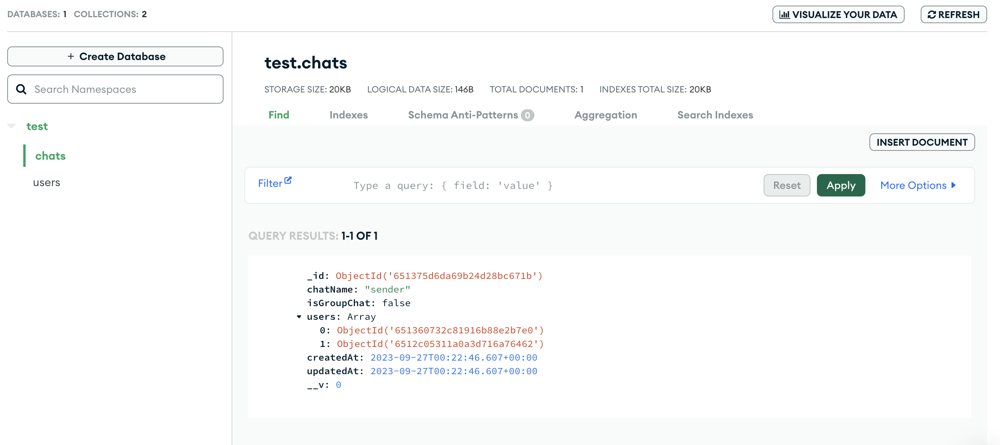

C9-C12

3.5 hrs 

now we are going to add more logics  at the backend


# 1. :moon: User Authentication

C9


## Server

```js
npm i express-async-handler
```

0-8min- user register api mainbody API

8min-generate and attach JWT token in the response to client if user created successfully

```js
npm i jsonwebtoken
```

14min- auth user login API

```js
npm i bcrypt		// for encrypt user password 
```

22min-24min error handling middleware


使用postman test signup & login API


code

---

controllers > userControllers.js

核心的业务逻辑所在

+ pattern: 边写写检查input, 与database operation结果, 并throw errors
+ 在sign up API里, JWT token is generated and attached in the response to client

```js
const asyncHandler = require("express-async-handler");
const User = require("../models/userModel");

const generateToken = require("../config/generateToken");

// do a step, then check error --------------------------------------------------------
const registerUser = asyncHandler(async (req, res) => {
  const { name, email, password, pic } = req.body;

  // ! validate input from req
  if (!name || !email || !password) {
    res.status(400);
    throw new Error("Please Enter all the Fields!");
  }

  const userExists = await User.findOne({ email }); // ! database manipulation: check if user exist
  if (userExists) {
    res.status(400);
    throw new Error("User already exists");
  }

  const user = await User.create({
    // ! Database Manipulateion: create user
    name,
    email,
    password,
    pic,
  });

  if (user) {
    // return response to client
    res.status(201).json({
      _id: user._id,
      name: user.name,
      email: user.email,
      pic: user.pic,
      token: generateToken(user._id),
    });
  } else {
    res.status(400);
    throw new Error("Failed to create the user");
  }
});

// user login authentication ------------------------------------------------------------------
const authUser = asyncHandler(async (req, res) => {
  const { email, password } = req.body;

  const user = await User.findOne({email});   // ! database manipulation

  if(user && (await user.matchPassword(password))){
    res.json({
      _id: user._id,
      name: user.name,
      email: user.email,
      pic: user.pic,
      token: generateToken(user._id),
    })
  } else {
    res.status(401);
    throw new Error("Invalid Email or Password");
  }
});

module.exports = { registerUser, authUser };

```

config > generateToken.js

```js
const jwt = require("jsonwebtoken");

const generateToken = (id) => {
  return jwt.sign({ id }, process.env.JWT_SECRET, {
    expiresIn: "30d",
  });
};

module.exports = generateToken;
```

routes > userRoute.js

+ bind controller service to API path

```js
const express = require("express");
const router = express.Router();

const { registerUser, authUser } = require("../controllers/userControllers");

router.post("/login", authUser);
router.route("/").post(registerUser);

module.exports = router;
```


database model

models > userModel.js

+ 除了 schema限定数据类型外, 还加入了一些自定义function为user model 提供额外的behaviour
  + encrypt user's password before save
  + compare user's input password with saved password in DB

```js
const mongoose = require("mongoose");
const bcrypt = require("bcrypt");

const userSchema = mongoose.Schema(
  {
    name: { type: String, required: true },
    email: { type: String, require: true, unique: true },
    password: { type: String, required: true },
    pic: {
      type: String,
      default:
        "https://icon-library.com/images/anonymous-avatar-icon/anonymous-avatar-icon-25.jpg",
    },
  },
  { timestamps: true }
);

// ! like AOP: before save, do this:  encrypt user's password
userSchema.pre("save", async function (next) {
  if (!this.isModified) {
    next();
  }

  const salt = await bcrypt.genSalt(10);
  this.password = await bcrypt.hash(this.password, salt);
});

userSchema.methods.matchPassword = async function (enteredPassword) {
  return await bcrypt.compare(enteredPassword, this.password);
};

const User = mongoose.model("User", userSchema);

module.exports = User;
```


error handling

app.js

+ 最后几个app.use() 一定是注册上error handler

```js
const express = require("express");
const { chats } = require("./data/data");
const dotenv = require("dotenv");

const connectDB = require("./config/db");
const colors = require("colors"); // coloring console.log() in terminal
const userRoutes = require("./routes/userRoutes");

const { notFound, errorHandler } = require("./middlewares/errorMiddleware");

dotenv.config();
connectDB();

const app = express();
app.use(express.json()); // !tell server to access json data

app.get("/", (req, res) => {
  res.send("API is running!");
});

app.use("/api/user", userRoutes);

app.use(notFound);
app.use(errorHandler);    // ! general error handler 

const PORT = process.env.PORT || 8080;
app.listen(
  PORT,
  console.log(`Server is listening on port ${PORT}`.yellow.bold)
);
```

Middlewares > errorMiddleware.js

```js
const notFound = (req, res, next) => {
  const error = new Error(`Not Found - ${req.originalUrl}`);
  res.status(404);
  next(error);
};

const errorHandler = (err, req, res, next) => {
  const statusCode = res.statusCode === 200 ? 500 : res.statusCode;
  res.status(statusCode);
  res.json({
    message: err.message,
    stack: process.env.NODE_ENV === "production" ? null : err.stack,
  });
};

module.exports = { notFound, errorHandler };
```


so far so good


## Client

24min-

有了server 的 sign up, login API 后, 我们先通过postman测试是通过的, 现在我们在client发送request


<span style="color: red">24-32min upload picture to `cloudinary` (it will store the pic and return a url, your MongoDB just store that url)</span>

+ set up cloudinary (make sure upload presets (chat-app) is unsigned)

32min-37min sign up handler, post sign up form data to MongoDB

37min- 40min login handler


code 

---

too many code in frontend, not show here

mainy in components > auth > SignUp.js , Login.js `submitHandler`

+ use axios to send post request to server, wrapped in try-catch block
+ 同样, 边检查user input, 边throw error (popup toast) 


:bangbang: 需要注意的是, 这里用了useHistory(), which is react router V5 feature, replaced by other hooks in V6

submitHandler 

```js
// step1: check user input

// step2: sned request
try{
  // use axios send request
  
  // after successfully get data from server, do something e.g. localStorage...
}catch (error) {
  
  // show error message to client
}
```


so far so good


# 2. Search User and Create chat APIs

C10

focus on server REST APIs


## :bangbang: Endpoint that need user logged-in state

https://www.mongodb.com/docs/manual/reference/operator/query/regex/

0-8min search all user api

+ search all users except myself -> it require authorization to identify if I am logged in! we don't want to expose this endpoint to everyone but the user who logged-in


8min- :bangbang: user login authentication 

+ use JWT token to verify a user is login ->middlewares > authMiddleware.js
+ 实现方法是, 将user login API 返回的JWT token携带到以后该user发送的request的authorization里, server会`req.headers.authorization` (authMiddleware.js)来判断user是否login
  + token type is Bearer token. postman是可以测试的 -> HTTP request的authorisation -> token type: bearer token + token content 


Attaching JWT token in FrontEnd is like:

+ in request header, we attach the JWT token

```js
const config = {
  headers: {
    Authorization: `Bearer ${user.token}`,
  },
};

const { data } = await axios.get(`/api/user?search=${search}`, config); // ! axios get: an array of users matching input

```


userRouter.js

+ 一个path可以跟多个http method

```js
const express = require("express");
const router = express.Router();

const {
  registerUser,
  authUser,
  allUsers,
} = require("../controllers/userControllers");
const { protect } = require("../middlewares/authMiddleware");

// /api/user/
router.post("/login", authUser);
router
  .route("/")
  .post(registerUser) //
  .get(protect, allUsers);      // !  protect runs before allUsers- first verify user login state (protect middleware), then search all users (as search all users require user to login)

module.exports = router;
```


:bangbang: middlewares > authMiddleware.js

+ attach the authenticated user info to request, then proceed the request to next function: `allUsers`
  + `jwt.verify()` decode the JWT token hash to a JS object (its fields depend on how you create the JWT token)


```js
const jwt = require("jsonwebtoken");
const User = require("../models/userModel.js");
const asyncHandler = require("express-async-handler");

const protect = asyncHandler(async (req, res, next) => {
  let token;

  if (
    req.headers.authorization && // jwt token here
    req.headers.authorization.startsWith("Bearer")
  ) {
    console.log(req.headers.authorization);

    try {
      // Bearer sfsafnwajejdanda
      token = req.headers.authorization.split(" ")[1]; // just take the token content
      console.log(token);

      //decodes token id
      const decoded = jwt.verify(token, process.env.JWT_SECRET);		// ! decode the token into plaintext
      console.log(decoded);
			
      // ! attach the authenticated user to request
      req.user = await User.findById(decoded.id).select("-password"); // ! return user without password from db
      console.log(req.user);

      next();
    } catch (error) {
      res.status(401);
      throw new Error("Not authorized, token failed!");
    }
  }

  if (!token) {
    res.status(401);
    throw new Error("Not authorized, no token");
  }
});

module.exports = { protect };
```

userController:

+ `allUsers` function need user to login to proceed

```js
// /api/user?search=bob    get all users -------------------------------
const allUsers = asyncHandler(async (req, res) => {
  const keyword = req.query.search
    ? {
        $or: [
          // mongoDB syntax
          { name: { $regex: req.query.search, $options: "i" } }, // case insensitive
          { email: { $regex: req.query.search, $options: "i" } },
        ],
      }
    : {};
  console.log(`keyword: ${keyword}`);

  const users = await User.find(keyword) //
                          .find({ _id: { $ne: req.user._id } }); // ! this line require user login, it return all other user except the one making the request
  res.send(users);
});
```


# 3. Chat API

C10 12min- define chat api

Previously, we are just focusing on User, Now we proceed to create our second entity related APIs - chat

chat - router, controller 

chatRouter.js

```js
const express = require("express");
const { protect } = require("../middlewares/authMiddleware");
const {accessChat} = require("../controllers/chatControllers")

const router = express.Router();

// /api/chat
router.route("/").post(protect, accessChat);
router.route("/").get(protect, fetchChat);

router.route("/group").post(protect, createGroupChat);
router.route("/rename").put(protect, renameGroup);
router.route("/groupremove").put(protect, removeFromGroup);
router.route("/groupadd").put(protect, addToGroup);

module.exports = router;
```


## Create or access a one-on-one chat with another user

12min-

in frontend, user can issue this API by clicking on the search result of other users, more in section3


```js
const asyncHandler = require("express-async-handler");
const Chat = require("../models/chatModel");
const User = require("../models/userModel")

// const accessChat = (req, res) => {
//     res.send("accessChat")
// }

// access chat of the loggedin user
const accessChat = asyncHandler(async (req, res) => {
  const { userId } = req.body;      // one-on-one chat target user
  console.log("some one is trying to acces chat!")

  if (!userId) {
    console.log("UserId param not sent with request!");
    return res.sendStatus(400);
  }

  // ! MongoDB manipulation
  let isChat = await Chat.find({
    isGroupChat: false,
    $and: [
      { users: { $elemMatch: { $eq: req.user._id } } },
      { users: { $elemMatch: { $eq: userId } } },
    ],
  })
    .populate("users", "-password")
    .populate("latestMessage");

  isChat = await User.populate(isChat, {
    path: "latestMessage.sender",
    select: "name pic email",
  });

  // after find the chat
  if (isChat.length > 0) {
    res.send(isChat[0]);

  } else {
    // ! if no existing chat found, create one
    var chatData = {
      chatName: "sender",
      isGroupChat: false,
      users: [req.user._id, userId],
    };
    //
    try {
      const createdChat = await Chat.create(chatData);

      const FullChat = await Chat.findOne({ _id: createdChat._id }).populate(
        "users",
        "-password"
      );
      res.status(200).send(FullChat);
    } catch (error) {
      res.status(400);
      throw new Error(error.message);
    }
  }
});

module.exports = { accessChat };
```


Postman test API: 

return from postman

+ "users" is populated as in the code. More flexible than SQL

```json
{
    "_id": "651375d6da69b24d28bc671b",
    "chatName": "sender",
    "isGroupChat": false,
    "users": [
        {
            "_id": "651360732c81916b88e2b7e0",
            "name": "Bob Sponge",
            "email": "BobSponge@gmail.com",
            "pic": "https://icon-library.com/images/anonymous-avatar-icon/anonymous-avatar-icon-25.jpg",
            "createdAt": "2023-09-26T22:51:31.859Z",
            "updatedAt": "2023-09-26T22:51:31.859Z",
            "__v": 0
        },
        {
            "_id": "6512c05311a0a3d716a76462",
            "name": "bob",
            "email": "bob@gmail.com",
            "pic": "http://res.cloudinary.com/douejh0qp/image/upload/v1695727698/g2o5vdqtnrbbaiklth4n.png",
            "createdAt": "2023-09-26T11:28:19.912Z",
            "updatedAt": "2023-09-26T11:28:19.912Z",
            "__v": 0
        }
    ],
    "createdAt": "2023-09-27T00:22:46.607Z",
    "updatedAt": "2023-09-27T00:22:46.607Z",
    "__v": 0
}
```

MongDB




## Fetch all chat of the logged-in user

25min-

this api will be used in frontend MyChat.js, more in section3


chatControllers.js

+ req.user is attached by `authMiddleware.js`  > protect

```js
const fetchChats = asyncHandler(async (req, res) => {
  try {
    Chat.find({ users: { $elemMatch: { $eq: req.user._id } } }) //  loop over all Chat's users attribute and find the ones that elemMatch
      .populate("users", "-password")
      .populate("groupAdmin", "-password")
      .populate("latestMessage")
      .sort({ updatedAt: -1 })
      .then(async (results) => {
        results = await User.populate(results, {
          path: "latestMessage.sender",
          select: "name pic email",
        });
        res.status(200).send(results);
      });
  } catch (error) {
    res.status(400);
    throw new Error(error.message);
  }
});
```


## Group chat

### create group chat 

30min-

integration with client is in section4


the user create the group chat will become the group chat admin

```js
const createGroupChat = asyncHandler(async (req, res) => {
  if (!req.body.users || !req.body.name) {
    return res.status(400).send({ message: "Please Fill all the fields!" });
  }

  let users = JSON.parse(req.body.users);       // ! note users in req.body is string

  if (users.length < 2) {
    return res
      .status(400)
      .send("More than 2 users are required to form a group chat!");
  }

  users.push(req.user);

  // now MongoDB manipulation -------------------------------
  try {
    const groupChat = await Chat.create({
      chatName: req.body.name,
      users: users,
      isGroupChat: true,
      groupAdmin: req.user,
    });

    const fullGroupChat = await Chat.findOne({ _id: groupChat._id })
      .populate("users", "-password")
      .populate("groupAdmin", "-password");

    res.status(200).json(fullGroupChat);
  } catch (error) {
    res.status(400);
    throw new Error(error.message);
  }
});
```


Postman test

request body for the post request

```json
{
    "name": "Test Group",
    "users": "[\"65129af14472a48d456b6984\", \"6512c05311a0a3d716a76462\"]"  // the user you want to add in group chat
}
```

postman returns

```json
{
    "_id": "651381448d3be550b354151d",
    "chatName": "Test Group",
    "isGroupChat": true,
    "users": [
        {
            "_id": "65129af14472a48d456b6984",
            "name": "XS Li",
            "email": "spoon@gmail.com",
            "pic": "https://icon-library.com/images/anonymous-avatar-icon/anonymous-avatar-icon-25.jpg",
            "createdAt": "2023-09-26T08:48:49.375Z",
            "updatedAt": "2023-09-26T08:48:49.375Z",
            "__v": 0
        },
        {
            "_id": "6512c05311a0a3d716a76462",
            "name": "bob",
            "email": "bob@gmail.com",
            "pic": "http://res.cloudinary.com/douejh0qp/image/upload/v1695727698/g2o5vdqtnrbbaiklth4n.png",
            "createdAt": "2023-09-26T11:28:19.912Z",
            "updatedAt": "2023-09-26T11:28:19.912Z",
            "__v": 0
        },
        {
            "_id": "651360732c81916b88e2b7e0",
            "name": "Bob Sponge",
            "email": "BobSponge@gmail.com",
            "pic": "https://icon-library.com/images/anonymous-avatar-icon/anonymous-avatar-icon-25.jpg",
            "createdAt": "2023-09-26T22:51:31.859Z",
            "updatedAt": "2023-09-26T22:51:31.859Z",
            "__v": 0
        }
    ],
    "groupAdmin": {
        "_id": "651360732c81916b88e2b7e0",
        "name": "Bob Sponge",
        "email": "BobSponge@gmail.com",
        "pic": "https://icon-library.com/images/anonymous-avatar-icon/anonymous-avatar-icon-25.jpg",
        "createdAt": "2023-09-26T22:51:31.859Z",
        "updatedAt": "2023-09-26T22:51:31.859Z",
        "__v": 0
    },
    "createdAt": "2023-09-27T01:11:32.055Z",
    "updatedAt": "2023-09-27T01:11:32.055Z",
    "__v": 0
}
```


### rename group chat

36min-

```js
const renameGroup = asyncHandler(async (req, res) => {
  const { chatId, chatName } = req.body;


  const updatedChat = await Chat.findByIdAndUpdate( //! DB manipulation
    chatId,
    {
      chatName: chatName,
    },
    {
      new: true, // return updated value
    }
  )
    .populate("users", "-password")
    .populate("groupAdmin", "-password");

  if (!updatedChat) {
    res.status(404);
    throw new Error("Chat Not Found!");
  } else {
    res.json(updatedChat);
  }
});
```


### Add / remove a user in group chat

39min-

```js
const addToGroup = asyncHandler(async (req, res) => {
  const { chatId, userId } = req.body;

  const added = await Chat.findByIdAndUpdate(
    chatId,
    {
      $push: { users: userId },
    },
    { new: true }
  )
    .populate("users", "-password")
    .populate("groupAdmin", "-password");

  if (!added) {
    res.status(404);
    throw new Error("Chat Not Found!");
  } else {
    res.json(added);
  }
});

const removeFromGroup = asyncHandler(async (req, res) => {
    const { chatId, userId } = req.body;
  
    const removed = await Chat.findByIdAndUpdate(
      chatId,
      {
        $pull: { users: userId },
      },
      { new: true }
    )
      .populate("users", "-password")
      .populate("groupAdmin", "-password");
  
    if (!removed) {
      res.status(404);
      throw new Error("Chat Not Found!");
    } else {
      res.json(removed);
    }
  });

```


so far so good!


# 4. Build Chat Page UI

C11

client side coding, integrate  server API in last  class

login as guest


## :bangbang: App-wide context 

0min-

make logged in user's info and related info app-wide availble, this includes:

+ logged-in user's info
+ all chats that the logged-in user get involved in
+ which chat the logged-in user seleced


creating context

+ make user's logged in state app-width available
  + useEffect(): fetch user info from local storage and set to a app-wide state

```js
import { createContext, useContext, useState, useEffect } from "react";
import { useHistory } from "react-router-dom";

const ChatContext = createContext({ user: null, setUser: () => {} });

// user logged in state should be app-wide available
const ChatProvider = ({ children }) => {
  const [user, setUser] = useState();   // logged in user
  const [selectedChat, setSelectedChat] = useState();   // the current chat user selected
  const [chats, setChats] = useState([]);   // all chats that logged in user get involved 

  const history = useHistory();

  // ! note since ChatProvider is wrapper around <App/>, the call back in useEffect() will firstly run as npm start
  // ! but shouldn't that have a circular dependency? 
  useEffect(() => {
    const userInfo = JSON.parse(localStorage.getItem("userInfo")); // ! note JSON parse string to object, localStorage has been set after user login 
    setUser(userInfo);

    if (!userInfo) {
      console.log("in chat provider, no user is logged in!")
      // history.push("/");  // ! go back to home page if no user is loggedin  ! circular dependency? which useEffect run first? this one or the one in HomePage.js
    }
  }, [history]);

  return (
    // bound context(state + setState) to context provider
    <ChatContext.Provider value={{ user, setUser, selectedChat, setSelectedChat, chats, setChats }}>
      {children}
    </ChatContext.Provider>
  );
};

// just make context app-wide available
export const ChatState = () => {
  return useContext(ChatContext);
};

export default ChatProvider;
```


index.js

+ remember to wrap app with context provider

```js
import React from "react";
import ReactDOM from "react-dom/client";
import "./index.css";
import App from "./App";
import { ChakraProvider } from "@chakra-ui/react";
import { BrowserRouter } from "react-router-dom";
import ChatProvider from "./Context/ChatProvider";

const root = ReactDOM.createRoot(document.getElementById("root"));
root.render(
  <ChatProvider>
    <BrowserRouter>
      <ChakraProvider>
        <App />
      </ChakraProvider>
    </BrowserRouter>
  </ChatProvider>
);

```


HomePage.js

+ add a useEffect() to keep user login state

```js
  const history = useHistory();

  useEffect(() => { // check local storage, keep user login state
    const user = JSON.parse(localStorage.getItem("userInfo"));
    if (user) history.push("/chats");
  }, [history]);
```


## Chat page 

6min - 59min

too many codes, not show here, just mention some keypoints

感觉他code写的并不是非常elegant, 以及可读


### General layout

6min-11min

General layout and components

+ <span style="color: yellow">SideDrawer.js</span> (本节写)

  Header bar on the top of the screen

  1. A search button on top left

     + allow user to type user name to search for other users

       + ```js
         const { data } = await axios.get(`/api/user?search=${search}`, config);
         ```

     + allow user to create a one-on-one chat with a specified user by click on the search result

       + ```js
          const { data } = await axios.post("api/chat", { userId }, config);
         ```

  2.  A profile button on top right
     + Menu
       + ProfileModal.js
       + Logout 

+ <span style="color: yellow">MyChats.js</span> (本节写)

  + a list of chats that the logged in user get involved in (fetched in useEffect())

    + ```js
      const { data } = await axios.get("/api/chat", config);
      ```

+ <span style="color: yellow">ChatBox.js</span> (下节写)

  + chat window for messaging


### SideDrawer 

the tool bar on top of the screen

11min-


**Top right menu**

---

+ profile modal

+ logout 


**Search user **

---

29min-44min

on top left 


**Fetch chat data with other user**

---

42-45min

+ added some new states in Chat Context

+ logged-in user create a one-on-one chat with another user by clicking on search result 


### MyChats

45min-60min

MyChats

+ fetch all chats that the logged in user get involved in, and render them in a list


so far so good


# 5. Group chat - CRUD user

C12

client side coding

还是integrate section2中API [section 2](#2-search-user-and-create-chat-apis)


too many code,  just show key points and watch for server-client communication


## Create group chat

0-24min

+ <span style="color: yellow">GroupChatModal.js</span>

  + input group chat name

  + input users to add

    + search user & render searched results

      ```js
      const config = {
        headers: {
          Authorization: `Bearer ${user.token}`,
        },
      };
      const { data } = await axios.get(`/api/user/?search=${search}`, config); // ! axios get
      ```

    + click on search results to add a user to selectedUsers

  + submit create group chat form 20min-24min

    ```js
    const config = {
      headers: {
        Authorization: `Bearer ${user.token}`,
      },
    };
    
    const { data } = await axios.post(        // ! axios post
    `/api/chat/group`,
    {
      name: groupChatName,
      users: JSON.stringify(selectedUsers.map((u) => u._id)),       
    },
    config
    );
    ```

    


## ChatBox

24min-

<span style="color: yellow">ChatBox.js</span>. 右半边那个窗口

+ Component communication - state lifting: MyChats.js - ChatBox.js

  + User interact with ChatBox.js, but change also propogate to MyChats.js

  ```js
  import React, { useEffect, useState } from "react";
  import axios from "axios";
  import { Box } from "@chakra-ui/react";
  
  import { ChatState } from "../Context/ChatProvider";
  import SideDrawer from "../Components/miscellaneous/SideDrawer";
  import MyChats from "../Components/Chat/MyChats";
  import ChatBox from "../Components/Chat/ChatBox";
  
  const ChatPage = () => {
    const { user } = ChatState(); // ! get app-wide context: user logged in state
    const [fetchAgain, setFetchAgain] = useState(false);
  
  
    return (
      <div style={{ width: "100%" }}>
        {user && <SideDrawer />}
  
        <Box
          display="flex"
          justifyContent="space-between"
          w="100%"
          h="91.5vh"
          padding="10px"
        >
          {/* state lifting */}
          {user && <MyChats fetchAgain={fetchAgain}/>}
          {/* state lifiting, as user input in ChatBox, influence MyChats */}
          {user && <ChatBox fetchAgain={fetchAgain} setFetchAgain={setFetchAgain} />} 
        </Box>
      </div>
    );
  };
  
  export default ChatPage;
  ```

  

+ <span style="color: yellow">SingleChat.js</span>

  + basic frames 24 - 37min
    + conditional rendering based on state `selectedChat`
  + <span style="color: yellow">UpdateGroupChatModal.js</span> 
    + Modal UI buildup 37min-45min
      + Chakra UI的Modal基本都是一个button + 一个 modal component
    + Modal functionality (use server api) 45min-
      + update group chat name
      + Add new user to group chat 49min-52min
      + user leave the group chat 52min-54min
      + admin user can choose to kick other user out 52-54min


so far so good!