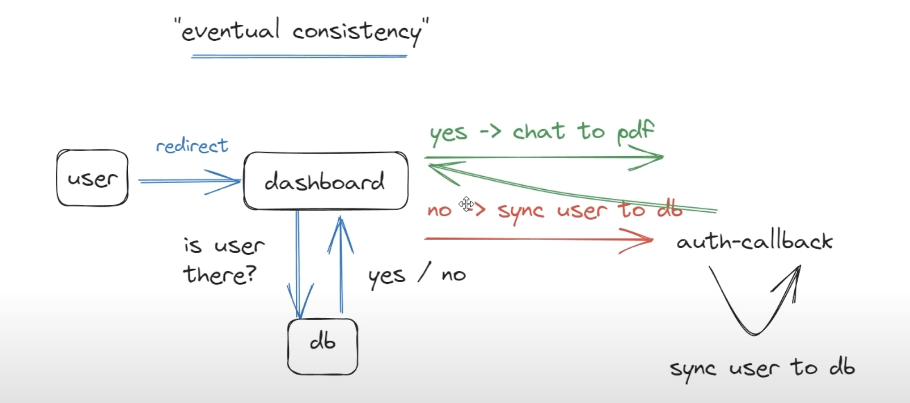

Resource:

https://www.youtube.com/watch?v=ucX2zXAZ1I0&t=509s

 [https://github.com/joschan21/quill](https://www.youtube.com/redirect?event=video_description&redir_token=QUFFLUhqazBVdkR3MHFabFVSZ1dITDhreFJJeFlIUGE2Z3xBQ3Jtc0tsSWM5SUsxSUdaNnVTSnVlMWYxX0hJVktLLXZra214cTl5ZWxIUVpXMW1NN1JuSVpyYWllSE84RnhYdnBfWjFQU05nZkQ3eVlKVmVHZU5DTEtGdGVON0s1VV9hbU9MOS1JM3ptMHR3WnFCOVhfNnNmRQ&q=https%3A%2F%2Fgithub.com%2Fjoschan21%2Fquill&v=ucX2zXAZ1I0)


11hrs tut

this is just notes, code is in another repo

snapshots of repo is created on different branches. 这样做有很多好处

+ 易于创建repo在不同阶段的snapshot, 并且直接将snapshot关联到笔记中, 不需要在笔记中粘贴大段代码
+ 利用repo snapshot, 可以在不同的阶段进行调试与修改
+ 开发历程更加明确, 回头复习看会更加明晰


features

+ payment & susbscription
+ PDF uploader & viewer
  + intuitive drag & drop upload
+ use ui lib 'shadcn-ui'
+ LangChain for AI memory
+ modern data fetching using tRPC & Zod
+ Prisma as our ORM


THe Saas building process overview

Landing Page & Navigation -> Auth -> Functionality -> Payment & Launch


# Key takeaways


Next,js

+ file system based routing - 
  + "_trpc" under app folder the underscore would tell next don't treat this directory as a route
  + "[dynamic_route]" 


tailwind css

+ 可以使用globals.css与tailwind.config.ts 来为tailwind添加(或修改)自定义的utility class

+ className中, 除了tailwind的默认utility class, 还可以使用自定义的value, e.g. mt-[16]


Ui lib

+ 除了直接使用ui lib的组建, 还可以使用ui lib提供的tailwind className来为组件添加styling e.g. [shadcn: button](https://github.com/Additivemenu/nextjs-quill/blob/448b932c853c8522cb3b73583211a5541f19eebb/src/components/ui/button.tsx#L7-L35C2)


# 1. Creating landing page

snapshot: https://github.com/Additivemenu/nextjs-quill/tree/01-init-globalcss-tailwindcss-setup


## Dummy landing page

10min-24min


:gem: [MaxWidthWrapper.tsx](https://github.com/Additivemenu/nextjs-quill/blob/01-init-globalcss-tailwindcss-setup/src/components/MaxWidthWrapper.tsx)

+ a wrapper component 


```ts
npm i clsx tailwind-merge
```

:gem: [src/lib/utils.ts](https://github.com/Additivemenu/nextjs-quill/blob/01-init-globalcss-tailwindcss-setup/src/lib/utils.ts)

+ use `clsx` and `tailwind-merge` for styling cascading


[pages](https://github.com/Additivemenu/nextjs-quill/blob/01-init-globalcss-tailwindcss-setup/src/app/page.tsx) & [layout](https://github.com/Additivemenu/nextjs-quill/blob/01-init-globalcss-tailwindcss-setup/src/app/layout.tsx) for init dummy landing page

+ watch for how to do styling cascading in these components: [code piece](https://github.com/Additivemenu/nextjs-quill/blob/a11740b5a3124042842a63908ff768a969b83c3a/src/app/layout.tsx#L21-L24)


## styling config


24min-35min

use shadcn's theme (blue I chosen https://ui.shadcn.com/themes) config for global.css

:gem: [global.css](https://github.com/Additivemenu/nextjs-quill/blob/01-init-globalcss-tailwindcss-setup/src/app/globals.css)


Tailwind config 

+ link the css variables we just defined in global.css with tailwind

```ts
// we will use below dependency as plugin in tailwind config 
npm i tailwindcss-animate @tailwindcss/typography
```

:gem: [tailwind.config.ts](https://github.com/Additivemenu/nextjs-quill/blob/01-init-globalcss-tailwindcss-setup/tailwind.config.ts)


# 2. Making landing page look awesome

35min- 1h11min

snapshot: https://github.com/Additivemenu/nextjs-quill/tree/02-making-landing-page-look-awesome

+ 这块主要关注tailwind css的使用, 其他没啥好说的, 大部分都是基础的静态页面写法


add button from a ui lib

---

35-45min

```ts
// for icon
npm i lucide-react
```

we continue to use shadcn as ui lib

https://ui.shadcn.com/docs/components/button

+ just follow CLI to install and use their button

```shell
(base) ➜  nextjs-quill git:(02-making-landing-page-look-awesome) ✗ npx shadcn-ui@latest add button
Need to install the following packages:
shadcn-ui@0.4.1
Ok to proceed? (y) y
Configuration is missing. Please run init to create a components.json file.
(base) ➜  nextjs-quill git:(02-making-landing-page-look-awesome) ✗ npx shadcn-ui@latest init      
```


:gem: [button code piece](https://github.com/Additivemenu/nextjs-quill/blob/62ee99f547ae95964bed2a87e9db4901c6131d94/src/app/page.tsx#L26-L36)

+ note here we use the [tailwind  className styling](https://github.com/Additivemenu/nextjs-quill/blob/62ee99f547ae95964bed2a87e9db4901c6131d94/src/components/ui/button.tsx#L8-L35) defined by the ui lib out of the box, to style the Link as a button 


add color gradient styling for home page

---

45min-52min

有点秀, 高级的css做视觉效果

:gem: [visual effect code piece](https://github.com/Additivemenu/nextjs-quill/blob/62ee99f547ae95964bed2a87e9db4901c6131d94/src/app/page.tsx#L42-L54)


add PDF preview img

---

52-58min

:gem: [product preview img code piece](https://github.com/Additivemenu/nextjs-quill/blob/62ee99f547ae95964bed2a87e9db4901c6131d94/src/app/page.tsx#L56-L72)


feature section

---

58min- 1h10min

just chunks of text and Link & add uploading pdf preview img at the bottom of home page

+ 没啥技术含量, 主要是tailwind css

:gem: [code pieces](https://github.com/Additivemenu/nextjs-quill/blob/448b932c853c8522cb3b73583211a5541f19eebb/src/app/page.tsx#L90-L164)


grainy effect

---

1h10min-1h11min

高级的css视觉颗粒纹理效果, 看起来有宣纸的质感

:gem: [grainy effect css](https://github.com/Additivemenu/nextjs-quill/blob/448b932c853c8522cb3b73583211a5541f19eebb/src/app/globals.css#L78-L81)


# 3. Adding navbar

1h11min-1h20min

snapshot: https://github.com/Additivemenu/nextjs-quill/tree/03-adding-navbar

up here


:gem: [navbar code piece](https://github.com/Additivemenu/nextjs-quill/blob/03-adding-navbar/src/components/Navbar.tsx)

+ use it in [root layout](https://github.com/Additivemenu/nextjs-quill/blob/4ff3cea991d7e9b36706eee9bb4ab7811e6b3549/src/app/layout.tsx#L27C7-L27C18) as multiple pages would share it

+ note here we use `kinde-oss` [LoginLink & RegisterLink](https://github.com/Additivemenu/nextjs-quill/blob/4ff3cea991d7e9b36706eee9bb4ab7811e6b3549/src/components/Navbar.tsx#L29-L44) for quick authentication setup

  + https://kinde.com/   authentication provider, we will use it in section4

  + ```ts
     npm i @kinde-oss/kinde-auth-nextjs
    ```

+ 再次体会使用ui lib定义好的tailwind className来为组件直接添加styling [styling Link as Button](https://github.com/Additivemenu/nextjs-quill/blob/4ff3cea991d7e9b36706eee9bb4ab7811e6b3549/src/components/Navbar.tsx#L30-L33)


# 4. Adding Authentication

1h21min-1h28min

https://github.com/Additivemenu/nextjs-quill/tree/04-adding-authentication


just follow instructions when setting your kinde business,  

+ kinde不仅可以做Next.js app的auth, 还可以做react, express ...的auth


.env setup

+ 定义好一些URL的环境变量与kinde的secret

```ts
KINDE_CLIENT_ID=...
KINDE_CLIENT_SECRET=...
KINDE_ISSUER_URL=https://nextquillshawn.kinde.com
KINDE_SITE_URL=http://localhost:3000
KINDE_POST_LOGOUT_REDIRECT_URL=http://localhost:3000
KINDE_POST_LOGIN_REDIRECT_URL=http://localhost:3000/dashboard
```


[kinde handle auth setup](https://github.com/Additivemenu/nextjs-quill/commit/37c014836fc1f0abf216ef048fbf5e94e1a26939#diff-2b1de504463c1dbf2fa0b12fb13400c339ef21e10a2aa4a08f42765574e1ddb5)

+ 将kinde auth 接入我们的app


[LoginLink & RegisterLink](https://github.com/Additivemenu/nextjs-quill/blob/4ff3cea991d7e9b36706eee9bb4ab7811e6b3549/src/components/Navbar.tsx#L29-L44)

+ use kinde auth component out of the box
  + when click on the LoginLink or RegisterLink, user will be directed to a page for login or signup, the data is hosted by kinde


这都可以, 有点秀, 做authentication的话直接一步到位


# 5. Dashboard

~2hrs

https://github.com/Additivemenu/nextjs-quill/tree/05-creating-dashboard


## Creating dashboard

1h28min-1h42min no code, just explaining for what we will do in this section

user login flow:

+ when first time login, user is redirect to dashboard page, there user is checked if their user info are in the database, if not sync user to database
  + we will implement the sync in auth-callback [dashboard init pages](https://github.com/Additivemenu/nextjs-quill/blob/902b9e40bfd9ef90683f1a553cfa4fd9c132e1fd/src/app/dashboard/page.tsx#L9)




### tRPC 

tRPC explaining  

1h42min-1h46min

:pencil: [tRPC](./sub_topics/tRPC.md)

+ tRPC mainly aims for type safety across frontend and backend


tRPC setup

1h46min-2h06min

https://trpc.io/docs/client/nextjs/setup


key setup steps

```ts
get trpc instance
define trpc routes
wireup trpc to app/api
```


route handlers for wiring up tRPC router with api

https://trpc.io/docs/server/adapters/nextjs#route-handlers


### create database

2h06min-2h24min

use prisma 

:pencil: [prisma](./sub_topics/prisma.md)


## Perfecting dashboard

2h24min-3h12min


let user delete file

3h12min-3h26min


dynamic fetching in Next.js

3h26min-3h30min


# Product page

3h30min-

~3hrs


PDF uploader


# Messaging


5h58min-


~3hrs


# Pricing page

~1hrs


Susbscription management page


# 最终杂项

~1hrs