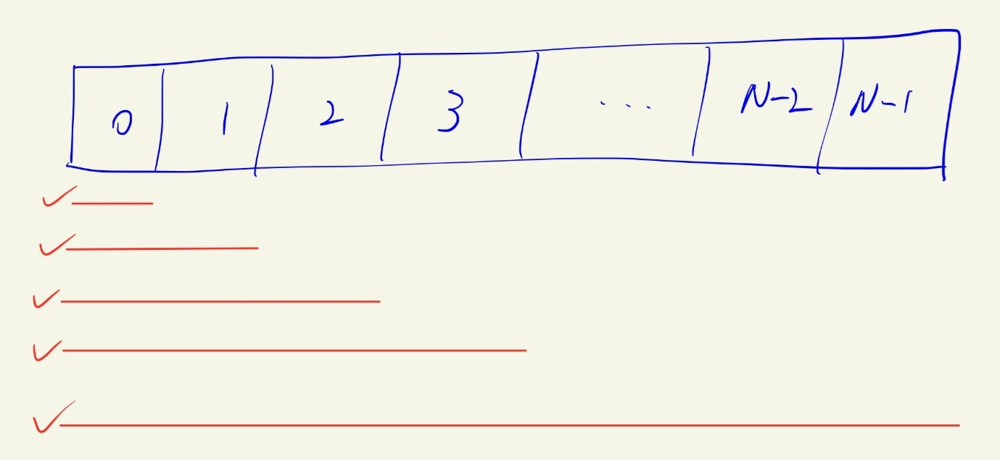
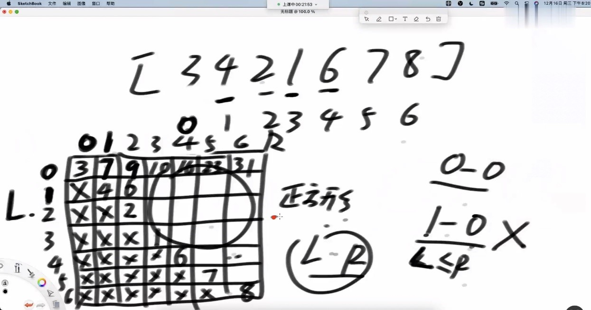
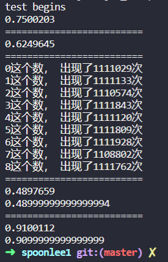
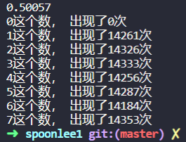

# 学习资源
[左神教程](https://www.bilibili.com/video/BV13Y411w7aU?spm_id_from=333.999.0.0&vd_source=c6866d088ad067762877e4b6b23ab9df)

[左参考代码](https://github.com/algorithmzuo/algorithm-primary)

先看这个(因为这个会带着你写代码), 再看数据结构之美(总结向，比较理论), 同时拿<<数据结构与算法分析Java>>作为工具书做更深入了解
# 新手班 P3-63
## Class1 简单排序
### 位运算

### 算法介绍

### P7 选择排序
把一个数组按从小到大的顺序重新排序
>算法思想
>+ 在[0, N-1]的下标范围内找到最小的数，和下标为0的数交换;
>+ 接着在排除下标为0的元素后，剩下的N-1个元素作为新数组，继续前面的步骤;

算法的图形化理解:

[Code: SelectionSorting](class1/Code07_SelectionSorting.java)
>+ 对数组做处理(检索，各种增删改操作)，肯定是围绕index做文章;
>+ 注意在两个for loop嵌套时，如何定义i, j (或者你可以用start, end来命名左右边界的index)来控制处理数组的左右边界;
>+ 写算法时, 记得先想boundary conditions;

### P8 冒泡排序
把一个数组按元素从小到大重新排序
>算法思想
>+ 从前往后，数组每两个元素(如1和2, 2和3, 3和4…)进行比较，大的那个数放到后面， 最后数组的最后一位一定是最大的那个
>+ 排除掉最后一个元素，剩下的前N-1个元素为新数组，继续前一步

算法的图形化理解
如RNA转录一般

[Code: bubbleSorting](class1/Code08_bubbleSort.java)
>只需要关注bubbleSort即可, 其他和上面排序算法一样
>+ 注意在两个for loop嵌套时，如何定义i, j (或者你可以用start, end来命名左右边界的index)来控制处理数组的左右边界

问: 拿到一个算法题, 如何想出最优解?
左答: 这是一个哲学问题.

### P9 插入排序
>算法思想
>+	从左往右, 实现0~0号元素从小到大, 接着实现0~1号元素从小到大, 接着0~2号…最后实现0~(N-1)号元素从小到大, 即在数组长度上逐步实现排序
>+	在以上的每次循环中, 相当于每次考虑一个新的元素来排序. 设这个新元素的index为i, 则从位置为i的slot上向左依次比较, 小的在左边，大的在右边, 直到比较到位置为0的slot上.

算法图形化理解
像吃东西似的, 一点一点消化…

[Code: insertSorting](class1/Code09_insertSort.java)
>只需要关注insertSort即可, 其他和上面排序算法一样
>+	insertSort最内层用while loop(这里老师用的)或者for loop都可以

### P10 优化插入排序
其实就是insertSorting中我写的for loop, 老师上面讲的用while loop

### P11 答疑
Github的代码
插入排序比选择,冒泡排序算法要好

各种班介绍
-入门班
-基础班
-进阶班
-体系学习班
-大厂刷题班

“你以为google很难吗?”--左程云
“如果你想在35岁后不落后, 算法是唯一能救你的” –左程云

## Class2 随机
### P12 什么叫数据结构
>含义
>+ 数据结构是存储，组织数据的方式
>+ 精心选择的数据结构可以带来更高的运行或者存储效率
>+ 数据结构是很多算法得以进行的载体

>数据结构分类
>+	连续结构: 占用内存里连续的空间, 寻址很快, 如数组. 便于寻址(因为容易计算偏移量)但不便于增删数据, 因为增减数据会导致数据不连续, 需要额外的操作来使得数据连续
>+	跳转结构: 占用内存里不连续的空间, 如链表(一个节点还包含下一个节点的地址), 二叉树(一个节点还包含其两个子节点的地址), 图(一个节点包含多个节点的地址).  便于增删数据（因为本来数据就不连续）但不便于寻址(因为无法计算偏移量, 只能一个接一个地跳转)
>+	连续结构+跳转结构:

### P13 最基本的数据结构
有一个数组arr，长度为n, 现有极大的业务需求(e.g.要求每秒能达到几千万此)对该数组的第i到第j个元素求和, 如何实现? 
+	如何只是for loop 遍历从第i到第j个元素, 效率很低. 肯定有很多需求是重复的, 那么我们直接建立一个经验表直接索引即可.
+	二维表.  创建一个n*n大小的二维表table, 如下: 行数代表i, 列数代表j. 比如table(0, 3) = 10代表求第0到第3个元素的累加和为10

+	一维表. 使用类似cumulative probability function的思想, 创建一个新的与原数组等长的数组new_arr，该数组第i个元素的值等于原数组第0个元素到第i个元素的累加和. 
	+ Arr的第i到第j个元素累加和 = new_arr[ j ] – new_arr[ i-1 ]; boundary condition: 如果I = 0, 就直接 = new_arr[ j ]
+	可见二维表费空间但是时间上快(只有索引), 而一维表费时间(因为除了索引, 还得运算)但是空间上节省

### P14 Java中的math.random()函数
Math.random()函数:
Return一个落在[0,1)上的数, 散落概率均布在[0,1);即probability density function f = x, x属于[0,1)

[code: mathRandom_Demo](class2/mathRandom_test.java)

其中5个test:
Test 4 和test 5相当于roll dice问题, roll一次只有两种结果, return值落在[0,x) （即中了）, 或落在[x,1)（即没中）,
Roll两次那就有4种事件: {1,2都中}, {1,2都不中},{1中,2不中}, {1不中, 2中}
取两次roll的max来看是否落在[0,x)， 等效于上面的{1,2都中}事件
取两次roll的min来看是否落在[x,1), 等效于上面的{1,2都不中}

### P15 从1到5随机到1-7随机
题目: 现有一个函数可以做到等概率返回1，2，3，4，5. 如何仅利用它(不能修改函数)做到等概率返回1,2,3,4,5,6,7呢?
>核心思想:
>还是通过调用条件函数(题目给定的工具函数)来构造等概率事件(比如多次调用条件函数) ;其实本质还是概率论里的roll dice问题
>>+ 方法:先把1-5随机转化为0,1发生器(1,2返回0， 4,5 返回1，是3弃掉重新做 ),再通过二进制表示法转化0-7随机, 再放弃0; 
>>+ 方法一般化: 从a-b随机到c-d随机都可以通过这种方法做到

[Code:Random_1to5Conversion](class2/Random_1to5conversion.java)

### P16 01不等概率随机到01等概率随机
题目: f函数以p概率返回0, 以1-p概率返回1； 如果仅利用p函数等概率返回0或1?
> 核心思想: 
> 还是通过调用条件函数(题目给定的工具函数)来构造等概率事件(比如多次调用条件函数), 再做标记(返回0或1); 其实本质还是概率论里的roll dice问题

[Code: 01UnevenTo01Even](class2/Random_01unevenTo01even.java)

### P17 对数器的使用
对数器用来调Bug
生成随机样本, 面对具体的数据来调试, 方便自己做对比调bug; 后续的课程里会用到此技巧
[Code: 计数器eg](class2/Code03_Comp.java)

Q&A: 按引用传递, 按值传递
Java 基础: 为什么不直接写arr2=arr1来copy呢?
-因为这样写, arr2其实指向的是和arr1同样指向的内存区域, 只有你重新再开辟一块内存区域让arr2指向它才算copy

## Class3 二分法
### P18 有序数组中找到num
[Code: BSExist](class3/Code01_BSExist.java)
用对数器来校对二分法与暴力遍历的结果是否一致
### P19 有序数组中找到>=num的最左位置
[1,2,2,2,3,4,5,6,7] 返回>=4最左的位置, 即返回4的下标5
一直二分直到把数组耗尽, 最晚抓到的中点(从右往左逼近, 因为所求为>=4最左)值即为所求
[code:BSNearLeft](class3/Code02_BSNearLeft.java)
同理, 有序数组中找到<=num的最右位置
只需修改代码中的二分法查找和暴力遍历部分即可
[code:BSNearRight](class3/Code02_BSNearRight.java)
### P20 局部最小值
###
###

## Class4 链表

## Class5 位图

## Class6 二叉树

## Class7

## Class8

# 体系学习班 P62-150

# 代表性题目 P155-199