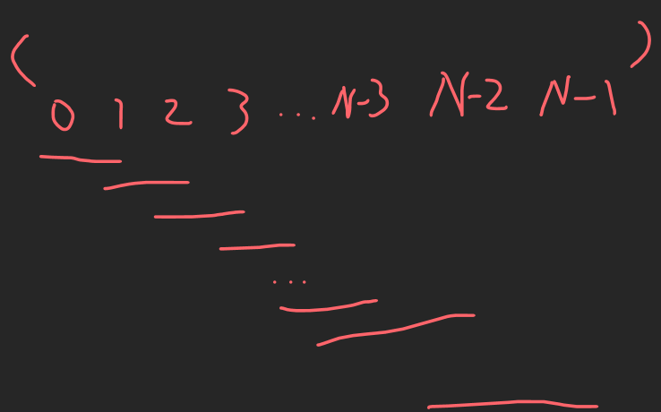
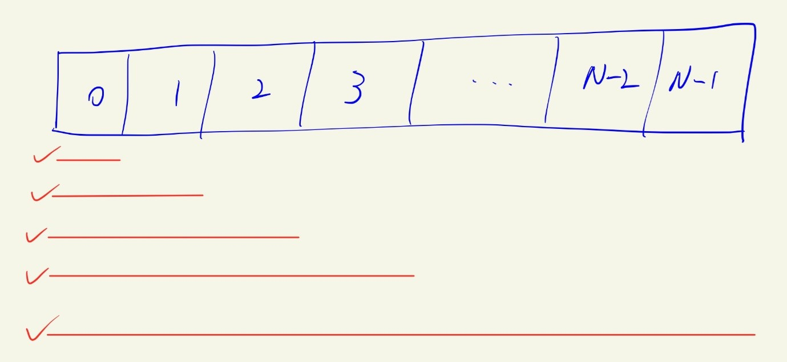

# 学习资源
[左神教程](https://www.bilibili.com/video/BV13Y411w7aU?spm_id_from=333.999.0.0&vd_source=c6866d088ad067762877e4b6b23ab9df)

[左参考代码](https://github.com/algorithmzuo/algorithm-primary)

先看这个(因为这个会带着你写代码), 再看数据结构之美(总结向，比较理论), 同时拿<<数据结构与算法分析Java>>作为工具书做更深入了解
# 新手班 P3-63
## Class1 简单排序
### 位运算

### 算法介绍

### P7 选择排序
把一个数组按从小到大的顺序重新排序
>算法思想
>+ 在[0, N-1]的下标范围内找到最小的数，和下标为0的数交换;
>+ 接着在排除下标为0的元素后，剩下的N-1个元素作为新数组，继续前面的步骤;

算法的图形化理解:

[Code: SelectionSorting](class1/Code07_SelectionSorting.java)
>+ 对数组做处理(检索，各种增删改操作)，肯定是围绕index做文章;
>+ 注意在两个for loop嵌套时，如何定义i, j (或者你可以用start, end来命名左右边界的index)来控制处理数组的左右边界;
>+ 写算法时, 记得先想boundary conditions;

### P8 冒泡排序
把一个数组按元素从小到大重新排序
>算法思想
>+ 从前往后，数组每两个元素(如1和2, 2和3, 3和4…)进行比较，大的那个数放到后面， 最后数组的最后一位一定是最大的那个
>+ 排除掉最后一个元素，剩下的前N-1个元素为新数组，继续前一步

算法的图形化理解
如RNA转录一般

[Code: bubbleSorting](class1/Code08_bubbleSort.java)
>只需要关注bubbleSort即可, 其他和上面排序算法一样
>+ 注意在两个for loop嵌套时，如何定义i, j (或者你可以用start, end来命名左右边界的index)来控制处理数组的左右边界

问: 拿到一个算法题, 如何想出最优解?
左答: 这是一个哲学问题.

### P9 插入排序
>算法思想
>+	从左往右, 实现0~0号元素从小到大, 接着实现0~1号元素从小到大, 接着0~2号…最后实现0~(N-1)号元素从小到大, 即在数组长度上逐步实现排序
>+	在以上的每次循环中, 相当于每次考虑一个新的元素来排序. 设这个新元素的index为i, 则从位置为i的slot上向左依次比较, 小的在左边，大的在右边, 直到比较到位置为0的slot上.

算法图形化理解
像吃东西似的, 一点一点消化…

[Code: insertSorting](class1/Code09_insertSort.java)
>只需要关注insertSort即可, 其他和上面排序算法一样
>+	insertSort最内层用while loop(这里老师用的)或者for loop都可以

### P10 优化插入排序
其实就是insertSorting中我写的for loop, 老师上面讲的用while loop

### P11 答疑
Github的代码
插入排序比选择,冒泡排序算法要好

各种班介绍
-入门班
-基础班
-进阶班
-体系学习班
-大厂刷题班

“你以为google很难吗?”--左程云
“如果你想在35岁后不落后, 算法是唯一能救你的” –左程云

## Class2 随机

## Class3 二分法

## Class4 

## Class5

## Class6

## Class7

## Class8

# 体系学习班 P62-150

# 代表性题目 P155-199