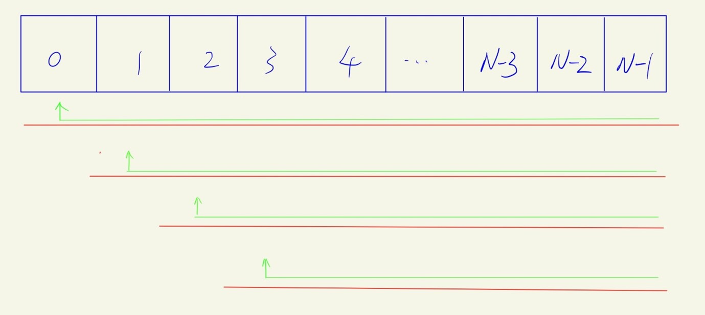

# 学习资源
[左神教程](https://www.bilibili.com/video/BV13Y411w7aU?spm_id_from=333.999.0.0&vd_source=c6866d088ad067762877e4b6b23ab9df)

[左参考代码](https://github.com/algorithmzuo/algorithm-primary)

先看这个(因为这个会带着你写代码), 再看数据结构之美(总结向，比较理论), 同时拿<<数据结构与算法分析Java>>作为工具书做更深入了解
# 新手班 P3-63
## Class1 简单排序
### 位运算

### 算法介绍

### P7 选择排序
把一个数组按从小到大的顺序重新排序
>算法思想
>+ 在[0, N-1]的下标范围内找到最小的数，和下标为0的数交换;
>+ 接着在排除下标为0的元素后，剩下的N-1个元素作为新数组，继续前面的步骤;

算法的图形化理解:

[选择排序](class1/Code07_SelectionSorting.java)
>+ 对数组做处理(检索，各种增删改操作)，肯定是围绕index做文章;
>+ 注意在两个for loop嵌套时，如何定义i, j (或者你可以用start, end来命名左右边界的index)来控制处理数组的左右边界;
>+ 写算法时, 记得先想boundary conditions;

### P8 冒泡排序

### P9 插入排序

### P10 优化插入排序

### P11 答疑

## Class2 随机

## Class3 二分法

## Class4 

## Class5

## Class6

## Class7

## Class8

# 体系学习班 P62-150

# 代表性题目 P155-199