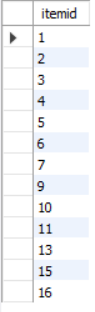
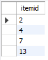
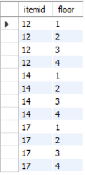
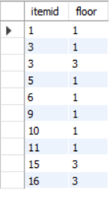
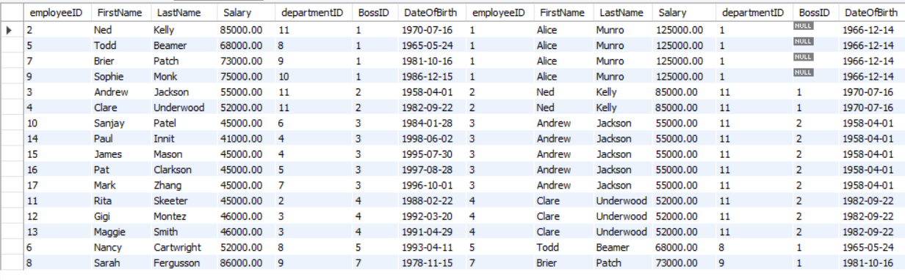
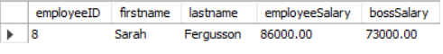
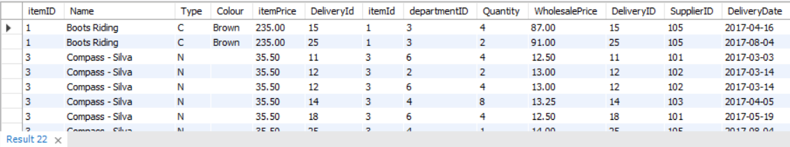
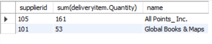
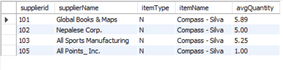
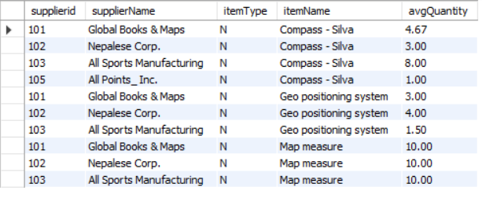

全部是practice

# e.g.1 

Type the query to list the id and name of all green items of type C

```sql
select itemid, name
From item
Where type = 'C' AND colour = 'Green';
```

# e.g.2

Type the query to find the items delivered by at least 2 suppliers (very similar to Having clause e.g.1 in week6)

```sql
Select item.name, count(distinct delivery.supplierid)
From item inner join deliveryitem inner join delivery
On item.itemid = deliveryitem.itemid AND deliveryitem.DeliveryId = delivery.DeliveryID
Group by item.itemid
Having count(distinct delivery.supplierid) >=2;
```

# e.g.3

Find the name of the highest-paid employee in the Marketing department

```sql
Select employee.firstname, employee.lastname, employee.salary
From employee inner join department
On employee.departmentid = department.departmentid
Where department.name = 'Marketing'
Order by employee.salary Desc
Limit 1;
```

# e.g.4

Find the supplier id and supplier name that do not deliver compasses

```sql
Select supplier.SupplierID, supplier.name
From supplier
Where supplier.supplierid NOT In (
		select delivery.supplierid
		From item inner join deliveryitem inner join delivery 
		On item.itemid = deliveryitem.itemid AND deliveryitem.deliveryId = delivery.deliveryID 
		Where item.name Like 'compass%'
);
```

# e.g.5

Find, for each department that has sold items of type E. List the department name and the average salary of the employees.

```sql
Select department.name, Format(avg(employee.salary),2) AS average_salary
From department inner join employee
On department.departmentid = employee.departmentid
Where department.departmentid IN (
		Select sale.departmentid 
		From item inner join saleitem inner join sale
		On item.itemid = saleitem.itemid AND saleitem.saleid = sale.saleid
		Where item.type = 'E'
		)
Group by department.name;
```

# e.g.6

Find the total number of items (list the item and sale quantity) of type E sold by the departments on the second floor

```sql
select item.name, sum(saleitem.Quantity) AS total_quantity
From item inner join saleitem inner join sale inner join department
On item.itemid = saleitem.itemId AND saleitem.SaleId = sale.SaleID AND  sale.departmentID = department.departmentID
Where department.floor = 2 AND item.type = 'E'
Group by item.name;
```

# e.g.7

Type the query to find the total quantity sold of each item by the department on the second floor 

similar to e.g.6

```sql
select item.name, sum(saleitem.Quantity) AS total_quantity
From item inner join saleitem inner join sale inner join department
On item.itemid = saleitem.itemId AND saleitem.SaleId = sale.SaleID AND  sale.departmentID = department.departmentID
Where department.floor = 2 
Group by item.name
Order by total_quantity Desc;
```

# :star: e.g.8

Find the items that are not sold by departments on the second floor but are sold on other floors within the store

## error demo1
> Note1: make sure you understand the question: "but are sold on other floors within the store" so that we want items being sold, not items no body want to buy. Therefore, you have to select saleitem.itemid, not item.itemid! 

```sql
# this is incorrect! because an item may not been sold by any departments! 
Select item.itemid
From item
Where item.itemid NOT IN (
		select item.itemid
		From item inner join saleitem inner join sale inner join department
		On item.itemid = saleitem.itemId AND saleitem.SaleId = sale.SaleID AND  sale.departmentID = department.departmentID
		Where department.floor = 2 
);
```
Results:



因为:

```sql
# items not been sold 
Select item.itemid 
From item
Where item.itemid NOT IN (
		select distinct saleitem.itemid
		From saleitem
);
```

Results:




## error demo2
> Note2: an item can be sold by multiple departments located on different floors. 

```sql
# this is incorrect!
Select distinct itemid, department.floor
From saleitem inner join sale inner join department
On saleitem.SaleId = sale.SaleID AND sale.departmentid = department.departmentID
Where department.floor != 2     # this is checked for each record (row) in the table
Order by saleitem.itemid;
```
Results:


因为:

```sql
Select distinct(item.itemid), department.floor
From item inner join saleitem inner join sale inner join department
On item.itemid = saleitem.itemid AND saleitem.SaleID = sale.saleid AND sale.departmentID = department.departmentID
Where saleitem.itemid IN (12,14,17)
Order by item.itemid, department.floor;
```

Results:



## solution

```sql
Select distinct saleitem.itemid, department.floor
From saleitem inner join sale inner join department
On saleitem.SaleId = sale.saleid AND sale.departmentid = department.departmentid
Where saleitem.itemid NOT IN (
		select item.itemid
		From item inner join saleitem inner join sale inner join department
		On item.itemid = saleitem.itemId AND saleitem.SaleId = sale.SaleID AND  sale.departmentID = department.departmentID
		Where department.floor = 2 
)
Order by saleitem.itemid;
```

Results:




## Summary
当题目中涉及到not..., 仔细审题, 以确保你理解题意.


# :star:e.g.9 (Unary join)

Find the numbers and names of the employees who earn more than their manager.

## Unary relationship inner join

```sql
select *
From employee emp inner join employee boss
On emp.bossid = boss.employeeID
Order by emp.BossID;
```

Results:

Unary relationship inner join, left is emp, right is boss



## Solution

```sql
select emp.employeeID AS employeeID, emp.firstname AS firstname, emp.lastname AS lastname, emp.Salary AS employeeSalary, boss.salary AS bossSalary
From employee emp inner join employee boss
On emp.bossid = boss.employeeID
where emp.salary > boss.Salary
Order by emp.BossID;
```

Results:



# e.g.10

Find, for each department on the second floor, the average salary of the employees

```sql
Select department.name, Format(avg(employee.salary),2) AS avgSalary
From department inner join employee
On department.departmentid = employee.departmentid
Where department.floor = 2
Group by department.name;
```

# :star:e.g.11

List suppliers that deliver a total quantity of items of type C and N that is greater than 40

step1: find items of type C and N **that have been delivered**
```sql
Select *
From item inner join deliveryitem inner join delivery
On item.itemid = deliveryitem.itemid AND deliveryitem.DeliveryId = delivery.deliveryid
Where item.type In ('C','N');
```

Results:



step2: filter
```sql
Select delivery.supplierid, sum(deliveryitem.Quantity), supplier.name
From item inner join deliveryitem inner join delivery inner join supplier
On item.itemid = deliveryitem.itemid AND deliveryitem.DeliveryId = delivery.deliveryid AND delivery.SupplierID = supplier.supplierid
Where item.type In ('C','N')
Group by delivery.supplierid
Having sum(deliveryitem.Quantity)>40;
```

Results:



# :star::star: e.g.12 Group by three columns!

What is the average delivery quantity of items of type N made by each company who delivers them. Be sure to list the Supplier ID and name, items type and name and average delivery quantity in your answer.

## Error demo

Group by only supplier.supplierid

```sql
Select supplier.supplierid, supplier.name AS supplierName, item.type AS itemType, item.name AS itemName, Format(avg(deliveryitem.Quantity),2) AS avgQuantity
From item inner join deliveryitem inner join delivery inner join supplier
On item.itemid = deliveryitem.itemid AND deliveryitem.DeliveryId = delivery.deliveryid AND delivery.SupplierID = supplier.supplierid
Where item.type = 'N'
Group by supplier.supplierid;
```

Results:




## Solution

Group by multiple conditions

因为一个supplier可能同时deliver多种item, avg(deliveryitem.quantity)不仅是针对supplier而言, 还要针对item而言

```sql
Select supplier.supplierid, supplier.name AS supplierName, item.type AS itemType, item.name AS itemName, Format(avg(deliveryitem.Quantity),2) AS avgQuantity
From item inner join deliveryitem inner join delivery inner join supplier
On item.itemid = deliveryitem.itemid AND deliveryitem.DeliveryId = delivery.deliveryid AND delivery.SupplierID = supplier.supplierid
Where item.type = 'N'
Group by supplier.supplierid, supplier.name, item.Name;
```

Results:




## Summary

Again, read question carefully to make sure you understand it.


# e.g.13

List the name and salary of the managers with more than 2 employees.

```sql
Select boss.firstname, boss.LastName, boss.salary, count(emp.employeeID) AS empNum
From employee emp inner join employee boss
On emp.bossid = boss.employeeID
Group by boss.employeeID
Having count(emp.employeeID)>2;
```

# e.g.14

List item names that are delivered by Nepalese Corp and sold in the Navigation department

```sql
Select item.name
From item
Where item.itemid IN (
		Select deliveryitem.itemid
		From deliveryitem inner join delivery inner join supplier
		On deliveryitem.DeliveryId = delivery.deliveryid AND delivery.SupplierID = supplier.SupplierID
		Where supplier.name = 'Nepalese Corp.'
)AND item.itemid In (
		Select saleitem.itemid
		From saleitem inner join sale inner join department
		On saleitem.saleid = sale.saleid AND sale.departmentID = department.departmentID
		Where department.name = 'Navigation'
);
```

# e.g.15

Type the query that finds the name and salary of Clare Underwood's manager

```sql
Select boss.firstname, boss.lastname, boss.salary
From employee emp inner join employee boss
On emp.BossID = boss.employeeID
Where emp.firstname = 'Clare' AND emp.lastname = 'Underwood';
```

# :star::star:e.g.16 Unary join 和取反求

List the ids of the departments where all of the employees earn less than their manager

## Error demo

注意题目中说的是where **all of** the employees earn less tha their manager

以下是找到departments where employees earn less than their manager, 有一个employee earn less than their manager就算

```sql
Select department.departmentID
From department 
Where department.departmentID In (
		Select emp.departmentID
		From employee emp inner join employee boss
		On emp.BossID = boss.employeeID
		Where emp.salary < boss.salary
)
Order by department.departmentid;
```

## Solution

Department其实就分两种: 
+ all of employees earn less than their manager
+ exist employees earn more than their manager

SQL语言只能提供给我们是否存在的查找, 所以选择先求第二种, 再用NOT In 来求第一种的.

```sql
Select department.departmentID
From department 
Where department.departmentID NOT In (
		Select emp.departmentID
		From employee emp inner join employee boss
		On emp.BossID = boss.employeeID
		Where emp.salary >= boss.salary
)
Order by department.departmentid;
```

## Summary
题目中出现all, not all 等词, 考虑先取反来求

# :star::star::star:e.g.17

Find the supplier id and supplier names that deliver both compasses and an item other than compasses

## solution1

```sql
# this works
Select supplier.SupplierID, supplier.name
From supplier
Where supplier.SupplierID In (
		Select supplier.SupplierID
		From item inner join deliveryitem inner join delivery inner join supplier
		On item.itemID = deliveryitem.itemId AND deliveryitem.DeliveryId = delivery.DeliveryID AND delivery.SupplierID = supplier.SupplierID
		Where item.name like 'compass%'
) And supplier.SupplierID In (
		Select supplier.supplierid
		From item inner join deliveryitem inner join delivery inner join supplier
		On item.itemID = deliveryitem.itemId AND deliveryitem.DeliveryId = delivery.DeliveryID AND delivery.SupplierID = supplier.SupplierID
		Where item.name NOT like 'compass%'
) Order by supplier.supplierid;
```


```sql
this also works
Select distinct supplier.SupplierID, supplier.name
From item inner join deliveryitem inner join delivery inner join supplier
On item.itemID = deliveryitem.itemId AND deliveryitem.DeliveryId = delivery.DeliveryID AND delivery.SupplierID = supplier.SupplierID
Where item.name like 'compass%'
And supplier.SupplierID In (
		Select supplier.supplierid
		From item inner join deliveryitem inner join delivery inner join supplier
		On item.itemID = deliveryitem.itemId AND deliveryitem.DeliveryId = delivery.DeliveryID AND delivery.SupplierID = supplier.SupplierID
		Where item.name NOT like 'compass%'
) Order by supplier.supplierid;
```

> Note: Solution 1 uses the approach to find those suppliers that supply things other than compasses and also supply compasses (sub query)


## :star:Solution2

思路: 我们先找到哪些supplier deliver了compass, 再进一步看这些supplier的是否deliver过两种以上的item

```sql
# this is the solution provided by tutorial solution
Select distinct delivery.supplierid, supplier.name
From supplier inner join delivery inner join deliveryitem inner join item
On supplier.supplierid = delivery.supplierid AND delivery.deliveryid = deliveryitem.deliveryid AND deliveryitem.itemid = item.itemid
Where delivery.SupplierID in(
		select supplierid
		From delivery inner join deliveryitem inner join item
		On delivery.DeliveryID = deliveryitem.DeliveryID AND deliveryitem.itemid = item.itemid 
		Where item.name LIKE 'Compass%'
)
Group by delivery.supplierid, supplier.name
Having count(distinct item.name) > 1
Order by delivery.SupplierID;
```

Note here we Select delivery.supplierid, instead of supplier.supplierid, to make sure the supplierid selected do participate in the relationship with item (while there could exist a supplier who haven't deliver any items). Be very careful to this!

In this solution, we firstly find out which supplier deliver compass, and then count how many distinct items the suppliers have delivered, at last screen out the ones with more than 1 distinct items delivered

> Note: Solution 2 uses a more generalized approach. The generalizable approach is better as it allows queries such as "_find suppliers that deliver two items other than compasses_" - change the >1 to >2 in the Having clause in solution 2 to do this. (Solution 2 uses distinct to handle multiple deliveries of compasses for the same supplier)


# :question:e.g.18 

this is an extended problem from e.g.17

Find suppliers that deliver two items other than compasses

Ambiguity:
+ supplier that do not deliver compasses but only deliver 2 other items
+ supplier that do deliver compasses but also deliver 2 other items

```sql
# Find supplier and its distinct item delivery number
Select  supplier.Name AS supplierName, count(distinct(item.itemid))
From item inner join deliveryitem inner join delivery inner join supplier
On item.itemid = deliveryitem.itemId AND deliveryitem.DeliveryId = delivery.DeliveryID AND delivery.supplierid = supplier.SupplierID
Group by supplier.name;
```


```sql
# Find suppliers supplying compass records
Select  *
From item inner join deliveryitem inner join delivery inner join supplier
On item.itemid = deliveryitem.itemId AND deliveryitem.DeliveryId = delivery.DeliveryID AND delivery.supplierid = supplier.SupplierID
Where item.name LIKE "compass%";
```

```sql
# Solution: correct or not??
Select supplier.Name AS supplierName, count(distinct(item.itemid))
From item inner join deliveryitem inner join delivery inner join supplier
On item.itemid = deliveryitem.itemId AND deliveryitem.DeliveryId = delivery.DeliveryID AND delivery.supplierid = supplier.SupplierID
Where delivery.deliveryid NOT IN(
		Select delivery.deliveryid
		From item inner join deliveryitem inner join delivery inner join supplier
		On item.itemid = deliveryitem.itemId AND deliveryitem.DeliveryId = delivery.DeliveryID AND delivery.supplierid = supplier.SupplierID
		Where item.name LIKE "compass%"
)
Group by supplier.name;
```


# SQL Homework - Functions

[MySQL reference manual](https://dev.mysql.com/doc/refman/8.0/en/functions.html)

## Q1: monthname()

How many deliveries have here been in the month of July?

```sql
Select count(DeliveryID)
From delivery
Where Monthname(deliverydate) = 'July';
```

## Q2

List the names of the tents available for sale

```sql
Select name
From Item
Where name like '%Tent%';
```

## Q3 

What month has had the highest number of sales?

```sql
Select count(SaleId), monthname(saledate)
From Sale
Group by monthname(saledate)
Order by count(saleid) Desc
Limit 1;
```

## Q4

List the salary total and employee count for each departmentid. Order by the smallest salary total to largest 

```sql
Select departmentid, count(employeeid), sum(salary) AS total_salary
From employee
Group by departmentid
Order by total_salary;
```

## Q5: dayname()

How many sales have been on a Sunday

```sql
Select count(saleid)
From sale
Where dayname(saledate) = 'Sunday';
```

## Q6: daydiff(), max(), min()

How many days have elapsed between the first delivery date and most recent delivery date for each supplier?

```sql
Select supplierid, datediff(max(deliverydate), min(deliverydate)), count(distinct(deliverydate))
From delivery
Group by supplierid;
```

## Q7: concat()

Produce the following output by writing a SQL statement

```sql
Select Concat('The', name, 'department is on floor number',floor) AS 'Where is each department?'
From department;
```

## Q8 stddev()

Find the minimum, maximum, average and standard deviation for salaries in each department

```sql
Select departmentid, Min(salary), Max(salary), stddev(salary)
From employee
Group by departmentid;
```