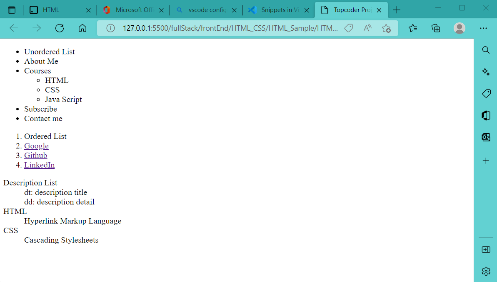
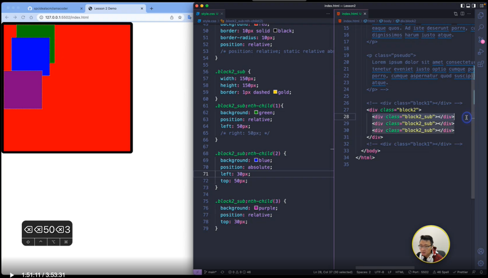
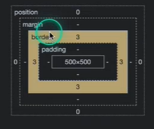

HTML & CSS


# 1. HTML

[HTML精简笔记](https://www.wolai.com/topcoderdoc/qxVBEVDrfSzif4djdw4hGm)

主要标签(tag)就4部分: 1)文本相关; 2)heading; 3) multi-media; 4) HTML list

标签格式:
```html
<p class="", ... >html content</p> 
```
+ html content 可以是text, 也可以是html tag, 比如一个表示image的tag
+ tag 后面的class， 可以用来区分相同类型的tag

## 1.1 HTML基本语法

### 1.1.1 文本相关

### 1.1.2 Heading

### 1.1.3 :star:multi-media
#### 1.1.3.1 Image
[document: img tag](https://developer.mozilla.org/zh-CN/docs/Web/HTML/Element/img)
```html

```

#### 1.1.3.2 Video
[document: video tag](https://developer.mozilla.org/zh-CN/docs/Web/HTML/Element/video#attr-controls)
```html
<video controls width="250">

    <source src="/media/cc0-videos/flower.webm"
            type="video/webm">

    <source src="/media/cc0-videos/flower.mp4"
            type="video/mp4">

    Download the
    <a href="/media/cc0-videos/flower.webm">WEBM</a>
    or
    <a href="/media/cc0-videos/flower.mp4">MP4</a>
    video.
</video>
```


#### 1.1.3.3 Audio
[document: audio tag](https://developer.mozilla.org/zh-CN/docs/Web/HTML/Element/audio)


### 1.1.4 HTML list

[HTML List demo](HTML_Sample/HTML_LIST.html)



注意其中nested list的写法

HTML <table> 快过时了, 因为现在有了新的布局工具


## 1.2 注意特殊语法:
+ p.active 和p .acitve 的区别 （2h08min-）
前者指p本级有个叫active的class，后者指p下属所有级适用的叫active的class
注解:本级，下属级指代写html时的分属关系，如<p> <em></em>  </p> 中em下属于p
+ Vscode的emmet (快捷指令宏): e.g. 批量写p： p>span.sp-$*6，按tap


# 2. CSS

## 2.1 选择器
[Learning Material: wc3 selector](https://www.w3schools.com/CSSref/css_selectors.php)

用来修饰HTML元素的格式, 但首先你得选择特定的HTML标签来施加修饰, 这就需要选择器:

Demo |
------ |
[选择器demo](CSS_Sample/Selector/CSS_Selector.html)   |
[wc3 Selector: nth-child demo](https://www.w3schools.com/CSSref/tryit.php?filename=trycss3_nth-child)|


### 2.1.1 无括号选择器:
allow us to reach down to branch of tag tree

+ ‘>’ 表示下一层. 

+ 空格表示下属所有.

+ nth:child(int)

### 2.1.2 有括号选择器
select tag element based on text filter

+ 直接选择
  [ = ]
+ 相关性选择
  [ *= ]
+ 头尾选择
  [ ^= ]: 开头
  [ $= ]: 结尾
+ 多个选择器合并选择
  一般用于text的多重filter, 比如先筛出来href和"google"相关的, 再筛出来href是以".com.au"结尾的

### 2.1.3 特殊语法 class::宏 
注：一下的指令中包含”::”是CSS中为数不多的语句，一般都是”:”

可使用 class::宏来渲染段落的某部分
+ .pseudo::first-letter{}: 只对第一个字母生效
+ .pseudo::first-line{}: 只对第一行生效
+ .pseudo::selection{}:只对用鼠标选中部分生效

除此外, 了解伪元素的概念:
.pseudo::before{}：在元素前跟随，有大用可以做特效（以后会讲）
.pseudo::after{}: 在元素后跟随


## 2.2 :moon: Block element
即div tag
```html
<div class="block1"></div>
```

Demo |
------ |
[block demo](CSS_Sample/Block_Element/Block.html)   |
[block position demo](CSS_Sample/Block_Position/Block_Position.html) |
[block dimension demo](CSS_Sample/Block_Dimension/Block_Dimension.html) |


### 2.2.1 Basics of Block
#### 2.2.1.1 block 基本属性
width, height, background
```css
.block1{
  width: 300px;
  height: 300px;
  background: red;
}
```
#### 2.2.1.2 设置html, body margin & padding

如下设置之后, block与网页的间距会消失
```css
html,body{
    margin:0;
    padding:0;
}
```

#### 2.2.1.3 border & border-radius
  
block有圆角
```css
.block1{
    width: 300px;
    height: 300px;
    background: red;
    border: 3px solid black;
    border-radius: 10px;
  }
```

block变成circle
```css
.block1{
    width: 300px;
    height: 300px;
    background: red;
    border: 3px solid black;
    border-radius: 50%;
  }
```

#### 2.2.1.4 :star:文档流

设置两个block, 会发现block2并不是出现在block1的右边, 而是在它下面

事实上, 一个bolck实际上是占一行的文档。Block默认是从左上角开始出现，新的block会占新的一行，而不是出现在旧的block的右边。

```html
  <div class="block1"></div>
  <div class="block2"></div>
```
```css
.block1{
    width: 300px;
    height: 300px;
    background: red;
    border: 3px solid black;
    border-radius: 10px;
}

.block2{
width: 300px;
height: 300px;
background: yellow;
border: 3px solid black;
border-radius: 10px;
}
```

#### 2.2.1.5 :star:Display属性
block的display属性, 默认是block, 即服从上面的文档流, 一个block结束了, 下一个block从下一行开始;

如果将display设为inline-block, block对外会呈现出inline的性质, 像text一样从左向右排列, 一行满了再去下一行.

```html
  <div class="block1"></div>
  <div class="block2"></div>
  <div class="block2"></div>
```

```css
html,body{
    margin:0;
    padding:0;
}

.block1{
    width: 300px;
    height: 300px;
    background: red;
    border: 3px solid black;
    border-radius: 10px;
    display:block;
}

.block2{
    width: 300px;
    height: 300px;
    background: yellow;
    border: 3px solid black;
    border-radius: 10px;
    display:inline-block;
}
```


### 2.2.2 :star: Position of Block
关于block的position属性, 以及位移属性(left, top, right, bottom)

+ 简言之, static的block的位移属性作废, relative与absolute的block的位移属性才生效.
+ absolute的block不参与文档流, relative的block参与文档流
+ absolute的block的位移参照物为其上级中最近的position=relative的block 

#### 2.2.2.1 static (by default)
```css
position: static;
```
Position属性如果是Static，则位移属性（left,right,top,bottom）无效，block的位置完全由文档流决定

#### 2.2.2.2 :star: relative

```css
position: relative
```
此时位移定义可以生效:
+ Left: 使得原来位置在新的位置左侧; right同理
+ Top: 使得原来位置在新的位置上侧; bottom同理

```html
<div class="block1"></div>
<div class="block2"></div>
<div class="block2"></div>
```

```css
html,body{
    margin:0;
    padding:0;
}


.block1{
    width: 300px;
    height: 300px;
    background: red;
    border: 3px solid black;
    border-radius: 10px;
    display:block;
    position: relative;     /*now that left, top works*/
    left: 100px;
    top: 100px;
}

.block2{
    width: 300px;
    height: 300px;
    background: yellow;
    border: 3px solid black;
    border-radius: 10px;
    display:inline-block;
}
```


+ 使用位移属性, 有可能将block移出视口
+ 位移属性优先级顺序: 同时定义了left, right, top and bottom的情况下, left, top优先, right, bottom作废


#### 2.2.2.3 absolute
```css
position: absolute;
```
position为absolute的block将会从文档流中脱离出来
+ **文档流**这里指的是，默认情况下，一个block从左上角开始，其实是占一行，下一个block直接从下一行开始而不是接着上一个block的右边开始，当然你可以通过将display属性从默认的block改为inline-block，使得下一个block接着上一个block的右边开始。总之文档流指的是一种文档的布局排布序列，从上到下，从左到右。
+ **脱离文档流**的意思是，不影响接下来block的布局排序，但其自身还是遵从文档流，跟着上一个block, 如蓝色的block还是在绿色的block的下一行

> 疑问：如果连写俩absolute sub block会怎么样？还是各自一行吗？还是重叠在一起？我倾向于重叠在一起

```html
<div class="block1">
    <div class="sub_block1"></div>
    <div class="sub_block2"></div>
    <div class="sub_block3"></div>
</div>
```
```css
html,body{
    margin:0;
    padding:0;
}

.block1{
    width: 500px;
    height: 500px;
    background: red;
}

.sub_block1{
    width: 100px;
    height: 100px;
    background: yellow;
}

.sub_block2{
    width: 100px;
    height: 100px;
    background: lightgreen;
    position: absolute;     /*isolate sub_block2 from document flow*/
}

.sub_block3{
    width: 100px;
    height: 100px;
    background: purple;
    position: relative;     /*now that displacement attributes works*/
    left: 50px;
    top: 50px;
}
```
将sub_block2从文档流独立出去, sub_block3的位置紧跟上一个在文档流中的元素(sub_block1)


如果将sub_block2算入文档流, 则sub_block3的位置紧跟上一个在文档流中的元素(sub_block2)


#### 2.2.2.4 :star: relative & absolute: 位移属性参照物

即使position是absolute, 也需要一个参照物来进行计算位移属性; 属性为absolute的block的位移参照物会从上一级的block属性查看。
+ 如果position为absolute的block的上一级block的position属性是static（不写position默认就是static），那么absolute就不会看上一层的，而会再往上一层去看直到block的position不是static（如果不是才会将其选择为位移参照物）, 如果上一层block的position属性一直都是static, 则会选取整个文档作为参照物，来计算位移属性。有时候发现block没有对齐, 可能就是这个原因!
+ 如果position为absolute的sub-block的上一级block的position属性是relative, 则该sub-block会以上一级的block为参照物来计算位移属性. **因此，一般parent block的position设定习惯上直接写relative，这样child block会选取mother block为位移参照物。**


#### 2.2.2.5 fixed
固定，像狗皮膏药一样贴在一个地方不动

#### 2.2.2.6 sticky
相当于relative和fixed结合


#### 2.2.2.7 :star: block的覆盖关系: z-index




HTML中后面生成的block会优先显示（压在之前的block上）; 但z-index可以调节同层级的优先覆盖关系， z-index一般取值0-999 


### 2.2.3 Dimension of Block




由内向外, 依次是: content, padding, border, margin, position; margin相当于邻居间的间隔, border相当于栅栏宽度, padding相当于自家院子里的草坪宽, content相当于自己的房子, 

+ Margin属性，表示该block与其他block之间的最小距离。用margin-left, 还可以单独定义某一边的margin; 下图中，block3(margin为50px)与block4(margin为30px)的距离是50px


+ 默认情况下, content就是我们定义div时的width和height. 但我们可以定义 
  ```css
  box-sizing： border-box
  ```
  来使得定义div的width和height为包含boder, padding和content的总体dimension. 	一般工作中，我们直接全局定义box-sizing, 这样方便一些. 
  + 如下, 定义一个500*500px的block, 当设定其box-sizing: border-box后, 它的border+padding+content=500
  


## 2.3 :star:Flexbox
+ 前面的我们如果写多个block, 它们按文档流依次排列下来


+ 使用overflow: hidden 来隐藏掉overflow的block


现在我们来看看如何使得block流动, 呈现一种动态布局

### 2.3.1 Display: Flex