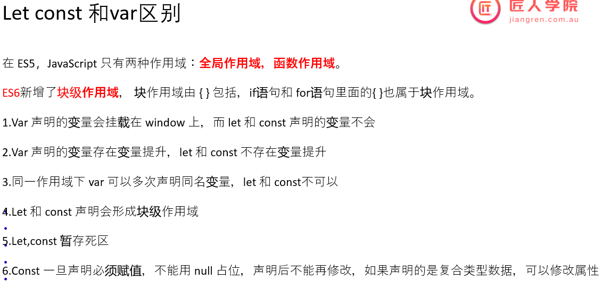

Content

- [1. 变量与打印](#1-变量与打印)
  - [1.0 Var](#10-var)
  - [1.1 Let](#11-let)
  - [1.2 const](#12-const)
- [2. 变量的数据类型](#2-变量的数据类型)
  - [2.0 :moon: JS 数据类型概述](#20-moon-js-数据类型概述)
  - [2.1 :full\_moon:truthy \& falsy](#21-full_moontruthy--falsy)
  - [2.2 primitive type](#22-primitive-type)
    - [2.1 Number](#21-number)
    - [2.2 Boolean \& if statement](#22-boolean--if-statement)
    - [2.3 String](#23-string)
      - [2.3.1 String拼接](#231-string拼接)
  - [2.3 :moon: Data type conversion](#23-moon-data-type-conversion)
- [3. Operator](#3-operator)
  - [3.1 Arithmetic Operator](#31-arithmetic-operator)
  - [3.2 :star: Compare Operator](#32-star-compare-operator)
  - [3.3 三联运算符](#33-三联运算符)
  - [3.4 Logical Operator](#34-logical-operator)
    - [短路计算](#短路计算)
  - [3.5 :moon: Spread Operator](#35-moon-spread-operator)
  - [3.6 严格模式](#36-严格模式)
- [4. Control flow](#4-control-flow)
  - [4.1 switch case](#41-switch-case)
  - [4.2 Loop](#42-loop)
- [5. Array](#5-array)
  - [5.1 初始化Array](#51-初始化array)
  - [5.2 定义新的数组元素](#52-定义新的数组元素)
    - [5.2.1 为Array加入object元素](#521-为array加入object元素)
  - [5.3 :moon: Array Decomposition](#53-moon-array-decomposition)
  - [5.4 :full\_moon: JS array API](#54-full_moon-js-array-api)
    - [map()](#map)
    - [filter()](#filter)
    - [5.4.3 reduce()](#543-reduce)
    - [forEach()](#foreach)
- [5.5 shadowCopy \& deepCopy](#55-shadowcopy--deepcopy)

---

# 1. 变量与打印

变量的命名规则:

+ 第一个字符，可以是任意 Unicode 字母(包括英文字母和其他语言的字母)，以及美元符号($)和下划线(_)。 

+ 第二个字符及后面的字符，除了 Unicode 字母、美元符号和下划线，还可以用数字0-9。


[variable.js](./variable.js)

## 1.0 Var

+ var很少再使用了, 因为它具有很多奇怪的特性, 代码多了容易出错
+ 一般无脑用const, 看情况使用let
  + 因为我们基本不希望别的程序员中途改动自己定义的变量
+ 面试还是会问var, let, const的区别




:gem: [var-let-const区别](./01-let_const_var.html)

## 1.1 Let
let & const 都属于ES6新特性

定义变量时无需声明类型, 直接用let, 相当于声明变量开辟内存, 之后再次用到变量时不用再let了.

```js
let my_name = "shawn";
console.log(my_name);
```

打印连接两个变量:
```js
let firstName = "shawn",
    lastName = "Li";
console.log(firstName, lastName);

```
'undefined' & 'null':
```js
firstName = undefined; //a type of data, not defined
firstName = null; //a type of data, defined but value is null
console.log(firstName);
```


## 1.2 const

```js
const password = "kjjk";
password = 'aasaaa';         // 会报错
```

+ const 限定一个primitive type的data后，无法更改，如果更改，就会报错。但是let就没有如此的限制。
+ const 限定一个object type variable, 只是表示这个variable的object type固定无法改, 但object内部的field依然可以改动. 本质上const只是限定变量需要的内存大小.


# 2. 变量的数据类型
## 2.0 :moon: JS 数据类型概述

变量的数据类型在JS中是implicit的, 不需要明确声明. 只分为两类: primitive type, object type


**JS primitive data type**

常用的5种

data type | description | default value
-----|------|-----
Number|包含int 和 float类型   | 0
Boolean| 你懂的   | false
String| 你懂的  | ""
Undefined| 声明了变量但没给值. e.g. `int a`, then `a=undefined` | undefined
Null|声明变量为空, int a=null     | null
Symbol||
Bigint||


**JS object date type**

data type | description | default value
-----|------|-----
Object|| 

**即非primitive type的变量的类型都是Object类型**. e.g.: function, array都是是object type

```js
function myFav(name){		// myFav is object type
    console.log(name);
}

const arr = [1,2,3,4]; // arr is object type

class Bank{
}
const nab = new Bank() // nab的类型: Object
```


## 2.1 :full_moon:truthy & falsy

只要不是false的, 就是true: 

+ trusy: String(exclude ''),  number (exclude 0),  object 

+ falsy: null,  undefined,  0,  ''

| 数值类型 | Boolean |
| ---- | ---- |
| undefined | false |
| null | false |
| Number | 0， NaN (Not a Number) 都是false， 其他是true |
| String | 空字符串''是false， 其余为true |
| 对象 | true |


正因为JS的truthy, falsy机制,  JS语法与Java稍有不同:

```js
var x = 2

if(x = 2){      // 在js中不报错,  console.log("1")会被执行. 因为2是trucy
    console.log("1")
}
```


基于JS中数值与boolean的转化关系, 我们可以写出更加简洁的代码:

+ primitive type 
  ```js
  const a =1;
  // 完全写法
  if(a !== undefined && a !== null && a !== 0 && a !== ''){
      ...
  }
  // 简洁写法
  if(a){
      ...
  }
      
  // 上面实际上是:
  if(duckTest(a, true)){
  
  }
  
  ```
+ object type
  ```js
  // 完全写法
  function getArrayLength(arr){
      if(array !== undefined && array !== null){
          return array.length;
      }
  
      return undefined;
  }
  
  // 简洁写法, 由于JS的数值和boolean转化关系
  function getArrayLength(arr){
      if(arr){
          return arr.length;
      }
  
      return undefined;
  }
  
  // 更简洁写法, 也很常用, 利用 &&的工作原理
  function getArrayLength(arr){
      return arr && arr.length;   // && 只有左边为true的情况下, 才会跑右边的东西; 否则只跑左边的东西
  }
  
  // 更更简洁写法, 用optional chaining
  function getArrayLength(arr){
      return arr?.length;         // ? 用来检测arr是否为true, 是的话才看后面 (optional chaining)
  }
  ```

---


## 2.2 primitive type

### 2.1 Number

### 2.2 Boolean & if statement
+ True: 字符串(包括字符串0)都是true
+ False: 数字0, null, undefined都是false
```js
//boolean
let c = "0";
let d = undefined;
let e = null;

if (c) {                // c: true
console.log("good");
}

if (!d) {               // d: false
console.log("bad");
} 

if (!e) {               // e: false
console.log("OK");
} 

```

```js 
If(statement){
}else if(statement){
}else if(statement){
}else{
}

```

### 2.3 String

+ `""` & `''`: 用于纯string
+ ``: 适用性更广, 可以引用变量 ES6新特性

```js
//data type
let a = 1;
console.log(a);

// "" & '' for pure string -------------------------
let b = "this is a b";
console.log(b);

let b1 = "this is a b1";
console.log(b1);

let b2 = 'he said: "this"';
console.log(b2);

let b3 = "he said: 'this'";
console.log(b3);

// `` 更广的适用性-----------------------------
let b4 = `he said: "a",'b'`;    // `` allows coexisting of '' & ""
console.log(b4);

let b5 = `he said: ${b}`;       // `` allows referencing a variable
console.log(b5);

```


#### 2.3.1 String拼接
+ 当一个str和一个num相加时，结果的数据类型和被加数一致(和java的print一致)
  + 特别地，+”1”代表将str类型的1转化为num类型. 但是其中的双引号内必须只有数字。
+ JS的`console.log()`支持多个argument(用`,`分隔), 打印结果顺序连接; 而Java中`print()`中只支持1个String, 需要用`+`连接

```js
// data type conversion
let a = 1;
let b = "this is a b";

let b6 = "he said: " + b;   //add up two str: link
console.log(b6);            // he said: this is a b

let b7 = "he said: " + a;   //add num(convert to str first) to the end of str
console.log(b7);            // he said: 1

// +"1": convert string to num ------------------------------
let b8 = "1" + a;           //add num to the end of str
console.log(b8);            // 11

let b9 = +"1" + a;          //convert ”1” to num, then add to a, which is 1
console.log(b9);            // 2

let b10 = "" + 1;           //num to string
console.log(b10, typeof b10);   // 1 string

let b11 = +"1";             //string to num
console.log(b11, typeof b11);   // 1 'number'

```


## 2.3 :moon: Data type conversion
numToString
+ `.toString()`
+ `String()`
```js
// 1. 把数字型转换为字符串型
let num = 10;
// ----
let str = num.toString();
console.log(str, typeof(str))
// ----
console.log(String(num))
// ----
console.log(num+"")
```

StringToNum
+ `parseInt()`
+ `parseFloat()`
+ `Number(String)`
```js
// 把 字符型的转换为数字型 得到是整数?
console.log(parseInt(`3.14`))       // 3
console.log(parseInt(`120px`))      // 120
console.log(parseInt(`rem120px`))   // NaN
// 2. 把 字符型的转换为数字型 得到是小数 浮点数?
console.log(parseFloat(`3.1415926`))    // 3.1415926

// 3. 利用 Number(变量)
var str = "123";
console.log(Number(str))    // 123

// 4.
console.log(typeof(`12`-0))     // number

```

Boolean
+ `Boolean()`
```js
//what's the output?
console.log(Boolean(""));         //false
console.log(Boolean(0));          // number 0: false
console.log(Boolean(NaN));        // not a number: false
console.log(Boolean(null));       // false
console.log(Boolean(undefined));  // false
console.log("------------------------------");
console.log(Boolean("123"));      // true
console.log(Boolean("hello"));    // true

```


# 3. Operator
[operator.js](./operator.js)

## 3.1 Arithmetic Operator
+ 加减乘除, 幂数运算, 取余取商
+ 自增自减
```js
// 数值运算符--------------------
let x = 10;
let y = 3;
console.log(x + y);
console.log(x - y);
console.log(x * y);
console.log(x / y);
console.log(x % y);
console.log(x ** y);  //exponential
console.log(Math.sqrt(100));

console.log(x++); // use first then add
console.log(x);
console.log(x--);
console.log(x);
console.log(++x); // add first then use
console.log(x);
console.log(--x);
console.log(x);

let xx = 10;
xx++;
xx = xx + 5;
xx += 5;
xx -= 5;
xx *= 5;
xx **= 5;
xx /= 5;
xx %= 5;

xx ?? 5; // what is it?
```

## 3.2 :star: Compare Operator

:book: [MDN: === & ==](https://developer.mozilla.org/en-US/docs/Web/JavaScript/Reference/Operators/Strict_equality)


+ =, ==, ===(strict equality)
  + 一般我们无脑用===, 很少用== 
+ !=, !==
+ 大于,小于

```js
// 比较运算符
let x = 1;
console.log(x > 1); // false
console.log(x >= 1);  // true
console.log(x < 1);  // false
console.log(x <= 1); // true

console.log((x = 1)); // 1
console.log(x == 1); // justify if the value of x equals 1: true
console.log(x === 1); // justify if the value & type of x equals 1: true

//== justify only value, return Boolean
console.log(0 == false);  // true
console.log(0 != false); // false,  != is opposite to ==
console.log(true == 1); // true
console.log(true == 2); // false,  only 1 can == true

// === justify type & value
console.log(0 === false); // false
console.log(0 !== false); // true, !== is opposite to ===
```

注意:

+ JS中, 任何两个独立的object都不相等.

  + 当比较primitive type的变量时, 比较值

  + 当比较object type的变量时, 比较内存地址

```js
{} == {}; // false 
{} === {}; // false
```


## 3.3 三联运算符

```js
let pointers = 100;
if (pointers > 100) {
  console.log("gold");
} else {
  console.log("silver");
}

console.log(pointers > 100 ? "gold" : "silver"); // identical to if else

```


## 3.4 Logical Operator
+ ||
  
  ```js
  console.log(0 || false);          // false, as num 0 is identical to false
  console.log(null || false);       // false
  console.log(undefined || false);  // false
  console.log(NaN || false);        // false
  //
  console.log(3 || false);  // return 3
  console.log(false||10);   // return 10
  console.log(4||10);       // return 4
  ```
  
  优先return左边的真
  + 如果||左边为真，则return左边的值， 
  + 如果左边为假,右边为真，则return右边的，
  + 如果左右两边都为假，则return false
  Application: 可以用于选择：默认端口||备用端口

+ 取反

```js
console.log(true==2)   // return false
console.log(!2)  //return false
```


### 短路计算

```js
// 本质
truthy && something = something
falsy && anything = falsy

truthy || anything = truthy
falsy || something = something
```


应用: 简化代码

```js
document.querySelector('#dropdown-container').innerHTML = showDropdown && renderDropdown();


// 等效
if(showDropdown){
    document.querySelector('#dropdown-container').innerHTML = renderDropdown();
}else{
    document.querySelector('#dropdown-container').innerHTML = false;
}
```

```js
const welcomeMessage = isVIP && 'welcome VIP!'   // if left is false, just return fasle. if left is true, then we look at right 
const loginMessage = welcomeMessage || "login success!" // if left is true, return the left. if left is fasle, then we look at the right

// isVIP false, loginMessage = "login success!"
// isVIP true, loginMessage = "welcome VIP!"

```


## 3.5 :moon: Spread Operator

JS特色的`...`

:book: [MDN: spread operator](https://developer.mozilla.org/en-US/docs/Web/JavaScript/Reference/Operators/Spread_syntax)

场景1: 用来展开一个array (shallowCopy to 1 layer)
:gem: [Demo: Spread Operator](./10-spread_operator.html)

```js
// 1. Copying an array
//output ['Apple','Orange','Banana']
let fruits = ["Apple", "Orange", "Banana"];
let newFruitArray = [...fruits];        // do shadowCopy only to 1 layer
console.log(newFruitArray);   

// 2. Concatenating arrays
//output ['A', 'B', 'C', 'X', 'Y', 'Z']
let arr1 = ["A", "B", "C"];
let arr2 = ["X", "Y", "Z"];
let arr3 = [...arr1, ...arr2];
console.log(arr3);
```


场景2: 用在函数的argument里
:gem: [函数的剩余参数](./12-%E5%89%A9%E4%BD%99%E5%8F%82%E6%95%B0.html)


## 3.6 严格模式

```js
"use strict"  //开启严格模式会开启诸多语法的严格限制
```

==

# 4. Control flow
## 4.1 switch case
和java一样
```js
const roles = ["student", "teacher", "boss"];

  let role = roles[2];

  switch (role) {
    case roles[0]:
      console.log("hello!");
      break;
    case roles[1]:
      console.log("!!!");
      break;
    case roles[2]:
      console.log("???");
      break;
    default:
      console.log("aaa");
  }


```
## 4.2 Loop
while, for loop语法和Java基本一致

+ while loop


+ for loop
  ```js
  let newArrayNumber = [];
  for (let i = 0; i < 10; i++) {
    newArrayNumber[i] = i + 5;
  }
  console.log(newArrayNumber);
  
  ```
+ forEach
  forEach: 专门用来处理数组的, 必须先指定是对那个数组进行forEach
  语法格式：
  Array.forEach()
  括号里一般是一个箭头函数 () =>{}
  ```js
  // forEach: manipulation over each
  newArrayNumber.forEach((num, index) => {
  // num here refers to the element in newArrayNumber 
  // index starts from 0
  console.log("1:", num, index);
  });
  
  // identical to the above
  for (let i = 0; i < newArrayNumber.length; i++) {
  console.log("2:", newArrayNumber[i]);
  }
  
  ```

  

  > For和forEach的区别(自己查): forEach是个迭代器; 但是forEach比普通的for loop运行慢很多, 不考虑性能的情况下使用forEach更方便

+ for in & for of


:gem: [Practice: 打印9*9乘法表](./loop.js)


# 5. :bangbang: Array

:book: [MDN: Array](https://developer.mozilla.org/en-US/docs/Web/JavaScript/Reference/Global_Objects/Array)

[Array.js](./Array.js)


## 5.1 basic grammar

初始化Array

---

要点:
+ 用square bracket
+ index starts from 0
+ Array不算基本数据类型, 变量名采用引用

```js
let array = [1, 2, 3, "4", true, { name: "shawn" }];

console.log(array[0]);   //index starts from 0	

array[0] = "sdufsd";
console.table(array);
```


定义新的数组元素

---

要点:
+ JS的数组是动态数组, 可以改变长度
+ 超出数组长度的为undefined
+ 可以不连续定义新的数组元素


```js
// 接上面的JS code

console.log(array.length);
console.log(array[6]);        // array[6] = undefined

// 不连续定义数组元素------------------
array[100] = 78;                
console.log(array[100]);
console.log(array.length);  // now length of array is 101

```


为Array加入object元素

---

要点:
+ 必须先指定哪个元素为object type, 再instantiate该object
+ 不能直接为某个元素instantiate
```js
// ...接上面的JS Array code...

array[101] = {};            // 先指定array[101]为object type
array[101].name = "shawn";  // 再instantiate该object
console.log(array[101]);    // now array[101].name displayed
```


 :moon: Array Decomposition

---

:gem: [Demo: array decomposition](./11-arrayDecomposition.html)


## 5.2 :bangbang: JS array API
本质上还是for loop实现某种功能, 只不过封装好代码更加简洁, 直接对array操作

以下API中用到的function()一般为了简洁采用箭头函数

很想Java 8 的stream API的用法

###  map()
manipulate over every elements and in the array, return a new array holding the results

:book: [w3schools: map()](https://www.w3schools.com/jsref/jsref_map.asp)

+ `map()` **returns a new array** from calling a function for every array element.
+ `map()` does not change the original array.

```js
// syntax
array.map(function(currentValue, index, arr), thisValue)

function(currentValue, index, arr){
  ...
  return calculationResultOverAnElement;
}
```

:gem: [Demo: map()](./17-map.html)

### filter()

从一个array中筛选符合条件的元素

:book: [w3school: filter()](https://www.w3schools.com/jsref/jsref_filter.asp)

+ The `filter()` method **returns a new array** filled with elements tha**t pass a test** provided by a function.
+ The `filter()` method does not change the original array.

```js
// syntax
array.filter(function(currentValue, index, arr), thisValue)

function(currentValue, index, arr){
  ...
  return filtering_booleanCondition;		// true: keep element
}
```

:gem: [Demo: filter()](./18-filter.html)


### reduce()

从一个array中提取aggregate信息

:book: [w3school: reduce()](https://www.w3schools.com/jsref/jsref_reduce.asp)

+ The `reduce()` method executes a reducer function for array element.
+ The `reduce()` method **returns a single value**: the function's accumulated result.
+ The `reduce()` method does not change the original array.

```js
// syntax
array.reduce(function(total, currentValue, currentIndex, arr), initialValue)

function(total, currentValue, currentIndex, arr){
  ...
  return 在每个iteration的aggregation语句;
}
```

:gem: [Demo: reduce()](./19-reduce.html)

:gem::gem: [Practice: reduce()](./20-map_filter_reduce.html)

### forEach()

```js
const array1 = ['a', 'b', 'c'];

array1.forEach((element, i) => console.log(element, i));

// expected output: "a" 0
// expected output: "b" 1
// expected output: "c" 2
```


### more 

JavaScript arrays come with a variety of methods that can be used to manipulate, iterate over, and transform array data. Here are some of the most commonly used array methods in JavaScript:

1. **`push()`**: Adds one or more elements to the end of an array and returns the new length of the array.

2. **`pop()`**: Removes the last element from an array and returns that element. This method changes the length of the array.

3. **`shift()`**: Removes the first element from an array and returns that removed element. This method changes the length of the array.

4. **`unshift()`**: Adds one or more elements to the beginning of an array and returns the new length of the array.

5. **`forEach()`**: Executes a provided function once for each array element.

6. **`map()`**: Creates a new array populated with the results of calling a provided function on every element in the calling array.

7. **`filter()`**: Creates a new array with all elements that pass the test implemented by the provided function.

8. **`reduce()`**: Executes a reducer function on each element of the array, resulting in a single output value.

9. **`slice()`**: Returns a shallow copy of a portion of an array into a new array object selected from start to end (end not included) where start and end represent the index of items in that array. The original array will not be modified.

10. :bangbang: **`splice()`**: Changes the contents of an array by removing or replacing existing elements and/or adding new elements in place.
    + It can add, remove, and replace elements within an array.

11. **`find()`**: Returns the value of the first element in the provided array that satisfies the provided testing function.

12. **`indexOf()`**: Returns the first index at which a given element can be found in the array, or -1 if it is not present.

13. **`includes()`**: Determines whether an array includes a certain value among its entries, returning true or false as appropriate.

14. **`join()`**: Joins all elements of an array into a string and returns this string.

15. **`concat()`**: Is used to merge two or more arrays. This method does not change the existing arrays but instead returns a new array.

16. **`sort()`**: Sorts the elements of an array in place and returns the sorted array.

17. **`reverse()`**: Reverses an array in place. The first array element becomes the last, and the last array element becomes the first.

18. **`every()`**: Tests whether all elements in the array pass the test implemented by the provided function.

19. **`some()`**: Tests whether at least one element in the array passes the test implemented by the provided function.

Each of these methods can be incredibly useful for various operations involving arrays, from simple manipulation to more complex data handling and transformation tasks. They are fundamental tools in the JavaScript programmer's toolkit.


## 5.3 shadowCopy & deepCopy

针对object或array

shadow copy
复制体和本体share address, 相互关联. 

+ `Object.assign()`
+ `Array.from()`
+ `[...arr]`

:gem: [shadow copy](./23-shadowCopy.html)


deep copy
复制体和本体在内存中各自独立, 相互不影响

+ `JSON.parse(JSON.stringify(obj))`
  + 但这个方法在copy时会忽略undefine, symbol, function的值 
+ lodash的库方法(更常用): `cloneDeep`
+ browser自带的方法: `structuredClone()`
:gem: [deep copy](./24-deepCopy.html)


# 6. Data structure 


## Stack & Queue

```ts
let stack = [];

// Pushing elements onto the stack
stack.push("Apple");
stack.push("Banana");
stack.push("Cherry");

console.log(stack); // Output: [ 'Apple', 'Banana', 'Cherry' ]

// Popping the top element off the stack
let topElement = stack.pop();

console.log(topElement); // Output: Cherry
console.log(stack); // Output: [ 'Apple', 'Banana' ]

```


```ts
let queue = [];

// Adding elements to the queue
queue.push("Apple");
queue.push("Banana");
queue.push("Cherry");

console.log(queue); // Output: [ 'Apple', 'Banana', 'Cherry' ]

// Removing the first element from the queue
let firstElement = queue.shift();

console.log(firstElement); // Output: Apple
console.log(queue); // Output: [ 'Banana', 'Cherry' ]

```


## Map

- **Key Uniqueness**: In a `Map`, each key is unique. If you add a key-value pair and the key already exists, the corresponding value will be updated.
- **Order of Keys**: The keys in a `Map` are ordered. When iterating over a `Map`, keys are returned in the order of insertion.
- **Size**: The number of key/value pairs in the `Map` can be retrieved through its `size` property.

```ts
let map = new Map();

// Adding elements to the Map
map.set('apple', 'green');
map.set('banana', 'yellow');
map.set('cherry', 'red');

console.log(map.size); // 3

// Getting a value
console.log(map.get('banana')); // yellow

// Checking existence
if (map.has('apple')) {
    console.log('Apple is in the map');
}

// Iterating over Map entries in 3 ways
map.forEach((value, key) => {
    console.log(`${key}: ${value}`);
});
// Output:
// apple: green
// banana: yellow
// cherry: red
for ([key, value] of map) {
  console.log(key, value);
}
const iter = map.entries();
console.log(iter.next().value);
console.log(iter.next().value);
console.log(iter.next().value);
const iter2 = map.keys();
console.log(iter2.next().value);
console.log(iter2.next().value);
console.log(iter2.next().value);
const iter3 = map.values();
console.log(iter3.next().value);
console.log(iter3.next().value);
console.log(iter3.next().value);


// Deleting an element
map.delete('banana');
console.log(map.size); // 2

// Clearing the Map
map.clear();
console.log(map.size); // 0

```


WeakMap


## Set

- **Uniqueness**: Each element in a `Set` must be unique; duplicate elements are ignored.
- **Value Types**: A `Set` can hold any type of value, whether primitive values or object references.
- **Element Order**: Elements in a `Set` are iterated in the order of insertion.

```ts
let mySet = new Set();

// Adding values
mySet.add("apple");
mySet.add("banana");
mySet.add("cherry");

// Duplicates are not added
mySet.add("apple");

console.log(mySet.size); // 3

// Checking for existence
if (mySet.has("banana")) {
    console.log("Banana is in the set");
}

// Iterating over Set values
for (let item of mySet) {
    console.log(item);
}
// Output:
// apple
// banana
// cherry

// Deleting an element
mySet.delete("banana");
console.log(mySet.size); // 2

// Clearing the Set
mySet.clear();
console.log(mySet.size); // 0

```


## WeakMap & WeakSet


- **eakly Referenced Keys**: The keys are weakly referenced, allowing for garbage collection if there are no other references to the key object.
- **Non-Enumerable**: You cannot iterate over the keys or values of a `WeakMap` or `WeakSet`with methods like `forEach` or `for...of`. The elements of a `WeakMap` or `WeakSet` are not enumerable.
- **Key Type**: Only objects can be used as keys. Primitive data types are not allowed.


```ts
let weakMap = new WeakMap();
let obj = {};

// Adding a new key-value pair
weakMap.set(obj, { key: 'value' });

console.log(weakMap.has(obj)); // true
console.log(weakMap.get(obj)); // { key: 'value' }

// Object can be garbage collected if there are no other references to it
obj = null; // Now `weakMap` might be empty

let weakSet = new WeakSet();
let obj2 = {};

// Adding an object
weakSet.add(obj2);

console.log(weakSet.has(obj2)); // true

// Object can be garbage collected if there are no other references to it
obj2 = null; // Now `weakSet` might be empty

```

