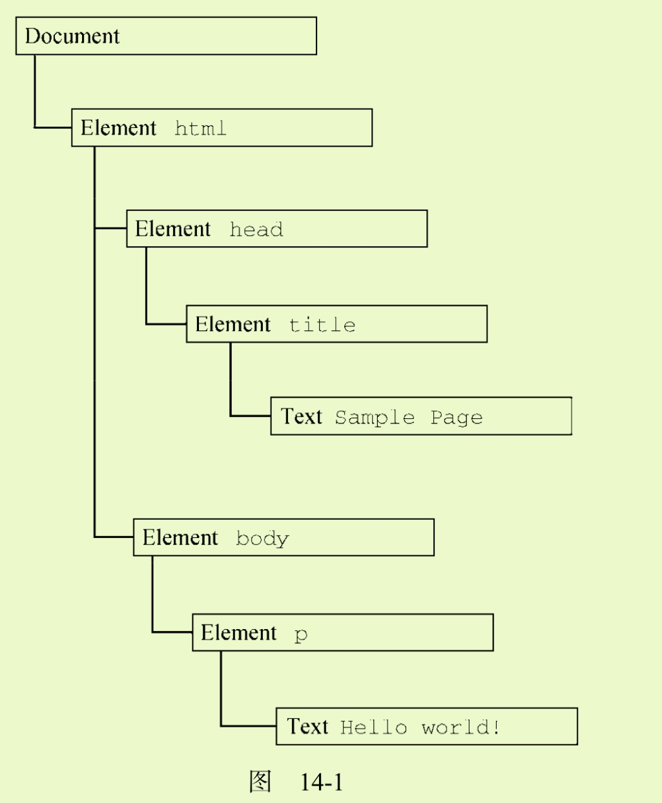
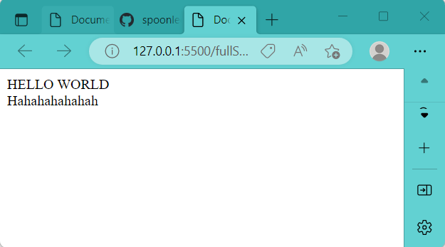
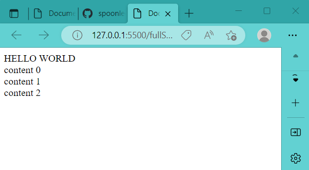
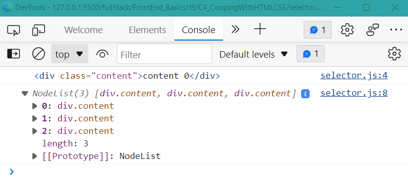
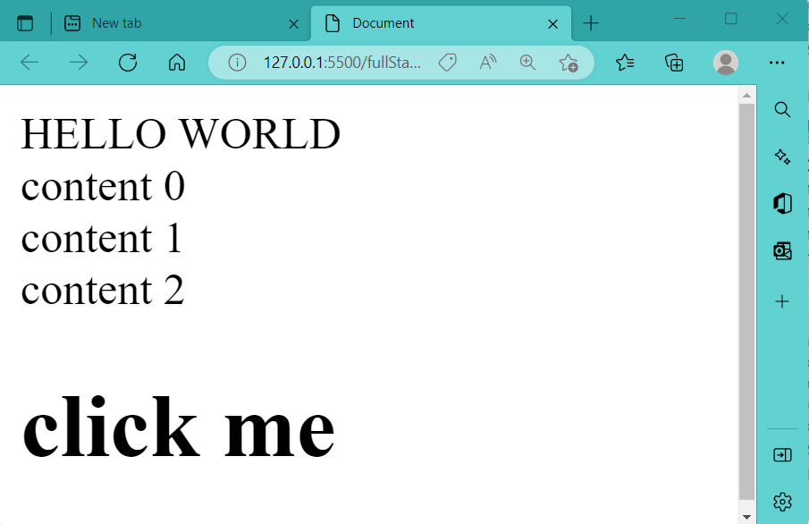
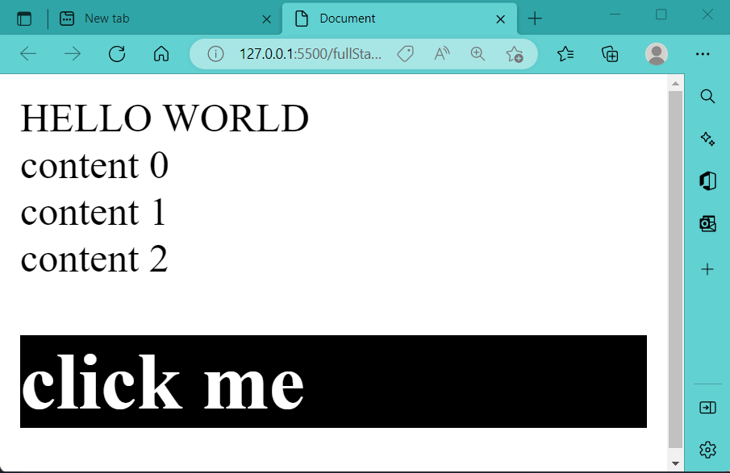

主要是DOM相关API

:pencil: [李立超: JS DOM](./lilichao/lilichao.md)


more comprehensive: https://developer.mozilla.org/en-US/docs/Learn/JavaScript/Client-side_web_APIs


# 1. JS操纵HTML

## 1.1 JS抓取node

[document.selector](./selector.js)

+ DOM (Document Object Model) 详见见JavaScript高级程序设计第14-16章

---

node指代HTML文档中的某个标签元素. 在HTML文档中, document节点表示每个节点的根节点, 根节点唯一的子节点是html元素





**通过document的selector API可以做到在JS中选择HTML文档中的某个标签元素, 并予以改动.**


对于以下的HTML文档:
```html
<!--html document-->
<body>  
    <span>HELLO WORLD</span>

    <div class="content"></div>
    <div class="content"></div>
    <div class="content"></div>

    <script src="./JS_lesson1.js">
    </script>
    
</body>

```
### document.querySelector()

```js
// get a single node ------------------------
const content = document.querySelector(".content"); // get the first node that meets specification
content.innerHTML = "Hahahahahahah";
console.log(content);
```
通过document.querySelector(), 我们edit了HTML文档中第一个".content"标签:




### document.querySelectorAll()
+ querySelectorAll(): 选中所有满足条件的node, 并返回对应的NodeList

```js
// get multiple nodes -----------------------
const contents = document.querySelectorAll(".content"); // get all nodes satisfying condition, and put them into an array 'contents'
console.log(contents);

contents.forEach((node, index) => {     // edit nodes
	node.innerHTML = `content ${index}`;
})
```
通过document.querySelectorAll(), 我们edit了HTML文档中所有".content"标签:



console打印结果:



## 1.2 JS创建HTML元素
分两步:
+ step1: 创建新节点 OR 选中已有节点
    ```js
    // 创建节点:
    const nodeToBeAdded = document.createElement('tag');
    nodeToBeAdded.innerHTML = ...;  //text, 或者嵌套标签都可
    ```
+ step2: 将节点attach在另一个节点上
    ```js
    // 添加节点:
    node.appendChild(nodeToBeAdded);
    ```


### e.g.1: 

```js
// 接上面content = document.querySelectorAll()

// create element ------------
const span = document.createElement('span')
span.innerHTML = "click me"

// *** append span onto a node ***
contents[contents.length - 1].appendChild(span) //appendChild, append result in the same effect here

```


### e.g.2: 在body下创建新元素
```js
// create element---
const span = document.createElement('span')
span.innerHTML = "click me"
// append span onto a node---
const domBody = document.querySelector("body") // note there is no '.' in front of body 
domBody.appendChild(span)

```


### e.g.3: 
```js
// create element---
const div = document.createElement('div')
div.innerHTML = "<h1>click me</h1>"
// append span onto a node---
const domBody = document.querySelector("body") // note there is no '.' in front of body 
domBody.appendChild(div) 
```



> div可以加载h1, span不能加载h1

# 2. JS操纵CSS

## 2.1 利用JS联动CSS

+ 事件流见<<JavaScript高级程序设计>> 第17章

+ JS中node的classList (P449): 
    HTML5给所有元素增加了classList属性来更便利地操作元素的className: 
  + add(value): 向类名列表中添加指定的字符串值value. 若该值已存在, 则什么也不做.
  + contains(value): 返回boolean, 表示给定的value是否存在.
  + remove(value): 从类名列表中删除指定的字符串值value.
  + toggle(value): 如果类名列表中已经存在指定的value, 则删除; 如果不存在, 则添加.

+ addEventListener() (P495):
  + 接收三个argument: 事件名, 事件处理函数, 一个boolean值
---

e.g. click 触发event: style切换
JS部分:

```js
// create element------------------------------------
const div = document.createElement('div')
div.innerHTML = "<h1>click me</h1>"
// append div onto a specific node---
const domBody = document.querySelector("body") 
domBody.appendChild(div) 

// append over CSS: add a style to span we just added using JS ---------------------------
div.classList.toggle('active')  // toogle: switch

div.setAttribute('style', 'cursor:pointer') // 当鼠标移到div上时, 会变成一个小手手

// *** add EventListener to div: (event name, event handling function) ***
div.addEventListener('click', ()=>{  
    div.classList.toggle('active')  // switch div's className
})
```

CSS部分:

```css
.active{
    background-color: #000;
    color: #fff;
}
```

Results: 点击click me 会toggle 'div'元素的类名(className), 从而达到切换CSS style的目的





# Event


## :gem: e.g. event with <input>​

Certainly! The `<input>` element in HTML interacts with users and the web application through various events. Here are some commonly used event-related properties for `<input>` elements:


Keyboard Events

---

- **`onkeydown`**: Fires when a key is pressed down over an `<input>` element.
- **`onkeyup`**: Occurs when a key is released over an `<input>` element.
- **`onkeypress`**: Triggered when a key that produces a character value is pressed down; deprecated in many modern browsers and replaced with `keydown`.


Mouse Events

---

- **`onclick`**: Fired when the `<input>` element is clicked.
- **`ondblclick`**: Occurs when the `<input>` element is double-clicked.
- **`onmousedown`**: Triggered when the mouse button is pressed down over the `<input>` element.
- **`onmouseup`**: Fires when a mouse button is released over the `<input>` element.
- **`onmousemove`**: Occurs when the mouse pointer moves while it is over the `<input>` element.
- **`onmouseover`**: Fired when the mouse pointer is moved onto the `<input>` element.
- **`onmouseout`**: Triggered when the mouse pointer moves out of the `<input>` element.


Form Events

---

- **`onchange`**: Occurs when the value of the `<input>` element is changed and then loses focus. This event is especially useful for input validation.
- **`oninput`**: Fires immediately when the value of the `<input>` element changes, making it ideal for real-time feedback on user input.
- **`onfocus`**: Triggered when the `<input>` element gains focus.
- **`onblur`**: Occurs when the `<input>` element loses focus.
- **`onsubmit`**: This event is associated with the form that the `<input>` is part of; it fires when the form is submitted, but it's not specific to the `<input>` element itself.


Clipboard Events

---

- **`oncopy`**: Fired when the user initiates a copy action on the `<input>`'s value.
- **`oncut`**: Occurs when the user cuts content from the `<input>`.
- **`onpaste`**: Triggered when the user pastes content into the `<input>`.


Drag Events

---

Although less commonly used with `<input>` elements, drag events can be applicable, especially for input types that handle files.

- **`ondrag`**: Occurs when an element or text selection is being dragged over the `<input>`.
- **`ondrop`**: Fired when a dragged item is dropped on the `<input>`.


Touch Events

---

Useful for touch devices:

- **`ontouchstart`**: Occurs when a touch is initiated on the `<input>`.
- **`ontouchmove`**: Fires when a touch point is moved across the screen.
- **`ontouchend`**: Triggered when a touch point is removed from the touch surface.

These events can be handled using JavaScript to create interactive and responsive web applications. Remember, the specific use and support for these events can vary depending on the browser and the `<input>` type (e.g., text, checkbox, radio).

