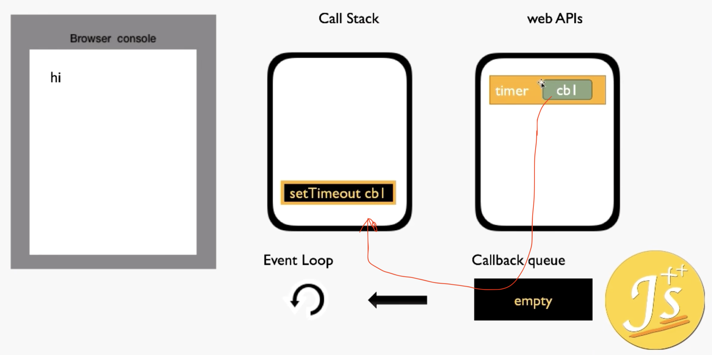
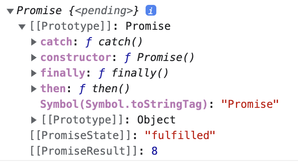
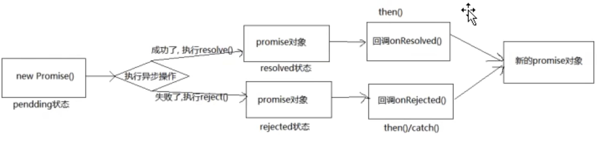

resources:

:computer: [尚硅谷: Promise从入门到精通](https://www.bilibili.com/video/BV1GA411x7z1/?spm_id_from=333.337.search-card.all.click&vd_source=c6866d088ad067762877e4b6b23ab9df)


# 0. 前置知识

## 异步任务的执行机制

:computer: [参考视频](https://www.bilibili.com/video/BV18B4y1u7rm/?spm_id_from=333.999.0.0&vd_source=c6866d088ad067762877e4b6b23ab9df)


异步: JS单线程, 为了 防止DOM操作冲突. JS中为了实现异步需要通过事件轮询(Event Loop) 的方式

Event Loop: 是一种执行方式， <u>当主线程的任务为空后 (really? 主线程任务不为空就不看callback queue啦?)</u>, 会轮询事件队列中的任务

> The event loop is a mechanism in JavaScript that allows for asynchronous programming. It is essentially an infinite loop that constantly checks for new tasks to execute, and handles them one by one in a queue-like manner.

Event loop的核心 --->  回调函数(callback function):  参数为函数的函数, 被认为是高阶函数, 高阶函数的参数被称为是回调函数. e,g,下面的`setTimeout()`为高阶函数, `function(){console.log('cbl')}`为回调函数


并不是所有的回调函数都是异步任务, 即存在同步回调函数, 异步回调函数

```js
arr.sort(function(a,b){				// function(a, b)是同步回调函数, 因为执行高阶函数和执行回调函数之间不需要等待
  
})

setTimeout(function(){ 				// setTimeout()的参数是异步回调函数, 执行setTimeout()和执行function()之间需要等待5s
  console.log('cbl')
}, 5000)

$.ajax({
  url: ''
  type: 'GET'
  dataType: 'JSON'
  success: function(data){		// 异步回调函数, 执行ajax()和执行function(data)之间需要等待服务器响应
  	console.log(data);
	}
})

```


:gem: e.g.

```js
console.log('hi')

setTimeout(function(){
  console.log('cbl')
}, 5000)

console.log('bye')
```

背后的执行顺序与机制

```js
1. 执行 console.log('hi')
2. 执行 setTimeout(), 定时器其实是浏览器提供的JS之外的线程(放在web APIs中), 在定时器结束时 setTimeout()中的callback function被放入Callback queue, 排队等待被调用
3. 执行 console.log('bye')
4. 3结束后, 主线程call stack为空, 浏览器通过Event Loop的方式去Callback queue中(以一定的时间间隔)查看是否有callback function需要被放入call stack, 此时看到function(){console.log('cbl')}把它放入call stack被主线程执行
```



上图中红线表示callback function在内存中转移的路径

执行结果:

```bash
hi
bye
cbl
```


# 1. Promise的介绍与基本使用

1-12

## 1.1 Intro

Promise是什么？

Promise是一门新的技术(ES6规范), 是JS中进行异步编程的新解决方案(旧方案是单纯使用回调函数)

```js
// 异步操作举例
1. fs文件操作
require('fs').readFile('./index.html', (err, data)=> {}) // 回调函数的例子

2. 数据库操作

3. AJAX 网络请求 (AJAX上层的Axios)
$.get('/server', (data)=>{})  // 回调函数的例子

4. 定时器
setTimeout(()=>{}, 2000)  // 回调函数的例子
```


从语法上来说, Promise是一个构造函数

从功能上来说, Promise对象用来封装一个异步操作并可以获取其成功/失败的结果值

---

why Promise? 

1. Promise指定回调函数的方式更加灵活
   + 旧的: 必须在启动异步任务前指定
   + Promise: 启动异步任务 ---> 返回Promise对象 ---> 给Promise对象绑定回调函数(甚至可以在异步任务结束后指定/多个)


2. Promise支持链式调用, 可以解决回调地狱问题

   + 回调地狱问题: 回调函数嵌套调用, 外部回调函数异步执行的结果是嵌套的回调执行条件

   + 回调地狱缺点: 不便于阅读, 不便于异常处理

​	解决方案: Promise链式调用


## 1.2 Promise初体验

### e.g.1  抽奖

03

使用Promise时, 分两步

+ 实例化Promise, 定义什么时候Promise状态为成功, 什么时候为失败 (封装异步操作)
+ 对Promise实例调用then(), 定义该Promise实例状态为成功时干什么, 失败时干什么

```html
<!DOCTYPE html>
<html lang="en">
<head>
    <meta charset="UTF-8">
    <meta http-equiv="X-UA-Compatible" content="IE=edge">
    <meta name="viewport" content="width=device-width, initial-scale=1.0">
    <title>Document</title>
</head>
<body>
    <div class="container">
        <h2 class="page-header">Promise初体验</h2>
        <button class="btn btn-primary" id="btn">点击抽奖</button>
    </div>

    <script>
        // 生成随机数
        function rand(m,n){
            return Math.ceil(Math.random()*(n-m+1)) + m-1;
        }

        /**
         * 点击按钮, 2s后显示是否中奖（30%概率中奖）
         *      若中奖, 恭喜恭喜, 奖品为10w rmb 
         *      若未中奖, 再接再厉
         */
        // 获取元素
        const btn = document.querySelector('#btn');
        // 绑定单击事件
        btn.addEventListener('click', function(){
            // // 方式一: 不用Promise   定时器 --------------------
            // setTimeout(()=>{
            //     // 30% 1~100
            //     // 获取从1到100的随机数
            //     let n = rand(1, 100)

            //     if(n <= 30){
            //         alert('恭喜恭喜, 奖品为10w rmb ')
            //     }else{
            //         alert('再接再厉');
            //     }

            // }, 1000)
            // ----------------------------------------------------
						
          	// ----------------------------------------------------
            // 方式二: 使用Promise
            // Promise实例化需要接收一个函数作为argument
            // resolve: 异步任务成功调用resolve 函数类型数据
            // reject: 异步任务失败调用reject 函数类型数据
            const p = new Promise((resolve, reject)=>{
                setTimeout(()=>{
                    // 30% 1~100
                    // 获取从1到100的随机数
                    let n = rand(1, 100)

                    if(n <= 30){
                        resolve()       // 调用resolve()会将Promise对象的状态设置为 [成功]
                    }else{
                        reject()        // 调用reject()会将Promise对象的状态设置为 [失败]
                    }

                }, 1000)
            });

            // 调用then()
            // Promise状态为成功时调用第一个arg
            // Promise状态为失败时调用第二个arg
            p.then(()=>{
                alert('恭喜恭喜, 奖品为10w rmb ')
            }, ()=>{
                alert('再接再厉');
            });
          	// ------------------------------------------------------

        })
    </script>
    
</body>
</html>
```


04

可以通过reject() 和 resolve() 向回调函数传值

还是上面的html为例

+ 将产生的随机数n作为argument传入reject()和resolve(), 之后then()中的对应状态的回调函数就可以用n了
  + :star: 并且, Promise的PromiseResult属性也会变成n的值


```html
    <script>
        // 生成随机数
        function rand(m,n){
            return Math.ceil(Math.random()*(n-m+1)) + m-1;
        }

        /**
         * 点击按钮, 2s后显示是否中奖（30%概率中奖）
         *      若中奖, 恭喜恭喜, 奖品为10w rmb 
         *      若未中奖, 再接再厉
         */
        // 获取元素
        const btn = document.querySelector('#btn');
        // 绑定单击事件
        btn.addEventListener('click', function(){

            // 方式二: Promise
            // Promise实例化需要接收一个函数作为argument
            // resolve: 异步任务成功调用resolve 函数类型数据
            // reject: 异步任务失败调用reject 函数类型数据
            const p = new Promise((resolve, reject)=>{
                setTimeout(()=>{
                    // 30% 1~100
                    // 获取从1到100的随机数
                    let n = rand(1, 100)

                    if(n <= 30){
                        resolve(n)       // 调用resolve()会将Promise对象的状态设置为 [成功], 向then()中对应回调函数传入n
                    }else{
                        reject(n)        // 调用reject()会将Promise对象的状态设置为 [失败], 向then()中对应回调函数传入n
                    }

                }, 1000)
            });

            // 调用then()
            // Promise状态为成功时调用第一个arg
            // Promise状态为失败时调用第二个arg
            p.then((value)=>{
                alert('恭喜恭喜, 奖品为10w rmb, 中奖数字为: '+ value)
            }, (reason)=>{
                alert('再接再厉, 您的号码为: ' + reason);
            });


        })


    </script>
```


### e.g.2 fs读取文件

05

2-readFs.js

```js
//
const fs = require('fs');

// // 方式一： 不使用Promise, 回调函数的形式 -----------------------------------------
// fs.readFile('./resource/content.txt', (err, data)=>{
//     // 如果有错误, 抛出
//     if(err) throw err;
//     //  输出文件内容
//     console.log(data.toString());
// })

// 方式二: Promise形式 --------------------------------------------------
// step1 实例化Promise 定义何时成功, 何时失败
let p = new Promise((resolve, reject)=>{
    fs.readFile('./resource/content.txt', (err, data)=>{
        if (err) reject (err);
        resolve(data);
    })
})

// step2 then 定义成功做什么, 失败做什么
p.then(value => {
    console.log(value.toString())
}, reason => {
    console.log(reason)
})
```


### e.g.3 ajax请求

06

3-ajaxPromise.html

```js
<!DOCTYPE html>
<html lang="en">
<head>
    <meta charset="UTF-8">
    <meta http-equiv="X-UA-Compatible" content="IE=edge">
    <meta name="viewport" content="width=device-width, initial-scale=1.0">
    <title>Document</title>
</head>
<body>
    <div class="container">
        <h2 class="page-header">
            Promise 封装AJAX操作
        </h2>
        <button class="btn btn-primary" id="btn">
            点击发送AJAX
        </button>
    </div>

    <script>

        // 选择节点
        const btn = document.querySelector('#btn')


        // 给节点绑定事件
        // // 方式一 回调函数的形式 -------------------------------------------------
        // btn.addEventListener('click', function(){
        //     // 1. 创建对象
        //     const xhr = new XMLHttpRequest()
        //     // 2. 初始化
        //     xhr.open('GET', 'https://jsonplaceholder.typicode.com/posts');
        //     // 3. 发送
        //     xhr.send();
        //     // 4. 处理响应结果
        //     xhr.onreadystatechange = function(){
        //         if(xhr.readyState === 4){
        //             // 判断响应状态码 2xx
        //             if (xhr.status >= 200 && xhr.status < 300){
        //                 // 控制台输出response body
        //                 console.log(xhr.response)
        //             }else{
        //                 // 控制台输出response status code
        //                 console.log(xhr.status)
        //             }
        //         }
        //     }
        // })

        // 方式二: Promise -----------------------------------------------------
        btn.addEventListener('click', function(){
            // step1: 实例化Promise
            const p = new Promise ((resolve, reject) =>{
                // 1. 创建对象
                const xhr = new XMLHttpRequest()
                // 2. 初始化
                xhr.open('GET', 'https://jsonplaceholder.typicode.com/posts');
                // 3. 发送
                xhr.send();
                // 4. 处理响应结果
                xhr.onreadystatechange = function(){
                    if(xhr.readyState === 4){
                        // 判断响应状态码 2xx
                        if (xhr.status >= 200 && xhr.status < 300){
                            // 控制台输出response body
                            resolve(xhr.response)
                        }else{
                            // 控制台输出response status code
                            reject(xhr.status)
                        }
                    }
                }
            })
            // step2: then
            p.then(value=>{
                console.log(value)
            }, reason=>{
                console.warn(reason)
            })


        })

    </script>

</body>
</html>
```


### e.g.4 封装读取fs的操作

07

4-encapsulatePromise.js

```js
// 封装一个函数mineReadFile 读取文件内容
// 参数: path 文件路径
// 返回: Promise对象

function mineReadFile(path){
    // 返回 Promise 对象
    return new Promise((resolve, reject)=>{
        // 读取文件
        require('fs').readFile(path, (err, data) => {
            //
            if (err) reject(err);
            resolve(data);
        })
    })
}

// Promise 对象.then()
mineReadFile('./resource/content.txt')
.then(value=>{
    // 成功, 输出文件内容
    console.log(value.toString())
}, reason=>{
    // 失败
    console.log(reason)
})
```


08

使用util.promisify方法进行Promise风格转化, 可以更方便的完成上述需求

https://www.geeksforgeeks.org/node-js-util-promisify-method/: The util.promisify() method makes the method to operate with promises, which brings us the advantage to use nesting promises in a linear style


```js
// 引入util 模块
const util = require('util')
// 引入 fs 模块
const fs = require('fs')
// 返回一个新的函数
let mineReadFile = util.promisify(fs.readFile);

mineReadFile('./resource/content.txt').then(value=>{
    console.log(value.toString())
})
```


### e.g.5 Promise封装AJAX请求

6-encapsulateAJAX.html

```html
<!DOCTYPE html>
<html lang="en">
<head>
    <meta charset="UTF-8">
    <meta http-equiv="X-UA-Compatible" content="IE=edge">
    <meta name="viewport" content="width=device-width, initial-scale=1.0">
    <title>Promise 封装AJAX操作</title>
</head>
<body>
    <script>
        // 封装一个函数 sendAJAX 发送GET AJAX请求
        // 参数 URL
        // 返回结果Promise对象
        function sendAJAX(url){
            return new Promise((resolve, reject)=>{
                //1. 创建对象
                const xhr = new XMLHttpRequest();
                // 2. 初始化
                xhr.open("GET", url)
                // 3. 发送
                xhr.send()
                // 4. 处理响应结果
                xhr.onreadystatechange = function (){
                    if(xhr.readyState === 4){
                        // 判断成功
                        if (xhr.status >= 200 & xhr.status < 300){
                            resolve(xhr.response);
                        }else {
                            reject(xhr.status);
                        }
                    }
                }
            })
        }

        sendAJAX('https://jsonplaceholder.typicode.com/posts')
        .then(value => {
            console.log(value)
        }, reason => {
            console.warn(reason)
        })

    </script>
</body>
</html>
```


## 1.3 Promise对象属性

10-11




### PromiseState

实例对象中的属性之一

三种可能的取值: pending(初始化默认值), resolved/fullfilled, rejected

状态改变只有两种: pending变为resolved/fullfilled, pending变为rejected,  

说明: 一个promise对象的状态只能改变1次


### PromiseResult

实例对象中的属性之一, 保留异步任务 成功/失败的结果

约定俗成: 成功的结果数据一般称为value, 失败的结果数据一般称为reason

只有两个函数可以修改Promise实例中PromiseResult的值

+ resolve()
+ reject()


## 1.4 Promise工作流程

12



对应我们前面讲的

Step1: 创建Promise实例, 封装异步操作, 定义何时调用resolve(), 何时调用reject()

Step2: Promise实例调用then(), 说明Promise实例在状态为resolved & rejected时应该各做什么. then()返回一个新的promise对象

# 2. :moon: Promise API

13-17

## 2.1 基本的API

Promise的构造函数: Promise(executor){}

+ executor函数: 执行器 `(resolve, reject) => {}`
  + resolve函数: 内部定义成功时我们调用的函数 value => {}
  + reject函数: 内部定义失败时我们调用的函数 reason => {}

说明: executor会在Promise内部立即同步调用:question: 啥意思?, 异步操作在执行器中执行


`Promise.prototype.then` 方法: (onResolved, onRejected) => {},   可以同时指定成功和失败后的回调函数

+ `onResolved`函数: 成功的回调函数 (value) => {}
+ `onRejected`函数: 失败的回调函数 (reason) => {}

说明: 指定用于得到成功value的成功回调,  和用于得到失败reason的失败回调,  并返回一个新的Promise对象


`Promise.prototype.catch`方法: (onRejected) => {}, 只能指定失败后的回调函数

+ `onRejected`函数: 失败的回调函数 (reason) => {}


## 2.2 Promise.resolve

`Promise.resolve` 方法: (value) => {}, 注意该方法属于Promise函数对象而不是实例对象

value: 非Promise类型的数据或Promise对象

说明: 返回一个成功/失败的Promise对象

```js
// 如果传入的参数为非Promise类型的对象, 则返回的结果为成功的Promise对象 ------------------
let p1 = Promise.resovle(521);
console.log(p1) // PromiseState: fullfilled, PromiseResult: 521


// 如果传入的参数为Promise对象, 则参数的结果决定resolve的结果 ---------------------------
let p2 = Promise.resolve(new Promise((resolve, reject)=>{
  	resolve('OK')
}))
console.log(p2)		 // PromiseState: fullfilled, PromiseResult: 'OK'


let p3 =  Promise.resolve(new Promise((resolve, reject)=>{
  	reject('Error')
}))
// 指定p3失败后的回调函数
p3.catch(reason => {
  console.log(reason)
})
console.log(p3) 	// PromiseState: rejected, PromiseResult: 'Error'
```


## 2.3 Promise.reject

`Promise.reject` 方法: (reason) => {}, 注意该方法属于Promise函数对象而不是实例对象

+ reason: 失败的原因

说明: 返回一个状态为失败的Promise对象, 该Promise对象的PromiseReult属性的值为向reject方法传入的reason

```js
// 传入的reason为非Promise类型的数据
let p = Promise.reject(521)
console.log(p)		//  PromiseState: rejected, PromiseResult: 521

// 传入的reason为Promise对象
let p2 = Promise.reject(new Promise((resolve, reject)=>{
  	resolve('OK')
}))
console.log(p2)		// PromiseState: rejected, PromiseResult: 传入的Promise对象
```


## 2.4 Promise.all 

`Promise.all`方法: (promises) => {}

+ Promises: 包含n个promise数组

说明: 

+ 返回一个新的promise, 只有所有的promise都成功才成功, 只要有一个失败了就直接失败
  + PromiseResult 属性的值: 成功的话为所有输入的Promise对象的PromiseResult组成的数组, 失败的话为输入中状态为失败的那个Promisde对象的PromiseResult

```js
let p1 = new Promise ((resolve, reject)=>{
  	resolve('OK')
})
let p2 = Promise.resolve('Success')
let p3 = Promise.resolve('Oh Yeah')

const result = Promise.all([p1, p2, p3])
console.log(result)		// PromiseState: fulfilled, PromiseResult: ['OK', 'Success', 'Oh Yeah']


let p4 = Promise.reject('Error')
const result2 = Promise.all([p1, p2, p4])
console.log(result2)	// PromiseState: rejected, PromiseResult: 'Error'

```


## 2.5 Promise.race

`Promise.race` 方法: (promises) => {}

+ promises: 包含n个promise的数组

说明: 返回一个新的Promise对象, 第一个改变状态的promise对象的结果状态就是最终的结果状态


```js
let p1 = new Promise ((resolve, reject)=>{
  	resolve('OK')
})
let p2 = Promise.resolve('Success')
let p3 = Promise.resolve('Oh Yeah')

const result = Promise.race([p1,p2,p3])  // p1先改变状态, 所以p1的结果状态就是最终结果	
console.log(result)		//  PromiseState: fulfilled, PromiseResult: 'OK'


let p4 = new Promise ((resolve, reject)=>{
  // 1000ms 之后再执行()=>{resolve('OK')}
  	setTimeout(() => {
      	resolve('OK')
    }, 1000)
})
let p5 = Promise.resolve('Success')
let p6 = Promise.resolve('Oh Yeah')

const result = Promise.race([p4,p5,p6])  // p2先改变状态, 所以p1的结果状态就是最终结果	
console.log(result)		//  PromiseState: fulfilled, PromiseResult: 'Success'

```


# 3. Promise 关键问题

18-24

## 3.1 普通问题

1. 如何修改Promise对象的状态

```js
let p = new Promise((resolve, reject)=>{
  	// 方式1. resolve(value): 如果当前是pending, 就会变成resolved
  	resolve('OK')
})

let p2 = new Promise((resolve, reject)=>{
  	// 方式2. resolve(value): 如果当前是pending, 就会变成resolved
  	reject('Error')
})

let p3 = new Promise((resolve, reject)=>{
  	// 方式3. resolve(value): 如果当前是pending, 就会变成resolved
  	throw 'Error'
})


```


2. 1个Promise对象指定多个成功/失败回调函数, 这些回调函数都会被调用吗?

当promise改变为对应状态时, 都会调用

```js
let p = new Promise((resolve, reject)=>{
  	resolve('OK')
})

// 指定回调 -1, 当p状态改变为成功时， 会被调用
p.then(value=>{
  console.log(value)
})

// 指定回调 -2 当p状态改变为成功时， 也会被调用
p.then(value=>{
  alert(value)
})

// 当p状态改变为成功时， 指定回调1，2都会被调用
```


3. :moon: **改变Promise的状态** 和 **指定回调函数** (:bangbang: 注意不是执行回调函数. 这里是指用then(), catch()指定回调函数是什么)  谁先执行谁后执行?

+ 都有可能, 正常情况下时先指定回调再改变状态, 但是也可以先改变状态再指定回调
+ 如何先改状态再指定回调?
  + 在执行器中直接调用 `resolve()/reject()`
  + 延迟更长的时间再调用`then()`

+ 什么时候才能拿到数据? 即回调函数什么时候被执行?
  + 如果先改变的状态, 那么当指定回调时, 回调函数就会调用, 得到数据
  + 如果是先指定的回调, 那么之后当状态发生改变时, 回调函数就会调用, 得到数据

```js
// 参考前置知识： 异步任务的执行机制, 情况一和二本质上只是同步回调函数和异步回调函数执行机制的不同

// 情况一: Promise的executor里只有同步任务, 先改变状态再指定回调. 
let p = new Promise((resolve, reject)=>{		// executor{} 属于是callback function, Promise()构造方法是高阶函数
  	resolve('OK')
})

p.then(value => {
  console.log(value)
}, reason => {
  
} )

// 情况二: Promise的executor里有异步任务, 先指定回调再改变状态 
let p1 = new Promise((resolve, reject)=>{ // setTimeout()里的callback function在计时器结束时 被放入callback stack
  
  	setTimeout(()=>{
      resolve('OK')
    }, 1000)
})

p1.then(value => {
  console.log(value)
}, reason => {
  
} )
```


## 3.2 then()的链式调用相关

`Promise.then()` 返回的新Promise的结果状态由什么决定?

由`then()`指定的回调函数的执行结果所决定

+ 情况一 如果`then()`指定的callback function抛出异常, 新promise变为rejected, reason变为抛出的异常
+ 情况二 如果`then()`指定的callback function返回的是非promise的任意值x, 新promise变为resolved, value变为x
+ 情况三 如果`then()`指定的callback function返回的是另一个新的promise, 此promise的结果就会成为新的promise的结果

```js
let p = new Promise((resolve, reject) => {
  	resolve('OK');
})

let result = p.then(value => {
  console.log(value)
  
  //// 情况一 抛出异常
  //throw 'error'
  //// 情况二 返回的是非promise的任意值
  //return 521;
  
  // 情况三 返回的是另一个新的promise
  return new Promise((resolve, reject)=>{
    resolve('success')
  })
}, reason => {
  console.log(reason)
})

console.log(result)
```


Promise如何串联多个操作任务?

+ Promise对象的then()返回一个新的promise, 可以形成then()的链式调用

+ 通过`then()`的链式掉用来串联多个 同步 / 异步任务

```js
let p = new Promise((resolve, reject) => {
  	setTimeout( () => {
      	resovle('OK')
    }, 5000)
})

p.then(value => {
  return new Promise((resolve, reject) => {
    	resolve('Success')
  })
}).then(value => {
  console.log(value)			// 打印Success   但这个then()里的回调函数返回值为undefined --> 这个then()返回的Promise对象的PromiseResult也是undifined
}),then(value => {
  console.log(value)			// undefined
})
```


异常穿透?

+ 当使用Promise的then链式调用时, 可以在最后指定失败的回调
+ 前面任何的操作出了异常, 都会传到最后失败的回调中

```js
let p = new Promise((resolve, reject) => {
  	setTimeout( () => {
      	reject('Err: some error')
    }, 5000)
})

p.then(value => {
	console.log(111)
}).then(value => {
	console.log(222)
}).then(value => {
  console.log(333)
}).catch(reason => {
  console.warn(reason)		// 'Err: some error'
})
```


如果中断promise链?

当使用Promise的`then()`链式调用时, 在中间中断, 将不会再调用后面的回调函数

办法: 在回调函数中返回一个pending状态的promise对象


```js
let p = new Promise((resolve, reject) => {
  	setTimeout( () => {
      	resolve('ok')
    }, 5000)
})

p.then(value => {
	console.log(111)
  // 有且只有1种方式中断Promise链: 返回1个pending状态的Promise对象, 之后的then()中的callback function就不能执行了
  return new Promise(()=>{})
}).then(value => {
	console.log(222)
}).then(value => {
  console.log(333)
}).catch(reason => {
  console.warn(reason)		// 'Err: some error'
})
```


# 4. Promise自定义封装

25-42

回头再看

类似实现axios的方法, 方法返回一个Promise对象

# 5. :moon: async与await

43-46


## 5.1 async函数

函数的返回值为Promise对象, 且这个Promise对象的结果由**async函数**的返回值决定

+ 情况一 如果返回值是非Promise类型的数据
+ 情况二 如果返回值是Promise对象
+ 情况三 如果抛出异常

这和`then()`的返回值规则是一样的

```js
async function main(){
  // 1. 如果返回值是非Promise类型的数据
  return 521
  
  //// 2. 如果返回值是Promise对象
  //return new Promise((resolve, reject) => {
  //  resolve('OK')
  //})
  
  //// 3. 抛出异常
  //throw "Oh No!"
  
}

let result = main();

console.log(result)		// Promise对象
```


## 5.2 await关键字

await 右侧的表达式一般为Promise对象, 但也可是其他的值

+ :star: 如果表达式是Promise对象, await返回的值取决于Promise对象的状态:
  + 如果Promise是成功的, await就抽取Promise对象的PromiseResult的值 (:bangbang: 这也是await的最重要的作用. 从成功的Promise对象中直接抽取信息, 摆脱了使用callback function的作用域限制) 
  + 如果Promise对象失败的, 则抛出异常, 需要通过try...catch捕获处理

+ 如果表达式是其他值, 直接将此值作为await的返回值

:bangbang: 注意

+ await关键字必须写在async函数中, 但asyn函数中可以没有await

```js
async function main(){
  // 1. 右侧为Promise对象
  let p = new Promise((resolve, reject) => {
    	resolve('OK')
  })
  let res = await p; 
  console.log(res)		// 'OK'
  
  // 2. 右侧为非Promise类型数据
  let res2 = await 20;
  console.log(res2)		// 20
  
  // 3. 如果Promise是失败的状态
  let p3 = new Promise((resolve, reject) => {
    	reject('Err')
  })
  try{
    let res3 = await p3		// will throw error
  }catch(e){
    console.log(e)
  }

}

main();
```


## 5.3 async与await结合示例

:gem: e.g.1 async与await结合读取文件

```js
// 方式一: 不使用Promise, 只用callback function
// 读取resource > 1.html, 2.html, 3.html的内容并合在一起

const fs = require('fs')
const util = require('util')
const mineReadFile = util.promisify(fs.readFile)        // 将fs.readFile转化为Promise

// 方式1: 使用回调函数的形式来实现: nesting callback function 带来callback hell问题
 fs.readFile('./resource/1.html', (err, data1) => {
     if(err) throw err;
     fs.readFile('./resource/2.html', (err, data2) => {
         if(err) throw err;
         fs.readFile('./resource/3.html', (err, data3) => {
            if(err) throw err;
             console.log(data1 + data2 + data3)
        })
     })
})


// 关于上面为什么写成nesting的形式的个人思考---
// fs.readFile()这个API, 第二个argument是一个函数(称这个函数为call backfunction, fs.readFile()为高阶函数),
// 由于作用域的限制, 读取文件后获取的data 或 遇到的err只能在callback function内部操作, 因此如果后续有额外逻辑就只能也写在callback function里, 后续逻辑里如果也涉及其他的callback function, 就会形成nesting callback function, 带来callback hell
fs.readFile('path', (err, data) => {

})
```


```js
// 方式2: 使用async, await; 两者结合看不到回调函数， 非常简洁易读
// 这是因为await可以直接从Promise对象中拿取信息, 这样就没有方式一中callback function作用域的限制了

// 读取resource > 1.html, 2.html, 3.html的内容并合在一起

const fs = require('fs')
const util = require('util')
const mineReadFile = util.promisify(fs.readFile)        // 将fs.readFile这个方法包装在Promise对象里

async function main(){
    try{
        // read 1.html
        let data1 = await mineReadFile('./resource/1.html')
        let data2 = await mineReadFile('./resource/2.html')
        let data3 = await mineReadFile('./resource/3.html')

        console.log(data1 + data2 + data3)
        
    }catch(e){
        console.log(e)
    }
}   

main()
```


:gem: e.g.2 async和await结合发送ajax请求

+ 利用await关键字直接从Promise对象中抽取PromiseResult的值
+ :star: 需要封装好AJAX操作的方法, 这个方法返回一个含有AJAX request的response信息的Promise对象
  + 实际上, axios库中有大量封装好AJAX操作的, 返回Promise对象的方法

```html
<!DOCTYPE html>
<html lang="en">
<head>
    <meta charset="UTF-8">
    <meta http-equiv="X-UA-Compatible" content="IE=edge">
    <meta name="viewport" content="width=device-width, initial-scale=1.0">
    <title>async和await结合发送AJAX请求</title>
</head>
<body>  
    <button id="btn"> 点击获取信息</button>
    <script>

        // 封装AJAX的GET, 返回一个Promise对象
        // 一个简单的axios实现函数: axios已经把AJAX封装好了
        function sendAJAX(url){

            return new Promise((resolve, reject)=>{
                // AJAX四步走
                //1. 创建对象
                const xhr = new XMLHttpRequest();
                // 2. 初始化
                xhr.open("GET", url)
                // 3. 发送
                xhr.send()
                // 4. 处理响应结果
                xhr.onreadystatechange = function (){
                    if(xhr.readyState === 4){
                        // 判断成功
                        if (xhr.status >= 200 & xhr.status < 300){
                            resolve(xhr.response);      // Promise对象获得 xhr.response ， 也就是将其赋值给PromiseResult
                        }else {     // 失败
                            reject(xhr.status);
                        }
                    }
                }
            })
        }


        // 
        let btn = document.querySelector('#btn')
        btn.addEventListener('click', async function(){
            // 获取信息
            let message = await sendAJAX('https://jsonplaceholder.typicode.com/posts');     // 抽取成功的Promise对象的PromiseResult信息
            console.log(message);
        })

        console.log(sendAJAX('https://jsonplaceholder.typicode.com/posts'))

    </script>
</body>
</html>
```


以下是我自己找的demo

## Demo1

:book: [async function - JavaScript | MDN (mozilla.org)](https://developer.mozilla.org/en-US/docs/Web/JavaScript/Reference/Statements/async_function)

+ get sample code to run in browser, sweet!

```js
function resolveAfter2Seconds() {
  return new Promise((resolve) => {
    setTimeout(() => {
      resolve('resolved');
    }, 2000);
  });
}

async function asyncCall() {
  console.log('calling');
  const result = await resolveAfter2Seconds();
  console.log(result);
  // Expected output: "resolved"
}

asyncCall();		//JS runtime doesn't wait for async function complete, moving to next line
console.log("end")
```

The provided code snippet is an example of JavaScript asynchronous execution using Promises and async/await syntax. Here's what happens when you run this code:

1. The `asyncCall` function is called.
2. Inside `asyncCall`, `console.log('calling');` executes, logging "calling" to the console.
3. Then, the `await resolveAfter2Seconds();` is executed. This pauses the execution of `asyncCall` until `resolveAfter2Seconds` completes. <span style="color: red">Meanwhile, the rest of the code outside of `asyncCall` continues to execute.</span>
4. <span style="color:red">Since the JavaScript runtime doesn't wait for `asyncCall` to complete before moving to the next line, `console.log("end");` executes next, logging "end" to the console.</span>
5. After 2 seconds, `resolveAfter2Seconds` function resolves, and the string 'resolved' is returned.
6. The `const result = await resolveAfter2Seconds();` line in `asyncCall` gets the resolved value 'resolved', and the next line `console.log(result);` executes, logging "resolved" to the console.

So, the output will be in the following order:

```js
calling
end
resolved			// appears after 2 seconds
```


## Demo2

loading state:

```js
import React, { useState, useEffect } from 'react';

function CommentsPage() {
  // useState to store the comments and the loading state
  const [comments, setComments] = useState([]);
  const [isLoading, setIsLoading] = useState(false);

  useEffect(() => {
    // Function to fetch comments
    const fetchComments = async () => {
      setIsLoading(true); // Start loading
      try {
        const response = await fetch('/api/comments'); // Replace with your API endpoint
        const data = await response.json();
        setComments(data); // Set the comments
      } catch (error) {
        console.error('Error fetching comments:', error);
      } finally {
        setIsLoading(false); // Finish loading regardless of success or error
      }
    };

    fetchComments(); // Invoke the function
  }, []); // Empty dependency array to ensure this runs only once on mount

  if (isLoading) {
    return <div>Loading...</div>; // Show a loading indicator while fetching
  }

  return (
    <div>
      <h1>Comments</h1>
      {comments.length === 0 ? (
        <p>No comments to display</p>
      ) : (
        <ul>
          {comments.map(comment => (
            <li key={comment.id}>{comment.text}</li> // Adjust according to your data structure
          ))}
        </ul>
      )}
    </div>
  );
}

export default CommentsPage;

```

### Behind the scene:

Certainly! Here's the summary of the rendering cycle for the React component that fetches data on mount:

1. **Initial Render**: 
   - The component mounts and renders for the first time.
   - The initial state is set with `comments` as an empty array and `isLoading` as `false`.
   - The UI reflects this initial state, likely showing no comments and no loading indicator.

2. **useEffect Hook Executes**:
   - Right after the first render, the `useEffect` hook is executed.
   - Inside `useEffect`, `setIsLoading(true)` is called first. This updates the `isLoading` state to `true`, signaling the start of the data fetching process.

3. **Second Render (Loading State)**:
   - React schedules a re-render in response to the state change (`isLoading` set to `true`).
   - The component re-renders, and the UI now shows a loading indicator, reflecting the updated state.

4. **Fetch Data**:
   - Still within the same `useEffect` block, immediately after `setIsLoading(true)`, the `fetch()` call is made to retrieve data.
   - This fetching process runs asynchronously in the background and does not block the rendering process.

5. **Data Fetching Completes & State Update**:
   - Once the data is successfully fetched, the state is updated again with `setComments(data)` to store the fetched comments and `setIsLoading(false)` to indicate that loading is complete.
   - These state changes trigger another re-render of the component.

6. **Final Render (Display Data)**:
   - The component re-renders in response to the updated state.
   - The UI now displays the fetched comments, and the loading indicator is removed, reflecting the final state where `isLoading` is `false` and `comments` contains the fetched data.

Throughout this process, React efficiently manages these renders, ensuring that the UI is always consistent with the component's state. The `useEffect` hook with an empty dependency array ensures that the side-effect (fetching data) is executed only once after the component initially mounts.


### a closer look: 

Yes, your understanding is correct. Let's break it down further for clarity:

1. **useEffect Executes**: When the component mounts, the `useEffect` hook is invoked after the initial render. This hook is designed for side effects and runs after the render is committed to the screen.

2. **Set isLoading to True**: Inside `useEffect`, the first thing that happens is `setIsLoading(true)`. This updates the state, which schedules a re-render of the component.

3. **Initiate fetch() Call**: Immediately after `setIsLoading(true)`, the `fetch()` function is called to retrieve the data. This is an asynchronous operation and doesn't block the JavaScript thread.

4. **Component Re-renders**: React now re-renders the component because of the state change (`isLoading` is now `true`). However, the `useEffect` hook does not run again because of its empty dependency array (`[]`). The empty dependency array ensures that the effect is only run on mount and unmount, not on every re-render.

5. **Asynchronous fetch() Continues**: While the component is re-rendering and showing the loading state, the `fetch()` operation continues in the background. It is not affected by the re-render since it's asynchronous and outside the normal flow of rendering.

6. **Fetch Completes**: Once the `fetch()` operation is complete, it updates the state with the fetched data (`setComments(data)`) and sets `isLoading` to `false`, which triggers another re-render to display the fetched data.

In summary, `setIsLoading(true)` triggers a re-render, and the `fetch()` call is made while the re-render is scheduled but not yet executed. The `useEffect` with an empty dependency array ensures that the fetch operation and the state updates within it are only executed once when the component mounts.
