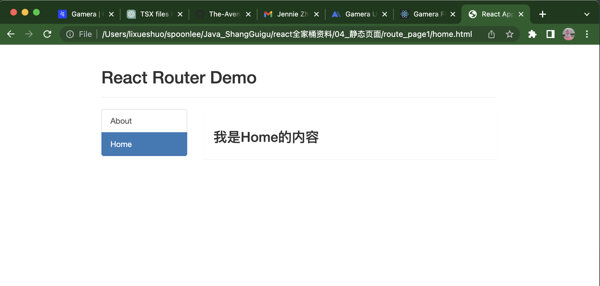

:book: [react router 1h tutorial](https://reactrouter.com/en/6.8.1/start/tutorial#setup)

---


c5 React router

74-93

# 1. Intro

## 对SPA的理解

74

single page web application SPA 

+ 整个应用**只有一个完整的页面** , 只对应1个 html
+ :star: 点击页面中的链接**不会刷新页面**, ***只会做页面的局部更新***
  + 单页面, 但多组件
+ 数据都需要通过ajax请求获取, 并在前端异步展现

:gem: 静态页面 > route_page1: 多页面例子 

```js
// 点击nav其实是其实是两个页面跳转, 渲染起来很低效
127.0.0.1:5501/home.html	
127.0.0.1:5501/about.html
```

使用react router, 实现的就是单页面




## 对路由的理解

75

### 什么是路由

使用react router, 点击About, 改变浏览器的地址从`127.0.0.1:5501 --> 127.0.0.1:5501/home `, 然后浏览器监测到地址改变就去匹配对应的组件, 右侧展示区显示About组件的内容; 点击Home, 右侧展示Home组件的内容


即 一个浏览器地址路径 对应 一个组件: 映射关系 

```js
key: value
path: component 
/home ---> Home
```

:bangbang: url中的 127.0.0.1:5501 不会参与组件匹配, 只是它后面的`/home`作为key, 映射到Home component


一个路由就是一个映射关系 (key: value)

key为路径, value可能是function(主要是后端API) 或 component


### 路由分类

+ 后端路由
  + 理解: value是function, 用来处理客户端提交的申请
  + 注册路由: router.get(path, function(req, res))
  + 工作过程: 当node接收到一个请求时, 根据请求路径找到匹配的路由, 调用路由中的函数来处理请求, 返回响应数据
+ 前端路由
  + 浏览器路由, value是component, 用于展示页面内容
  + 注册路由: <Router path="/test" component = {test}>
  + 工作过程: 当浏览器的path变为`/test`时, 当前路由组件就会变为Test组件


### 前端路由的工作原理

76


前端路由的基础: browser的history


BOM(浏览器对象)上有一个history属性, 对它进行操作可以实现路径的变化

:gem: e.g. 视频有例子, 这里不展示了


浏览器的历史记录是栈结构

```js
history.push() 			// 押入 一条历史记录

history.replace()		// 替换 栈顶的历史记录
```


# 2. 路由的使用


## 2.1 路由的基本使用

77

react-router-dom (需要另外下载)

+ react的一个插件库
+ 专门用来实现一个SPA应用
+ 基于react的项目基本都会用到此库


React-router-dom 相关API


15min- 开始写demo

路由其作用的基本的流程: 点击button引起路径变化 ---> router监测到路径变化, 从而匹配组件展示组件


>  安装react router dom, 课程里老师用的5版本. 6版本更新后有兼容性问题
>
> `npm i react-router-dom@5`


-35min

实现点击button切换路径

:gem: 见本md同路径下的react-router app


总结 分两步

首先明确界面中的导航区, 展示区

App.tsx中

+ Step1: 在导航区, 编写路由链接 描述如何切换路径
  + `<Link>`, 写法和`<a>`类似, 点击Link元素, 切换到指定路径 `to = '/pathDesired'`; 其实编译下去在浏览器端把`<Link>`转化为了`<a>`

```react
<Link className="list-group-item active" to="/about">About</Link>
<Link className="list-group-item active" to="/home">Home</Link>
```

+ Step2: 在展示区, 注册路由 描述路径与组件的映射关系
  + `<Route>` 用来指定一个路径与一个组件的映射关系
  + `<Routes>`: `<Route>`应该写在`<Routes>`的里面

```react
<Routes>
  <Route path="/about" element={<About/>}/>	
  <Route path="/home" element={<Home/>}/>
</Routes>
```


:bangbang: `<BrowserRouter>`直接包住`<App>`, 就让整个页面受**同一个**BrowserRouter管理了

index.tsx (entry tsx file)中

```react
const root = ReactDOM.createRoot(
  document.getElementById('root') as HTMLElement
);
root.render(
  <React.StrictMode>
    <BrowserRouter>
      <App />
    </BrowserRouter>
  </React.StrictMode>
);
```


先不关注`<HashRouter>`和`BrowserRouter`的区别


## 2.2 路由组件与一般组件

78

路由组件 vs.一般组件不同之处

1. 写法不同
   + 一般组件 : `<Demo/>`
   + 路由组件: `<Route path="/home" element={<Home/>}>`

2. 存放位置不同

   + 一般组件: 放components文件夹
   + 路由组件: 放pages文件夹, 用的时候是写在`<Route>`里的. 表示当path为...时, 渲染该组件

3. 接收到的props不同 (课上都是用类式组件写的, 而龙哥讲的都是以函数式组件写的, 有关二者的区别问chatGPT)

   以下两点都是基于this.props而言的, 函数式组建没有this

   + 一般组件: 写组件时传递了什么, 就能接收到什么
   + 路由组件: 接收到三个固定的属性 {history, location, match}

```react
history: 
		go: f go(n)
    goBack: f goBack()
    goForwardL f goForward()
    push: f push(path, state)
    replace: f replace(path, state)
location:
		pathname: "/about"
    search: ""
    state: undefined
match:
    params: {}
    path: "/about"
    url: "/about"
```


## 2.3 NavLink的使用

79


---
# 2022补充课程 React router6 127-141


