跳转

+ [CSS selector](./CSS_Sample/Selector/CSS_Selector.html)
+ [block element](./CSS_Sample/Block_Element/Block.html)
+ [block dimension](./CSS_Sample/Block_Dimension/Block_Dimension.html)
+ [block position](./CSS_Sample/Block_Position/Block_Position.html)
+ [flexbox](./CSS_Sample/Flexbox/flexbox.html)


---

Contents

- [1. :full\_moon:选择器](#1-full_moon选择器)
  - [1.1 无括号选择器](#11-无括号选择器)
  - [1.2 有括号选择器](#12-有括号选择器)
  - [1.3 特殊语法 class::宏](#13-特殊语法-class宏)
- [2. :moon: Block element](#2-moon-block-element)
  - [2.1 Basics of Block](#21-basics-of-block)
    - [2.1.1 block 基本属性](#211-block-基本属性)
    - [2.1.2 设置html, body margin \& padding](#212-设置html-body-margin--padding)
    - [2.1.3 border \& border-radius](#213-border--border-radius)
    - [2.1.4 :full\_moon:文档流](#214-full_moon文档流)
      - [2.1.5 Display属性](#215-display属性)
  - [2.2 :star: Position of Block](#22-star-position-of-block)
    - [2.2.1 static (by default)](#221-static-by-default)
    - [2.2.2 :star: relative](#222-star-relative)
    - [2.2.3 absolute](#223-absolute)
    - [2.2.4 :star: relative \& absolute: 位移属性参照物](#224-star-relative--absolute-位移属性参照物)
    - [2.2.5 fixed](#225-fixed)
    - [2.2.6 sticky](#226-sticky)
    - [2.2.7 :star: block的覆盖关系: z-index](#227-star-block的覆盖关系-z-index)
  - [2.3 Dimension of Block](#23-dimension-of-block)
  - [2.4 :star:Flexbox](#24-starflexbox)
    - [2.4.1 Display: Flex](#241-display-flex)
    - [2.4.2 Flex flow](#242-flex-flow)
    - [2.4.3 align-content](#243-align-content)
    - [2.4.4 flex-grow/flex-shrink](#244-flex-growflex-shrink)
    - [2.4.5 :star:content, item \& self](#245-starcontent-item--self)
      - [2.4.5.1 Only flex flow](#2451-only-flex-flow)
      - [2.4.5.2 content](#2452-content)
      - [2.4.5.3 item](#2453-item)
      - [2.4.5.4 self](#2454-self)
    - [2.4.6 order](#246-order)


---
学习资源

---

# 1. :full_moon:选择器
[Learning Material: wc3 selector](https://www.w3schools.com/CSSref/css_selectors.php)

用来修饰HTML元素的格式, 但首先你得选择特定的HTML标签来施加修饰, 这就需要选择器. 选择器作为对HTML element施加样式的基础, 如果写错了, 后面不容易debug


:gem: [选择器demo](CSS_Sample/Selector/CSS_Selector.html)   


## 1.1 无括号选择器
allow us to reach down to branch of tag tree

+ ‘>’ 表示下一层. 
+ 空格表示下属所有.
+ nth:child(int)
  + 需要你首先限定是哪个group的元素 
  + 如果不限定, 那就选择所有组别的nth element
+ 固有标签不需要加.前缀, className前需要.来作为前缀

> 注意写选择器时一定要仔细, 一个符号的差异可能带来完全不同的选择结果, 导致debug时很困难

:gem: e.g.1
如下, 选中所有classname为website的ol标签下的所有li下的所有a元素
```css
ol.website li a{
    text-decoration: none;
}
```

:gem: e.g.2
```html
<header>
  <section class="header_left">
    ...
  </section>

  <section class="header_right">
    ...
  </section>
</header>
```
要选中header下面那个classname为header_left的section元素: 
+ 最准确的写法
  ```css
  header>section.header_left{
    ...
  }
  ```
+ 省略写法(确保header下只有一个classname为"header_left"的元素)
  ```css
  header .header_left{
    ...
  }
  ```
+ 错误写法, 啥也选不中
  ```css
  /*选中className为"header_left"的header元素， 可是html中根本没有这个元素*/
  header.header_left{ 
    ...
  }
  ```

:gem: e.g.3  
[wc3 Selector: nth-child demo](https://www.w3schools.com/CSSref/tryit.php?filename=trycss3_nth-child)


## 1.2 有括号选择器
select tag element based on class name filter

+ 直接选择
   `=`
+ 相关性选择
  `*=`
+ 头尾选择
  `^=`: 开头
  `$=`: 结尾
+ 多个选择器合并选择
  一般用于text的多重filter, 比如先筛出来href和"google"相关的, 再筛出来href是以".com.au"结尾的

## 1.3 特殊语法 class::宏 
注：一下的指令中包含”::”是CSS中为数不多的语句，一般都是”:”

可使用 class::宏来渲染段落的某部分
+ .pseudo::first-letter{}: 只对第一个字母生效
+ .pseudo::first-line{}: 只对第一行生效
+ .pseudo::selection{}:只对用鼠标选中部分生效

除此外, 了解伪元素的概念:
.pseudo::before{}：在元素前跟随，有大用可以做特效（以后会讲）
.pseudo::after{}: 在元素后跟随


# 2. :moon: Block element
即div tag
```html
<div class="block1"></div>
```

## 2.1 Basics of Block
### 2.1.1 block 基本属性
width, height, background
```css
.block1{
  width: 300px;
  height: 300px;
  background: red;
}
```

### 2.1.2 设置html, body margin & padding

如下设置之后, block与网页的间距会消失
```css
html,body{
    margin:0;
    padding:0;
}
```

### 2.1.3 border & border-radius
  
block有圆角
```css
.block1{
    width: 300px;
    height: 300px;
    background: red;
    border: 3px solid black;
    border-radius: 10px;
  }
```

block变成circle
```css
.block1{
    width: 300px;
    height: 300px;
    background: red;
    border: 3px solid black;
    border-radius: 50%;
  }
```

### 2.1.4 :full_moon:文档流

设置两个block, 会发现block2并不是出现在block1的右边, 而是在它下面

事实上, 一个bolck实际上是占一行的文档。Block默认是从左上角开始出现，新的block会占新的一行，而不是出现在旧的block的右边。

```html
  <div class="block1"></div>
  <div class="block2"></div>
```
```css
.block1{
    width: 300px;
    height: 300px;
    background: red;
    border: 3px solid black;
    border-radius: 10px;
}

.block2{
width: 300px;
height: 300px;
background: yellow;
border: 3px solid black;
border-radius: 10px;
}
```

#### 2.1.5 Display属性
block的display属性, 默认是block, 即服从上面的文档流, 一个block结束了, 下一个block从下一行开始;

如果将display设为inline-block, block对外会呈现出inline的性质, 像text一样从左向右排列, 一行满了再去下一行.

```html
  <div class="block1"></div>
  <div class="block2"></div>
  <div class="block2"></div>
```

```css
html,body{
    margin:0;
    padding:0;
}

.block1{
    width: 300px;
    height: 300px;
    background: red;
    border: 3px solid black;
    border-radius: 10px;
    display:block;
}

.block2{
    width: 300px;
    height: 300px;
    background: yellow;
    border: 3px solid black;
    border-radius: 10px;
    display:inline-block;
}
```

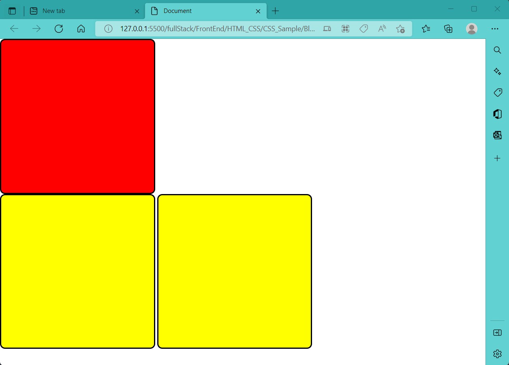

## 2.2 :star: Position of Block
关于block的position属性, 以及位移属性(left, top, right, bottom)

+ 简言之, static的block的位移属性作废, relative与absolute的block的位移属性才生效.
+ absolute的block不参与文档流, relative的block参与文档流
+ 参与文档流的block的位移参照物为其上级中最近的position不是static的block 

### 2.2.1 static (by default)
```css
position: static;
```
Position属性如果是Static，则位移属性（left,right,top,bottom）无效，block的位置完全由文档流决定

### 2.2.2 :star: relative

```css
position: relative
```
此时位移定义可以生效:
+ Left: 使得原来位置在新的位置左侧; right同理
+ Top: 使得原来位置在新的位置上侧; bottom同理

```html
<div class="block1"></div>
<div class="block2"></div>
<div class="block2"></div>
```

```css
html,body{
    margin:0;
    padding:0;
}


.block1{
    width: 300px;
    height: 300px;
    background: red;
    border: 3px solid black;
    border-radius: 10px;
    display:block;
    position: relative;     /*now that left, top works*/
    left: 100px;
    top: 100px;
}

.block2{
    width: 300px;
    height: 300px;
    background: yellow;
    border: 3px solid black;
    border-radius: 10px;
    display:inline-block;
}
```


+ 使用位移属性, 有可能将block移出视口
+ 位移属性优先级顺序: 同时定义了left, right, top and bottom的情况下, left, top优先, right, bottom作废


### 2.2.3 absolute
```css
position: absolute;
```
position为absolute的block将会从文档流中脱离出来. 一般当我们想要将某个block移动到某个想要位置时会用position: absolute;

+ **文档流**这里指的是，默认情况下，一个block从左上角开始，其实是占一行，下一个block直接从下一行开始而不是接着上一个block的右边开始，当然你可以通过将display属性从默认的block改为inline-block，使得下一个block接着上一个block的右边开始。总之文档流指的是一种文档的布局排布序列，从上到下，从左到右。
+ **脱离文档流**的意思是，不影响接下来block的布局排序，但其自身还是遵从文档流，跟着上一个block, 如蓝色的block还是在绿色的block的下一行

> 疑问：如果连写俩absolute sub block会怎么样？还是各自一行吗？还是重叠在一起？我倾向于重叠在一起

```html
<div class="block1">
    <div class="sub_block1"></div>
    <div class="sub_block2"></div>
    <div class="sub_block3"></div>
</div>
```
```css
html,body{
    margin:0;
    padding:0;
}

.block1{
    width: 500px;
    height: 500px;
    background: red;
}

.sub_block1{
    width: 100px;
    height: 100px;
    background: yellow;
}

.sub_block2{
    width: 100px;
    height: 100px;
    background: lightgreen;
    position: absolute;     /*isolate sub_block2 from document flow*/
}

.sub_block3{
    width: 100px;
    height: 100px;
    background: purple;
    position: relative;     /*now that displacement attributes works*/
    left: 50px;
    top: 50px;
}
```
将sub_block2从文档流独立出去, sub_block3的位置紧跟上一个在文档流中的元素(sub_block1)

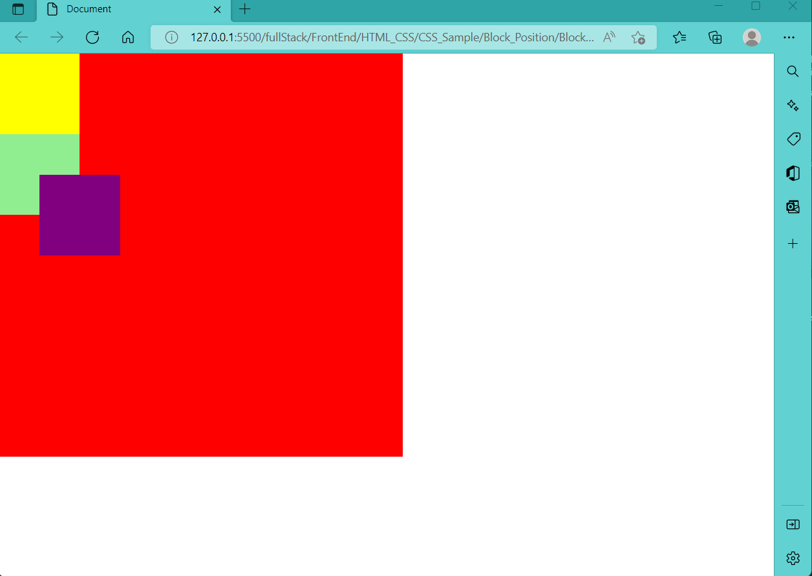

如果将sub_block2算入文档流, 则sub_block3的位置紧跟上一个在文档流中的元素(sub_block2)


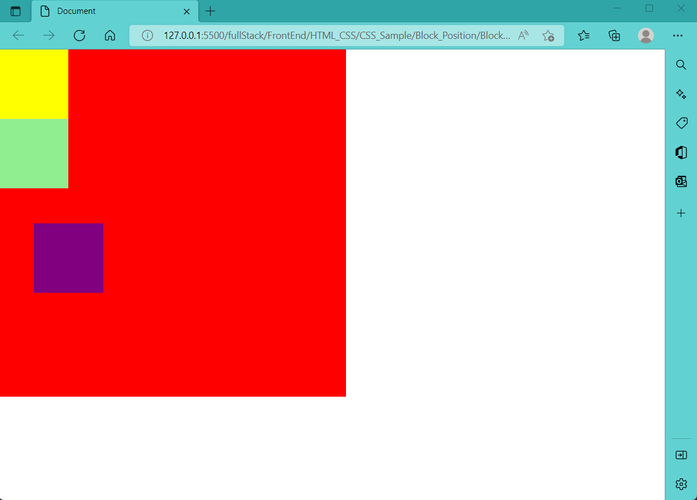

### 2.2.4 :star: relative & absolute: 位移属性参照物

即使position是absolute, 也需要一个参照物来进行计算位移属性; 属性为absolute的block的位移参照物会从上一级的block属性查看。
+ 如果position为absolute的block的上一级block的position属性是static（不写position默认就是static），那么absolute就不会看上一层的，而会再往上一层去看直到block的position**不是static**（如果不是才会将其选择为位移参照物)
  + 如果上一层block的position属性一直都是static, 则会选取整个文档作为参照物，来计算位移属性。有时候发现block没有对齐, 可能就是这个原因!
+ 如果position为absolute的sub-block的上一级block的position属性是relative, 则该sub-block会以上一级的block为参照物来计算位移属性. **因此，一般parent block的position设定习惯上直接写relative，这样child block会选取mother block为位移参照物。**
+ 如果position为absolute的sub-block的上一级block的position属性是absolute, 则该sub-block会以上一级的block作为参照物来计算位移属性. 但注意此时, 上一级的block是独立于文档流的


### 2.2.5 fixed
固定，像狗皮膏药一样贴在一个地方不动

### 2.2.6 sticky
相当于relative和fixed结合


### 2.2.7 :star: block的覆盖关系: z-index


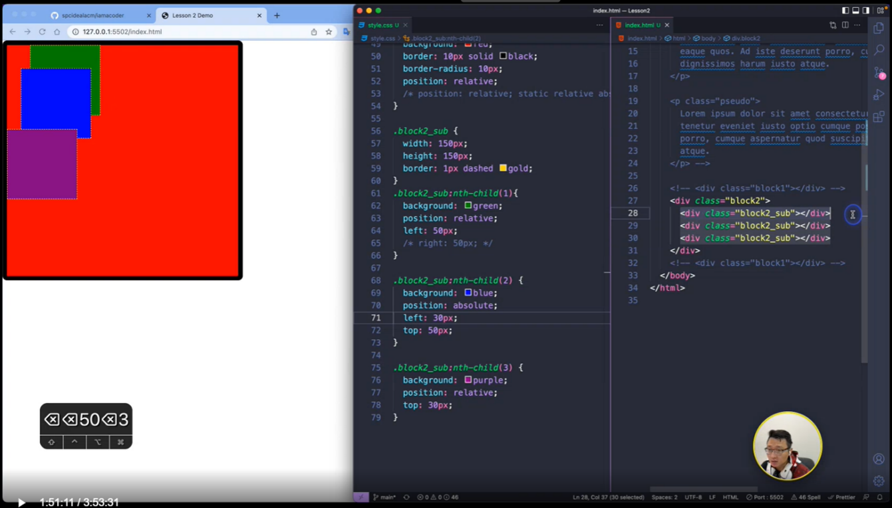

HTML中后面生成的block会优先显示（压在之前的block上）; 但z-index可以调节同层级的优先覆盖关系， z-index一般取值0-999 


## 2.3 Dimension of Block


由内向外, 依次是: content, padding, border, margin, position. ( margin相当于邻居间的间隔, border相当于栅栏宽度, padding相当于自家院子里的草坪宽, content相当于自己的房子)

+ Margin属性，表示该block与其他block之间的最小距离。用margin-left, 还可以单独定义某一边的margin; 下图中，block3(margin为50px)与block4(margin为30px)的距离是50px
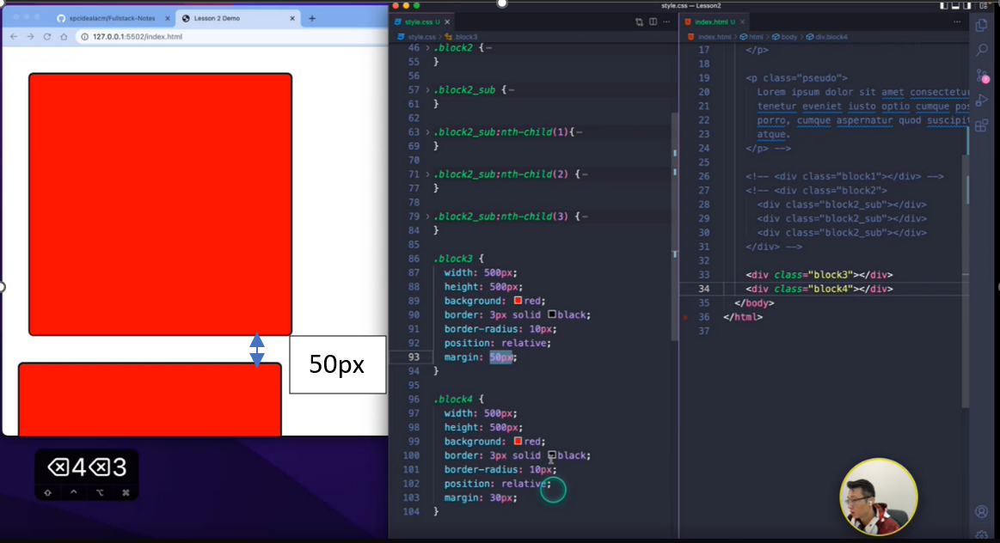

+ 默认情况下, content就是我们定义div时的width和height. 但我们可以定义 
  ```css
  box-sizing： border-box
  ```
  来使得定义div的width和height为包含boder, padding和content的总体dimension. 	一般工作中，我们直接全局定义box-sizing, 这样方便一些. 
  + 如下, 定义一个500*500px的block, 当设定其box-sizing: border-box后, 它的border+padding+content=500
  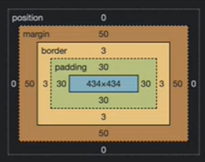


## 2.4 :star:Flexbox
+ 前面的我们如果写多个block, 它们按文档流依次排列下来

  

+ 使用overflow: hidden 来隐藏掉overflow的block
  
  

现在我们来看看如何使得block流动, 呈现一种动态布局

### 2.4.1 Display: Flex


+ 在parent block中未启用display:flex; sub-blocks按文档流竖着排下来
  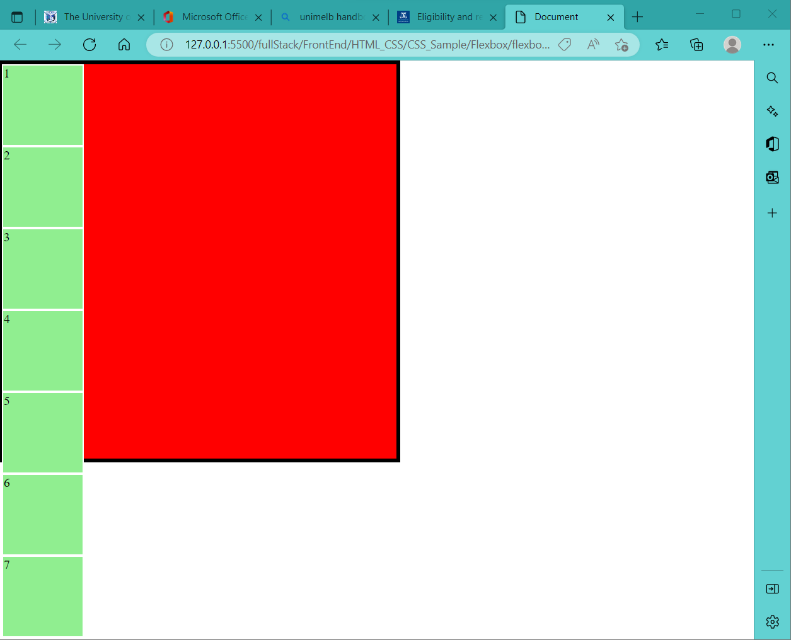

+ 在parent block中启用display:flex; sub-blocks横着挤成一排, 此时sub-block的width,height可能会和定义大小不同.
  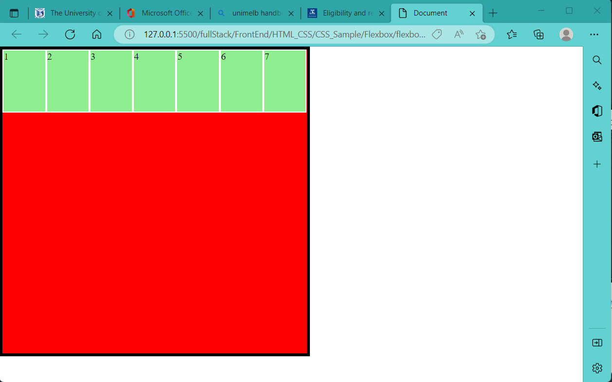

  ```html
    <div class="block1">
        <div class="sub_block1">1</div>
        <div class="sub_block1">2</div>
        <div class="sub_block1">3</div>
        <div class="sub_block1">4</div>
        <div class="sub_block1">5</div>
        <div class="sub_block1">6</div>
        <div class="sub_block1">7</div>
    </div>
  ```

  ```css
  body,html{
      margin: 0;
      padding: 0;
  }

  .block1{
      height: 500px;
      width: 500px;
      background-color: red;
      border: 5px black solid; 
      /* box-sizing: border-box; */
      /* overflow:hidden; */

      position: relative;

      display: flex;         

  }

  .sub_block1{
      height: 100px;
      width:100px;
      background-color: lightgreen;
      border: 2px white solid;
      /* box-sizing: border-box;  */

      position: relative;
  }
  ```


### 2.4.2 Flex flow

在定义了display: flex 之后, 还必须定义flex flow, 这样才能够使得sub-blocks在视口变化时"流动"起来, 后面的justify, align的效果才能生效.

+ 可变视口
  调节body, html中height与width为相对100vh,100vw; 再将block1的height, width调节成相对值, 这样block1便可继承body,html的dimension. 当改变浏览器视口大小时, block1的大小也会随着改变

  ```css
  body,html{
      margin: 0;
      padding: 0;
      height: 100vh;
      width: 100vw;
  }

  .block1{
      height: 50%;
      width: 50%;
      ...
  }

  ```


flex flow包含两个子属性: flex-direction, flex-wrap; 分别定义他们两个或者直接定义flex flow都可, 但一般我们都分别定义. 写的时候不用管flex-direction, flex-wrap的先后顺序.

+ flex-direction
  ```css
  flex-direction: row/row-reverse/column/column-reverse
  ```
  + row: 从左向右排
  + row-reverse： 从右向左排
  + column: 从上向下排
  + column-reverse: 从下向上排

+ flex-wrap
  ```css
  flex-wrap: wrap/wrap-reverse
  ```
  + wrap: 顶天花板开始排
  + wrap-reverse: 顶地板开始排

e.g. sub-block顶天花板开始排, 从右向左排
 


对应code:

```css
body,html{
    margin: 0;
    padding: 0;
    height: 100vh;
    width: 100vw;
}

.block1{
  height: 50%;
  width: 50%;
  ...
  display: flex;    
  flex-direction: row-reverse;  
  flex-wrap: wrap;   
}

```

### 2.4.3 align-content
参见下图(flex flow中的第一个图):

其中sub-block在两行之间是有空隙的, 这是因为align-content默认值为stretch, 会把sub-block在在竖直方向上均匀地排布在parent block中, 例如现在sub-block有两行, 那么每一行地高度都为parent block.height/2

将align-content改为flex-start:

```css
.block1{
    height: 50%;
    width: 50%;
    background-color: red;
    border: 5px black solid; 
    /* box-sizing: border-box; */
    /* overflow:hidden; */

    position: relative;

    display: flex;    
    flex-direction: row-reverse;  
    flex-wrap: wrap;   
    align-content: flex-start;      /*this works*/

}
```

可见此时sub-block行与行之间没有空隙了, sub-block的流动连续了.


### 2.4.4 flex-grow/flex-shrink
单独定义给某个sub-block：
+ flex-grow: 当sub-block的dimension超过原本定义的dimension后继续拉伸, 该sub-block的拉伸速率为原来的n倍
+ flex-shrink: 与flex-grow类似, 收缩速率为原来n倍数
+ Flex-grow和Flex-shrink可以叠加给同一个sub block

```css
.sub_block1:nth-child(3){
    flex-grow: 3;
}
```

### 2.4.5 :star:content, item & self

简言之:
+ 前标justify: 表示水平方向上布局
+ 前标align: 表示竖直方向上布局
+ content优先级高于item (详见2.4.5.3 items)
+ content, items 定义在parent block中, self定义在sub-block中

#### 2.4.5.1 Only flex flow
初始情况：只是设置了flex flow的direction和wrap， 不设置任何和content, item, self有关的属性时（当然他们有默认设置）

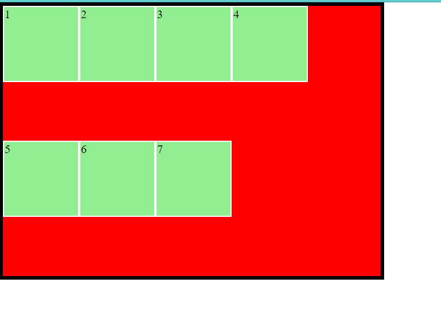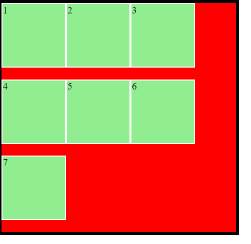

```css
.block1{
    ...
    position: relative;

    display: flex;    
    flex-direction: row;  
    flex-wrap: wrap;   
}
```

#### 2.4.5.2 content

1. Justify-content: center/flex-start/flex-end 

    水平方向上center

    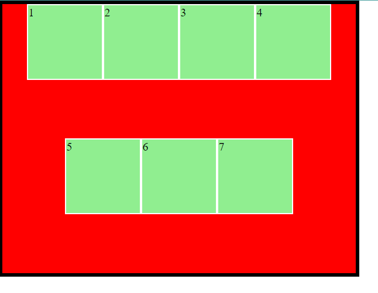
    

    ```css
    .block1{
        ...
        position: relative;

        display: flex;    
        flex-direction: row;  
        flex-wrap: wrap;   

        justify-content: center;    /*this works*/

    }
    ```

    

    其他justify-content属性选项见上图。
    + 其中flex-start, flex-end, center为一组，决定一行的sub block是居左，居右还是居中
    + Space-between, space-around, space-evenly为一组， 决定一行的sub block的gap分布


2. Align-content: center/flex-start/flex-end
    竖直方向上center

     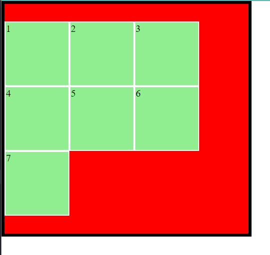

    ```css
    .block1{
        ...
        position: relative;

        display: flex;    
        flex-direction: row;  
        flex-wrap: wrap;   

        align-content: center;
    }
    ```
    

    其他align-content属性选项见上图
    +	Flex-start, flex-end, center为一组，决定sub block整体（竖直方向上没有gap）上在mother block的哪个位置
    +	Stretch, space-between, space-around为一组，这时sub block竖直方向上有gap，区别在于gap的分布. 其中strech为默认设置. 他们的区别在于竖直方向上的gap: stretch是头顶mother block, 脚离mother block; space- between 是头脚顶mother block; space-around则是头脚都不顶mother block


3. Justify-content + Align-content
    水平,竖直方向上都center

     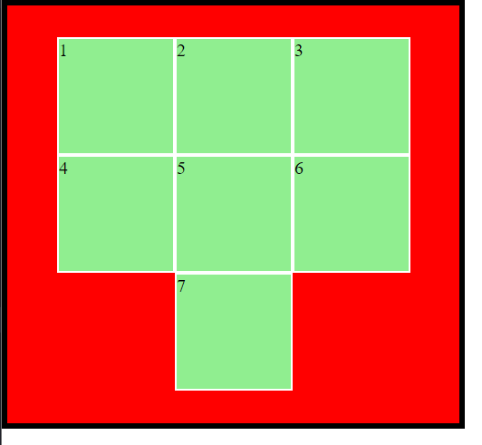

    ```css
    .block1{
        ...
        position: relative;

        display: flex;    
        flex-direction: row;  
        flex-wrap: wrap;   

        align-content: center;
        justify-content: center;

    }
    ```

#### 2.4.5.3 item
疑问：content, item, self各是什么？

比喻：content是整体合力做事儿，item是统一做某个个体的事儿，self是个体做自己的事儿

1. align-items
    如果只设置align-items: center(上图图一); 可见sub block也是在竖直方向上居中，但是相比align-content: center; 这些sub block并不是合成一体居中，竖直方向上还有gap。

    由此可见，**align-content是比align-items更强烈的一个指令（即align-content优先级高于align-items，当然也高于后面的align-self)**, 如果你同时写align-content: center; 和align-items: center;(不管先后顺序) 你会发现结果和只写align-content:center;一致.

    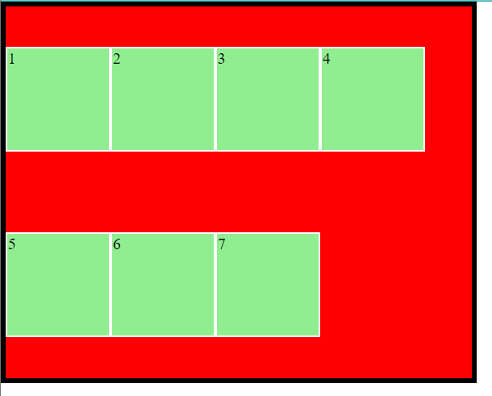

    ```css
    .block1{
        ...
        position: relative;

        display: flex;    
        flex-direction: row;  
        flex-wrap: wrap;   

        align-items: center;  /*每行在竖直方向上居中于其所被分配的空间*/
    }
    ```
    
    其他align-items属性选项见上图

    + Flex-start, flex-end, center为一组
    + Stretch, baseline为一组

  2. justify-content + align-items
    同时定义justify-content: center;(每行水平居中) 和 align-items: center; （每行在竖直方向上居中于其所被分配的空间）会发现水平和竖直方向上sub block在mother block 内部也居中了，但是由于是align-items这个相对较弱的竖直居中条件，sub block们在竖直方向上还是有gap

    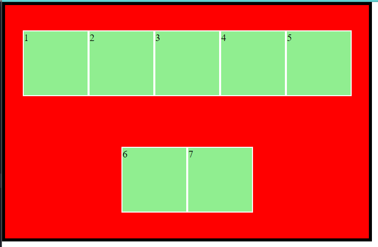

      ```css
      .block1{
        ...
        position: relative;

        display: flex;    
        flex-direction: row;  
        flex-wrap: wrap;   

        justify-content: center;  /*content水平居中*/
        align-items: center;      /*每行在竖直方向上居中于其所被分配的空间*/
      }
      ```

#### 2.4.5.4 self

1. align-self
   + Align-self是单独定义一个sub block的布局，因此必须写在sub-block里，而不是mother block里；前面的flex-flow, flex-direction等等定义的是mother block内的sub block的布局，因此必须写在mother block里。
   + Align-self只能改item, 不能改content，因为content是对整体的布局，是最强的（优先级高于align-self，相关解释见” justify-content + align content” ）。如果mother block的css里写了和content相关的指令，那么align-self就不会生效。

   

   ```css
   .sub_block1:nth-child(3){
       /* flex-grow: 3; */
       align-self: flex-start;
   }
   ```

   
   其他align-self属性选项见上图. 
   + 其中边框为黑色的sub block A是我们想要设置align-self的

### 2.4.6 order
甚至可以自定义排列顺序:

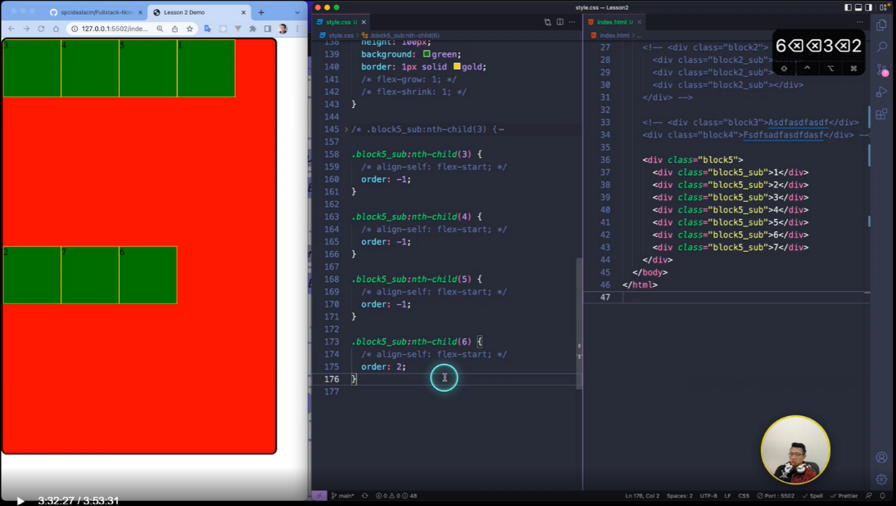

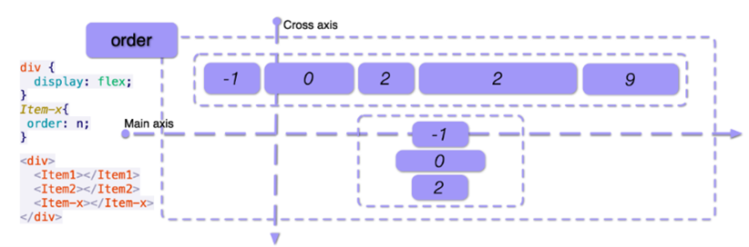

默认order 为0。按上图图二中order取值的顺序排列