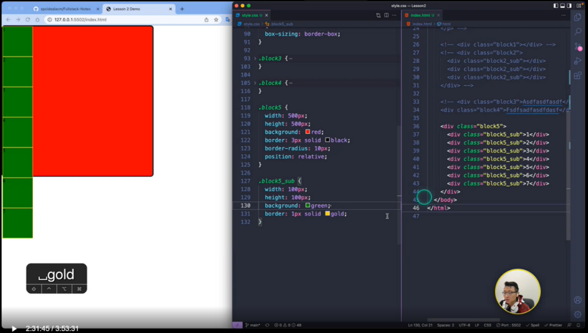

跳转

+ [my_SCSS_notes](./SCSS/my_SCSS_notes.md)

---

Content

一个选择器内的CSS属性大致分为4类:
+ position(定位)
+ dimension(大小)
+ layout(布局)
+ 其他渲染属性
  + text-
  + font-
  + line-
  + background-
  + ...

因而这里我们也采用这种顺序来组织笔记, chap1-2介绍CSS基本语法思想; chap3介绍block element的position, dimension以及layout的控制语句; chap4介绍其他渲染属性(包括text, background)


- [0. BEM命名规范](#0-bem命名规范)
- [1. :full\_moon:选择器](#1-full_moon选择器)
  - [1.1. 基本选择器](#11-基本选择器)
  - [1.2 层次选择器](#12-层次选择器)
    - [1.2.1 基本层级选择器](#121-基本层级选择器)
    - [1.2.2 结构伪类选择器](#122-结构伪类选择器)
  - [1.4 属性选择器](#14-属性选择器)
  - [1.5 :full\_moon: 伪类(pseudo class)](#15-full_moon-伪类pseudo-class)
    - [1.5.1 元素的伪类](#151-元素的伪类)
- [2. CSS基本语法与特性](#2-css基本语法与特性)
  - [2.1 施加CSS的三种方式](#21-施加css的三种方式)
  - [2.2 :full\_moon: CSS三大特性](#22-full_moon-css三大特性)
    - [2.1 层叠性](#21-层叠性)
    - [2.2 继承性](#22-继承性)
    - [2.3 优先级(权重)](#23-优先级权重)
  - [2.3 :full\_moon: 元素模式的转化](#23-full_moon-元素模式的转化)
  - [2.4 Emmet语法](#24-emmet语法)
- [3. :moon: Block element](#3-moon-block-element)
  - [2.0 box model (盒模型)](#20-box-model-盒模型)
  - [2.1 Basics of Block](#21-basics-of-block)
    - [2.1.1 设置html, body margin \& padding](#211-设置html-body-margin--padding)
    - [2.1.2 :full\_moon:文档流](#212-full_moon文档流)
      - [2.1.3 Display属性](#213-display属性)
  - [2.2 :star: Position of Block](#22-star-position-of-block)
    - [2.2.1 static (by default)](#221-static-by-default)
    - [2.2.2 :star: relative](#222-star-relative)
    - [2.2.3 absolute](#223-absolute)
    - [2.2.4 fixed](#224-fixed)
    - [2.2.5 sticky](#225-sticky)
    - [2.2.6 :star: 位移属性参照物](#226-star-位移属性参照物)
    - [2.2.7 :star: block的覆盖关系: z-index](#227-star-block的覆盖关系-z-index)
  - [2.3 :star:Flexbox](#23-starflexbox)
    - [2.3.1 Display: Flex](#231-display-flex)
    - [2.3.2 Flex flow](#232-flex-flow)
    - [2.3.3 align-content](#233-align-content)
    - [2.3.4 flex-grow/flex-shrink](#234-flex-growflex-shrink)
    - [2.3.5 :star:content, item \& self](#235-starcontent-item--self)
      - [2.3.5.1 Only flex flow](#2351-only-flex-flow)
      - [2.3.5.2 content](#2352-content)
      - [2.3.5.3 item](#2353-item)
      - [2.3.5.4 self](#2354-self)
    - [2.4.6 order](#246-order)
- [4. 其他渲染属性](#4-其他渲染属性)
  - [4.1 :full\_moon: Text](#41-full_moon-text)
    - [4.1.1 常用的Text相关Properties](#411-常用的text相关properties)
    - [4.1.2 text属性单位](#412-text属性单位)
      - [4.1.2.1 长度属性](#4121-长度属性)
      - [4.1.2.2 颜色属性](#4122-颜色属性)
  - [4.2 :full\_moon: Background](#42-full_moon-background)
- [5. CSS动态效果](#5-css动态效果)
  - [5.1 media query](#51-media-query)


---
学习资源

[mozilla CSS](https://developer.mozilla.org/en-US/docs/Web)

---
# 0. BEM命名规范

BEM命名规范用来提高代码可读性, 用来命名class, 分为三部分:
block__element--modifier

用2\*underline和2\*dash来分隔classname

:gem: [BEM命名规范](./CSS_Sample/BEM/03-bem.html)


# 1. :full_moon:选择器
[Learning Material: wc3 selector](https://www.w3schools.com/CSSref/css_selectors.php)

用来修饰HTML元素的格式, 但首先你得选择特定的HTML标签来施加修饰, 这就需要选择器. 选择器作为对HTML element施加样式的基础, 如果写错了, 后面不容易debug


:gem: [选择器demo](CSS_Sample/Selector/CSS_Selector.html)   


selector| 代码模板| e.g.| description|
-----|-----|-----|----|
通用选择器| * | *{}|选择所有元素
属性选择器|[<条件>]| [href]{}、[attr=”val”]{}|根据属性选择元素
并级选择器|选择器,选择器|em,strong{} | 同时匹配多个选择器，取多个选择器的并集
后代选择器|选择器 选择器|.asideNav  li {} |先匹配第二个选择器的元素，并且属于第一个选择器内
子代选择器|选择器>选择器|ul>li{} | 匹配匹配第二个选择器，且为第一个选择器的元素的后代
兄弟选择器|选择器+选择器|p+a{} |匹配紧跟第一个选择器并匹配第二个选择器的元素，如紧跟p元素后的a元素
伪选择器|: :伪元素 OR: 伪类|p::first-line{}、a:hover{} |伪选择器不是直接对应HTML中定义的元素，而是向选择器增加特殊的效果


## 1.1. 基本选择器

+ 标签选择器 
固有标签不需要加.前缀
  ```css
  p, div{...}
  ```
+ 类选择器 
className前需要.来作为前缀
  + 在同一页面可以多次使用(最常用) 
  ```css
  .imageContainer{...}  /*选中所有class="imageContainer"的元素*/
  ```
+ ID选择器
  + 同一页面只能使用1次  
  ```css
  #id1{...}     /*选中id="id1"的那一个元素*/
  ```

优先级: ID selector>类selector>标签selector>通配符选择器; 
 + 优先级高的会覆盖优先级低的
+ 关于优先级具体参见[2.3 优先级(权重)](#23-优先级权重)

:gem: [multi-className selector](./CSS_Sample/Selector/06-multiClassNameSelector.html)
:gem: [select all](./CSS_Sample/Selector/08-selectAll.html)

---

Q&A: ID与name属性的区别
+ ID具有唯一性
+ name属性
  + 可以结合JS中的getElementByName()来查找元素
  + 当HTML的`<input>`的type="radio"时, 多个相同name的`<input>`才能被算为一组实现单选功能
    + class属性也可实现将不同种类的的标签归为一个类别. 不同标签可以使用相同的类名, 主要用于css选择

## 1.2 层次选择器
allow us to reach down to branch of tag tree

### 1.2.1 基本层级选择器

+ 子类(child)选择器
  + `A>B{...}`, 用`>`连接两个元素, 表示选中A的子代B, A与B之间只有`>`没有其他任何符号. 
+ 后代(descendant)选择器
  + `A B{...}`, 用空格连接两个元素, 表示选中A下属所有(后代)B.

### 1.2.2 结构伪类选择器


+ nth:child(int)
  + 需要你首先限定是哪个group的元素 
  + 如果不限定, 那就选择所有组别的nth element


> 注意写选择器时一定要仔细, 一个符号的差异可能带来完全不同的选择结果, 导致debug时很困难

:gem: e.g.1
如下, 选中所有classname为website的ol标签下的所有li下的所有a元素
```css
ol.website li a{
    text-decoration: none;
}
```

:gem: e.g.2
```html
<header>
  <section class="header_left">
    ...
  </section>

  <section class="header_right">
    ...
  </section>
</header>
```
要选中header下面那个classname为header_left的section元素: 
+ 最准确的写法
  ```css
  header>section.header_left{
    ...
  }
  ```
+ 省略写法(确保header下只有一个classname为"header_left"的元素)
  ```css
  header .header_left{
    ...
  }
  ```
+ 错误写法, 啥也选不中
  ```css
  /*选中className为"header_left"的header元素， 可是html中根本没有这个元素*/
  header.header_left{ 
    ...
  }
  ```

:gem: e.g.3  
[wc3 Selector: nth-child demo](https://www.w3schools.com/CSSref/tryit.php?filename=trycss3_nth-child)


## 1.4 属性选择器
select tag element based on class name filter

selector|description
-----|-----
E[attr] | 选择匹配具有属性attr的E元素
直接选择: E[attr=val] | 选择匹配具有属性attr的E元素,并且属性值为val（其中val区分大小写）
开头选择: E[attr^=val] | 选择匹配元素E，且E元素定义了属性attr，其属性值是以val开头的任意字符串
结尾选择: E[attr$=val] | 选择匹配元素E，且E元素定义了属性attr，其属性值是以val结尾的任意字符串
相关性选择: E[attr*=val] | 选择匹配元素E，且E元素定义了属性attr，其属性值包含了“val”，换句话说，字符串val与属性值中的任意位置相匹配

+ 多个属性选择器可以合并选择
  一般用于text的多重filter, 比如先筛出来href和"google"相关的, 再筛出来href是以".com.au"结尾的

```css
a[href="https://example.org"]
{
  color: green;
}
```

## 1.5 :full_moon: 伪类(pseudo class)

[mozilla pseudo class](https://developer.mozilla.org/en-US/docs/Web/CSS/:active)

[mozilla pseudo element](https://developer.mozilla.org/en-US/docs/Web/CSS/::after)

注：一下的指令中包含”::”是CSS中为数不多的语句，一般都是”:”

可使用 class::宏来渲染段落的某部分
+ .pseudo::first-letter{}: 只对第一个字母生效
+ .pseudo::first-line{}: 只对第一行生效
+ .pseudo::selection{}:只对用鼠标选中部分生效

除此外, 了解伪元素的概念:
.pseudo::before{}：在元素前跟随，有大用可以做特效（以后会讲）
.pseudo::after{}: 在元素后跟随


### 1.5.1 元素的伪类

以`<a>`为例: `<a>`的伪类代表`<a>`的某种状态, 可以理解为`<a>`的状态选择器(state selector)

伪类名称|含义|实例
-----|-----|-----
a:link|未单击hyperlink时的状态| a:link{color:#9ef5f9;}
a:visited|单击hyperlink后的状态| a:visited {color:#333;}
a:hover|鼠标悬浮在Hyperlink时的状态| a:hover{color:#ff7300;}
a:active|鼠标单击hyperlink, 但未释放时的状态| a:active {color:#999;}

+ 类似的, .className:hover{...}代表用标签选择器选中的元素的悬浮伪类

:gem: [`<a>`的伪类选择器1](./CSS_Sample/Selector/17-pseudoClassSelector1.html)

:gem: [`<a>`的伪类选择器2](./CSS_Sample/Selector/17-pseudoClassSelector2.html)

:gem: [`<input>` 的 foucs selector](./CSS_Sample/Selector/18-focusSelector.html)

利用元素的伪类可以实现很多花哨的特效, further reading: 
[mozilla Pseudo-class](https://developer.mozilla.org/en-US/docs/Web/CSS/Pseudo-classes)


# 2. CSS基本语法与特性

## 2.1 施加CSS的三种方式
+ 行内样式(只控制一个标签)
  ```css
  <p style="font-size:14px; color:green;">直接在HTML标签中设置的样式</p>
  ```
+ 内部样式表(只控制一个页面)
  写在HTML文件的`<head>`下的`<style>`里
  ```css
  <style>
    h1{color: green; }
  </style>
  ```
+ 外部样式表(可以控制多个页面, 最常用)
  在HTML文件的`<head>`下挂载`<link>`

## 2.2 :full_moon: CSS三大特性
### 2.1 层叠性
+ 样式冲突，后定义的覆盖之前定义的
+ 样式不冲突，不会重叠

:gem: [CSS层叠性](./CSS_Sample/CSS_3Features/26-css%E5%B1%82%E5%8F%A0%E6%80%A7.html)

### 2.2 继承性
+ 子标签会继承父标签的**text相关样式**，比如Text-, font-, line-和color属性会继承。
+ 高度和盒模型内外边距(margin, padding)等**则不会**继承

:gem: [CSS继承性](./CSS_Sample/CSS_3Features/27-css%E7%BB%A7%E6%89%BF%E6%80%A7.html)

### 2.3 优先级(权重)
当一个标签的同一个属性在不同的选择器中被同时定义了多次时, 由优先级来确定到底启用哪一个被定义的属性.

除去层叠性带来的优先级(后定义的覆盖之前定义的), 以下优先级等级(权重)也被用来解决定义属性冲突的问题:


+ 上表的解读
  + 通过ID选择器定义的属性的权重为B
  + 通过class/attribute选择器定义的属性的权重为C
  + 通过标签/伪类选择器定义的属性的权重为D
  + 继承下来的属性没有权重.
+ 权重最高的才会被采用 (A>B>C>D>none); 
+ 如果是权重相同的选择器, 越具体的选择器优先级越高, 这也符合直觉常理
  ```css
  ul li{...}  /*优先级高于li{...}*/

  li{...}
  ``` 
+ 权重可以被`!important`来被忽略掉
  + 一般情况下, `!important`的使用非常谨慎, 用的很少 
  +  :question: `!important`被忽略掉到底啥意思, 是指权重为0吗? 还是指-1? 实例告诉我们忽略掉权重也大于0

:gem: [CSS优先级](./CSS_Sample/CSS_3Features/28-css%E4%BC%98%E5%85%88%E7%BA%A7.html)

:gem: [权重注意点](./CSS_Sample/CSS_3Features/29-css%E6%9D%83%E9%87%8D%E6%B3%A8%E6%84%8F%E7%82%B9.html)

:gem: [权重的叠加](./CSS_Sample/CSS_3Features/30-%E6%9D%83%E9%87%8D%E7%9A%84%E5%8F%A0%E5%8A%A0.html)

## 2.3 :full_moon: 元素模式的转化

[myHTMLNotes: #1. HTML basic tags](../HTML/myHTMLNotes.md)

元素模式|元素排列|设置样式|默认宽度|包含
-----|-----|-----|-----|-----
块级元素 block |  一行只能放1个block元素 | 可以设置宽高 | 容器的100%| 可以包含任何标签
行内元素inline |  一行内可以放多个inline元素 | 不可以直接设置宽高(强行设置会被忽略掉) | 本身内容的宽度 | 容纳文本或其他行内元素
行内块元素inline-block |  一行内可以放多个inline-block元素 | 可以设置宽高 | 本身内容的宽度 | 

+ 元素的模式是可以相互转化的!
+ ``, `<input>`,`<td>`都属于inline-block element :question:和HTML notes冲突了
+ `<a>`虽然作为inline element,  但a里不能再放a了, 但a里可以放block element


:gem: [inline-block element](./CSS_Sample/Element_mode/19-inline-block_element.html)

:gem::star: [tag element mode conversion](./CSS_Sample/Element_mode/20-elementModeConversion.html)


## 2.4 Emmet语法

快速生成HTML结构的语法
```css
div*5

div>span

div+p   

div.class1

div#id1

ul>li#id2

div.demo$*5 /*class name中的数递增*/

div{hello}  /*tag内容*/

div{$}*5    /*内容中的数字递增*/
```

CSS简写: 只打首字母
```css
text-align: center; 
/* type in tac */

text-indent:2em;
/* type in ti2 */

```

# 3. :moon: Block element
即div tag
```html
<div class="block1"></div>
```

这部分介绍block element的position, dimension以及layout的控制语句


## 2.0 box model (盒模型)


先介绍dimension properties of a block


margin相当于邻居间的间隔, border相当于栅栏宽度, padding相当于自家院子里的草坪宽, content相当于自己的房子

:gem: [box model](./CSS_Sample/Block_Dimension/31-boxModel.html)

:gem: [block dimension](./CSS_Sample/Block_Dimension/Block_Dimension.html)


如图, 一个box涉及到的dimension由外而内依次是:
+ top, left...等位移属性, 是相对于位移属性参照物而言, 见[2.2.4 位移属性参照物](#224-star-位移属性参照物)
+ margin (邻居间的间隔), 外边距
Margin属性，表示该block与其他block之间的最小距离. e.g.如果block1(margin:30px)与block2(margin:50px), 那么他们俩之间实际间距是50px;
  + margin的'重载'
    ```css
    margin: 上下 左右;      /*2个argument*/
    margin: 上 左右 下;     /*3个argument*/
    margin: 上 右 下 左;    /*4个argument*/
    ```
    + 除了使用margin一起定义上下左右, 还可以单独定义某一边的margin (如margin-left...);
  + margin 还可以用来让**box水平居中**(而不是box中的内容水平居中, 见[text居中](#41-full_moon-text)), 满足两个条件:
    + box已经定义了width
    + box左右外边距都为auto
    ```css
    Margin: 0 auto;   /*上下外边距为0, 左右外边距auto*/
    ``` 
    :gem: [用margin实现box水平居中](./CSS_Sample/Block_Dimension/33-margin%E6%B0%B4%E5%B9%B3%E5%B1%85%E4%B8%AD.html)
  + [mozilla: margin collapse](https://developer.mozilla.org/en-US/docs/Web/CSS/CSS_Box_Model/Mastering_margin_collapsing) :question: 没太懂
    :gem: [margin合并塌陷](./CSS_Sample/Block_Dimension/34-margin合并塌陷.html) 
+ border
  + block有圆角
    ```css
    .block1{
        width: 300px;
        height: 300px;
        background: red;
        border: 3px solid black;
        border-radius: 10px;
      }
    ```

  + block变成circle
    ```css
    .block1{
        width: 300px;
        height: 300px;
        background: red;
        border: 3px solid black;
        border-radius: 50%;
      }
    ```
+ padding  (自家院子), 内边距
  + padding的'重载', 和margin类似
+ content (自家房子)


---

盒模型注意事项:
+ 网页元素很多都带有默认的内外边距，而且不同浏览器默认的也不一样，因此我们在布局前，要先清除网页元素的默认内外边距.
  ```css
  body,html{
    padding: 0;   /*内边距*/
    margin: 0;    /*外边距*/
  }
  ```
+ 区分几个概念
  + 看到的方块
  即border+padding+content
  + box
  即width, height所定义的区域
  
+ box
  + 默认box是只包含content. 
    + 此时box不等于看到的方块, 因而此时定义padding, border后会看到方块会变大
  + 定义: `box-sizing: border-box;`后, box延伸到包含border (即此时box = border + padding + content).
    + 此box就是我们看到的方块. 
    + 一般工作中，我们直接全局定义box-sizing, 这样方便一些. 
  + 如下, 定义一个500*500px的block, 当设定其box-sizing: border-box后, 它的border+padding+content=500
  

+ 嵌套的box结构
  + 里面的box占据外面的box的content 
    + 不管有没有定义`box-sizing: border-box;` 里面的box都是用外面的box的**content部分**作为边框进行嵌套 
  :gem: [nested boxes](./CSS_Sample/Block_Dimension/nestedBox.html) 


:gem::question: [padding不影响盒子大小的情况](./CSS_Sample/Block_Dimension/32-padding%E4%B8%8D%E4%BC%9A%E5%BD%B1%E5%93%8D%E7%9B%92%E5%AD%90%E5%A4%A7%E5%B0%8F%E6%83%85%E5%86%B5.html)


## 2.1 Basics of Block

### 2.1.1 设置html, body margin & padding

如下设置之后, block与网页的间距会消失
```css
html,body{
    margin:0;
    padding:0;
}
```

### 2.1.2 :full_moon:文档流

设置两个block, 会发现block2并不是出现在block1的右边, 而是在它下面

事实上, 一个block element实际上是占一行的文档。Block默认是从左上角开始出现，新的block会占新的一行，而不是出现在旧的block的右边。

inline-element可以在一行内接连出现

:gem: [block element, inline element](./CSS_Sample/Block_Element/Block.html)


总之, 文档流是页面元素的排布顺序(可能是用array的形式存储的?), 从左到右, 从上到下

+ 表示文档流的数据结构可以认为是父元素的一个field
  + 如果一个页面有多个同级别的父元素, 每个父元素下有多个子元素, 则子元素加入对应父元素的文档流
  + 另外记得如果是block element的嵌套, 子元素都是以父元素的content部分作为外边框来排布, 不管有没有定义`box-sizing: border-box;`

:gem::gem: [文档流与位移属性参照物](./CSS_Sample/Block_Position/Block_Position.html)


#### 2.1.3 Display属性
block的display属性, 默认是block, 即服从上面的文档流, 一个block结束了, 下一个block从下一行开始;

如果将display设为inline-block, block对外会呈现出inline的性质, 像text一样从左向右排列, 一行满了再去下一行.

```html
  <div class="block1"></div>
  <div class="block2"></div>
  <div class="block2"></div>
```

```css
html,body{
    margin:0;
    padding:0;
}

.block1{
    width: 300px;
    height: 300px;
    background: red;
    border: 3px solid black;
    border-radius: 10px;
    display:block;
}

.block2{
    width: 300px;
    height: 300px;
    background: yellow;
    border: 3px solid black;
    border-radius: 10px;
    display:inline-block;
}
```


## 2.2 :star: Position of Block
关于block的position属性, 以及位移属性(left, top, right, bottom)

+ 简言之, static的block的位移属性作废, relative与absolute的block的位移属性才生效.
+ 文档流是一个表示元素排列顺序的数据结构(可能是个array?), 元素们由上到小, 由左到右排列. 不参与文档流的元素不被写入这个数据结构.
+ absolute的block不参与文档流, relative的block参与文档流
+ 位移属性参照物的选取

### 2.2.1 static (by default)
```css
position: static;
```
+ Position属性如果是Static，则位移属性（left,right,top,bottom）无效，block的位置完全由文档流决定
+ 是的, position为static的元素只能认为没有定位, 其位移属性失效, 但元素本身还是参与文档流的

### 2.2.2 :star: relative

```css
position: relative;
```
此时位移定义可以生效:
+ Left: 使得原来位置在新的位置左侧; right同理
+ Top: 使得原来位置在新的位置上侧; bottom同理

```html
<div class="block1"></div>
<div class="block2"></div>
<div class="block2"></div>
```

```css
html,body{
    margin:0;
    padding:0;
}


.block1{
    position: relative;     /*now left, top works*/
    left: 100px;
    top: 100px;

    width: 300px;
    height: 300px;

    display:block;

    background: red;
    border: 3px solid black;
    border-radius: 10px;
}

.block2{
    width: 300px;
    height: 300px;

    display:inline-block;

    background: yellow;
    border: 3px solid black;
    border-radius: 10px;
}
```


+ 使用位移属性, 有可能将block移出视口
+ 位移属性优先级顺序: 如果同时定义了left, right, top and bottom的情况下, left, top优先, right, bottom作废


### 2.2.3 absolute
```css
position: absolute;
```
position为absolute的block将会从文档流中脱离出来. 一般当我们想要将某个block移动到某个想要位置时会用position: absolute;

+ [文档流](#212-full_moon文档流)
+ **脱离文档流**的意思是, 该元素不加入其父元素的表示文档流的数据接结构, 不影响接下来block的布局排序，但其自身还是遵从文档流，跟着上一个在文档流中的element, 如下面e.g.中蓝色的block还是在绿色的block的下一行

> :question:疑问：如果连写俩absolute sub block会怎么样？还是各自一行吗？还是重叠在一起？我倾向于重叠在一起

:gem: [position: absolute](./CSS_Sample/Block_Position/absolute.html)


将sub_block2(绿色)从文档流独立出去, sub_block3(紫色)的位置紧跟上一个在文档流中的元素(sub_block1)


如果将sub_block2(绿色)算入文档流, 则sub_block3(紫色)的位置紧跟上一个在文档流中的元素(sub_block2)


### 2.2.4 fixed
固定，像狗皮膏药一样贴在一个网页视口的一个地方一动不动, 不管你如何scroll up and down

:gem: [fixed](./CSS_Sample/Block_Position/08-fixed.html)

:gem: [Practice: 固定side window到版心右侧](./CSS_Sample/Block_Position/09-%E5%9B%BA%E5%AE%9A%E5%AE%9A%E4%BD%8D%E6%8A%80%E5%B7%A7-%E5%9B%BA%E5%AE%9A%E5%88%B0%E7%89%88%E5%BF%83%E5%8F%B3%E4%BE%A7.html)

### 2.2.5 sticky
[w3school: sticky](https://www.w3schools.com/howto/howto_css_sticky_element.asp)

An element with position: sticky; is positioned based on the user's scroll position.

A sticky element toggles between `relative` and `fixed`, depending on the scroll position. It is positioned relative until a given offset position is met in the viewport - then it "sticks" in place (like position:fixed).

sticky的特点:
+ 以浏览器的可视窗口为参照移动元素 （fixed特点）
+ 粘性定位占有原先的位置 （relative特点）
+ 除了position: sticky, 还需至少定义一个位移属性(滚动后的位置)才能实现sticky的效果

:gem: [sticky](./CSS_Sample/Block_Position/10-sticky.html)


### 2.2.6 :star: 位移属性参照物
一个元素有没有定位会影响到它的子元素的位移属性的参照物如何选择
+ position属性为relative/absolute/fixed的元素是有定位的
+ position为其他的元素是无定位的. 

**位移属性参照物的选择:**
+ 对于position:absolute的element, 其不参与任何元素的文档流 
  + 如果**没有为**position:absolute的元素声明位移属性, 则该元素选取由文档流决定的原来位置为位移属性参照物(:question:位移属性如果不设置, 默认为0吗?我觉得是的), 但其本身并不参与文档流.
  + 如果为position: absolute的元素声明了位移属性 
    + 如果祖先元素有定位(relative,absolute,fixed), 则选取最近一级的有定位的祖先元素为位移属性参照物. 
    + 如果祖先元素均无定位, 则选root element作为位移属性参照物. 
+ 对于position: relative的element, 它参与其父级元素的文档流
  + 选取由其父级元素的文档流决定的原来位置作为位移属性参照物, 不用管其父级元素是否是有定位的.
+ 对于position: fixed的element, 位移属性参照物为browser的viewport, 和父级元素无关, 也不参与任何文档流

:gem::gem: [文档流与位移参照物](./CSS_Sample/Block_Position/Block_Position.html)

### 2.2.7 :star: block的覆盖关系: z-index


HTML中后面生成的block会优先显示（压在之前的block上）; 但z-index可以调节同层级的优先覆盖关系， z-index一般取值0-999 


## 2.3 :star:Flexbox
[mozilla: flex box](https://developer.mozilla.org/en-US/docs/Web/CSS/CSS_Flexible_Box_Layout/Basic_Concepts_of_Flexbox)


+ 前面的我们如果写多个block, 它们按文档流依次排列下来

  

+ 使用overflow: hidden 来隐藏掉overflow的block
  
  

:gem: [Demo: flexbox](./CSS_Sample/Flexbox/flexbox.html)


现在我们来看看如何使得block流动, 呈现一种动态布局

### 2.3.1 Display: Flex


+ 在parent block中未启用display:flex; sub-blocks按文档流竖着排下来
  

+ 在parent block中启用display:flex; sub-blocks横着挤成一排, 此时sub-block的width,height可能会和定义大小不同.
  

  ```html
    <div class="block1">
        <div class="sub_block1">1</div>
        <div class="sub_block1">2</div>
        <div class="sub_block1">3</div>
        <div class="sub_block1">4</div>
        <div class="sub_block1">5</div>
        <div class="sub_block1">6</div>
        <div class="sub_block1">7</div>
    </div>
  ```

  ```css
  body,html{
      margin: 0;
      padding: 0;
  }

  .block1{
      height: 500px;
      width: 500px;
      background-color: red;
      border: 5px black solid; 
      /* box-sizing: border-box; */
      /* overflow:hidden; */

      position: relative;

      display: flex;         

  }

  .sub_block1{
      height: 100px;
      width:100px;
      background-color: lightgreen;
      border: 2px white solid;
      /* box-sizing: border-box;  */

      position: relative;
  }
  ```


### 2.3.2 Flex flow


在定义了display: flex 之后, 还必须定义flex flow, 这样才能够使得sub-blocks在视口变化时"流动"起来, 后面的justify, align的效果才能生效.

+ 可变视口
  调节body, html中height与width为相对100vh,100vw; 再将block1的height, width调节成相对值, 这样block1便可继承body,html的dimension. 当改变浏览器视口大小时, block1的大小也会随着改变

  ```css
  body,html{
      margin: 0;
      padding: 0;
      height: 100vh;
      width: 100vw;
  }

  .block1{
      height: 50%;
      width: 50%;
      ...
  }

  ```


flex flow包含两个子属性: flex-direction, flex-wrap; 分别定义他们两个或者直接定义flex flow都可, 但一般我们都分别定义. 写的时候不用管flex-direction, flex-wrap的先后顺序.

+ `flex-direction`: 流动方向
  定义了flexbox的main-axis, cross-aix runs perpendicular to the main axis; **而main-axis则决定了container内的元素的流向** 后面的一切都和main- & cross axis有关
  + `align-` align elements along the cross-axis
  + `justify-` align elements along the main-axis

  ```css
  flex-direction: row/row-reverse/column/column-reverse
  ```
  + row: main-axis runs from left to right
  + row-reverse: main-axis runs from right to left
  + column: main-axis runs from top to bottom
  + column-reverse: main-axis runs from bottom to top

+ `flex-wrap`
  ```css
  flex-wrap: wrap/wrap-reverse
  ```
  + wrap: 顶天花板开始排
  + wrap-reverse: 顶地板开始排

e.g. sub-block顶天花板开始排, 从右向左排
 


对应code:

```css
body,html{
    margin: 0;
    padding: 0;
    height: 100vh;
    width: 100vw;
}

.block1{
  height: 50%;
  width: 50%;
  ...
  display: flex;    
  flex-direction: row-reverse;  
  flex-wrap: wrap;   
}

```

### 2.3.3 align-content
[mozilla: align-](https://developer.mozilla.org/en-US/docs/Web/CSS/CSS_Flexible_Box_Layout/Basic_Concepts_of_Flexbox#alignment_justification_and_distribution_of_free_space_between_items)

`align-` align elements along the cross-axis

`justify-` align elements along the main-axis


参见下图(flex flow中的第一个图):

其中sub-block在两行之间是有空隙的, 这是因为align-content默认值为stretch, 会把sub-block在在竖直方向上均匀地排布在parent block中, 例如现在sub-block有两行, 那么每一行地高度都为parent block.height/2

将align-content改为flex-start:

```css
.block1{
    height: 50%;
    width: 50%;
    background-color: red;
    border: 5px black solid; 
    /* box-sizing: border-box; */
    /* overflow:hidden; */

    position: relative;

    display: flex;    
    flex-direction: row-reverse;  
    flex-wrap: wrap;   
    align-content: flex-start;      /*this works*/

}
```

可见此时sub-block行与行之间没有空隙了, sub-block的流动连续了.


### 2.3.4 flex-grow/flex-shrink
单独定义给某个sub-block：
+ flex-grow: 当sub-block的dimension超过原本定义的dimension后继续拉伸, 该sub-block的拉伸速率为原来的n倍
+ flex-shrink: 与flex-grow类似, 收缩速率为原来n倍数
+ Flex-grow和Flex-shrink可以叠加给同一个sub block

```css
.sub_block1:nth-child(3){
    flex-grow: 3;
}
```

### 2.3.5 :star:content, item & self

简言之:
+ 前标justify: 表示main-axis方向上布局
+ 前标align: 表示cross-axis方向上布局
+ content优先级高于item (详见2.4.5.3 items)
+ content, items 定义在parent block中, self定义在sub-block中

#### 2.3.5.1 Only flex flow
初始情况：只是设置了flex flow的direction和wrap， 不设置任何和content, item, self有关的属性时（当然他们有默认设置）


```css
.block1{
    ...
    position: relative;

    display: flex;    
    flex-direction: row;  
    flex-wrap: wrap;   
}
```

#### 2.3.5.2 content

1. Justify-content: center/flex-start/flex-end 

    水平方向上center

    
    

    ```css
    .block1{
        ...
        position: relative;

        display: flex;    
        flex-direction: row;  
        flex-wrap: wrap;   

        justify-content: center;    /*this works*/

    }
    ```

    

    其他justify-content属性选项见上图。
    + 其中flex-start, flex-end, center为一组，决定一行的sub block是居左，居右还是居中
    + Space-between, space-around, space-evenly为一组， 决定一行的sub block的gap分布


2. Align-content: center/flex-start/flex-end
    竖直方向上center

     

    ```css
    .block1{
        ...
        position: relative;

        display: flex;    
        flex-direction: row;  
        flex-wrap: wrap;   

        align-content: center;
    }
    ```
    

    其他align-content属性选项见上图
    +	Flex-start, flex-end, center为一组，决定sub block整体（竖直方向上没有gap）上在mother block的哪个位置
    +	Stretch, space-between, space-around为一组，这时sub block竖直方向上有gap，区别在于gap的分布. 其中strech为默认设置. 他们的区别在于竖直方向上的gap: stretch是头顶mother block, 脚离mother block; space- between 是头脚顶mother block; space-around则是头脚都不顶mother block


3. Justify-content + Align-content
    水平,竖直方向上都center

     

    ```css
    .block1{
        ...
        position: relative;

        display: flex;    
        flex-direction: row;  
        flex-wrap: wrap;   

        align-content: center;
        justify-content: center;

    }
    ```

#### 2.3.5.3 item
疑问：content, item, self各是什么？

比喻：content是整体合力做事儿，item是统一做某个个体的事儿，self是个体做自己的事儿

1. align-items
    如果只设置align-items: center(上图图一); 可见sub block也是在竖直方向上居中，但是相比align-content: center; 这些sub block并不是合成一体居中，竖直方向上还有gap。

    由此可见，**align-content是比align-items更强烈的一个指令（即align-content优先级高于align-items，当然也高于后面的align-self)**, 如果你同时写align-content: center; 和align-items: center;(不管先后顺序) 你会发现结果和只写align-content:center;一致.

    

    ```css
    .block1{
        ...
        position: relative;

        display: flex;    
        flex-direction: row;  
        flex-wrap: wrap;   

        align-items: center;  /*每行在竖直方向上居中于其所被分配的空间*/
    }
    ```
    
    其他align-items属性选项见上图

    + Flex-start, flex-end, center为一组
    + Stretch, baseline为一组

  2. justify-content + align-items
    同时定义justify-content: center;(每行水平居中) 和 align-items: center; （每行在竖直方向上居中于其所被分配的空间）会发现水平和竖直方向上sub block在mother block 内部也居中了，但是由于是align-items这个相对较弱的竖直居中条件，sub block们在竖直方向上还是有gap

    

      ```css
      .block1{
        ...
        position: relative;

        display: flex;    
        flex-direction: row;  
        flex-wrap: wrap;   

        justify-content: center;  /*content水平居中*/
        align-items: center;      /*每行在竖直方向上居中于其所被分配的空间*/
      }
      ```

#### 2.3.5.4 self

1. align-self
   + Align-self是单独定义一个sub block的布局，因此必须写在sub-block里，而不是mother block里；前面的flex-flow, flex-direction等等定义的是mother block内的sub block的布局，因此必须写在mother block里。
   + Align-self只能改item, 不能改content，因为content是对整体的布局，是最强的（优先级高于align-self，相关解释见” justify-content + align content” ）。如果mother block的css里写了和content相关的指令，那么align-self就不会生效。

   

   ```css
   .sub_block1:nth-child(3){
       /* flex-grow: 3; */
       align-self: flex-start;
   }
   ```

   
   其他align-self属性选项见上图. 
   + 其中边框为黑色的sub block A是我们想要设置align-self的

### 2.4.6 order
甚至可以自定义排列顺序:


默认order 为0。按上图图二中order取值的顺序排列


# 4. 其他渲染属性

## 4.1 :full_moon: Text 
### 4.1.1 常用的Text相关Properties
+ color          	
+ Text-align         
+ text-indent: 缩进       
+ text-decoration 
+ line-height: top + font-size + bottom
  + 让box内的text的line-height和box height相等, 可以实现box中的text在box内竖直居中
   

---

特殊的:
+ 修饰text中的特定字段:
  ```HTML
  <p>我的母亲有 <span style="color:blue">蓝色</span> 的眼睛。</p>
  ```

:gem: [font style](./CSS_Sample/Text/09-font.html)

:gem: [text](./CSS_Sample/Text/10-text.html)

:gem: [block内的内容居中(2种方式)](./CSS_Sample/Text/21-divTextCenter.html)

### 4.1.2 text属性单位
#### 4.1.2.1 长度属性
长度单位有相对长度单位和绝对长度单位两种类型。
+ 绝对长度单位: px
  + 对应地, px一般用于border或者定位属性 
+ 相对长度单位指相对于另一长度的长度，主要有em、ex、ch、rem(默认1rem=16px)、%和可视区百分比长度单位vw、vh、vmin、vmax
  + em: multiple of the font-size of the element on which it is used
    + 子元素的字体大小的em是相对于父元素的字体大小.
    + 元素的width/height/padding/margin用em的话是相对于该元素的font-size 
  + rem: multiple of the given **root** font-size
    + rem是相对于root(即最高父级), 因而更常用 
    + 默认1 rem = 16px, 但是可以在html{font-size:}改
+ 注意浏览器会有默认最小font-size的设置, 比如chrome默认最小字体为12px

:gem: [em](./CSS_Sample/Size_Unit/01-em.html)

:gem: [rem](./CSS_Sample/Size_Unit/02-rem.html)

#### 4.1.2.2 颜色属性
用十六进制数方式表示颜色值
+ 用rgb()函数方式表示颜色值
  + 每个参数大小0~255 
+ 用rgba()函数方式表示颜色值
  + 比rgb()多了个透明度选项(0~1)

颜色渐变:
+ 线性渐变
颜色沿着一条直线过渡：从左到右、从右到左、从上到下等
```css
linear-gradient ( position,  color1,  color2,…)  /*position: 颜色渐变方向, color1: 起始颜色, color2: 终点颜色*/
```
+ 径向渐变
圆形或椭圆形渐变，颜色不再沿着一条直线变化，而是从一个起点朝所有方向混合


## 4.2 :full_moon: Background
这里的background指往block element(块级元素, 并不仅是`<div>`)中加入background

常用的background属性
+ `background-color`
+ `background-image`
可以通过URL指定值来设定绝对或相对路径指定网页的背景图像，例如，background-image：url（图片路径）
+ `background-repeat`
默认情况下, background image会repeat来占据`<div>`声明的区域
  + repeat-x:图像横向平铺
  + repeat-y:图像纵向平铺
  + no-repeat：不平铺
+ `background-attachment`
  + scroll：背景图像是随内容滚动的(默认);
  + fixed：背景图像固定，即内容滚动而图像不动
+ `background-position`
背景位置，确定背景在`<div>`声明的区域中的水平和垂直位置
  + 该属性可取Xpos和Ypos, 单位是px，分别表示水平位置和垂直位置。还可以使用百分比表示背景的位置, 即X%和Y% 
  + 可以用X、Y方向关键词来表示
    + 水平方向的关键词有左对齐(left), 右对齐（right)和水平居中(center),
    + 垂直方向的关键词有顶部(top)底部(bottom)和垂直居中(center)
    ```css
    /*第一个参数表示水平方向上位置, 第二个参数表示竖直方向上位置*/
    background-position: left center;   /*水平左对齐, 竖直居中*/  
    ```
+ `background-size`
定义背景图片的大小和block element的关系
  + auto(默认值，使用背景图片保持图片的原样)
  + percentage(当使用百分值时，不是相对于背景的尺寸大小来计算的，而是相对于元素宽度来计算的)
  + cover(整个背景图片放大填充了整个元素)
  + contain(让背景图片保持本身的宽高比例，将背景图片缩放到宽度或者高度正好适应所定义背景的区域)
+ `background`
该属性实际上对应上面几个具体属性的取值
  + 如background：url（xxx.jpg）就等价于background-image：url（xxx.jpg）


:gem: [Background-repeat](./CSS_Sample/Background/22-backgroundNoRepeat.html)

:gem: [Background-position](./CSS_Sample/Background/23-backgroundPosition.html)

:gem: [Background fixing](./CSS_Sample/Background/24-backgroundFixing.html)

:gem::star: [Background semi-transparent while text remain solid](./CSS_Sample/Background/25-backgroundSemiTransparent.html)

:question: 最后这个练习里, .hero::before{}和.hero的层级关系是什么?


# 5. CSS动态效果

## 5.1 media query

+ min-width 表示使得{}中语句有效的min width
+ max-width 表示使得{}中语句有效的max width
+ @media 后面那块为true, 才启用{ }中的语句

```css
/* 当 300px <= width  <= 600px时, 启用{ }中的语句}*/
@media screen and (min-width:300px) and (max-width: 600px){
  body{
    background: aqua;
  }
}
```

注意:  
+ 有重叠的区间, 后写的覆盖前面写的
+ 好的规范: 写的时候区间总是先写大的, 再写小的
+ 具体区间的划分看公司的规定

:gem: [@media 区间无冲突](./CSS_Sample/Media_Query/04-media.html)

:gem: [@media 区间有冲突](./CSS_Sample/Media_Query/04-media2.html)


5.2 transition

`transition`使得原本instant的变化变得continuous
  +  注意变化本身不是transition定义的

定义
+ 变化过程的持续时间
+ 变化开始前的延迟时间

```css
/*所有属性连续变化*/
transition: all 0.5s;

/*指定属性连续变化*/
transition: width 1s ease 0s, height .5s ease 1s;
```

:gem: [transition](./CSS_Sample/Transition/11-transition.html)

:gem: [Practice: health bar](./CSS_Sample/Transition/11-transitionPractice.html)

a:hover b 实 现一个元素触发另一个元素的变化, 或者通过JS的event