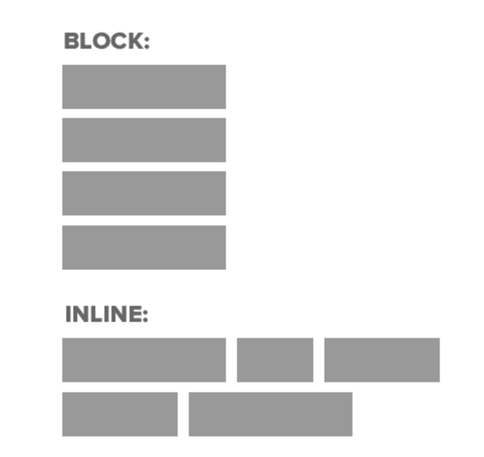
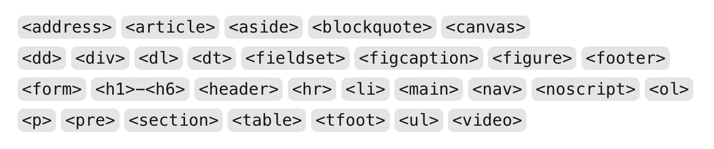
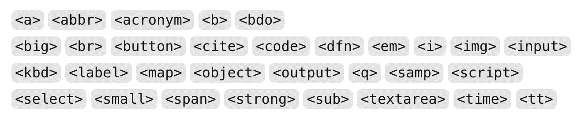
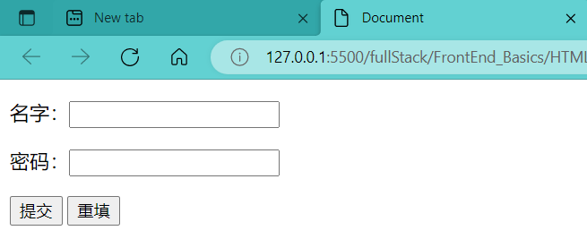
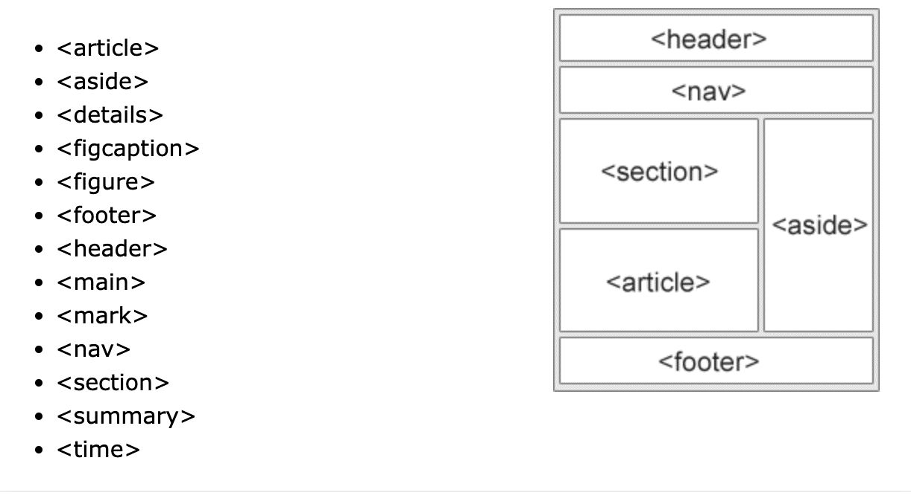

Contents

- [1. HTML basic tags](#1-html-basic-tags)
  - [1.0 布局标签](#10-布局标签)
  - [1.1 文本相关](#11-文本相关)
  - [1.2 :star: multi-media](#12-star-multi-media)
    - [1.2.1 Image](#121-image)
    - [1.2.2 Video](#122-video)
    - [1.2.3 Audio](#123-audio)
  - [1.3 :full\_moon:Hyper-link](#13-full_moonhyper-link)
  - [1.4 注释和特殊字符](#14-注释和特殊字符)
  - [1.5 :full\_moon:`<Form>` \&  `<input>`](#15-full_moonform---input)
    - [`<input>` tag](#input-tag)
  - [1.6 HTML结构元素](#16-html结构元素)
- [2. 注意特殊语法](#2-注意特殊语法)

---
学习资源

[HTML精简笔记](https://www.wolai.com/topcoderdoc/qxVBEVDrfSzif4djdw4hGm)

[JR camp](https://github.com/australiaitgroup/full-stack-bootcamp-wiki)

---

HTML核心

标签格式:
```html
<p class="", ... >html content</p> 
```
+ html content 可以是text, 也可以是html tag, 比如一个表示image或hyper link的tag
+ tag 后面的class name， 可以用来区分相同类型的tag. 在JS中有对应函数可以操纵class name
+ tag的id属性可以uniquely identify某个具体的tag
---


# 1. HTML basic tags
根据HTML基本标签, 先分割UI design, 再结合`文档流`写出一个HTML框架作为写web project的第一步
+ HTML tag element可以分为两类:

  + 块(block-level)级元素
  无论内容多少, 一个标签占一行
  
  + 行内(inline-level)元素
  一行内可以放多个标签元素
  


+ HTML标签本身也可以具有属性, 
如class, id(用来uniquely identify某个标签, 可以是String), name....


## 1.0 布局标签
没有语义, 只是盒子, 用来布局; 

注意不要全都是`<div>`, 要多使用semantic tag, 来增加代码的可读性
+ `<div>`: 一个`<div>`标签占一行; 
+ `<span>`: 一行可以放多个`<span>`标签, 一般用在p, h1..内部用来标识某个特殊内容 

:gem: [div, section, article区别](https://www.jianshu.com/p/b818ceeedd13)


## 1.1 文本相关

+ Heading
        从`<h1>` 到`<h6>` 由大到小有各种不同的 Heading，为页面创造视觉层级效果

+ Paragraph
    + `<p>`里面可以使用`<br/>`换行, `<br/>`是个单标签, 换行两行行间距比较小 
    + 段落与段落会有行间距
+ 水平线标签
`<hr/>`
+ Bold/Italic/Underline/Delete 
使用对应 tag 包住要强调的元素进行加粗或者斜体, 推荐使用更为语义化的标签
  + Bold: `<strong>`, `<b>`
  + Italic: `<em>`, `<i>`
  + Underline:  `<ins>`, `<u>`
  + Delete: `<del>`, `<s>`
+ List 
`<ul>`与`<ol>`下一层都是`<li>`标签, 一个`<li>`标签占一行
`<dl>`标签下是`<dt>`(title)&`<dd>`(description)
  + unorder list
  + order list
  + description list (自定义列表)
[HTML List demo](./HTML_Sample/HTML_LIST.html) (注意其中nested list的写法)


+ table
table head, table row

  HTML `<table>` 快过时了, 因为现在有了新的布局工具

  :gem: [table](./HTML_Sample/HTML_table.html)


## 1.2 :star: multi-media
### 1.2.1 Image
常见的img格式: JPG, 

```HTML
<!--grammer-->
     
```
+ 一般width, height只设置一个(另一个等比例缩放), 设俩容易失真
+ title: 鼠标悬停显示信息

[document: img tag](https://developer.mozilla.org/zh-CN/docs/Web/HTML/Element/img)

```html
     <!--表示当src unavailable时的代替选项-->
```

### 1.2.2 Video
[document: video tag](https://developer.mozilla.org/zh-CN/docs/Web/HTML/Element/video#attr-controls)
```html
<video controls width="250">

    <source src="/media/cc0-videos/flower.webm"
            type="video/webm">

    <source src="/media/cc0-videos/flower.mp4"
            type="video/mp4">

    Download the
    <a href="/media/cc0-videos/flower.webm">WEBM</a>
    or
    <a href="/media/cc0-videos/flower.mp4">MP4</a>
    video.
</video>
```


### 1.2.3 Audio
[document: audio tag](https://developer.mozilla.org/zh-CN/docs/Web/HTML/Element/audio)

## 1.3 :full_moon:Hyper-link
语法
```HTML
<a href="path" target="目标窗口位置"> text or image </a>

<a href="https://www.w3schools.com" target="_blank">Visit W3Schools.com!</a>
```

可实现:
+ 页面跳转 
  + 用target属性定义是在self打开新页面还是另开一个blank page打开新页面
+ 页内跳转(锚链接)
  + 采用id + href="#..."来链接页内跳转标签
    ```html
    <h5 id="is_specified">this is h5</h5>

    <a hrerf="#id_specified">this is a hyperlink</a>
    ```
  + 无跳转: href = "#" 
+ 功能性链接
  + Email
  + QQ
  + MSN... 

:gem: [hyperlink](./HTML_Sample/HTML_hyperlink.html)

## 1.4 注释和特殊字符
+ 空格： &nbsp
+ 大于号: &gt
+ 小于号: &lt
+ 引号: &quot
+ 版权符号: &copy

:gem: [特殊字符](./HTML_Sample/HTML_Special_String.html)

## 1.5 :full_moon:`<Form>` &  `<input>`
HTML5的重要元素, 用来作为用户输入

主要由`<form>`与内嵌的`<input>`及其它辅助标签组成
```html
<!--method属性:规定如何发送表单数据, 常用值：get  | post -->
<!--action属性: 表示向何处发送表单数据-->
<form  method="get" action="result.html">
   <p>  名字：<input name="name" type="text" >  </p>
   <p>  密码：<input name="pass" type="password" >  </p>
   <p>
      <input type="submit" name="button" value="提交"/>
      <input type="reset" name="reset" value="重填“/> 
   </p>
</form>
```




### `<input>` tag

```html
<input  type="text"  name="fname" value="text"/>
```


+ 单多选
  + type="radio" 为单选, 但要确保input标签的name一致
  + type="checkbox"为多选
+ 按钮
按钮类的input tag中value属性的值会反映在按钮上
  + type="submit"为提交按钮
  + type="button"为普通按钮
  + type="reset"为重置按钮
  + type="file"为上传文件按钮
+ 下拉列表: `<select>` & `<option>`
```HTML
<select name="列表名称" size="行数">
<option value="选项的值" selected="selected">…</option >
<option value="选项的值">…</option >
</select>
```

+ 文本相关
  + `<textarea>`
  ```html
  <textarea  name="showText"  cols="x"  rows="y">文本内容 </textarea  >
  ```
  + 只读和禁用
  ```html
  <input name="name" type="text" value="张三"  readonly>
  <input type="submit "  disabled   value="保存" >
  ```
  + autocomplete (on/off)属性, 
  + placeholder属性
  文本框底部文字, 用来提醒输入
  + required属性
  表明该输入是必须的, 不能为空


:gem: [e.g. HTML form](./HTML_Sample/HTML_form.html)

:gem: [Practice: sign up form](./HTML_Sample/signupForm.html)

这个practice中额外的辅助标签:
+ `<fieldset>`
分块
+ `<legned>`
+ `<label>`
点击label转移到input元素

## 1.6 HTML结构元素

一些常用的语义化(semantic)结构元素:

tag | description
-----|-----
header  | 标题头部区域的内容（用于页面或页面中的一块区域）
footer | 标记脚部区域的内容（用于整个页面或页面的一块区域）
section | Web页面中的一块独立区域
article | 独立的文章内容
aside | 相关内容或应用（常用于侧边栏）
nav | 导航类辅助内容





# 2. 注意特殊语法
+ p.active 和p .acitve 的区别 （2h08min-）
前者指p本级有个叫active的class，后者指p下属所有级适用的叫active的class
注解:本级，下属级指代写html时的分属关系，如<p> <em></em>  </p> 中em下属于p
+ Vscode的emmet (快捷指令宏): e.g. 批量写p： p>span.sp-$*6，按tap
