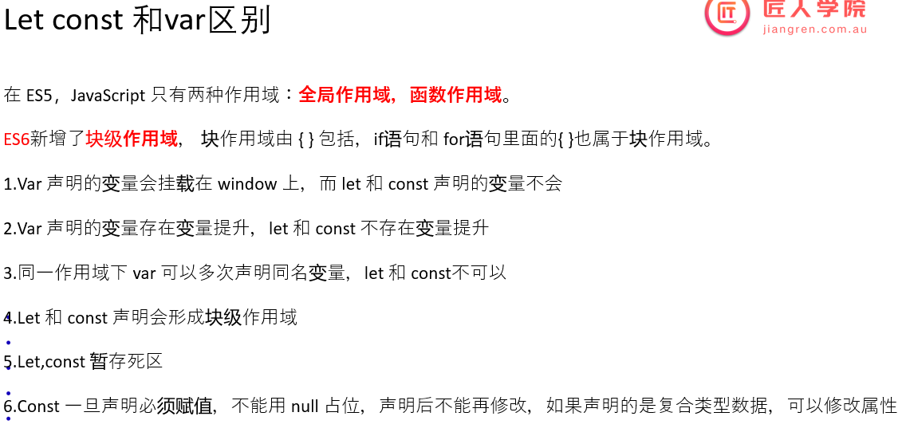
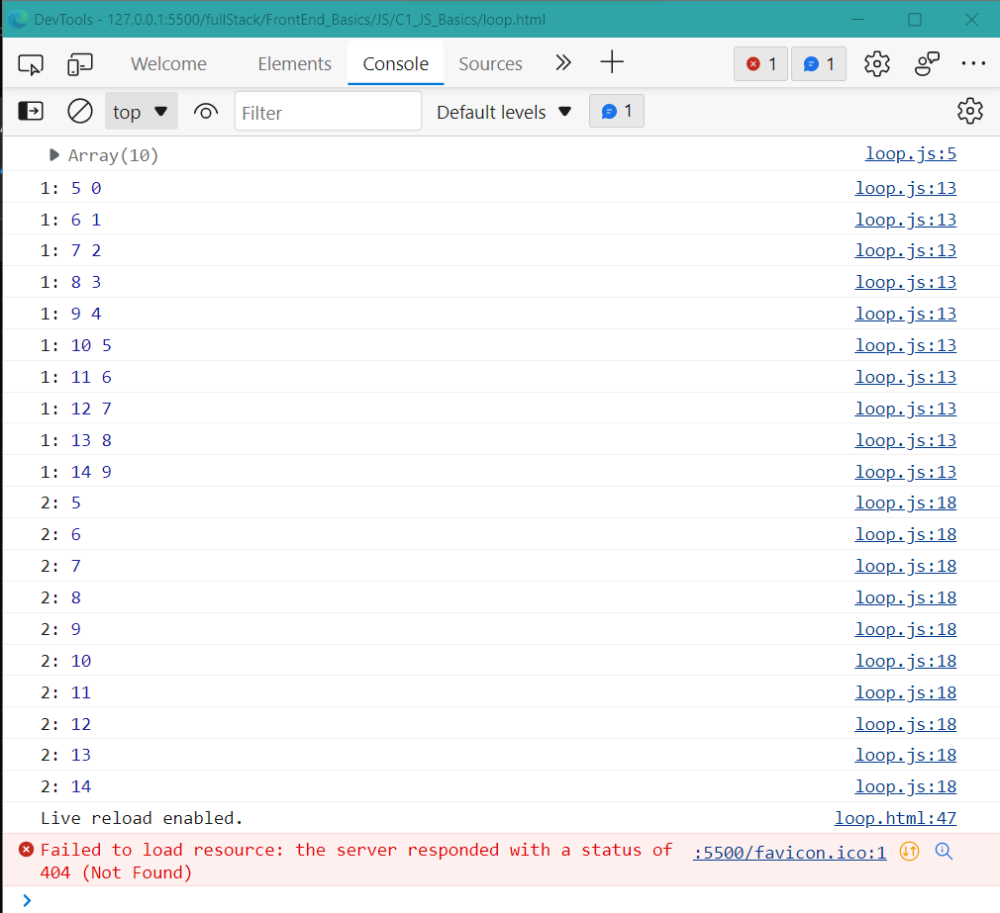
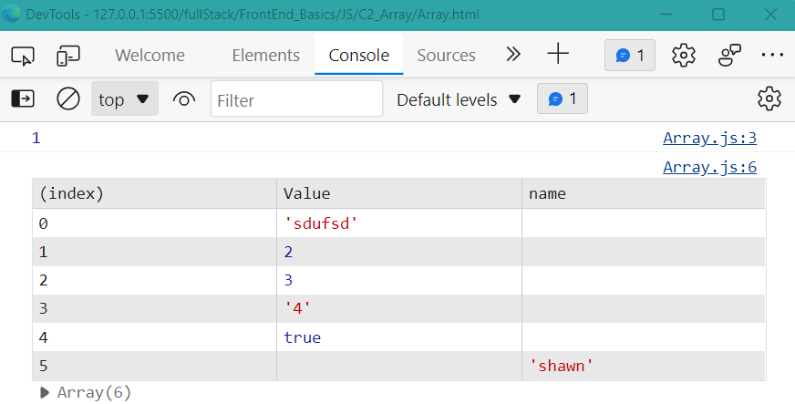
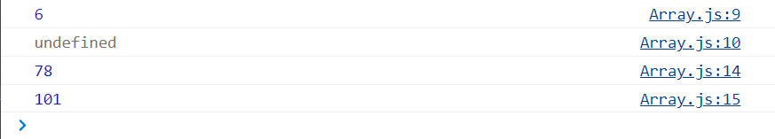
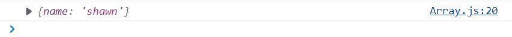

Content

- [1. 变量与打印](#1-变量与打印)
  - [1.0 Var](#10-var)
  - [1.1 Let](#11-let)
  - [1.2 const](#12-const)
- [2. 变量的数据类型](#2-变量的数据类型)
  - [2.1 Number](#21-number)
  - [2.2 Boolean \& if statement](#22-boolean--if-statement)
  - [2.3 String](#23-string)
    - [2.3.1 :star:String连接](#231-starstring连接)
  - [2.4 Data type conversion](#24-data-type-conversion)
- [3. Operator](#3-operator)
  - [3.1 Arithmetic Operator](#31-arithmetic-operator)
  - [3.2 :star: Compare Operator](#32-star-compare-operator)
  - [3.3 三联运算符](#33-三联运算符)
  - [3.4 Logical Operator](#34-logical-operator)
  - [3.5 :moon: Spread Operator](#35-moon-spread-operator)
  - [3.6 严格模式](#36-严格模式)
- [4. Control flow](#4-control-flow)
  - [4.1 switch case](#41-switch-case)
  - [4.2 Loop](#42-loop)
- [5. Array](#5-array)
  - [5.1 初始化Array](#51-初始化array)
  - [5.2 定义新的数组元素](#52-定义新的数组元素)
    - [5.2.1 为Array加入object元素](#521-为array加入object元素)
  - [5.3 :moon: Array Decomposition](#53-moon-array-decomposition)
  - [5.4 :full\_moon: JS array API](#54-full_moon-js-array-api)
    - [5.4.1 map()](#541-map)
    - [5.4.2 filter()](#542-filter)
    - [5.4.3 reduce()](#543-reduce)
  - [5.4.4 forEach()](#544-foreach)
- [5.5 shadowCopy \& deepCopy](#55-shadowcopy--deepcopy)

---

# 1. 变量与打印
[variable.js](./variable.js)

## 1.0 Var

var很少再使用了, 因为它具有很多奇怪的特性, 代码多了容易出错


以下做了解



:gem: [var-let-const区别](./01-let_const_var.html)

## 1.1 Let
定义变量时无需声明类型, 直接用let, 相当于声明变量开辟内存, 之后再次用到变量时不用再let了.
```js
let my_name = "shawn";
console.log(my_name);
```

打印连接两个变量:
```js
let firstName = "shawn",
    lastName = "Li";
console.log(firstName, lastName);

```
'undefined' & 'null':
```js
firstName = undefined; //a type of data, not defined
firstName = null; //a type of data, defined but value is null
console.log(firstName);
```


## 1.2 const

```js
const password = "kjjk";
password = 'aasaaa';         // 会报错

```

+ const 限定一个普通变量后，无法更改，如果更改，就会报错。但是let就没有如此的限制。
+ const 限定一个object type variable, 只是表示这个variable的object type固定无法改, 但object内部的field依然可以改动. 本质上const只是限定变量需要的内存大小.

# 2. 变量的数据类型
变量的数据类型在JS中是implicit的, 不需要explicitly声明

JS基本数据类型
data type | description | default value
-----|------|-----
Number|包含int 和 float类型   | 0
Boolean|    | false
String|   | ""
Undefined| 声明了变量但没给值, int a, a=undefined  | undefined
Null|声明变量为空, int a=null     | null

JS高级数据类型
data type | description | default value
-----|------|-----
Symbol|| 
Bigint|| 
Object|| 


## 2.1 Number

## 2.2 Boolean & if statement
+ True: 字符串(包括字符串0)都是true
+ False: 数字0, null, undefined都是false
```js
//boolean
let c = "0";
let d = undefined;
let e = null;

if (c) {                // c: true
console.log("good");
}

if (!d) {               // d: false
console.log("bad");
} 

if (!e) {               // e: false
console.log("OK");
} 

```

```js 
If(statement){
}else if(statement){
}else if(statement){
}else{
}

```

## 2.3 String

+ `""` & `''`: 用于纯string
+ ``: 适用性更广, 可以引用变量

```js
//data type
let a = 1;
console.log(a);

// "" & '' for pure string -------------------------
let b = "this is a b";
console.log(b);

let b1 = "this is a b1";
console.log(b1);

let b2 = 'he said: "this"';
console.log(b2);

let b3 = "he said: 'this'";
console.log(b3);

// `` 更广的适用性-----------------------------
let b4 = `he said: "a",'b'`;    // `` allows coexisting of '' & ""
console.log(b4);

let b5 = `he said: ${b}`;       // `` allows referencing a variable
console.log(b5);

```


### 2.3.1 :star:String连接
+ 当一个str和一个num相加时，结果的数据类型和被加数一致(和java的print一致)
  + 特别地，+”1”代表将str类型的1转化为num类型. 但是其中的双引号内必须只有数字。
+ JS的`console.log()`支持多个argument(用`,`分隔), 打印结果顺序连接; 而Java中`print()`中只支持1个String, 需要用`+`连接

```js
// data type conversion
let a = 1;
let b = "this is a b";

let b6 = "he said: " + b;   //add up two str: link
console.log(b6);            // he said: this is a b

let b7 = "he said: " + a;   //add num(convert to str first) to the end of str
console.log(b7);            // he said: 1

// +"1": convert string to num ------------------------------
let b8 = "1" + a;           //add num to the end of str
console.log(b8);            // 11

let b9 = +"1" + a;          //convert ”1” to num, then add to a, which is 1
console.log(b9);            // 2

let b10 = "" + 1;           //num to string
console.log(b10, typeof b10);   // 1 string

let b11 = +"1";             //string to num
console.log(b11, typeof b11);   // 1 'number'

```


## 2.4 Data type conversion
numToString
```js
// 1. 把数字型转换为字符串型
let num = 10;
// ----
let str = num.toString();
console.log(str, typeof(str))
// ----
console.log(String(num))
// ----
console.log(num+"")
```
StringToNum
```js
// 把 字符型的转换为数字型 得到是整数?
console.log(parseInt(`3.14`))       // 3
console.log(parseInt(`120px`))      // 120
console.log(parseInt(`rem120px`))   // NaN
// 2. 把 字符型的转换为数字型 得到是小数 浮点数?
console.log(parseFloat(`3.1415926`))    // 3.1415926

// 3. 利用 Number(变量)
var str = "123";
console.log(Number(str))    // 123

// 4.
console.log(typeof(`12`-0))     // number

```

Boolean
```js
//what's the output?
console.log(Boolean(""));         //false
console.log(Boolean(0));          // number 0: false
console.log(Boolean(NaN));        // not a number: false
console.log(Boolean(null));       // false
console.log(Boolean(undefined));  // false
console.log("------------------------------");
console.log(Boolean("123"));      // true
console.log(Boolean("hello"));    // true

```


# 3. Operator
[operator.js](./operator.js)

## 3.1 Arithmetic Operator
+ 加减乘除, 幂数运算, 取余取商
+ 自增自减
```js
// 数值运算符--------------------
let x = 10;
let y = 3;
console.log(x + y);
console.log(x - y);
console.log(x * y);
console.log(x / y);
console.log(x % y);
console.log(x ** y);  //exponential
console.log(Math.sqrt(100));

console.log(x++); // use first then add
console.log(x);
console.log(x--);
console.log(x);
console.log(++x); // add first then use
console.log(x);
console.log(--x);
console.log(x);

let xx = 10;
xx++;
xx = xx + 5;
xx += 5;
xx -= 5;
xx *= 5;
xx **= 5;
xx /= 5;
xx %= 5;

xx ?? 5; // what is it?
```

## 3.2 :star: Compare Operator

[Mozilla doc: === & ==](https://developer.mozilla.org/en-US/docs/Web/JavaScript/Reference/Operators/Strict_equality)

+ =, ==, ===(strict equality)
+ !=, !==
+ 大于,小于

```js
// 比较运算符
let x = 1;
console.log(x > 1); // false
console.log(x >= 1);  // true
console.log(x < 1);  // false
console.log(x <= 1); // true

console.log((x = 1)); // 1
console.log(x == 1); // justify if the value of x equals 1: true
console.log(x === 1); // justify if the value & type of x equals 1: true

//== justify only value, return Boolean
console.log(0 == false);  // true
console.log(0 != false); // false,  != is opposite to ==
console.log(true == 1); // true
console.log(true == 2); // false,  only 1 can == true

// === justify type & value
console.log(0 === false); // false
console.log(0 !== false); // true, !== is opposite to ===
```


## 3.3 三联运算符

```js
let pointers = 100;
if (pointers > 100) {
  console.log("gold");
} else {
  console.log("silver");
}

console.log(pointers > 100 ? "gold" : "silver"); // identical to if else

```


## 3.4 Logical Operator
+ True: 字符串(包括字符串0)都是true
+ False: 数字0, null, undefined都是false

  + &&, ||
    ```js
    console.log(true && true);
    let dayTime = 3;
    if (dayTime > 18 && daytime < 24) {
      console.log("night");
    } else {
      console.log("day");  // go through this branch
    }


    console.log(false || true); // true

    if ((dayTime > 18 && dayTime < 24) || (dayTime > 0 && dayTime < 6)) {
      console.log("night");  // go through this branch
    } else {
      console.log("day");
    }

    ```

+ ||: true & false
  ```js
  console.log(0 || false);          // false, as num 0 is identical to false
  console.log(null || false);       // false
  console.log(undefined || false);  // false
  console.log(NaN || false);        // false
  //
  console.log(3 || false);  // return 3
  console.log(false||10);   // return 10
  console.log(4||10);       // return 4
  ```

  优先return左边的真
  + 如果||左边为真，则return左边的值， 
  + 如果左边为假,右边为真，则return右边的，
  + 如果左右两边都为假，则return false
  Application: 可以用于选择：默认端口||备用端口

+ 取反
  ```js
  console.log(true==2)   // return false
  console.log(!2)  //return false
  ```

## 3.5 :moon: Spread Operator
JS的特色: 用来代表一个array片段

:gem: [Demo: Spread Operator](./10-spread_operator.html)

:gem: [函数的剩余参数](./12-%E5%89%A9%E4%BD%99%E5%8F%82%E6%95%B0.html)


## 3.6 严格模式

```js
"use strict"  //开启严格模式会开启诸多语法的严格限制
```


==
# 4. Control flow
## 4.1 switch case
和java一样
```js
const roles = ["student", "teacher", "boss"];

  let role = roles[2];

  switch (role) {
    case roles[0]:
      console.log("hello!");
      break;
    case roles[1]:
      console.log("!!!");
      break;
    case roles[2]:
      console.log("???");
      break;
    default:
      console.log("aaa");
  }


```
## 4.2 Loop
while, for loop语法和Java基本一致

+ while loop


+ for loop
  ```js
  let newArrayNumber = [];
  for (let i = 0; i < 10; i++) {
    newArrayNumber[i] = i + 5;
  }
  console.log(newArrayNumber);

  ```
+ forEach
  forEach: 专门用来处理数组的, 必须先指定是对那个数组进行forEach
  语法格式：
  Array.forEach()
  括号里一般是一个箭头函数 () =>{}
  ```js
  // forEach: manipulation over each
  newArrayNumber.forEach((num, index) => {
  // num here refers to the element in newArrayNumber 
  // index starts from 0
  console.log("1:", num, index);
  });

  // identical to the above
  for (let i = 0; i < newArrayNumber.length; i++) {
  console.log("2:", newArrayNumber[i]);
  }

  ```

  

  > For和forEach的区别(自己查): forEach是个迭代器; 但是forEach比普通的for loop运行慢很多, 不考虑性能的情况下使用forEach更方便

+ for in & for of


:gem: [Practice: 打印9*9乘法表](./loop.js)


# 5. Array

[Array.js](./Array.js)

## 5.1 初始化Array
要点:
+ 用square bracket
+ index starts from 0
+ Array不算基本数据类型, 变量名采用引用

```js
let array = [1, 2, 3, "4", true, { name: "shawn" }];

console.log(array[0]);   //index starts from 0	

array[0] = "sdufsd";
console.table(array);
```



## 5.2 定义新的数组元素
要点:
+ JS的数组是动态数组, 可以改变长度
+ 超出数组长度的为undefined
+ 可以不连续定义新的数组元素


```js
// 接上面的JS code

console.log(array.length);
console.log(array[6]);        // array[6] = undefined

// 不连续定义数组元素------------------
array[100] = 78;                
console.log(array[100]);
console.log(array.length);  // now length of array is 101

```



### 5.2.1 为Array加入object元素
要点:
+ 必须先指定哪个元素为object type, 再instantiate该object
+ 不能直接为某个元素instantiate
```js
// ...接上面的JS Array code...

array[101] = {};            // 先指定array[101]为object type
array[101].name = "shawn";  // 再instantiate该object
console.log(array[101]);    // now array[101].name displayed
```


## 5.3 :moon: Array Decomposition

:gem: [Demo: array decomposition](./11-arrayDecomposition.html)


## 5.4 :full_moon: JS array API
本质上还是for loop实现某种功能, 只不过封装好代码更加简洁, 直接对array操作

以下API中用到的function()一般为了简洁采用箭头函数

### 5.4.1 map()
manipulate over every elements and in the array, return a new array holding the results

:book: [w3schools: map()](https://www.w3schools.com/jsref/jsref_map.asp)

+ `map()` **returns a new array** from calling a function for every array element.
+ `map()` does not change the original array.

```js
// syntax
array.map(function(currentValue, index, arr), thisValue)

function(currentValue, index, arr){
  ...
  return calculationResultOverAnElement;
}
```

:gem: [Demo: map()](./17-map.html)

### 5.4.2 filter()

从一个array中筛选符合条件的元素

:book: [w3school: filter()](https://www.w3schools.com/jsref/jsref_filter.asp)

+ The `filter()` method **returns a new array** filled with elements that pass a test provided by a function.
+ The `filter()` method does not change the original array.

```js
// syntax
array.filter(function(currentValue, index, arr), thisValue)

function(currentValue, index, arr){
  ...
  return filtering_booleanCondition;
}
```

:gem: [Demo: filter()](./18-filter.html)

### 5.4.3 reduce()

从一个array中提取aggregate信息

:book: [w3school: reduce()](https://www.w3schools.com/jsref/jsref_reduce.asp)

+ The `reduce()` method executes a reducer function for array element.
+ The `reduce()` method **returns a single value**: the function's accumulated result.
+ The `reduce()` method does not change the original array.

```js
// syntax
array.reduce(function(total, currentValue, currentIndex, arr), initialValue)

function(total, currentValue, currentIndex, arr){
  ...
  return 在每个iteration的aggregation语句;
}
```

:gem: [Demo: reduce()](./19-reduce.html)

:gem::gem: [Practice: reduce()](./20-map_filter_reduce.html)

## 5.4.4 forEach()

# 5.5 shadowCopy & deepCopy

针对object或array

+ shadow copy
  复制体和本体share address, 相互关联. 
  + `Object.assign()`
  + `Array.from()`
  + `[...arr]`

  :gem: [shadow copy](./23-shadowCopy.html)

+ deep copy
  复制体和本体在内存中各自独立, 相互不影响
  + `JSON.parse(JSON.stringify(obj))`
    + 但这个方法在copy时会忽略undefine, symbol, function的值 
  + lodash的库方法(更常用): `cloneDeep`
  + browser自带的方法: `structuredClone()`
  :gem: [deep copy](./24-deepCopy.html)