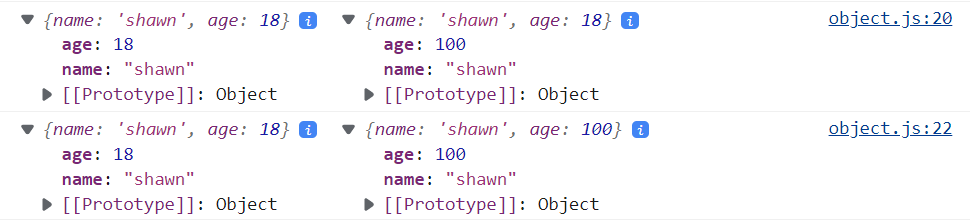

[object.js](./object.js)

# 1. 创建一个object(instance)
```js
let obj = {
    name: "shawn",
    age: 18,
    income: 0,
    arc: {
        a: 222,
        b: 333,
    },
};
console.log(obj);
console.table(obj);
```

# 2. 修改或增加已存在的object的某个field

+ 修改
  + 方式一 使用属性定义
    ```js
    obj.income = 0;
    ```
  + 方式二  使用索引定义
    ```js
    obj['name'] = 'Batman';
    ```

> Note:
> JS中没有锁，意味着你可以修改任何obj, 这带来了极大的不安全性（e.g.你手滑了把name打成了names, 这样就不是修改name的值而是添加了一个新元素，引起了很难察觉到的bug）. 因此在修改obj时需要格外谨慎。不过后端语言有锁，不会让你乱改数据导致此类Bug.

+ 添加
  + 和修改一样


# 3. 关于object的引用
同java一样基本数据类型不需要引用, 但对于object类型(Array也算)的数据, JS依然采用引用: 
```js
object2 = object1; 
```
上面赋值语句代表将object1所引用的在内存中实际的object的地址赋给object2, 此时object1与object2同时指向内存中的同一个object. 

## 3.1 使用展开: {...obj}来传递object的值

展开的意思是, 再在内存中创建一个真实的object, 而不是使用引用, 有点像deepCopy, 但还不完全是deepCopy, 因为展开无法作用于嵌套的object, 只能作用于object内的基本数据类型.

> Note:
> {...object1}只是展开一层object1, 如果一个object1内部嵌套了另一个object2, {...object1}则不会展开内部更深层的object2 （JS此时依然使用object2的引用). 此时需要真正的deepCopy了. 老师的GitHub文档>JavaScript>javascript.xmind>数组的拷贝


e.g. 
```js
let person = {
    name: "shawn",
    age: 18,
};

let person3 = { ...person }; // create a deepCopy of person, assign this deepCopy to person3
console.log(person, person3);
person3.age = 100;          // this only change person3.age
console.log(person, person3);

```



可见此时person和person3之间没有dependency了, person3.age=100只作用了person3. 

另外要注意到JS中的打印不是按程序执行顺序的打印, 而是反映最终状态的. 如上面结果中, 第一次的console.log(person, person3)显示person3的age也变成了最终状态的100.