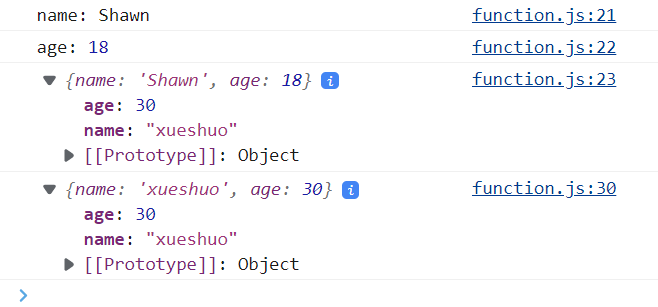
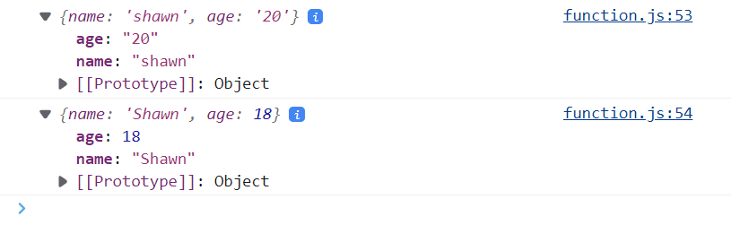

Contents:
- [1. 定义与使用function](#1-定义与使用function)
  - [1.1 Primitive type data as function argument](#11-primitive-type-data-as-function-argument)
  - [1.2 Array as function argument](#12-array-as-function-argument)
  - [1.3 Object type as function argument](#13-object-type-as-function-argument)
- [2. :moon: 箭头函数](#2-moon-箭头函数)
  - [2.1 箭头函数的定义](#21-箭头函数的定义)
- [3. 定义object内部的function](#3-定义object内部的function)
  - [3.1 标准写法](#31-标准写法)
  - [3.2 简略写法](#32-简略写法)

---
学习资源
+ [MDN: function](https://developer.mozilla.org/en-US/docs/Web/JavaScript/Guide/Functions)
+ <<JS高级程序设计>>第10章

---
> JS函数分为命名函数和匿名函数
> + 命名函数: 函数的调用可以在函数定义之前或之后
> + 匿名函数: 函数的调用必须在函数定义之后


:bangbang: 和Java很大的不同是, JS中函数可以作为变量被到处传递(甚至可以被放入数组), 函数变量本质上也是object, 但Java中没有函数变量这种说法, Java只是通过functional interface来完成类似的功能 

# 1. 定义与使用function

A JavaScript function is defined with the `function` keyword, followed by a name, followed by parentheses ().


```js
// type1: standard way to define a function
function name(parameter1, parameter2, parameter3) {
  // code to be executed
}

// type2: anonymous function
let fn = function(){    // 将匿名函数赋值给一个名为fn的变量
  // code to be executed
}
```

+ Accessing a function without () will return the function object instead of the function result.

  ```js
  function toCelsius(fahrenheit) {    //华氏度to摄氏度
    return (5/9) * (fahrenheit-32);
  }
  
  document.getElementById("demo").innerHTML = toCelsius(77);    // return results
  
  document.getElementById("demo").innerHTML = toCelsius;  // return function object
  
  ```
+ Local variable also holds for JS: variable defined within a function can only be used in that function
+ a function without `return` statement will return `undefined` 
  
  
## 1.1 Primitive type data as function argument
因为primitive type argument所需的内存大小已知, 不需要引用

```js
function func2(info) {
  console.log(`${info} juice`); // ${} extract str input
}

func2("orange");
func2("apple");

```

## 1.2 Array as function argument
+ Array的变量名采用引用
  ```js
  function func4(array) {
      let cum = 0;
  
      array.forEach((num) => {
        cum += num;
      });
      console.log(cum);
    }
  
    func4([1, 2, 3, 4, 5, 6]); // input has to be an array
  
  ```

+ 柔性数组
  ```js
  function func4_1(a, b, ...rest) {
    let cum = a + b;
    rest.forEach((num) => {
      cum += num;
    });
    console.log(cum);
  }
  
  func4_1(1, 2, 3, 4, 5, 6); // input is not an array, lawful
  func4_1(...[1, 2, 3, 4, 5, 6]); // expand the array, result in the same as above, lawful
  ```

+ return 
  ```js
  // return
  let cum = func5(1, 2);
  console.log(cum);
  
  function func5(a, b) {
    return a + b; // skip over the code left behind the return
  }
  
  ```


## 1.3 Object type as function argument

+ object as function argument (直接索引object进行操作)
  + object type变量名采用引用, 因而存在dependency的问题
  + object作为函数输入时采用引用, 因此在函数中对object进行操作就相当于对内存中真实的object进行操作.
  ```js
  //obj as input parameter--------------------
  const obj = {
    // const only confines type of obj, cannot confine its content
    name: "Shawn",
    age: 18,
  };
  
  function func6(obj) {
    console.log("name:", obj.name);
    console.log("age:", obj.age);
    console.log(obj);
  
    obj.name = "xueshuo"    // alter obj status
    obj.age = 30;           // alter obj status
  }
  
  func6(obj);
  console.log(obj);
  //---------------------------------
  // function func6(obj) there is only 1 entrance
  // but there are two 'exit'
  // return: 出口之一，特点是产生新内容,同时不更改原始数据
  // 复杂结构的传参: 出口之一, 特点是可以获得内容修改, 缺点是更改了原始的数据。
  //---------------------------------
  
  ```
  注意打印object和打印object的属性的不同之处
  


+ 使用object的元素作为函数输入 (采用object的deepCopy进行函数操作)
    + 此时会创建一个新的, 真实的object, 相当于java中采用一对象的deepCopy来在函数内进行操作.
    + 但这种方式函数只能通过return来向外界传递信息, 相当于对输入对象的deepCopy进行操作, 然后return这个deepCopy.
    ```js
    function func7({ name, age }) {
    
      name = "shawn";
      age = "20";
      return { name, age };
    }
    
    const people = {
      // const only confines type of obj, cannot confine its content
      name: "Shawn",
      age: 18,
    };
    
    const newPeople = func7(people);
    console.log(newPeople); 
    console.log(people); 
    ```
  结果可见newPeople和people之间并没有dependency
  


# 2. :moon: 箭头函数
ES6新特性

+ 对于标准的function定义方式, function的使用可以在其定义之前, 也可以在定义之后, 因为定义的函数会被存在一个表里,与主函数代码平行来被调用


+ 但是对于anonymous function则不能这样, 只有在定义了函数之后才能使用, 否则报错. 这是应为这种函数是常量，必须先定义后使用:
  ```js
  const func8 = function () {   // 将匿名函数赋值给一个名为func8的常量
      console.log("func8");
  };
  func8();
  ```
  **箭头函数同样如此, 必须先定义后使用，因为箭头函数也是anonymous function**

## 2.1 箭头函数的定义

箭头函数是匿名函数的一种, 不绑定argument

匿名函数和普通的函数也存在区别

```js
  const getArrMax = function(arr){      // 把匿名函数赋给变量getARRMax
    ...
  }
```
---

格式: 函数名 = ()=>{}
+ 如果只有一个输入参数，可以省略括号写: 函数名 = a=>{}; 
+ 如果是两个以上输入参数，则必须写括号: 函数名 = (a, b)=>{} , 表示(a,b)将作为输入参数进入{}参与运算:
```js
const arrow_func1 = () => {
    console.log("array_func1");
};
```

e.g. 一个箭头函数的例子: 先定义后使用
```js
// JS中, 函数是普通老百姓, 没有特权, 函数和变量没有任何区别
// 函数也可以作为变量的值储存，也可以作为参数传递，也可以作为返回值返回
// 区分 fn = function(){...} 函数变量赋值 与 fn() 函数调用

const array = [11,12,13,14,15]
const array_func4 = (num) =>{
  console.log(num)
}

array.forEach(array_func4)  //forEach()括号内可以是箭头函数

```


e.g.
```js
//命名函数写法
function addOne(number){
    return number+1;
}

//标准的箭头函数写法
const addOne = (number)=>{
    return number+1;
}

//箭头函数简洁写法, 只有一个变量(最好别去掉argument的括号), 函数体若只有1行可以省略return 和 { }
const addOne = (number) => number+1;
```
e.g.
```js
const add = (a,b)=>a+b;

const getCircleArea = (r)=> 3.14*r*r;
```
e.g.
```js
// 返回一个object
// 用()包住{}, 告诉编译器里面的{}不是代表代码块
const createProfile = (name, age, title)=>({
    name:name, 
    age: age, 
    title:title})

// 当object属性名和函数argument同名时, ES6语法糖写法:
const createProfile = (name, age, title) => ({name, age, title}) 
```


# 3. 定义object内部的function

## 3.1 标准写法
```js
//note 'const' only confine the type of cirle,
// not its content(its content is still changeable)
const circle = {    // 注意对象里定义变量用:而不是= 有点像JSON
  // fields-----------------
  radius: 1,
  location: {
    x: 1,
    y: 2,
  },
  isVisible: true,

  // methods----------------
  draw1() {
    console.log("draw1");
  },

  draw2() {
    console.log("draw2");
  },
};

circle.draw1()
circle.draw2()
```


## 3.2 简略写法
```js
// 外部变量传入obj进行定义
const radius = 1;
const location = { x: 1, y: 2 };
const isVisible = true;
const draw = function () {
  console.log("draw----");
};

const circle2 = {     //z注意这里用: 而不是等号
  radius: radius,
  location: location,
  isVisible: isVisible,
  draw: draw,
};

circle2.draw(); // remember the bracket!!! 
```

```js
// 实际上，你甚至可以直接写成，省去映射的title以表示映射title和对应内容一样:
const radius = 1;
const location = { x: 1, y: 2 };
const isVisible = true;
const draw = function () {
  console.log("draw----");
};

const circle2 = {
  radius,
  location,
  isVisible,
  draw,
};

circle2.draw();

```


# 4.闭包

https://www.bilibili.com/video/BV1mG411h7aD?p=106&vd_source=c6866d088ad067762877e4b6b23ab9df

通过利用函数作用域, 限定一个变量的全局access

[Demo: closed package](./closePackage.html)