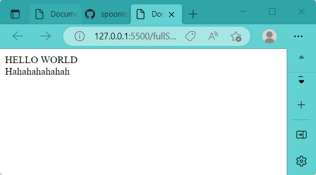
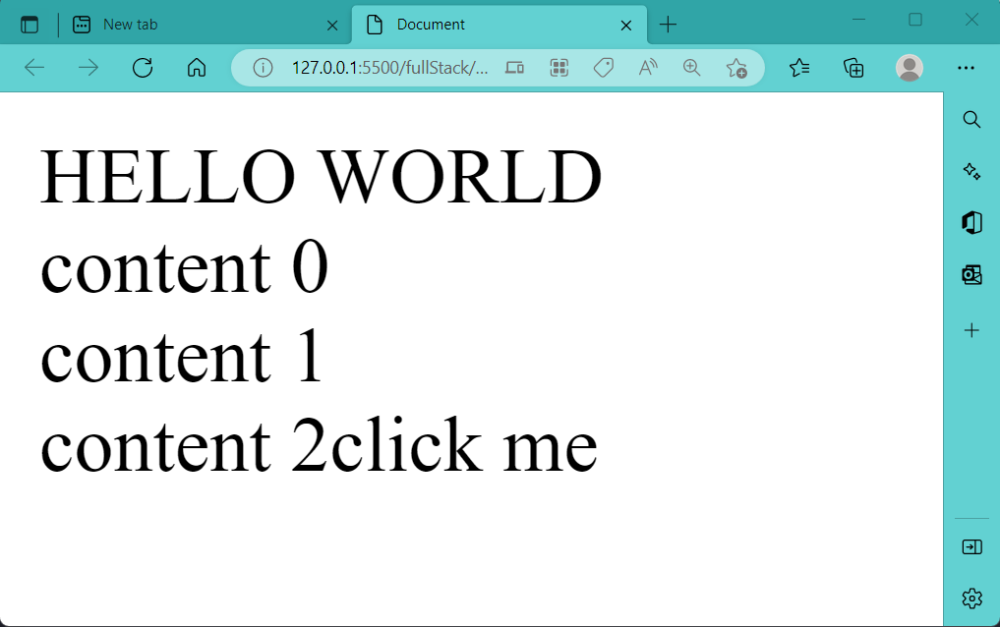
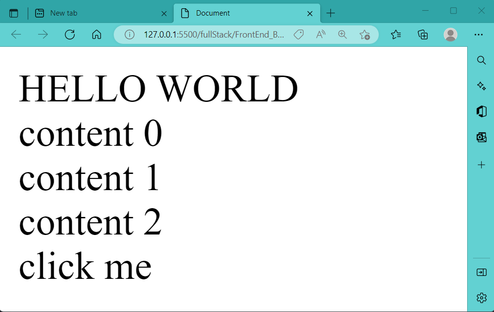
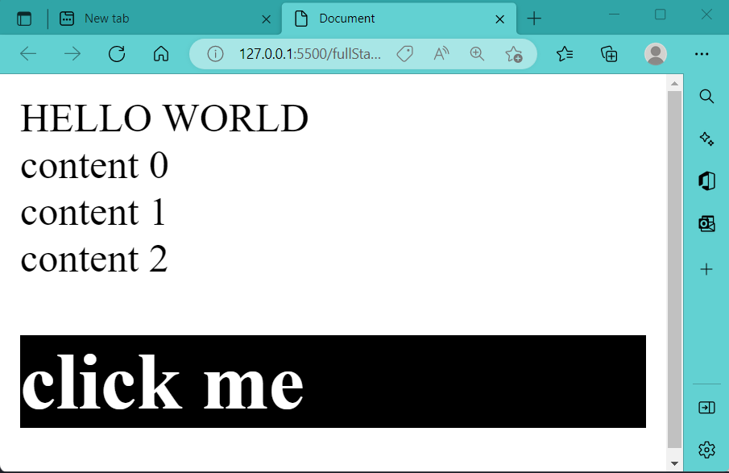

# 1. JS耦合HTML

## 1.1 JS抓取node

[document.selector](./selector.js)

+ DOM (Document Object Model) 详见见JavaScript高级程序设计第14-16章

---

node指代HTML文档中的某个标签元素. 在HTML文档中, document节点表示每个节点的根节点, 根节点唯一的子节点是html元素


**通过document的selector API可以做到在JS中选择HTML文档中的某个标签元素, 并予以改动.**


对于以下的HTML文档:
```html
<!--html document-->
<body>  
    <span>HELLO WORLD</span>

    <div class="content"></div>
    <div class="content"></div>
    <div class="content"></div>

    <script src="./JS_lesson1.js">
    </script>
    
</body>

```
### 1.1.1 document.querySelector()

```js
// get a single node ------------------------
const content = document.querySelector(".content"); // get the first node that meets specification
content.innerHTML = "Hahahahahahah";
console.log(content);
```
通过document.querySelector(), 我们edit了HTML文档中第一个".content"标签:




### 1.1.2 document.querySelectorAll()
+ querySelectorAll(): 选中所有满足条件的node, 并返回对应的NodeList

```js
// get multiple nodes -----------------------
const contents = document.querySelectorAll(".content"); // get all nodes satisfying condition, and put them into an array 'contents'
console.log(contents);

contents.forEach((node, index) => {     // edit nodes
	node.innerHTML = `content ${index}`;
})
```
通过document.querySelectorAll(), 我们edit了HTML文档中所有".content"标签:


console打印结果:


## 1.2 JS创建HTML元素
分两步:
+ step1: 创建新节点 OR 选中已有节点
    ```js
    // 创建节点:
    const nodeToBeAdded = document.createElement('tag');
    nodeToBeAdded.innerHTML = ...;  //text, 或者嵌套标签都可
    ```
+ step2: 将节点attach在另一个节点上
    ```js
    // 添加节点:
    node.appendChild(nodeToBeAdded);
    ```

### e.g.1: 

```js
// 接上面content = document.querySelectorAll()

// create element ------------
const span = document.createElement('span')
span.innerHTML = "click me"

// *** append span onto a node ***
contents[contents.length - 1].appendChild(span) //appendChild, append result in the same effect here

```




### e.g.2: 在body下创建新元素
```js
// create element---
const span = document.createElement('span')
span.innerHTML = "click me"
// append span onto a node---
const domBody = document.querySelector("body") // note there is no '.' in front of body 
domBody.appendChild(span)

```



### e.g.3: 
```js
// create element---
const div = document.createElement('div')
div.innerHTML = "<h1>click me</h1>"
// append span onto a node---
const domBody = document.querySelector("body") // note there is no '.' in front of body 
domBody.appendChild(div) 
```


> div可以加载h1, span不能加载h1

# 2. JS耦合CSS

## 2.1 利用JS联动CSS

+ 事件流见<<JavaScript高级程序设计>> 第17章

+ JS中node的classList (P449): 
    HTML5给所有元素增加了classList属性来更便利地操作元素的className: 
  + add(value): 向类名列表中添加指定的字符串值value. 若该值已存在, 则什么也不做.
  + contains(value): 返回boolean, 表示给定的value是否存在.
  + remove(value): 从类名列表中删除指定的字符串值value.
  + toggle(value): 如果类名列表中已经存在指定的value, 则删除; 如果不存在, 则添加.

+ addEventListener() (P495):
  + 接收三个argument: 事件名, 事件处理函数, 一个boolean值
---

e.g. click 触发event: style切换
JS部分:

```js
// create element------------------------------------
const div = document.createElement('div')
div.innerHTML = "<h1>click me</h1>"
// append div onto a specific node---
const domBody = document.querySelector("body") 
domBody.appendChild(div) 

// append over CSS: add a style to span we just added using JS ---------------------------
div.classList.toggle('active')  // toogle: switch

div.setAttribute('style', 'cursor:pointer') // 当鼠标移到div上时, 会变成一个小手手

// *** add EventListener to div: (event name, event handling function) ***
div.addEventListener('click', ()=>{  
    div.classList.toggle('active')  // switch div's className
})
```

CSS部分:

```css
.active{
    background-color: #000;
    color: #fff;
}
```

Results: 点击click me 会toggle 'div'元素的类名(className), 从而达到切换CSS style的目的


