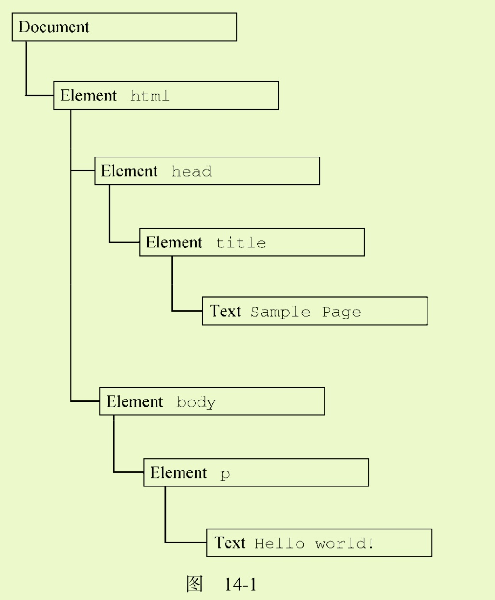
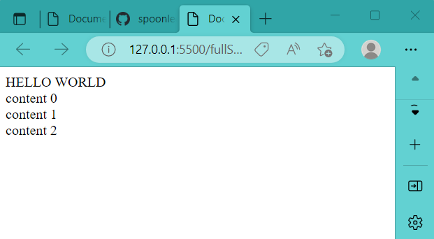
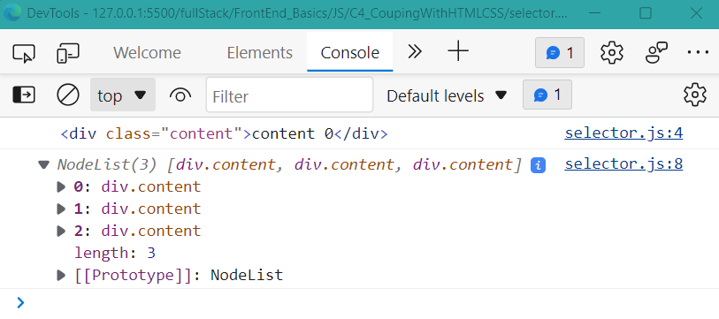

# 1. JS耦合HTML

## 1.1 JS抓取node
node指代HTML文档中的某个标签元素. 在HTML文档中, document节点表示每个节点的根节点, 根节点唯一的子节点是html元素

> DOM (Document Object Model) 详见见JavaScript高级程序设计第14-16章




**通过document的selector API可以做到在JS中选择HTML文档中的某个标签元素, 并予以改动.**


对于以下的HTML文档:
```html
<!--html document-->
<body>  
    <span>HELLO WORLD</span>

    <div class="content"></div>
    <div class="content"></div>
    <div class="content"></div>

    <script src="./JS_lesson1.js">
    </script>
    
</body>

```
### 1.1.1 document.querySelector()

```js
// get a single node ------------------------
const content = document.querySelector(".content"); // get the first node that meets specification
content.innerHTML = "Hahahahahahah";
console.log(content);
```
通过document.querySelector(), 我们edit了HTML文档中第一个".content"标签:


### 1.1.2 document.querySelectorAll()
```js
// get multiple nodes -----------------------
const contents = document.querySelectorAll(".content"); // get nodes
console.log(contents);

contents.forEach((node, index) => {     // edit nodes
node.innerHTML = `content ${index}`;
})
```
通过document.querySelectorAll(), 我们edit了HTML文档中所有".content"标签:


console打印结果:


## 1.2 JS创建HTML元素

### 1.2.1 在某个节点下创建新元素


### 1.2.2 在body下创建新元素


# 2. JS耦合CSS