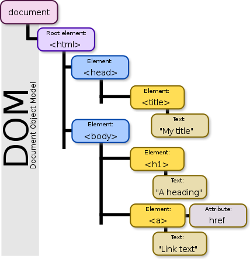

Resources

:computer: [b站李立超视频: DOM 134- 181](https://www.bilibili.com/video/BV1mG411h7aD?p=134&vd_source=c6866d088ad067762877e4b6b23ab9df)

:pencil: [配套笔记网站](https://www.lilichao.com/index.php/2022/08/09/dom/)


## 什么是DOM

DOM，全称Document Object Model，中文翻译为文档对象模型。DOM属于Web API的一部分。Web API中定义了非常多的对象，通过这些对象可以完成对网页的各种操作（添加删除元素、发送请求、操作浏览器等), DOM打通了JS和web

DOM中的

+ D意为Document，即文档。所谓文档就是指整个网页，换言之，DOM是用来操作网页的。
+ O意为Object，即对象。DOM将网页中的每一部分内容都转换为了对象，div有div的对象，input有input的对象，甚至一段文本，一段注释也有其所对应的对象。转换为对象干什么？还记得面向对象吗？转换对象以后，我们就可以以面向对象的方式去操作网页，想要操作哪个元素就获取哪个元素的对象，然后通过调用其方法或属性完成各种操作。
+ M意为Model，即模型, 再具体就是指整个document包含的html elements对应的Objects的hiearchy tree。模型用来表示对象之间的关系，也就是父子元素、祖先后代、兄弟元素等，明确关系后我们便可以通过任意一个对象去获取其他的对象。

```html
<!DOCTYPE html>
<html lang="zh">
<head>
    <title>My Title</title>
</head>
<body>
    <h1>A Heading</h1>
    <a href="#">Link Text</a>
</body>
</html>
```

对应的model:




## 概念

### 节点（Node）

在DOM标准下，网页中的每一个部分都会转换为对象。这些对象有一个共同的称呼 -- 节点(Node), 即来自于hierachy tree中的Node都是对象. 一个页面将会由多个节点构成，虽然都称为节点，但是它们却有着不同的类型：

1. 文档节点
2. 元素节点
3. 文本节点
4. 属性节点
5. …

每一个节点都有其不同的作用，文档节点表示整个网页，元素节点表示某个标签，文本节点表示网页中的文本内容，属性节点表示标签中的各种属性。如果从对象的结构上来讲，这些对象都有一个共同的父类Node。总的来说，都是属于节点，但是具体类型不同。

### 关系

- 祖先 —— 包含后代元素的元素是祖先元素
- 后代 —— 被祖先元素包含的元素是后代元素
- 父 —— 直接包含子元素的元素是父元素
- 子 —— 直接被父元素包含的元素是子元素
- 兄弟 —— 拥有相同父元素的元素是兄弟元素