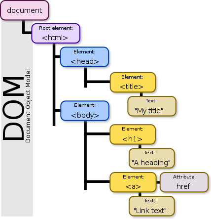

Resources

:computer: [b站李立超视频: DOM 134- 181](https://www.bilibili.com/video/BV1mG411h7aD?p=134&vd_source=c6866d088ad067762877e4b6b23ab9df)

:pencil: [配套笔记网站](https://www.lilichao.com/index.php/2022/08/09/dom/)


# 1. DOM

134- 154


## 1.1 Intro

**什么是DOM**

DOM，全称Document Object Model，中文翻译为文档对象模型。DOM属于Web API的一部分。Web API中定义了非常多的对象，通过这些对象可以完成对网页的各种操作（添加删除元素、发送请求、操作浏览器等), DOM打通了JS和web

DOM中的

+ D意为Document，即文档。所谓文档就是指整个网页，换言之，DOM是用来操作网页的。
+ O意为Object，即对象。DOM将网页中的每一部分内容都转换为了对象，div有div的对象，input有input的对象，甚至一段文本，一段注释也有其所对应的对象。转换为对象干什么？还记得面向对象吗？转换对象以后，我们就可以以面向对象的方式去操作网页，想要操作哪个元素就获取哪个元素的对象，然后通过调用其方法或属性完成各种操作。
+ M意为Model，即模型, 再具体就是指整个document包含的html elements对应的Objects的hiearchy tree。模型用来表示对象之间的关系，也就是父子元素、祖先后代、兄弟元素等，明确关系后我们便可以通过任意一个对象去获取其他的对象。

```html
<!DOCTYPE html>
<html lang="zh">
<head>
    <title>My Title</title>
</head>
<body>
    <h1>A Heading</h1>
    <a href="#">Link Text</a>
</body>
</html>
```

对应的model:




节点（Node）

在DOM标准下，网页中的每一个部分都会转换为对象。这些对象有一个共同的称呼 -- 节点(Node), 即来自于hierachy tree中的Node都是对象. 一个页面将会由多个节点构成，虽然都称为节点，但是它们却有着不同的类型：

1. 文档节点
2. 元素节点
3. 文本节点 (一般在element node内,  可以通过element node来调用)
4. 属性节点 (一般在element node内, 可以通过element node来调用)
5. …

每一个节点都有其不同的作用，文档节点表示整个网页，元素节点表示某个标签，文本节点表示网页中的文本内容，属性节点表示标签中的各种属性。如果从对象的结构上来讲，这些对象都有一个共同的父类Node。总的来说，都是属于节点，但是具体类型不同。

Node类是所有网页节点对象的根父类 https://developer.mozilla.org/en-US/docs/Web/API/Node


关系

- 祖先 —— 包含后代元素的元素是祖先元素
- 后代 —— 被祖先元素包含的元素是后代元素
- 父 —— 直接包含子元素的元素是父元素
- 子 —— 直接被父元素包含的元素是子元素
- 兄弟 —— 拥有相同父元素的元素是兄弟元素


## 1.2 DOM: Hello World

135

[01 hello world](./01_helloWold.html)


## 1.3 :moon: DOM node


### 1.3.1 Document node

136
[Demo: document obj](./02_documentObj.html)

document 对象. document object 表示的是整个网页


document obejct 的prototype链 (通过console: document.__proto__ 可以查看)

- HTMLDocuemnt -> Docuemnt -> Node -> EventTarget -> Object.prototype -> null
- prototype chain上的类的的属性和方法, 我们都可通过document来调用
    - 部分属性
        - document.documentElement -> html 根元素
        - docuemnt.head -> head element
        - document.title -> title element
        - document.body -> body element
        - document.links -> 获取页面中所有hyper link
        ...


### 1.3.2 Element Node

#### Get element node

137
[Demo: get element](./03_elementNode.html)


元素节点(element)

在网页中, 每一个标签都是一个元素节点

1. 通过document obj来获取元素节点: 
    + document.getElementById(): 根据id获取1个元素节点
    + document.getElementsByClassName(): 根据className来获取一组元素节点
        - 该方法返回的结果是一个实时更新的集合: 当网页中添加新元素时， 集合也会实时更新, 很方便
    + document.getElementsByTagName(): 根据tag name得到一组节点元素
        - 同样, 该方法返回的结果是一个实时更新的集合
        - document.getElementsByTagName("*"): 获取document上所有元素
    + document.getElementsByName(): 根据name属性获得一组元素节点对象
        - 返回一个实时更新的集合
        - 一般多用于<form>
    + document.querySelectorAll(): 根据css selector去页面查询all matching元素
        - 注意返回的数组结果不会实时更新
    + document.querySelector(): 根据css selector去页面查询1st matching元素. 相当于document.querySelectorAll()[0]

2. 通过document obj来创建元素节点: createElement
    + document.createElement(): 根据标签名创建一个元素节点对象


#### Elements' method and attributes

138

[Demo: element's method and attributes](./04_elementNode.html)

div元素的原型链: HTMLDivElement -> HTMLElement -> Element -> Node -> EventTarget (用__proto__查)

  

element methods: 

+ 通过元素节点对象获取其他节点的方法, 有两套:
  - 基于node: 空白的节点(换行符), text node, attribute node, document node都算
       - element.childNodes 获取当前元素的子节点. 所谓节点, 即所有的节点(会包含空白的子节点, 文本节点...)
       - element.firstChild
       - element.lastChild
       - element.nextSibling
       - element.previousSibling
       - element.parentNode: Node可以是element, 也可以是docuemnt
  - 基于element: 只算element node
       - element.children 获取当前元素的子元素. 所谓子元素, 只指元素 (节点概念的subset )
       - element.firstElementChild: 获取当前元素的第一个子element
       - element.lastElementChild
       - element.nextElementSibling: 相当于按层遍历, 返回当前元素的下一个element
       - element.previousElementSibling
       - element.parentElement: 只能是element


+ element.tagName 获取当前元素的tag name


### 1.3.3 Text node

139
[Demo](./05_textNode.html)

在DOM中, 网页中所有的文本内容都是文本节点对象. 因此可以通过元素来获取其中的文本节点对象, 但通常不会这么做, 因为我们可以直接通过元素去修改其中的文本.
修改文本的三个属性

+ `element.textContent` 获取或修改元素中的文本内容
      - 获取的是标签中的内容, <u>不会考虑css样式</u>


+ `element.innerText`   获取或修改元素中的文本内容
      - innerText获取内容时, <u>会考虑css样式</u>
          - 通过innerText去读区css style, 会触发网页的重排(计算css style), 因而性能比textContent稍慢
          - 当string中有<>时, 会自动对标签进行转移
          - <li> => &lt;li&gt;


+ `element.innerHTML`   获取或修改**元素中的html代码** (权限给的比较大, 会有风险)
      - 可以直接向元素中添加html代码
          - innerHTML插入内容时, 有被xss注入(被恶意插入html代码)的风险


```js
  <body>
    
    <div id="box1">
      <span>I am box1</span>
    </div>

    <script>
      /*
            在DOM中, 网页中所有的文本内容都是文本节点对象
                - 因此可以通过元素来获取其中的文本节点对象, 但通常不会这么做
                - 因为我们可以直接通过元素去修改其中的文本
                    - 修改文本的三个属性
                        element.textContent 获取或修改元素中的文本内容
                        element.innerText   获取或修改元素中的文本内容
                        element.innerHTML   获取或修改元素中的html代码
      */
      const box1 = document.getElementById("box1");
      
    </script>
  </body>
```

Console结果:

```js
> box1.innerText
'I am box1'
> box1.textContent
'\n      I am box1\n    '
> box1.innerHTML
'\n      <span>I am box1</span>\n    '
> box1.innerHTML = "<li>innerText</li>"		// 真正去修改box1的innerHTML代码, innerText和textContent可做不到
'<li>innerText</li>'		
```


### 1.3.4 Attribute node

140

[Demo](./06_attributeNote.html)

attribute node 

​    \- 在DOM中也是对象, 但通常不需要获取对象而是直接通过元素来完成对其的操作


如何操作属性节点

+ 方式1: direct access
  + 读: element.attributeName (注意class属性需要用className来读, 因为class是js保留字); 读取boolean attribute时, 会返回true or fals
  + 改: element.attributeName = attributeValue

+ 方式2: getter setter
  + 读: element.getAttribute(attributeName)
  + 改: element.setAttribute(attributeName, attributeValue)
  + 删: element.removeAttribute(attributeName)


#### Event

141

[Demo: 07 event](./07_event.html)


<u>元素上以属性的形式绑定事件， 而事件绑定对应的响应函数 (可以同时绑定多个响应函数)</u>


event就是用户和页面之间发生的交互行为; e.g. click button; mouse move, mouse double click, mouse drag; release key, type key

bound event listener / 响应函数 (其实就是callback function) to element, 来完成和用户的交互 

- 方式1: 直接在元素的属性中设置 
- 方式2: 可以通过为元素的指定属性设置callback function的形式来绑定事件 (但1个元素上的1个事件同时只能绑定1个响应函数)
    - 多人开发中可能因此出现conflict
- 方式3： 可以通过element.addEventListener() 来绑定响应函数 (1个元素上的1个事件同时可以绑定多个响应函数)
    - 因而多人开发时更prefer


```html
  <body>
    // 方式1: 
    <button id="btn" ondblClick="alert('you just clicked me!')">
      click me twice
    </button>

    <button id="btn2" onmouseover="alert('you just move over me!')">
      move over me
    </button>

    <button id="btn3">I am button 3</button>

    <button id="btn4">I am button 4</button>

    <script>
      // 方式2:
      const btn3 = document.getElementById("btn3");
      btn3.ondblclick = () => {
        alert("i am button 3");
      };

      // 方式3:
      const btn4 = document.getElementById("btn4");
      btn4.addEventListener("mouseover", () => {
        alert("I am button4");
      });
      btn4.addEventListener("mouseover", () => {
        alert("greetings from button4!");
      });
    </script>
  </body>
```


## 1.4 Practice

142-149

看到这里

## 1.5 Node的复制

150


# 2. Event

155-160


## Event Object intro

155


# 3. BOM

161

[Demo: BOM intro](./28_BOM.html)

## 常用的BOM 对象

### Navigator obj


### Location obj


### History obj


## brower tools

### Timer


### 调用栈


### Message queue


### Timer


# Practice 


### 贪吃蛇


