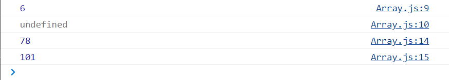

[JS学习资源](https://developer.mozilla.org/en-US/docs/Web/JavaScript)
学完JS后可以把它当作dictionary来查

如何在webpage打开JS的’debug window’: Inspect>Console> where JavaScript is edited

Tips: 
+ 学代码只看书没有意义，得写代码，多练习
    JavaScript写前端逻辑
    NodeJS写后端逻辑, NodeJS与JavaScript一脉相承(Java和python也可以写后端)  
    而后端负责管理数据库
+ 语言最好先选一样学精，再学另一样
    JavaScript每年都会有新feature, 最新的feature自学（可以关注个公众号）, 我们这里只讲基础的

# 1. JS basics
## 1.1 变量与打印
### 1.1.1 Let
定义变量时无需声明类型, 用let:
```js
let my_name = "shawn";
console.log(my_name);
```
注意别再使用var来定义变量了:
```js
var something = "abc"; // no more using var now because it is not strict with grammar, use let instead
console.log(something);

```
打印连接两个变量:
```js
let firstName = "shawn",
    lastName = "Li";
console.log(firstName, lastName);

```
'undefined' & 'null':
```js
firstName = undefined; //a type of data, not defined
firstName = null; //a type of data, defined but value is null
console.log(firstName);
```

### 1.1.2 const

```js
const password = "kjjk";
password = 'aasaaa';         // 会报错

```

+ const 限定一个普通变量后，无法更改，如果更改，就会报错。但是let就没有如此的限制。
+ const 限定一个object type variable, 只是表示这个variable的object type固定无法改, 但object内部的field依然可以改动. 本质上const只是限定变量需要的内存大小.

## 1.2 变量的数据类型
变量的数据类型在JS中是implicit的

### 1.2.1 String

+ "" & '': 用于纯string
+ ``: 适用性更广, 可以引用变量

```js
//data type
let a = 1;
console.log(a);

// "" & '' for pure string -------------------------
let b = "this is a b";
console.log(b);

let b1 = "this is a b1";
console.log(b1);

let b2 = 'he said: "this"';
console.log(b2);

let b3 = "he said: 'this'";
console.log(b3);

// `` -----------------------------
let b4 = `he said: "a",'b'`;    // `` allows coexisting of '' & ""
console.log(b4);

let b5 = `he said: ${b}`;       // `` allows referencing a variable
console.log(b5);

```


### 1.2.2 数据类型转化
+ 当一个str和一个num相加时，结果的数据类型和被加数一致(和java的print一致)
  + 特别地，+”1”代表将str类型的1转化为num类型. 但是其中的双引号内必须只有数字。

```js
// data type conversion
let a = 1;
let b = "this is a b";

let b6 = "he said: " + b;   //add up two str: link
console.log(b6);            // he said: this is a b

let b7 = "he said: " + a;   //add num(convert to str first) to the end of str
console.log(b7);            // he said: 1

// +"1": convert string to num ------------------------------
let b8 = "1" + a;           //add num to the end of str
console.log(b8);            // 11

let b9 = +"1" + a;          //convert ”1” to num, then add to a, which is 1
console.log(b9);            // 2

let b10 = "" + 1;           //num to string
console.log(b10, typeof b10);   // 1 string

let b11 = +"1";             //string to num
console.log(b11, typeof b11);   // 1 'number'

```


## 1.3 Boolean & if statement
+ True: 字符串(包括字符串0)都是true
+ False: 数字0, null, undefined都是false
```js
//boolean
let c = "0";
let d = undefined;
let e = null;

if (c) {                // c: true
console.log("good");
}

if (!d) {               // d: false
console.log("bad");
} 

if (!e) {               // e: false
console.log("OK");
} 

```

```js 
If(statement){
}else if(statement){
}else if(statement){
}else{
}

```

## 1.4 Operator

turn to here


# 2. Array
## 2.1 初始化Array
要点:
+ 用square bracket
+ index starts from 0
+ Array不算基本数据类型, 变量名采用引用

```js
let array = [1, 2, 3, "4", true, { name: "shawn" }];

console.log(array[0]);   //index starts from 0	

array[0] = "sdufsd";
console.table(array);
```


## 2.2 定义新的数组元素
要点:
+ JS的数组是动态数组, 可以改变长度
+ 超出数组长度的为undefined
+ 可以不连续定义新的数组元素


```js
// 接上面的JS code

console.log(array.length);
console.log(array[6]);        // array[6] = undefined

// 不连续定义数组元素------------------
array[100] = 78;                
console.log(array[100]);
console.log(array.length);  // now length of array is 101

```



### 2.2.1 为Array加入object元素
要点:
+ 必须先指定哪个元素为object type, 再instantiate该object
+ 不能直接为某个元素instantiate
```js
// ...接上面的JS Array code...

array[101] = {};            // 先指定array[101]为object type
array[101].name = "shawn";  // 再instantiate该object
console.log(array[101]);    // now array[101].name displayed
```


# 3. Object
## 3.1 创建一个object(instance)
```js
let obj = {
    name: "shawn",
    age: 18,
    income: 0,
    arc: {
        a: 222,
        b: 333,
    },
};
console.log(obj);
console.table(obj);
```

## 3.2 修改或增加已存在的object的某个field

+ 修改
  + 方式一 使用属性定义
    ```js
    obj.income = 0;
    ```
  + 方式二  使用索引定义
    ```js
    obj['name'] = 'Batman';
    ```

> Note:
> JS中没有锁，意味着你可以修改任何obj, 这带来了极大的不安全性（e.g.你手滑了把name打成了names, 这样就不是修改name的值而是添加了一个新元素，引起了很难察觉到的bug）. 因此在修改obj时需要格外谨慎。不过后端语言有锁，不会让你乱改数据导致此类Bug.

+ 添加
  + 和修改一样


## 3.3 关于object的引用
同java一样基本数据类型不需要引用, 但对于object类型(Array也算)的数据, JS依然采用引用: 
```js
object2 = object1; 
```
上面赋值语句代表将object1所引用的在内存中实际的object的地址赋给object2, 此时object1与object2同时指向内存中的同一个object. 

### 3.3.1 使用展开: {...obj}来传递object的值

展开的意思是, 再在内存中创建一个真实的object, 而不是使用引用, 有点像deepCopy, 但还不完全是deepCopy, 因为展开无法作用于嵌套的object, 只能作用于object内的基本数据类型.

> Note:
> {...object1}只是展开一层object1, 如果一个object1内部嵌套了另一个object2, {...object1}则不会展开内部更深层的object2 （JS此时依然使用object2的引用). 此时需要真正的deepCopy了. 老师的GitHub文档>JavaScript>javascript.xmind>数组的拷贝


e.g. 
```js
let person = {
    name: "shawn",
    age: 18,
};

let person3 = { ...person }; // create a deepCopy of person, assign this deepCopy to person3
console.log(person, person3);
person3.age = 100;          // this only change person3.age
console.log(person, person3);

```


可见此时person和person3之间没有dependency了, person3.age=100只作用了person3. 

另外要注意到JS中的打印不是按程序执行顺序的打印, 而是反映最终状态的. 如上面结果中, 第一次的console.log(person, person3)显示person3的age也变成了最终状态的100.

